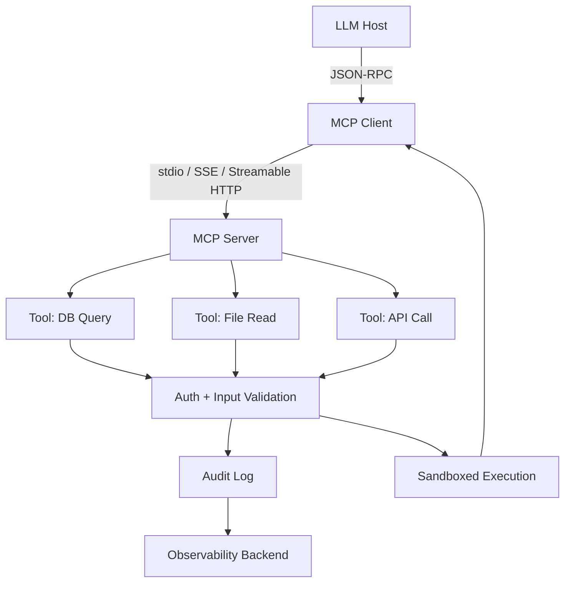

# Implementing a Secure MCP Server

## Introduction

The Model Context Protocol (MCP) lets LLM hosts talk to external tools, data sources, and prompts through a standardized JSON-RPC pipe. That pipe is powerful — and dangerous if you treat it like a friendly internal API. In production, an MCP server sits at the boundary between an untrusted model execution environment and your real systems: databases, file stores, cloud APIs. Get the security layer wrong, and you've handed a prompt-injection vector a direct execution path.

This article walks through what actually matters when you're building an MCP server that survives contact with real users.

## Why This Matters

MCP servers are typically long-lived processes that stay connected to a host (Claude Desktop, Cursor, a custom agent framework). They expose *tools* — callable functions the model can invoke — and *resources* — data the model can read. Both are attacker-controlled inputs once the LLM decides to call them.

The production pain points are real:

- **Prompt injection through tool parameters** — a malicious prompt crafts a tool call that exfiltrates data or mutates state.
- **Local transport abuse** — stdio-based servers on developer machines have no network auth at all.
- **Schema trust** — servers often advertise tool schemas the host blindly forwards to the model.
- **No audit trail** — every tool invocation is an action that needs logging.

We've seen teams ship MCP integrations in weeks, then spend months retrofitting auth and observability. Build it secure from day one.

## How It Works

MCP follows a host–client–server triad. The host (your IDE or agent runtime) runs one or more clients, each connected to an MCP server over a transport. The server declares capabilities (which tools/resources it supports), and the client mediates every call.



**Step-by-step:**

1. **Handshake** — Client connects, server announces capabilities (`tools`, `resources`, `prompts`).
2. **Capability negotiation** — Client opts into only what it needs.
3. **Tool call** — Model picks a tool, client forwards the call with arguments.
4. **Server-side validation** — Server checks auth, input schema, rate limits, and audit logs *before* executing.
5. **Result** — Server returns structured output; client relays back to the model context.

The security boundary is the server process. Everything between the host and your tool code is your responsibility.

## Core Concepts

- **Tools** — Callable functions with JSON Schema input definitions. The schema is your first line of defense; validate *every* argument, even if the host claims it's already validated.
- **Resources** — Read-only data URIs (`file://`, `db://`, `http://`). Access control applies here too — don't leak resources the caller shouldn't see.
- **Prompts** — Reusable prompt templates with injected parameters. Treat prompt parameters as untrusted strings.
- **Sampling** — Server can request the model to generate completions. This is a two-hop trust boundary; sanitize both directions.
- **Transports** — `stdio` (local, no auth), `SSE` (HTTP streaming), and `Streamable HTTP` (new in spec). Each has different auth implications.
- **Capabilities** — `tools`, `resources`, `prompts`, `logging`, `elicitation`. Declare minimally.

## Examples & Code Walkthrough

Here's a production-style MCP server in Python using the official SDK. It exposes a single tool — a parameterized database query runner — with auth, input validation, and audit logging.

```python
import os
import json
import logging
import asyncio
from typing import Any
from mcp.server import Server, NotificationOptions
from mcp.server.models import InitializationOptions
from mcp.types import Tool, TextContent
from pydantic import BaseModel, Field, ValidationError
import aiosqlite

# --- Setup ---
logging.basicConfig(level=logging.INFO)
logger = logging.getLogger("secure-mcp")

server = Server("secure-db-query")

# --- Config ---
DB_PATH = os.environ.get("MCP_DB_PATH", "/data/app.db")
ALLOWED_TABLES = {"users", "orders", "products"}
MAX_ROWS = 500
API_KEY = os.environ["MCP_API_KEY"]  # fail fast if missing


# --- Validation layer ---
class QueryArgs(BaseModel):
    table: str = Field(..., min_length=1, max_length=64)
    columns: list[str] = Field(default_factory=list)
    limit: int = Field(default=50, ge=1, le=MAX_ROWS)
    tenant_id: str = Field(..., pattern=r"^[a-z0-9_-]{1,64}$")


# --- Auth ---
async def verify_auth(request_kwargs: dict) -> str:
    key = request_kwargs.get("api_key")
    if key != API_KEY:
        raise PermissionError("Invalid API key")
    return key


# --- Audit ---
async def audit(event: str, detail: dict, tenant: str):
    logger.info(json.dumps({"event": event, "tenant": tenant, "detail": detail}))


# --- Tool definition ---
@server.list_tools()
async def handle_list_tools() -> list[Tool]:
    return [
        Tool(
            name="query_table",
            description="Read rows from an allowlisted table. Scoped to tenant.",
            inputSchema={
                "type": "object",
                "properties": {
                    "table": {"type": "string"},
                    "columns": {"type": "array", "items": {"type": "string"}},
                    "limit": {"type": "integer"},
                    "tenant_id": {"type": "string"},
                    "api_key": {"type": "string"},
                },
                "required": ["table", "tenant_id", "api_key"],
            },
        )
    ]


@server.call_tool()
async def handle_call_tool(name: str, arguments: dict | None) -> list[TextContent]:
    if name != "query_table":
        raise ValueError(f"Unknown tool: {name}")

    # 1. Auth
    try:
        tenant = await verify_auth(arguments or {})
    except PermissionError as e:
        await audit("auth_failure", {"tool": name}, "unknown")
        raise

    # 2. Validate input
    try:
        args = QueryArgs(**arguments)
    except ValidationError as exc:
        await audit("validation_error", {"error": str(exc)}, tenant)
        raise

    # 3. Allowlist table (prevent SQL injection via table name)
    if args.table not in ALLOWED_TABLES:
        await audit("blocked_table", {"table": args.table}, tenant)
        raise ValueError(f"Table not allowlisted: {args.table}")

    # 4. Build parameterized query
    cols = ", ".join(args.columns) if args.columns else "*"
    query = f"SELECT {cols} FROM {args.table} WHERE tenant_id = ? LIMIT ?"
    params = (args.tenant_id, args.limit)

    # 5. Execute in sandbox
    try:
        async with aiosqlite.connect(DB_PATH) as db:
            db.row_factory = aiosqlite.Row
            cursor = await db.execute(query, params)
            rows = await cursor.fetchall()
            data = [dict(r) for r in rows]
    except Exception as e:
        await audit("query_error", {"error": str(e), "table": args.table}, tenant)
        raise

    await audit("query_ok", {"table": args.table, "rows": len(data)}, tenant)
    return [TextContent(type="text", text=json.dumps(data, default=str))]


# --- Main ---
async def main():
    async with server.run("stdio"):
        await asyncio.Future()  # run forever

if __name__ == "__main__":
    asyncio.run(main())
```

**Key security choices in the code:**

- **API key in every call** — yes, it's repetitive, but stdio transport has no TLS/auth otherwise.
- **Pydantic validation** — enforces types, ranges, and regex patterns before anything hits the DB.
- **Table allowlist** — never interpolate user input into SQL identifiers.
- **Parameterized queries** — the only safe way to handle values.
- **Tenant scoping** — every query is filtered by `tenant_id`, enforced at the server layer, not just the DB.
- **Audit logging** — every auth failure, validation error, and successful query is logged with tenant context.

## Best Practices

1. **Never trust the host.** The client is not a security boundary. Validate every argument on the server.
2. **Least-privilege transport.** Prefer `stdio` only for local dev; use SSE or Streamable HTTP with TLS and API keys in production.
3. **Rate-limit per tenant.** A single malicious prompt can hammer your tools. Token-bucket per API key, not per connection.
4. **Schema minimization.** Only expose the tools and fields the model actually needs. Fewer tools = smaller attack surface.
5. **Output encoding.** Return structured data, not raw strings the host might render without escaping.
6. **Secrets out of env.** Use a vault (Vault, AWS Secrets Manager) for API keys and DB credentials. Rotate regularly.
7. **Timebox every tool call.** Set timeouts on DB queries, HTTP calls, and file ops. A runaway tool blocks the entire server process.

## Common Mistakes & Anti-Patterns

**Mistake 1 — Trusting tool schemas from the client.**
```python
# BAD: echoing whatever the client sends as the schema
tools = request.json()["tools"]
```
*Fix:* Define schemas server-side, hardcode them. The client should never influence what tools exist.

**Mistake 2 — No auth on stdio.**
```python
# BAD: assuming local = safe
@server.call_tool()
async def handle(...): ...
```
*Fix:* Even on stdio, require an API key or mutual-auth token. Local processes can be hijacked via compromised dependencies.

**Mistake 3 — Returning raw LLM output without sanitization.**
```python
# BAD
return [TextContent(type="text", text=llm_output)]
```
*Fix:* Strip or escape control characters, enforce max length, validate JSON if the host expects it.

**Mistake 4 — Missing rate limits.**
```python
# BAD: no throttling
async def handle_call_tool(...):
    await execute(arguments)
```
*Fix:* Wrap with a token-bucket per API key. Reject with `429`-equivalent before execution.

## Performance Considerations

- **Connection overhead:** Each MCP client holds a persistent JSON-RPC stream. 1,000 concurrent clients ≈ 1,000 open connections. Use async I/O (asyncio, tokio) and connection pooling.
- **Serialization cost:** JSON-RPC with large result sets adds CPU. Cap result sizes (`MAX_ROWS = 500` above) and consider binary transports if throughput matters.
- **Memory per session:** Tool state, resource caches, and prompt histories add up. Profile RSS per connection; set hard limits.
- **Big-O:** Tool execution is typically O(n) on result set size. The server itself should be O(1) per call — avoid linear scans over global state on every invocation.
- **Latency budget:** Model context window time is precious. Keep tool calls under 2–3 seconds or the host will time out.

## Real-World Usage

Companies running MCP at scale treat the server as a microservice, not a script:

- **Anthropic** ships Claude Desktop with built-in MCP support; servers run as subprocesses with stdio, sandboxed by OS user namespaces.
- **Cursor / Windsurf** use MCP to connect to repos, docs, and issue trackers — each integration is a separate server with scoped API keys.
- **Internal enterprise deployments** (finance, healthcare) run MCP servers behind sidecar proxies that enforce mTLS, OAuth2, and audit logging. The server itself is stateless and horizontally scaled behind a load balancer.

The pattern is consistent: the MCP server is a thin, authenticated, audited façade over your real systems.

## Frequently Asked Questions (FAQ)

**Q: Do I need auth on stdio transport?**  
A: Yes. stdio has no network isolation. Any process that can spawn the host can inject tool calls. Require an API key or mutual-auth token even locally.

**Q: How do I prevent prompt injection from triggering dangerous tool calls?**  
A: Validate and allowlist every tool parameter server-side. Never construct SQL, shell commands, or API URLs from raw model output.

**Q: Can I run multiple MCP servers in the same process?**  
A: Technically yes, but it's safer to run one server per process. A compromised server shouldn't be able to touch another server's state.

**Q: What's the right timeout for a tool call?**  
A: 2–5 seconds for synchronous tools. For long-running work, use async patterns with polling or webhooks — don't block the JSON-RPC stream.

**Q: How do I handle schema evolution without breaking hosts?**  
A: Version your tool schemas. Add fields as optional, never remove or rename existing ones. Hosts cache schemas at startup.

## Conclusion

A secure MCP server is nothing exotic — it's auth, input validation, allowlists, audit logs, and timeouts, applied consistently at the process boundary. The protocol makes it easy to expose powerful tools to an LLM; your job is to ensure every call that crosses that boundary is verified, scoped, and logged.

Start with the server-side validation layer. Add auth. Write the audit hook. Then iterate on features. The teams that ship MCP integrations fast and safely are the ones that treat the server as a hardened microservice from day one, not an afterthought.
