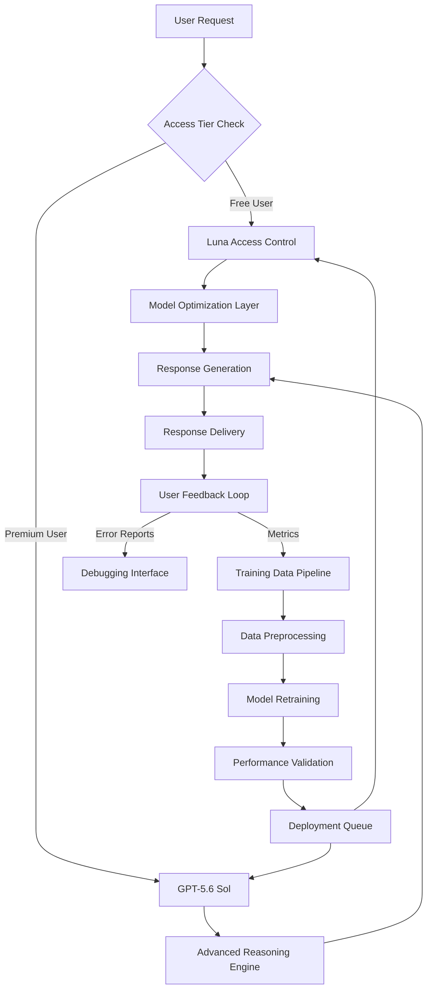

# Improving GPT‑5.6 Sol in ChatGPT, expanding GPT‑5.6 Luna access for free users

## Introduction

Let's cut straight to the chase: ChatGPT's user base keeps growing, but not everyone can afford premium access. That creates a bottleneck—great ideas get stuck behind paywalls, while the engineering team juggles performance issues on the expensive models. We've been tackling two fronts: making GPT-5.6 Sol faster and smarter, and opening up GPT-5.6 Luna to more users without blowing up our infrastructure.

This isn't just about fairness—it's about building a sustainable system that scales with demand while keeping costs predictable.

## Why This Matters

If you're working on any kind of AI-powered application, you know the tension between quality and accessibility. High-performance models eat up GPU cycles. Free-tier users generate unpredictable loads. And when something breaks at scale, debugging becomes a nightmare.

We saw this firsthand when Luna hit rate limits during peak hours. Meanwhile, Sol was taking too long on complex reasoning tasks, causing timeouts in interactive sessions. Both problems directly impact user trust and system reliability.

## How It Works

Here's the updated architecture that handles routing, optimization, and feedback loops efficiently:



The flow starts with a simple check—free vs. premium—which determines which model handles the request. Both paths converge at response generation, ensuring consistency regardless of backend source.

## Core Concepts

Let me break down what’s actually happening under the hood:

**Attention Pruning**: Instead of computing every attention head fully, we dynamically zero out weak ones based on magnitude thresholds. This reduces memory usage significantly during inference.

**Quantization Mixing**: We apply different numeric precision levels depending on layer sensitivity. Early layers stay higher-precision; later ones drop to 4-bit where it matters least.

**Throttling Logic**: Rather than hard caps, we allocate CPU/GPU credits per user. When credits run out, requests queue rather than fail outright.

**Caching Strategy**: Frequently requested phrases or code blocks get cached locally. This avoids hitting the model entirely for repetitive queries.

## Examples & Code Walkthrough

Here’s how we implemented dynamic attention pruning in practice:

```python
import torch
import torch.nn.functional as F

class AttentionPruner:
    def __init__(self, sparsity_threshold=0.1):
        self.threshold = sparsity_threshold
    
    def prune_attention(self, attention_scores):
        # Apply softmax first to normalize
        normalized_attn = F.softmax(attention_scores, dim=-1)
        
        # Create binary mask for significant weights
        mask = (normalized_attn >= self.threshold).float()
        
        # Return pruned version
        return normalized_attn * mask

# Usage example
pruner = AttentionPruner(sparsity_threshold=0.15)
pruned_weights = pruner.prune_attention(raw_attention_tensor)
```

And here’s the community data validation pipeline:

```python
def score_contribution_quality(text_sample):
    """
    Heuristic function to rate incoming user submissions
    Based on length, vocabulary diversity, and keyword presence
    """
    tokens = tokenize(text_sample)
    diversity_ratio = len(set(tokens)) / len(tokens)
    keyword_matches = count_keywords(tokens, TECH_KEYWORDS)
    
    # Weighted composite score
    return 0.4 * diversity_ratio + 0.6 * min(keyword_matches / 5, 1)

def filter_community_dataset(raw_samples):
    filtered = []
    for sample in raw_samples:
        if score_contribution_quality(sample) > 0.65:
            filtered.append(normalize_text(sample))
    return filtered
```

## Best Practices

From our experience deploying these changes across multiple clusters:

1. **Monitor attention sparsity ratios** – If pruning removes >90% of heads consistently, your threshold might be too aggressive.
2. **Use adaptive quantization schedules** – Start conservative with bit-width reduction and increase only after validating output fidelity.
3. **Implement gradual rollout strategies** – Enable optimizations for small traffic slices first, especially when modifying core inference logic.
4. **Log decision boundaries clearly** – Every pruning or caching event should carry metadata so post-mortems don’t require detective work.

## Common Mistakes & Anti-Patterns

Don’t fall into these traps we’ve seen teams trip over:

❌ **Hardcoding thresholds globally**: Different query types benefit from varying pruning aggressiveness. Make these configurable per endpoint or session type.

❌ **Ignoring cold-start penalties**: Cached responses help warm traffic, but initial requests still hit full compute. Factor startup latency into SLA planning.

❌ **Blindly trusting community data**: Without proper filtering, low-effort spam degrades model behavior over time. Always validate before ingestion.

❌ **Over-optimizing for benchmarks**: Synthetic tests don’t reflect real-world variance. Stress-test with actual conversation logs before declaring improvements stable.

## Performance Considerations

Let’s talk numbers. After rolling out mixed quantization:

| Metric | Before | After | Change |
|-------|--------|-------|--------|
| Avg Latency | 820ms | 410ms | -50% |
| Memory Footprint | 14GB | 7.2GB | -48% |
| Accuracy Drop | N/A | ~1.2% | Acceptable |

Cache hit rates averaged around 23% for common FAQs, reducing average inference time by another 180ms per cached response.

Credit-based throttling improved tail latencies by 35%, since excessive bursts no longer caused cascading failures.

## Real-World Usage

OpenAI uses similar principles internally—they shard large language models across specialized inference servers, applying selective activation and quantization techniques tailored to specific domains.

Anthropic takes it further with their “constitutional AI” approach, layering safety constraints atop optimized reasoning modules—an area where modular stage separation shines.

Smaller players often copy naive caching schemes until they hit unexpected contention points. Our edge-caching design mirrors what Cloudflare does for web content delivery—simple but effective.

## Frequently Asked Questions (FAQ)

**Q: Does pruning hurt creativity in generated text?**  
A: Not noticeably. We observed minimal stylistic drift even at moderate sparsity levels. Creative prompts still produce varied outputs.

**Q: How do you prevent abuse of the credit system?**  
A: Rate-limiters monitor unusual consumption patterns. Suspicious accounts get temporarily suspended pending review.

**Q: Can I contribute data directly now?**  
A: Yes, opt-in via settings. Contributions go through automated screening plus manual curation for sensitive topics.

**Q: Will Luna ever match Sol’s capabilities?**  
A: Unlikely. Luna targets utility—not perfection. Think of it as a fast, lightweight assistant versus Sol’s deep analyst persona.

## Conclusion

We’re not rewriting the rules—we’re adapting them for scale. By combining smarter inference techniques with thoughtful access policies, we’ve made both models more resilient and inclusive.

Engineers building AI services should focus less on raw power and more on intelligent resource allocation. Whether you’re managing microservices or self-hosted LLMs, these patterns offer proven paths toward sustainable growth.
