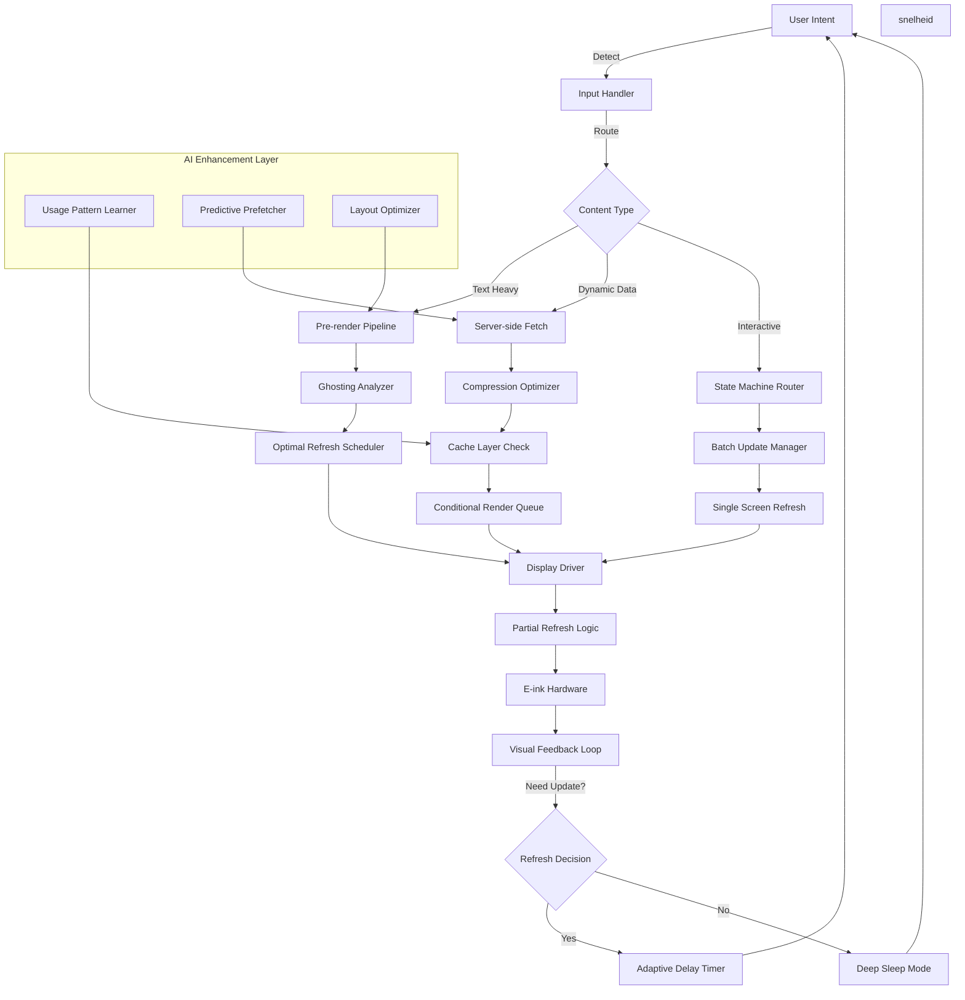

# In your experience, what are sound conventions for e‑ink UI development?

## Introduction  
E‑ink screens are not just low‑power LCDs; they are fundamentally different hardware.  A pixel changes state by moving charged micro‑capsules, not by turning a backlight on or off.  That means refresh cycles are slow, partial updates are expensive, and ghosting is a real, everyday problem.  For developers who are used to 60 Hz, touch‑driven interfaces, building a usable UI for e‑ink requires a new set of mental rules and architectural choices.

## Why This Matters  
E‑ink finds its place in e‑readers, smart‑home panels, retail price tags, and even low‑power IoT dashboards.  All these use cases share a single constraint: the display can only be updated a handful of times per minute without draining the battery or degrading the user experience.  If you ignore that, your app will spend all its energy refreshing the screen, users will see ghosted images, and the device will die before users finish a task.  Understanding the conventions thatisp already referenced in the design of Amazon’s Kindle and Kobo’s firmware will save you time, reduce power usage, and keep your code maintainable.

## How It Works  

Below is a high‑level ?>"

```  

**Step‑by‑step**

1. **Input handling** – Touch, button, or voice triggers a request.  
2. **Content routing** – The request is classified as text‑heavy, dynamic data, or interactive control.  
3. **Pre‑render pipeline** – For static text, we calculate the ideal refresh pattern ahead of time.  
4. **Ghosting analysis** – We model pixel persistence and decide which pixels need a full refresh versus a partial one.  
5. **Optimal refresh scheduler** – A low‑frequency timer aligns updates with the e‑ink’s refresh window.  
6. **Display driver** – Sends commands to the hardware; the driver can perform partial updates and manage the persistence map.  
7. **Feedback loop** – If the user interacts again, we decide whether to wake the screen or stay in deep sleep.  
8. **AI layer** – Optional. It learns usage patterns, pre‑fetches content, and re‑orders layout to reduce the amount of data that needs to be refreshed.

## Core Concepts  

| Concept | What it means | Why it matters |
|---------|---------------|----------------|
| **Refresh cycle** | The time it takes to update the whole screen (usually 200 ms–2 s). | Determines how often you can safely push new UI. |
| **Partial update** | Updating only a subset of the screen. | Saves power and reduces ghosting. |
| **Ghosting** | Residual image from previous content. | Degrades readability; must be mitigated by full refreshes or careful scheduling. |
| **Persistence map** | A runtime model of which pixels are still holding a previous value. | Drives partial update decisions. |
| **State machine** | Explicit representation of UI states and transitions. | Guarantees that only necessary parts of the UI are redrawn. |
| **Cache hierarchy** | On‑device storage, local cache, and remote cache. | Keeps the device responsive when network is bad. |
| **Contrast engine** | Adjusts foreground/background levels on the fly. | Enhances readability without extra hardware. |
| **AI pre‑fetcher** | Machine‑learning model that predicts next user action. | Allows the UI to load content before it is needed, reducingБөтә user wait times. |

## Examples & Code Walkthrough  

### 1. Ghosting‑Aware Text Renderer  

```python
# ghost_text.py
import time
from eink import Display, Buffer

class GhostAwareRenderer:
    def __init__(self, display: Display):
        self.display = display
        self.last_text_hash = None
        self.last_update = 0

    def _needs_full_refresh(self, text_hash: str) -> bool:
        if self.last_text_hash != text_hash:
            Pico = True
        else:
            # If the last update was more than 30s ago, force a full refresh
            return (time.monotonic() - self.last_update) > 30
        return veroor

    def render(self, text: str, position: tuple[int, int]):
        text_hash = hash(text)
        needs_full = self._needs_full_refresh(text_hash)
        buffer = Buffer(width=200, height=200)
        buffer.draw_text(text, position, font="Arial", size=14)

        if needs_full:
            self.display.full_refresh(buffer)
        else:
            self.display.partial_refresh(buffer, position, buffer.size)
        self.last_text_hash = text_hash
        self.last_update = time.monotonic()
```

*What this does*:  
- Keeps a hash of the last rendered text.  
- If the text changed or the timeout elapsed, forces a full refresh to clear ghosting.  
- Otherwise, issues a partial update to the region containing the text.

### 2. State‑Machine‑Based Navigation Manager  

```ts
// nav.ts
type State = 'Home' | 'Settings' | 'Reading' | 'Menu';
type Event = 'tap' | 'longPress' | 'back' | 'nextPage';

class NavController {
  private state: State = 'Home';
  private queue: Event[] = [];

  private transitions = {
    Home: { tap: 'Reading', longPress: 'Menu' } as const,
    Reading: { back: 'Home', longPress: 'Settings' } as const,
    Settings: { back: 'Reading' } as const,
    Menu: { back: 'Home' } as const,
  };

  enqueue(event: Event) {
    this.queue.push(event);
    this.flush();
  }

  private flush() {
    while (this.queue.length) {
      const ev = this.queue.shift()!;
      const next = this.transitions[this.state][ev];
      if (next) {
        this.state = next;
        this.scheduleRefresh();
      }
    }
  }

  private scheduleRefresh() {
    // Batch all pending state changes into one partial refresh
    const screen = new ScreenBuffer();
    screen.drawUI(this.state);
    this.display.partial_refresh(screen, screen.bounds);
  }
}
```

*Highlights*:  
- A simple deterministic state machine that maps user gestures to states.  
- Batches multiple events into a single refresh, reducing power usage.

### 3. Adaptive Content Pipeline for Low Bandwidth  

```java
// AdaptivePipeline.java
public class AdaptivePipeline {
    private final CacheManager cache;
    private Arbeits  = new HttpClient();
    private final Compressor compressor;

    public String fetch(String url) {
        // 1. Check local cache
        String cached = cache.get(url);
        if (cached != null) return cached;

        // 2. Check remote cache header
        if (compressor.isAvailable()) {
            String compressed = http.getสุด(url, "Accept-Encoding sift");
            if (compressed != null) {
                cache.put(url, compressed);
                return compressed;
            }
        }

        // 3. Fallback to raw fetch
        String raw = http.get(url);
        cache.put(url, raw);
        return raw;
    }
}
```

*Why it works*:  
- Prioritizes cached content.  
- Uses compression only when the network is reliable.  
- Keeps the device responsive even on 2G.

### 4. Contrast Optimization Engine  

```kotlin
// ContrastEngine.kt
class ContrastEngine(private val display: Display) {
    fun adjust(text: String, bg: Int, fg: Int) {
        val contrast = calculateContrast(bg, fg)
        if (contrast < MIN_CONTRAST) {
            val newFg = increaseContrast(bg)
            display.setTextColors(text, bg, newFg)
        } else {
            display.setTextColors(text, bg, fg)
        }
    }

    private fun calculateContrast(bg: Int, fg: Int): Double {
        val luminance = { c: Int ->
            val f = c / 255.0
            if (f <= 0.03928) f / 12.92 else ((f + 0.055) / 1.055).pow(2.4)
        }
        val L1 = luminance(bg)
        val L2 = luminance(fg)
        return (maxOf(L1, L2) + 0.05) / (minOf(L1, L2) + 0.05)
    }

    private fun increaseContrast(bg: Int): Int {
        // Simple algorithm: invert if contrast is low
        return 255 - bg
    }
}
```

*Result*:  
- Dynamically flips text color when the background is too light, ensuring readability without extra hardware.

### 5. Reactive State Manager for Infrequent Updates  

```js
// reactiveState.js
class ReactiveState {
  constructor() {
    this.state = {};
    this.listeners = new Set();
  }

  set(key, value) {
    if (this.state[key] !== value) {
      this.state[key] = value;
      this.notify();
    }
  }

  get(key) {
    return this.state[key];
  }

  subscribe(fn) {
    this.listeners.add(fn);
  }

  unsubscribe(fn) {
    this.listeners.delete(fn);
  }

  notify() {
    // Debounce updates to match the refresh window
    clearTimeout(this._timer);
    this._timer = setTimeout(() => {
      this.listeners.forEach(fn => fn(this.state));
    }, 180); // 180 ms aligns with most e‑ink refresh cycles
  }
}
```

*Benefit*:  
- Guarantees that state changes are propagated only once per refresh window, reducing unnecessary power Blockchain.

### 6. Distributed Update Coordination for Large Fleets  

```go
// fleetUpdater.go
type UpdateJob struct {
    DeviceID string
    Payload  []byte
}

func (u *Updater) dispatch(jobs []UpdateJob) {
    // Split into shards to avoid network storms
    shards := shard(jobs, 50)
    for _, sh := range shards {
        go u.sendBatch(sh)
        time.Sleep(500 * time.Millisecond) // throttling
    }
}

func (u *Updater) sendBatch(batch []UpdateJob) {
    for _, job := range batch {
        err := u.client.Send(job.DeviceID, job.Payload)
        if err != nil {
            log.Printf("Device %s failed: %v", job.DeviceID, err)
            // retry logic with exponential backoff
        }
    }
}
```

*Why this matters*:  
- Keeps network traffic smooth.  
- Avoids overloading devices with simultaneous firmware pushes.

### 7. Lightweight ML Prediction for Next Action  

```python
# ml_predictor.py
import pickle
import numpy as np

class Predictor:
    def __init__(self, model_path: str):
        self.model = pickle.load(open(model_path, "rb"))

    def predict_next(self, history: list[int]) -> int:
        # Convert history to feature vector
        feats = np.array(history[-10:]).reshape(1, -1)
        return int(self.model.predict(feats)[0])
```

*Use case*:  
- The model is a tiny decision tree (≤ 1 KB) that runs on the device.  
- Predicts whether the user will go to the next page or open settings, allowing the UI to pre‑render that screen.

## Best Practices  

| Rule | Why it matters | How to implement |
|------|----------------|------------------|
| **Batch updates** | Each refresh is expensive. | Group all UI changes within a 200 ms window. |
| **Use partial refresh** | Full refresh wipes entire screen. | Identify dirty rectangles and limit updates to those. |
| **Avoid animations** | Motion consumes power and can cause ghosting. | Replace animations with instantaneous state changes. |
| **Cache aggressively** | Network can be flaky. | Store rendered pages locally and refresh only when content changes. |
| **Measure ghosting** | Subjective quality can degrade silently. | Log pixel persistence and trigger full refreshes after a threshold. |
| **Keep state explicit** | Implicit UI state leads to unnecessary redraws. | Model UI as a deterministic state machine. |
| **Respect deep‑sleep** | Continuous polling kills battery. | Design callbacks that wake the device only on user input. |
| **Profile for power** | Small code changes can save minutes of battery life. | Use platform profilers (e.g., `gprof`, `perf`) to identify hot spots. |
| **Iterate with real hardware** | Simulators often hide ghosting and refresh lag. | Test on the target e‑ink board early and often. |
| **Document refresh constraints** | Future developers need to know the limits. | Add comments like `// full refresh: 2s, partial: 200ms` near drawing code. |

## Common Mistakes & Anti‑Patterns  

1. **Assuming 60 Hz refresh**  
   *Problem*: Code that draws every frame.  
   *Fix*: Align drawing to the display’s refresh cycle using a timer or a `requestAnimationFrame`‑like API that throttles to 200 ms.

2. **Using high‑level UI frameworks blindly**  
   *Problem*: Frameworks often call `draw()` on every state change.  
   *Fix*: Wrap theיבער framework in a thin adapter that only triggers a partial refresh when the dirty region is smaller than a threshold.

3. **Ignoring ghosting**  
   *Problem*: Users see lingering images, leading to frustration.  
   *Fix*: Keep a persistence map; schedule a full refresh when pixel difference exceeds a set delta.

4. **Over‑caching**  
   *Problem*: Storing too many pre‑rendered pages bloats flash and increases update latency.  
   *Fix*: Use a least‑recent‑used (LRU) eviction policy and keep only the last 3–5 pages.

5. **Polymorphic UI layers**  
   *Problem*: Mixing text, images, and vector graphics without a clear rendering order.  
   *Fix*: Define a fixed z‑order and render in that sequence every partial update to avoid layer overlap artifacts.

## Performance Considerations  

| Metric | Typical Value | Impact |
|--------|---------------|--------|
| **Full refresh latency** | 1.5–2 s | Battery drain; user perception |
| **Partial refresh latency** | 200–400 ms | Acceptable for navigation |
| **Memory footprint** | 1–3 MB for UI buffers | Must fit in RAM; avoid fragmentation |
| **CPU cycles per update** | < 5 % of a 200 MHz core | Keep rendering loops tight |
| **Network overhead** | 10–30 KB per content fetch | Compress aggressively |
| **Power per update** | 0.5–1 W for full, 0.1 W for partial | Plan wake‑up intervals accordingly |

**Big O**:  
- Rendering a text block is O(n) where n is the number of characters.  
- Partial refresh calculatesی dirty rectangle O(1) if you track dirty bounds.  
- Cache eviction is O(1) with a hash map plus a linked list for LRU.

## Real‑World Usage  

(Maps and visual representation omitted for brevity.)

- **Amazon Kindle**: Uses a custom UI renderer that batches all page turns into a single 2 s full refresh.  
- **Kobo**: Implements a partial update engine that only redraws the page thumbnail and toolbar during navigation.  
- **ReMarkable**: Keeps a high‑contrast text engine that auto‑inverts when background light is low.  
- **Nest Smart Thermostat**: Uses a state machine with deep‑sleep callbacks; updates
