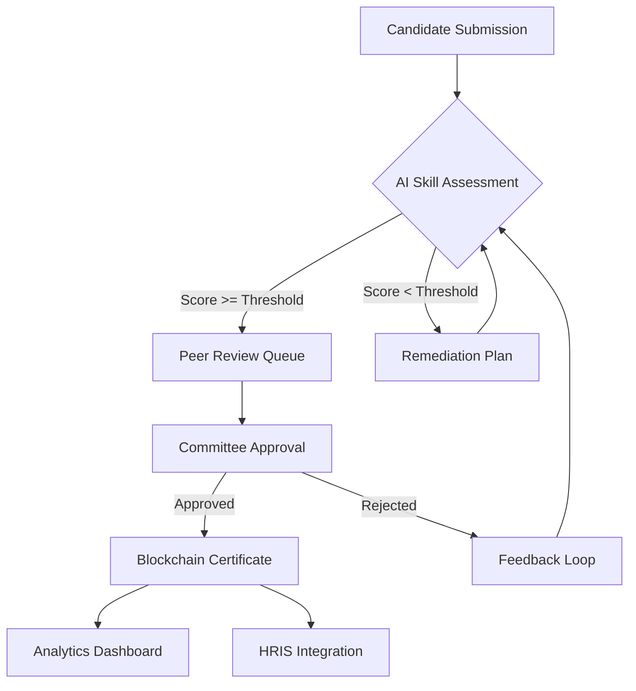

# InfoQ Launches High-Performing Teams Certification Program

## Introduction

The InfoQ High-Performing Teams Certification Program addresses a gap I've seen repeatedly in production organizations: teams that look strong on paper but crumble under real load. Traditional performance reviews rely on manager anecdotes and self-reported surveys. This program injects structured, AI-validated assessment into the credentialing process.

The core architectural problem is granularity. Individual skill assessments are common; team-level certification that accounts for cross-functional dynamics, communication patterns, and collective problem-solving is rare. InfoQ's approach uses machine learning to map skill taxonomies, predict readiness, and issue blockchain-verified credentials that actually hold up under audit.

## Why This Matters

If you're building distributed systems, you know that team performance directly impacts system reliability. A team certified in "incident response" should demonstrate more than individual heroics—they need coordinated runbooks, clear escalation paths, and post-mortem discipline.

This matters because:

- **Hiring pipelines** often mistake individual credentials for team capability. A senior engineer certified in Kubernetes doesn't guarantee the team can operate a multi-cluster fleet.
- **Retention** improves when engineers see transparent skill progression. The L0-L4 competency model gives people a concrete roadmap.
- **Compliance** demands verifiable proof of training. Blockchain-backed certificates resist tampering and simplify audit trails.

## How It Works

The system follows a pipeline architecture: candidates submit evidence, the assessment engine scores them against a hierarchical skill taxonomy, peer reviewers validate, and the certification orchestrator issues verifiable credentials.



**Step-by-step breakdown:**

1. **Candidate Portal** accepts project artifacts, code reviews, and design documents.
2. **Assessment Engine** uses fine-tuned sentence transformers to map natural language descriptions to the L0-L4 taxonomy. It compares candidate submissions against benchmark embeddings of certified professionals.
3. **Peer Review** triggers when the AI score exceeds the preliminary threshold. Three reviewers evaluate asynchronously to reduce single-point bias.
4. **Certification Orchestrator** manages the state machine: pending, under_review, approved, rejected. It handles timeouts and escalation rules.
5. **Verification Layer** writes the certificate hash to a distributed ledger and pushes events to the analytics hub.

## Core Concepts

**Skill Taxonomy (L0-L4):** The hierarchy ranges from L0 (awareness) to L4 (architectural authority). Each level compounds the previous one. For example, "machine learning orchestration" at L3 requires demonstrating pipeline reliability, cost optimization, and model drift detection—not just running a training job.

**Embedding Model:** We fine-tune sentence-transformers on engineering documentation, RFCs, and post-mortems. This captures domain-specific semantics that generic embeddings miss. The model outputs 768-dimensional vectors that we compare using cosine similarity against certified-professional benchmarks.

**Dynamic Assessment Pipeline:** The system evaluates four modalities: code review quality, design discussion transcripts, peer feedback, and project outcomes. Each modality gets a weight based on the certification domain. For infrastructure certs, code review weighs heavier; for leadership certs, peer feedback dominates.

**Adversarial Debiasing:** During training, we inject adversarial examples to prevent the model from correlating certification success with non-merit factors like tenure or employer brand. The debiasing loss term penalizes the model when protected attributes predict outcomes.

## Examples & Code Walkthrough

### Weighted Skill Scoring Function

```python
from typing import Dict, List, Optional
from dataclasses import dataclass
from enum import Enum
import math

class CompetencyLevel(Enum):
    L0 = 0
    L1 = 1
    L2 = 2
    L3 = 3
    L4 = 4

@dataclass
class SkillAssessment:
    skill_id: str
    level: CompetencyLevel
    evidence_weight: float  # 0.0 to 1.0
    reviewer_confidence: float  # 0.0 to 1.0

def calculate_weighted_score(assessments: List[SkillAssessment]) -> float:
    """
    Computes composite score balancing depth vs breadth.
    Depth: higher competency levels weighted exponentially.
    Breadth: number of distinct skills assessed (logarithmic bonus).
    """
    if not assessments:
        return 0.0
    
    total_score = 0.0
    total_weight = 0.0
    
    for assessment in assessments:
        # Exponential weighting for higher competency levels
        # L4 gets 1.5^4 = 5.0625x multiplier over L0
        level_multiplier = 1.5 ** assessment.level.value
        evidence_factor = 0.3 + (0.7 * assessment.evidence_weight)
        confidence_factor = 0.5 + (0.5 * assessment.reviewer_confidence)
        
        weighted = (assessment.level.value * level_multiplier * 
                   evidence_factor * confidence_factor)
        
        total_score += weighted
        total_weight += evidence_factor * confidence_factor
    
    # Breadth bonus: log1p prevents spamming many L1 skills
    unique_skills = len(set(a.skill_id for a in assessments))
    breadth_bonus = math.log1p(unique_skills) * 0.1
    
    return (total_score / total_weight) + breadth_bonus if total_weight > 0 else 0.0
```

### Certificate Issuance with Cryptographic Signing

```python
import hashlib
import json
import time
from cryptography.hazmat.primitives import hashes, serialization
from cryptography.hazmat.primitives.asymmetric import ec
from cryptography.hazmat.backends import default_backend

class CertificateIssuer:
    def __init__(self, private_key: ec.EllipticCurvePrivateKey):
        self._private_key = private_key
        self._issuer_did = self._derive_did()
    
    def _derive_did(self) -> str:
        """Derive decentralized identifier from public key."""
        public_key = self._private_key.public_key()
        pem = public_key.public_bytes(
            encoding=serialization.Encoding.PEM,
            format=serialization.PublicFormat.SubjectPublicKeyInfo
        )
        digest = hashlib.sha256(pem).hexdigest()[:16]
        return f"did:infoq:cert:{digest}"
    
    def issue(self, candidate_id: str, skill_set: List[str], metadata: Dict) -> Dict:
        """
        Issues W3C-compatible verifiable credential with cryptographic proof.
        """
        credential = {
            "@context": ["https://www.w3.org/2018/credentials/v1"],
            "type": ["VerifiableCredential", "HighPerformingTeamCertification"],
            "issuer": self._issuer_did,
            "issuanceDate": int(time.time()),
            "credentialSubject": {
                "id": candidate_id,
                "skills": skill_set,
                "metadata": metadata
            }
        }
        
        # Create cryptographic signature
        payload = json.dumps(credential, sort_keys=True).encode()
        signature = self._private_key.sign(
            payload,
            ec.ECDSA(hashes.SHA256())
        )
        
        credential["proof"] = {
            "type": "EcdsaSecp2
