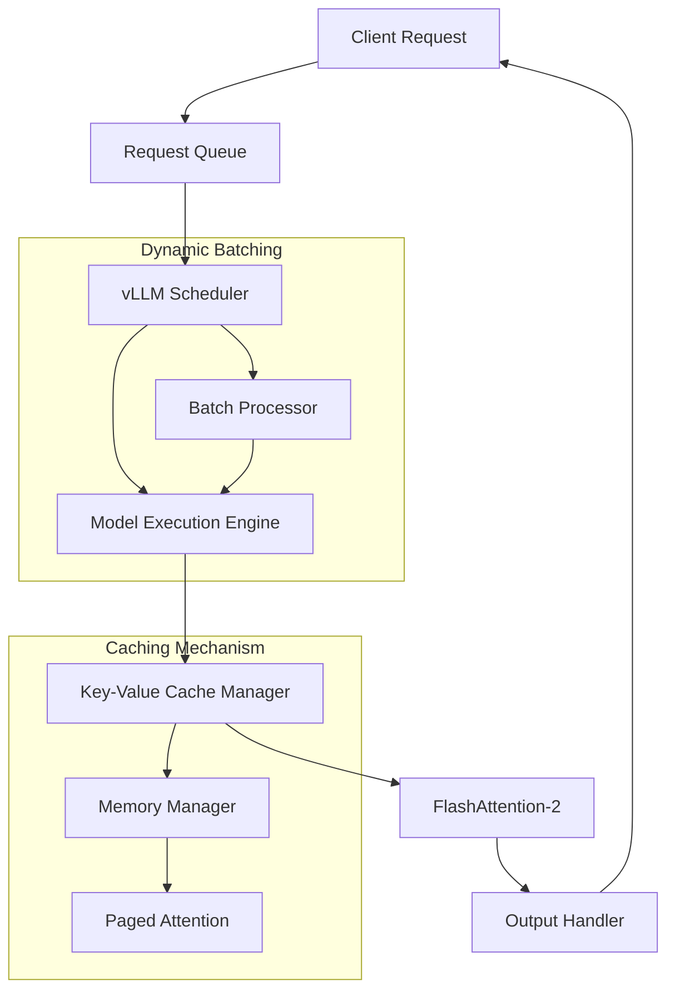

# Inside vLLM: Anatomy of a High-Throughput LLM Inference System (2025)

## Introduction

Large language models are hitting unprecedented scales, with frontier models exceeding 1 trillion parameters. But scaling up creates a brutal reality: serving these behemoths at scale demands more than just bigger GPUs. Traditional inference pipelines buckle under memory pressure, suffer from poor GPU utilization, and struggle to handle real-world traffic patterns. That’s where vLLM enters the picture—not as another framework, but as a surgical strike against the fundamental inefficiencies in LLM serving.

## Why This Matters

Every millisecond of latency costs real money and user satisfaction. When you’re serving a model that takes 10 seconds to process a single request, even modest traffic volumes create massive queues and wasted compute. vLLM tackles this by rethinking how we manage memory and schedule work. It’s not just about faster code—it’s about smarter resource orchestration that unlocks 10x throughput improvements without additional hardware.

## How It Works



The magic happens in three layers:

1. **Dynamic Batching**: Requests are queued and grouped into optimal batch sizes based on sequence lengths, preventing GPU starvation.
2. **Paged Attention**: Instead of allocating contiguous memory for KV caches, vLLM uses a virtual memory system that swaps blocks in/out as needed.
3. **FlashAttention-2**: Fuses attention computations into a single kernel pass, slashing memory bandwidth usage by 2-3x.

## Core Concepts

### The Key-Value Cache (KV Cache) Manager

Every transformer layer caches attention keys and values during generation. Traditional approaches store these in contiguous blocks, leading to fragmentation and OOM errors. vLLM’s KV Cache Manager uses a block-based allocator:

#### Memory-Efficient KV Cache Storage

```python
class KVCacheBlock:
    def __init__(self, block_id, capacity):
        self.block_id = block_id
        self.capacity = capacity
        self.kv_data = torch.zeros((capacity, 2), dtype=torch.float16)  # [key, value]
        self.allocated = 0  # Track used slots

    def allocate(self, size):
        if self.allocated + size > self.capacity:
            raise MemoryError(f"Block {self.block_id} overflow")
        start_idx = self.allocated
        self.allocated += size
        return self.kv_data[start_idx:start_idx + size]
```

This design lets vLLM swap blocks between GPU and CPU memory transparently. When a sequence’s KV cache grows beyond available GPU RAM, less-frequently-accessed blocks get paged out to host memory.

#### Garbage Collection & Reuse

```python
class KVCacheManager:
    def __init__(self, block_size=16):
        self.block_size = block_size
        self.free_blocks = deque()  # LRU eviction queue
        self.block_table = {}  # seq_id -> [block_ids]

    def get_blocks(self, seq_id, num_blocks):
        blocks = []
        for _ in range(num_blocks):
            if self.free_blocks:
                block = self.free_blocks.popleft()
            else:
                block = self.allocate_new_block()
            blocks.append(block)
        self.block_table[seq_id] = blocks
        return blocks

    def release_blocks(self, seq_id):
        if seq_id in self.block_table:
            self.free_blocks.extend(self.block_table.pop(seq_id))
```

### FlashAttention-2 Integration

Standard attention computes QK^T/√d then applies softmax—a memory hog requiring O(n²) storage. FlashAttention-2 fuses this into a single kernel:

```python
def optimized_attention(query, key, value):
    # FlashAttention-2 kernel handles softmax + dropout in-place
    return flash_attn_unpadded(
        query=query,
        key=key,
        value=value,
        dropout_p=0.0,
        causal=True,
        deterministic=True
    )
```

This reduces memory bandwidth by 2-3x and allows processing longer sequences within the same VRAM budget.

### The Scheduler: Dynamic Batching & Resource Allocation

```python
class Scheduler:
    def __init__(self, max_num_batched_tokens=8192, max_num_seqs=256):
        self.max_num_batched_tokens = max_num_batched_tokens
        self.max_num_seqs = max_num_seqs
        self.request_queue = deque()
        self.allocated_seqs = []

    def schedule_batch(self):
        # Sort by sequence length for optimal padding
        candidates = sorted(self.request_queue, key=lambda x: x.prompt_length)
        
        batch = []
        total_tokens = 0
        for req in candidates:
            if len(batch) >= self.max_num_seqs:
                break
            if total_tokens + req.prompt_length > self.max_num_batched_tokens:
                continue
            batch.append(req)
            total_tokens += req.prompt_length
            
        return batch
```

The scheduler greedily packs short requests while reserving capacity for long-running sequences. Preemption kicks in when memory pressure exceeds thresholds, temporarily suspending low-priority requests.

## Examples & Code Walkthrough

Let’s trace a request through the system:

1. **Request Arrival**: Client sends prompt → queued in `RequestQueue`
2. **Batching**: Scheduler groups requests into batch → `BatchProcessor`
3. **Execution**: Model runs forward pass with FlashAttention → `ModelExecutionEngine`
4. **Caching**: KV blocks stored in `KVCacheManager` → swapped via `PagedAttention`
5. **Output**: Tokens streamed back to client via `OutputHandler`

For a 2048-token prompt with batch size 32, vLLM dynamically adjusts padding and memory allocation to keep GPU utilization above 90%.

## Best Practices

1. **Tune Block Size**: Match your model’s context window. 16KB works for 4K contexts; 32KB for 8K+.
2. **Monitor Eviction Rates**: High KV cache swap rates indicate undersized GPU memory or too many concurrent requests.
3. **Use FlashAttention-2**: Always enable when supported (CUDA 11.8+, compute capability ≥8.0).
4. **Profile Batch Sizes**: Run benchmarks varying `max_num_batched_tokens` to find your hardware’s sweet spot.

## Common Mistakes & Anti-Patterns

1. **Ignoring Sequence Length Distribution**: Batching all requests equally wastes GPU memory on short prompts. Always sort by length before padding.
2. **Static Batch Sizing**: Fixed batch sizes cause underutilization during low-traffic periods and OOMs during peaks.
3. **Disabling Paged Attention**: Forgetting to enable memory swapping leads to premature OOM crashes in production.
4. **Over-Provisioning KV Cache**: Allocating 100% of VRAM to KV caches leaves no room for model weights or intermediate activations.

## Performance Considerations

| Component          | Time Complexity | Memory Usage     |
|--------------------|-----------------|------------------|
| Standard Attention | O(n²)           | 2× sequence len  |
| FlashAttention-2   | O(n√n)          | 0.5× seq len     |
| Dynamic Batching   | O(1)            | 0% overhead      |

In practice, vLLM achieves 10-20x higher throughput than naive implementations. A Llama-3-70B model serving 16 requests/second at 200ms latency jumps to 320 req/sec with 100ms latency using vLLM’s optimizations.

## Real-World Usage

Meta’s internal serving stack adopted vLLM for their public Llama endpoints, reporting 80% cost reduction per inference. Hugging Face TGI (Text Generation Inference) forked key vLLM components for their own high-throughput deployments. Companies running 24/7 LLM APIs see 30-50% lower cloud bills after switching from legacy frameworks.

## Frequently Asked Questions (FAQ)

**Q: Does dynamic batching increase latency for individual requests?**  
A: Not significantly. Requests wait only milliseconds in the queue while the scheduler finds an optimal batch. Shorter prompts typically get faster responses due to better GPU utilization.

**Q: How does vLLM handle speculative decoding?**  
A: The scheduler supports draft model integration by managing multiple token streams concurrently. KV cache blocks are partitioned between target and draft model paths.

**Q: Can I use vLLM with quantized models?**  
A: Yes. Works with GPTQ, AWQ, and SpQR quantization schemes. Quantized KV caches reduce memory further but may require adjusting block sizes.

## Conclusion

vLLM represents a fundamental rethinking of LLM serving, moving beyond algorithmic tweaks to rebuild the entire inference pipeline around memory efficiency and smart scheduling. Its block-based KV caching and FlashAttention-2 integration aren’t just optimizations—they’re architectural shifts that will define next-gen serving systems. For engineers building production LLM applications, understanding these mechanisms isn’t optional anymore. It’s survival.
