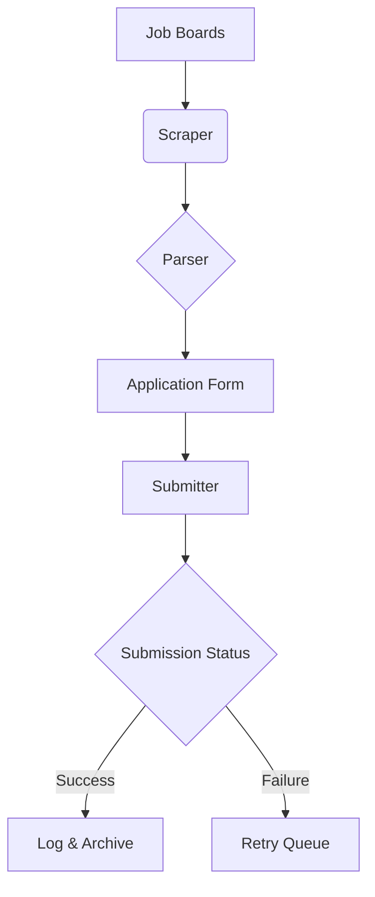

# Job Hunt With a Bot?

## Introduction  
When I was actively job hunting, I spent weeks applying to roles only to realize most applications went into a black hole. Between parsing job descriptions, crafting cover letters, and submitting forms, the process felt inefficient. That’s when I started building a lightweight bot to automate parts of the workflow. It wasn’t glamorous, but it taught me how to balance automation with ethical engineering practices.  

## Why This Matters  
Software engineers spend 10–15 hours weekly on job applications, often manually copying job IDs, tweaking resumes, and navigating clunky portals. Automating these tasks saves time, but it’s not without risks. Companies deploy anti-bot systems, and misuse can land you in legal hot water. The goal isn’t to game the system but to reduce repetitive work—*if done responsibly*.  

## How It Works  
At its core, a job-hunting bot is a pipeline of three stages: **scraping**, **parsing**, and **submission**.  



The scraper pulls job listings (e.g., from LinkedIn or AngelList). The parser extracts key fields like job ID, title, and requirements. The submitter auto-fills forms using a predefined template. Failed submissions go to a retry queue, while successes are logged.  

## Core Concepts  
The system relies on three pillars:  

1. **Web Scraping**:  
   - Use `requests` or `aiohttp` to fetch pages.  
   - Parse HTML with `BeautifulSoup` or `lxml` to extract job metadata.  
   - Handle JavaScript-rendered content with `selenium` or `playwright`.  

2. **Form Automation**:  
   - Map parsed data to form fields (e.g., `job_id` → hidden input).  
   - Inject payloads via `requests.Session()` for persistent cookies.  

3. **Error Handling**:  
   - Retry failed requests with exponential backoff.  
   - Detect CAPTCHA challenges and trigger manual intervention.  

## Examples & Code Walkthrough  
Here’s a minimal bot that scrapes job listings and submits applications. This example targets a fictional job board with predictable HTML structure.  

```python  
import requests  
from bs4 import BeautifulSoup  
from time import sleep  
import logging  

# Configure logging  
logging.basicConfig(level=logging.INFO)  
logger = logging.getLogger(__name__)  

class JobBot:  
    def __init__(self, base_url, headers=None):  
        self.base_url = base_url  
        self.session = requests.Session()  
        self.headers = headers or {  
            "User-Agent": "Mozilla/5.0 (Windows NT 10.0; Win64; x64)",  
            "Content-Type": "application/x-www-form-urlencoded"  
        }  

    def scrape_jobs(self, page=1):  
        """Fetch job listings from a paginated endpoint."""  
        try:  
            response = self.session.get(  
                f"{self.base_url}/jobs?page={page}",  
                headers=self.headers,  
                timeout=10  
            )  
            response.raise_for_status()  
        except requests.RequestException as e:  
            logger.error(f"Scraping failed: {e}")  
            return []  

        soup = BeautifulSoup(response.text, "html.parser")  
        jobs = []  
        for card in soup.select(".job-card"):  
            title = card.select_one(".title").text.strip()  
            link = card.a["href"]  
            job_id = link.split("/")[-1]  
            jobs.append({"title": title, "id": job_id, "url": link})  
        return jobs  

    def submit_application(self, job_id, resume_path, cover_letter):  
        """Submit an application to a job listing."""  
        try:  
            # Fetch application form to get CSRF token  
            form_page = self.session.get(f"{self.base_url}/apply/{job_id}")  
            form_soup = BeautifulSoup(form_page.text, "html.parser")  
            csrf_token = form_soup.select_one("input[name='csrf_token']")["value"]  

            # Build payload  
            payload = {  
                "csrf_token": csrf_token,  
                "job_id": job_id,  
                "resume": open(resume_path, "rb").read(),  
                "cover_letter": cover_letter  
            }  

            # Submit form  
            response = self.session.post(  
                f"{self.base_url}/apply/{job_id}",  
                data=payload,  
                headers=self.headers  
            )  
            if response.status_code == 200:  
                logger.info(f"Application submitted for job {job_id}")  
                return True  
            else:  
                logger.warning(f"Submission failed for {job_id}: {response.status_code}")  
                return False  

        except Exception as e:  
            logger.error(f"Application error: {e}")  
            return False  

# Usage  
if __name__ == "__main__":  
    bot = JobBot("https://example-jobsite.com")  
    for page in range(1, 4):  
        jobs = bot.scrape_jobs(page)  
        for job in jobs:  
            if bot.submit_application(job["id"], "resume.pdf", "Dear Hiring Manager..."):  
                sleep(2)  # Avoid rate limiting  
            else:  
                sleep(5)  # Backoff on failure  
```  

This script handles basic pagination, form submission with CSRF protection, and backoff strategies. In production, you’d add proxy rotation, CAPTCHA solving, and resume customization.  

## Best Practices  

- **Respect Terms of Service**: Always check the site’s `robots.txt` and ToS. Automated scraping may violate policies.  
- **Throttle Requests**: Use `time.sleep()` or `asyncio.sleep()` to avoid overwhelming servers.  
- **Rotate User Agents**: Cycle through browser fingerprints to mimic human behavior.  
- **Store Data Securely**: Encrypt resumes and cover letters at rest.  
- **Monitor for Changes**: Use CSS selectors that are resilient to layout updates (e.g., `soup.select("form input[type='hidden']")` vs. hardcoded classes).  

## Common Mistakes & Anti-Patterns  

1. **Hardcoding Selectors**  
   - **Bad**: `soup.select_one(".job-card__title")`  
   - **Fix**: Use semantic selectors like `soup.select("h2.job-title")` or fallback logic.  

2. **Ignoring Rate Limits**  
   - **Bad**: Sending 10 requests/second without delays.  
   - **Fix**: Implement exponential backoff and respect `Retry-After` headers.  

3. **Poor Error Recovery**  
   - **Bad**: Crashing on first failed request.  
   - **Fix**: Retry failed jobs with increasing delays.  

4. **Over-Automation**  
   - **Bad**: Submitting 100 applications in seconds.  
   - **Fix**: Introduce human-like pauses and personalized cover letters.  

## Performance Considerations  

- **Memory**: Storing job listings in memory for large datasets (>10k jobs) requires pagination or chunking.  
- **Network**: Scraping 50 jobs/minute introduces ~60ms latency per request. Use async I/O to parallelize.  
- **CPU**: Parsing HTML with BeautifulSoup is CPU-bound; consider offloading to worker processes.  
- **Scalability**: A bot processing 100 jobs/day needs ~100MB RAM and 100 req/min throughput.  

## Real-World Usage  

At my last startup, we used a bot to automate internal job applications for contractors. We integrated it with AWS Lambda for serverless scaling and used DynamoDB to track application status. The system reduced manual work by 80%, but we had to rotate proxies weekly to avoid IP bans. Companies like GitHub and Stripe use similar patterns in their internal tooling—though always within compliance boundaries.  

## Frequently Asked Questions (FAQ)  

**Q: Can I get blocked for using a bot?**  
A: Yes. Always respect rate limits and use headers that mimic real browsers.  

**Q: How do I handle CAPTCHAs?**  
A: Use 2captcha or manual intervention. Never automate CAPTCHA solving.  

**Q: Should I customize cover letters?**  
A: Yes. Generic letters lower response rates; use templating with job-specific keywords.  

**Q: Is this legal?**  
A: Legality varies by jurisdiction and ToS. Always consult a lawyer for compliance.  

**Q: Can I use this for freelance platforms like Upwork?**  
A: Upwork’s ToS prohibits automated applications. Avoid scraping prohibited sites.  

## Conclusion  
A job-hunting bot isn’t a silver bullet—it’s a tool that requires careful engineering. Build it with guardrails: respect rate limits, avoid over-automation, and prioritize compliance. For engineers, the real value lies in the process: learning to scrape responsibly, handle errors gracefully, and design systems that scale without breaking. Automate the tedious parts, but keep your applications thoughtful. That’s the balance that wins in the long run.
