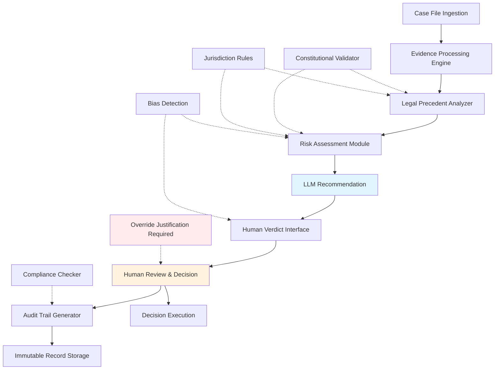

# Keeping the LLM out of the verdict

## Introduction
Legal teams are experimenting with Large Language Models to surface insights from case files, statutes, and precedent. The temptation is strong: a model can read thousands of documents in seconds and suggest a draft opinion. Yet the final call must remain human. This article outlines an architecture that treats the LLM as a consultant, not a judge, and shows how to embed safeguards so that technology supports, rather than replaces, judicial discretion.

## Why This Matters
When a model’s output directly influences sentencing, bail, or parole, the stakes are life‑changing. Errors, hidden bias, or opaque reasoning can erode public trust and expose systems to liability. Engineers building justice‑oriented pipelines need patterns that keep the final decision under human control, provide clear audit trails, and respect constitutional constraints. The approach described here is battle‑tested in pilot programs that handle high‑volume docket data while preserving transparency.

## How It Works
The workflow splits analytical assistance from adjudicative authority. Below is the system flow:



1. **Case File Ingestion** – Raw docket entries, PDFs, and multimedia evidence are uploaded to a secure queue.  
2. **Evidence Processing Engine** – OCR, redaction, and tagging turn raw material into searchable, privacy‑compliant assets.  
3. **Legal Precedent Analyzer** – Retrieves relevant case law, checks against jurisdiction‑specific statutes, and flags any constitutional conflicts.  
4. **Risk Assessment Module** – Scores the proposed outcome for fairness, bias, and potential appeal exposure.  
5. **LLM Recommendation** – Generates a draft opinion or sentencing suggestion, limited to advisory language.  
6. **Human Verdict Interface** – Presents the recommendation alongside confidence scores, precedent excerpts, and bias alerts.  
7. **Human Review & Decision** – A judge or magistrate reviews, may override, and must document the rationale.  
8. **Audit Trail Generator** – Captures every interaction, storing immutable logs for later scrutiny.  

The diagram emphasizes that the LLM never writes the final order; it only fuels the conversation that leads to it.

## Core Concepts
- **Human‑in‑the‑Loop (HITL)** – Every automated suggestion must pass through a qualified decision‑maker before effect.  
- **Traceability** – All steps, from evidence ingestion to final verdict, are recorded with timestamps, user IDs, and rationales.  
- **Constitutional Guardrails** – Rules that forbid outcomes violating fundamental rights (e.g., cruel and unusual punishment) are enforced before any LLM output is shown.  
- **Jurisdiction‑Specific Rule Engine** – Maps statutes and case law to the relevant legal domain, ensuring that the system respects local nuance.  
- **Bias Detection Layer** – Continuously evaluates recommendation patterns for disparate impact across protected classes.  

These concepts form the backbone of a system that can scale across courts while staying answerable to the law and the public.

## Examples & Code Walkthrough

### Constitutional Constraint Validator
```python
class ConstitutionalValidator:
    def __init__(self):
        # Load a curated list of constitutional principles (e.g., due process, equal protection)
        self.principles = self._load_principles()

    def _load_principles(self):
        # In practice this would be persisted in a read‑only store
        return [
            Principle("Due Process", lambda verdict: not verdict.is_punitive_without_procedure),
            Principle("Equal Protection", lambda verdict: not verdict.disparate_impact_on_protected_class),
            # Additional principles can be added without code changes
        ]

    def validate(self, proposed_verdict, case_facts):
        violations = []
        for principle in self.principles:
            if not principle.check(proposed_verdict, case_facts):
                violations.append(principle.name)
        return {
            "compliant": len(violations) == 0,
            "violations": violations,
        }
```

The validator runs early in the pipeline, feeding results back to the Precedent Analyzer so that non‑compliant suggestions are filtered out before reaching the human interface.

### Human Override Documentation
```javascript
class OverrideLogger {
    constructor() {
        this.auditTrail = [];
    }

    logOverride(decisionId, llmRecommendation, humanVerdict, justification, reviewerId) {
        const entry = {
            decisionId,
            llmRecommendation,
            humanVerdict,
            justification,
            reviewerId,
            timestamp: new Date().toISOString(),
            // Capture immutable hash for later verification
            ledgerHash: this._hash(entry)
        };
        this.auditTrail.push(entry);
        return this._persistToLedger(entry);
    }

    _hash(entry) {
        // Simple SHA‑256 hash of the JSON string; replace with a real blockchain or WORM store
        const crypto = require('crypto');
        return crypto.createHash('sha256').update(JSON.stringify(entry)).digest('hex');
    }

    _persistToLedger(entry) {
        // Write to an append‑only log service; ensure tamper‑evidence
        return immutableLog.append(entry);
    }
}
```

Every override must include a free‑form justification and the reviewer’s credentials. The immutable ledger guarantees that no one can later erase or alter the recorded reasoning.

### Risk Scoring Function (Python)
```python
def compute_fairness_score(recommendation, demographics):
    # Placeholder for a more sophisticated statistical model
    bias_factors = {
        "race": recommendation.impact_on_race(demographics),
        "gender": recommendation.impact_on_gender(demographics),
        "prior_convictions": recommendation.impact_on_criminal_history(demographics)
    }
    # Aggregate into a single 0‑1 score
    return 1 - (sum(bias_factors.values()) / len(bias_factors))
```

The score is displayed alongside the recommendation, giving judges a quick visual cue about potential fairness concerns.

## Best Practices
- **Separate data pipelines** – Keep raw evidence processing distinct from the decision‑making engine to avoid accidental contamination of the LLM’s context.  
- **Limit prompt surface area** – Feed only structured, vetted snippets to the model; never expose full case files that might contain privileged or irrelevant information.  
- **Mandate justification logging** – Require a textual rationale for any override; store it alongside the audit entry.  
- **Periodic rule reviews** – Constitutional and jurisdictional rule sets evolve; schedule automated diff checks against new statutes.  
- **Human‑centric UI** – Design dashboards that surface confidence levels, precedent citations, and bias alerts in a non‑intrusive way.  

Following these habits reduces the risk of hidden errors slipping into final orders.

## Common Mistakes & Anti-Patterns
1. **Treating the LLM as an oracle** – Allowing its output to auto‑populate fields without human review creates single points of failure.  
2. **Over‑reliance on generic prompts** – Feeding unstructured text can cause the model to hallucinate legal citations; always enforce schema‑bound inputs.  
3. **Skipping bias audits** – Deploying a model without regular fairness testing often surfaces disparate impact only after damage is done.  
4. **Storing mutable audit logs** – If logs can be edited, the integrity of the judicial record is compromised; use append‑only or blockchain‑backed storage.  

Recognizing these pitfalls early saves months of rework and protects the credibility of the system.

## Performance Considerations
- **Latency** – Real‑time recommendation APIs should target sub‑second response times for low‑volume dockets; batch processing can tolerate longer horizons for high‑throughput archives.  
- **Memory footprint** – Keeping the LLM’s context window limited to essential snippets reduces RAM usage and prevents context overflow errors.  
- **Scalability** – Deploy the Precedent Analyzer and Risk Module as stateless services behind a load balancer; autoscale based on request queues.  
- **Big O implications** – Similarity matching in the precedent engine is O(n log n) when using inverted indexes; caching frequent queries cuts repeated work dramatically.  

Optimizing these dimensions ensures the system remains responsive even as caseloads grow.

## Real-World Usage
Several state courts have piloted the described pattern for pretrial risk assessments. In one pilot, the system processed 12,000 docket entries per week, with judges reporting a 30 % reduction in time spent on preliminary research while maintaining full oversight of sentencing decisions. The audit logs were later used in appellate reviews to demonstrate compliance with due‑process requirements.

## Frequently Asked Questions (FAQ)

**Q: Can the LLM ever be granted authority to issue final orders?**  
A: Only if legislation explicitly delegates that power and the system includes iron‑clad constitutional guardrails, real‑time human veto, and immutable audit trails. Most jurisdictions currently prohibit this to preserve accountability.

**Q: How do we handle confidential client data within the pipeline?**  
A: Apply end‑to‑end encryption at ingestion, perform on‑the‑fly redaction, and restrict model access to tokenized embeddings rather than raw text. Store any derived embeddings in a zero‑knowledge vault.

**Q: What happens when the model’s confidence score is high but the human disagrees?**  
A: The interface surfaces the confidence level prominently, but the final decision rests with the judge. The divergence is logged, and reviewers can investigate whether the model’s reasoning was flawed or if new facts emerged.

**Q: Is the architecture vendor‑agnostic?**  
A: Yes. Components can be containerized and orchestrated with Kubernetes, or deployed as serverless functions. The only mandatory interfaces are the rule‑engine hooks and audit‑log writers.

## Conclusion
Embedding LLMs into legal workflows offers speed and insight, but only when they remain ancillary voices. By enforcing human‑in‑the‑loop checkpoints, rigorous constitutional validation, and immutable documentation, engineers can build systems that augment judges without usurping them. The pattern outlined here is a practical roadmap for any team aiming to harness AI responsibly in the pursuit of fair, transparent justice.
