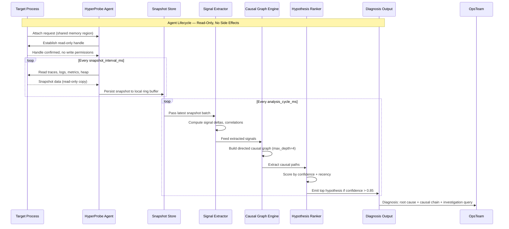

# Launch HN: HyperProbe (YC S26) – Agents that do read-only debugging in prod

## Introduction

We've all been there. 3 AM. Pager screaming. Dashboards red. And the only thing you can do is stare at a latency graph that looks like an EKG of a patient who just saw their tax bill. You know something is broken. You just don't know *what* or *why*.

That's the gap HyperProbe fills. We built an agent that attaches to your running production processes and observability pipelines, reads everything — traces, logs, metrics, heap snapshots, runtime internals — and writes absolutely nothing back. No side effects. No instrumentation changes. No restarts. Just causal analysis that answers the question your metrics dashboard never could: *why did this break, and what chain of events caused it?*

We're YC S26 and we're launching publicly today.

## Why This Matters

Here's the thing nobody talks about enough: existing observability tooling is spectacular at telling you *that* something is wrong and terrible at telling you *why*. Datadog gives you a spike in error rate. New Relic shows you a p99 latency jump. But neither of those tools will tell you that your `PaymentGatewayClient` started timing out because a background GC sweep starved the connection pool, which happened because a retry storm from a downstream timeout amplified the connection demand by 4x, which happened because the idempotency key generator had a collision bug that went undetected for three weeks.

That's a causal chain. You need that chain. Metrics alone are correlation soup.

The other reason this matters: safety. Debugging production is inherently risky. You attach a profiler, you restart with debug flags, you inject tracing middleware — and every one of those actions changes the behavior of the system you're trying to understand. HyperProbe's read-only enforcement is a hard guarantee, not an advisory. The `ReadGuard` blocks any write operation at the language runtime level. If your agent tries to write a single byte to disk or open a network socket to an external endpoint, it gets killed. No exceptions.

## How It Works

HyperProbe operates as a lightweight subprocess that attaches to a target process via shared memory and ptrace-compatible introspection (on Linux) or JVMTI/CLR profiling interfaces (on JVM and .NET). It periodically captures snapshots of the observability surface — traces, logs, metrics, heap state — and runs a causal analysis pipeline on those snapshots without ever modifying the target process's state.

Here's the full agent lifecycle:



Step by step:

1. **Attach.** The probe opens a read-only handle to the target process's observability surface. On Linux, this uses a pre-allocated shared memory region that the target process populates with trace spans and log entries. The probe never gets write access to that region.

2. **Snapshot.** Every `snapshot_interval_ms` (default 5000ms), the probe reads the current state of traces, logs, metrics, and heap snapshots into a local ring buffer. The snapshot is a point-in-time copy — immutable once written.

3. **Extract signals.** The `SignalExtractor` computes deltas and correlations across the snapshot window. It looks at latency percentiles, error rates, GC pause durations, thread block counts, and any custom signals you define.

4. **Build the causal graph.** Signals become nodes. Dependencies (temporal ordering + correlation strength) become directed edges. The graph is bounded at depth 4 to prevent combinatorial explosion.

5. **Rank hypotheses.** The `HypothesisRanker` scores each causal path by a weighted combination of confidence (how strongly the data supports the path) and recency (how recent the signal was). Only paths above the confidence threshold get surfaced.

6. **Diagnose.** The agent emits a structured diagnosis: the root cause node, the full causal chain, a confidence score, and a suggested investigation query (e.g., "filter traces by span.operation == 'PaymentGatewayClient.timeout' and look at connection pool utilization in the same window").

## Core Concepts

### ReadGuard

The `ReadGuard` is the hard enforcement layer. It configures what domains the agent is allowed to read from and absolutely prevents any write operations. The `deny_writes` flag is enforced at the runtime level — not as a middleware check or a polite suggestion, but as a bytecode-level guard that intercepts any write syscall and terminates the agent process if triggered.

```python
from hyperprobe import ReadGuard

guard = ReadGuard(
    allowed_domains=["traces", "logs", "metrics", "heap"],
    deny_writes=True,
    snapshot_interval_ms=5000,
    max_memory_overhead_mb=64,
)
```

The `allowed_domains` list is exhaustive. If the agent tries to read from a domain not in this list, the read is silently dropped. This is defense in depth — you control exactly what the agent touches.

### CausalGraph

The `CausalGraph` is a directed graph with a configurable maximum depth. Nodes represent observed signals (latency spikes, error bursts, GC pauses). Edges represent temporal dependencies with weighted correlation scores. The graph is rebuilt fresh on every analysis cycle, so it always reflects the current state of the system.

The key insight: correlation is not causation, but temporal ordering plus domain-aware correlation weighting gets you surprisingly close. The graph engine uses a modified Granger-causality test adapted for streaming observational data, combined with heuristic rules for common failure patterns (retry storms, cascading timeouts, resource exhaustion).

### HypothesisRanker

The ranker scores each extracted causal path using a weighted formula:

```
score = (confidence * 0.7) + (recency * 0.3)
```

Confidence is derived from the statistical strength of the correlation between parent and child signals across the snapshot window. Recency is an exponential decay function — signals from the last 30 seconds count more than signals from 4 minutes ago.

Only the top-ranked hypothesis is surfaced if its confidence exceeds 0.85. If no hypothesis clears the threshold, the agent returns `None` and waits for more data. We deliberately avoid surfacing low-confidence diagnoses because false positives in production debugging are worse than no diagnosis at all.

### Snapshot

A `Snapshot` is an immutable, point-in-time capture of the observability surface. It contains traces, logs, metrics, and heap data as of the moment of capture. Snapshots are stored in a ring buffer with a configurable retention window. Old snapshots are evicted automatically when the buffer fills up.

## Examples & Code Walkthrough

### Attaching HyperProbe to a FastAPI Service

Here's the minimal attachment pattern. Zero changes to your request handlers — the agent instruments at the boundary level.

```python
import hyperprobe
from hyperprobe import ReadGuard, Snapshot

probe = hyperprobe.attach(
    service_name="checkout-api",
    environment="production",
    read_guard=ReadGuard(
        allowed_domains=["traces", "logs", "metrics", "heap"],
        deny_writes=True,
        snapshot_interval_ms=5000,
        max_memory_overhead_mb=64,
    ),
)

@probe.observe("route_process_payment")
async def process_payment(request: PaymentRequest) -> PaymentResult:
    # Your existing code. Completely untouched.
    result = await charge_customer(request.payment_method, request.amount)
    await persist_transaction(result)
    return result
```

The `@probe.observe` decorator is optional — it gives the agent a named span to anchor its analysis on, but the agent works fine without it. Without the decorator, the agent still reads all available traces and correlates them with metrics and logs.

### The Internal Causal Analysis Engine

Here's what the agent does internally during each analysis cycle:

```python
from hyperprobe.analysis import CausalGraph, SignalExtractor, HypothesisRanker

class ProductionDebuggerAgent:
    def __init__(self, probe):
        self.probe = probe
        self.extractor = SignalExtractor(
            window="last_5min",
            signals=[
                "latency_p99",
                "error_rate",
                "gc_pause_ms",
                "thread_block_count",
                "connection_pool_utilization",
            ],
        )
        self.graph = CausalGraph(directed=True, max_depth=4)
        self.ranker = HypothesisRanker(weight_confidence=0.7, weight_recency=0.3)

    async def run_analysis_cycle(self):
        signals = await self.extractor.capture(self.probe.snapshot())

        self.graph.clear()
        for signal in signals:
            self.graph.add_node(
                signal.name,
                value=signal.value,
                timestamp=signal.ts,
            )
            for parent in signal.dependencies:
                self.graph.add_edge(
                    parent, signal.name, weight=signal.correlation
                )

        hypotheses = self.graph.extract_causal_paths()
        ranked = self.ranker.rank(hypotheses)

        if ranked and ranked[0].confidence > 0.85:
            return self._format_diagnosis(ranked[0])
        return None

    def _format_diagnosis(self, hypothesis):
        return {
            "root_cause": hypothesis.primary_node,
            "causal_chain": list(hypothesis.path),
            "confidence": round(hypothesis.confidence, 3),
            "recommended_investigation": hypothesis.suggested_query,
        }
```

The `SignalExtractor` computes signal deltas across the snapshot window. A "dependency" between two signals means that signal A temporally precedes signal B and their correlation coefficient exceeds a configurable threshold (default 0.6). The `CausalGraph` then finds all directed paths from root signals (those with no incoming edges) to leaf signals (those with no outgoing edges), up to the configured max depth.

### Defining Custom Probes for Domain-Specific Failure Patterns

You can define custom probes that watch for specific failure signatures in your domain. Here's an example that detects stale cache reads — a pattern we see constantly in high-throughput e-commerce systems.

```python
from hyperprobe import ProbeDefinition, ReadCondition, Action

stale_cache_probe = ProbeDefinition(
    name="stale-read-detector",
    description=(
        "Detects when a cache read returns data whose age exceeds "
        "the configured staleness threshold, indicating the cache "
        "is serving outdated responses."
    ),
    trigger=ReadCondition(
        source="traces",
        filter_expression='span.operation == "cache_read" and span.cache_age_ms > span.ttl_ms',
        aggregation="count_per_minute",
        threshold=5,
    ),
    actions=[
        Action(
            type="annotate_snapshot",
            payload={
                "tag": "stale_cache_risk",
                "severity": "high",
                "detail": (
                    "Cache reads are returning data older than the TTL. "
                    "Check cache invalidation pipeline and upstream write latency."
                ),
            },
        ),
        Action(
            type="escalate_diagnosis",
            priority="high",
            channel="#prod-debugging",
        ),
    ],
)

probe.register_probe(stale_cache_probe)
```

This probe watches trace spans for `cache_read` operations where the returned data's age exceeds the configured TTL. If more than 5 such reads occur per minute, it tags the current snapshot with a high-severity annotation and escalates to the `#prod-debugging` Slack channel. The probe reads the span metadata — it never modifies the cache or the upstream data store.

Another practical example: detecting connection pool exhaustion before it cascades into timeouts.

```python
pool_exhaustion_probe = ProbeDefinition(
    name="connection-pool-starvation",
    description=(
        "Detects when connection pool utilization exceeds 90% "
        "concurrently with rising client-side timeout rates."
    ),
    trigger=ReadCondition(
        source="metrics",
        filter_expression=(
            'metric.name == "connection_pool_active" and metric.value > 0.9 * metric.capacity '
            'AND metric.name == "client_timeout_rate" and metric.value > baseline * 2'
        ),
        window="last_60s",
        threshold=3,
    ),
    actions=[
        Action(
            type="generate_hypothesis",
            hypothesis=(
                "Connection pool exhaustion is causing client timeouts. "
                "Investigate: (1) slow downstream responses holding connections, "
                "(2) missing connection release in error paths, "
                "(3) sudden traffic spike exceeding pool capacity."
            ),
        ),
    ],
)

probe.register_probe(pool_exhaustion_probe)
```

## Best Practices

**Start with the defaults, then tune.** The out-of-the-box configuration works for most services. Adjust `snapshot_interval_ms` and `max_memory_overhead_mb` based on your service's traffic profile. For high-throughput services (10k+ RPS), a 2-second interval with a 128MB cap is a reasonable starting point. For lower-throughput internal services, 10 seconds and 32MB is fine.

**Define custom probes for your known failure modes.** The generic causal analysis engine is powerful, but it's even more powerful when guided by domain knowledge. If you know your service has a specific failure pattern (stale cache, connection pool exhaustion, retry amplification), define a probe for it. The probes act as targeted lenses that help the agent focus its analysis.

**Use the `@probe.observe` decorator strategically.** You don't need it everywhere, but placing it on your most critical paths (payment processing, auth checks, data export pipelines) gives the agent named anchors to correlate against. Think of it as bookmarking the most important pages in a book — it doesn't change the book, but it makes navigation faster.

**Monitor the monitor.** HyperProbe itself consumes resources. Set up a separate observability pipeline for the probe process. Watch its memory usage, snapshot capture latency, and analysis cycle duration. If the probe starts falling behind (snapshot intervals drifting), scale the `max_memory_overhead_mb` or reduce the snapshot frequency.

**Treat diagnoses as hypotheses, not facts.** The agent's confidence score is a useful heuristic, not a guarantee. A diagnosis with 0.91 confidence is probably right. A diagnosis with 0.86 confidence is worth investigating, not acting on blindly. Always validate the causal chain against your domain knowledge before taking action.

## Common Mistakes & Anti-Patterns

**Mistake 1: Treating HyperProbe as a replacement for proper observability.** It isn't. The agent reads from your existing traces, logs, and metrics. If those signals aren't there, the agent has nothing to analyze. We've seen teams deploy HyperProbe without adequate
