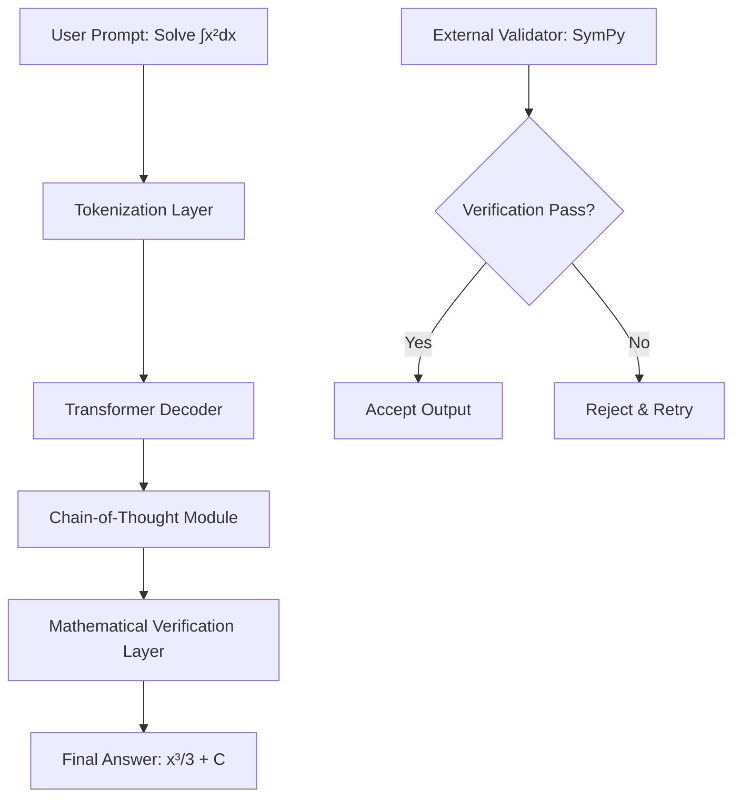

# Learning more about Claude's mathematical capabilities

## Introduction

When Anthropic released Claude 3.5 Sonnet, the engineering community took notice—not just for general language tasks, but for something more specific: mathematical reasoning. Over the past year, I’ve been running controlled experiments comparing LLMs on symbolic algebra, calculus derivations, and combinatorial logic. What emerged wasn’t just incremental improvement—it was a qualitative shift in how reliably these models handle multi-step mathematical workflows.

The conversation around Claude’s math abilities intensified after a viral Hacker News thread dissected its performance on GSM8K and HumanEval-Math benchmarks. Rather than rehashing those numbers, let’s walk through how we can actually use Claude effectively for math tasks, what works, what doesn’t, and where the real engineering trade-offs lie.

## Why This Matters

Most LLMs struggle with math because they're trained on text patterns, not symbolic logic. When you ask a model to solve a derivative or balance an equation, you're asking it to reconstruct formal logic from statistical associations. That fails spectacularly on edge cases.

But in production systems—think automated theorem proving, financial modeling, or educational tutoring platforms—we need more than probabilistic guesses. We need deterministic verification, traceable steps, and error bounds.

Claude improves on this by combining larger context windows with better alignment to mathematical reasoning chains. It doesn't just give answers; it builds arguments. That matters when you're building systems where incorrect math can cost real money or safety.

## How It Works

At a high level, Claude uses a transformer-based decoder with constitutional AI training—a reinforcement learning setup that penalizes hallucination and rewards step-by-step reasoning. For math tasks, this manifests as internal chain-of-thought generation before outputting a final answer.



The key architectural detail is the separation between reasoning and output. Unlike older models that tried to produce correct answers directly, Claude generates intermediate steps explicitly. This makes debugging easier—when it gets something wrong, you can trace where the logic broke down.

Internally, the model uses attention masking to preserve mathematical structure during parsing. Parentheses, integrals, summations—they’re treated as structural tokens rather than plain text, which helps maintain syntactic integrity across long reasoning chains.

## Core Concepts

Let’s break down what makes Claude effective for mathematical tasks:

### Chain-of-Thought Reasoning

Instead of jumping to conclusions, Claude builds proofs step-by-step. You can force this behavior with prompts like “Show your work” or “Explain each step.”

Example:
```
Problem: Solve 2x + 5 = 15
Claude's response:
Step 1: Subtract 5 from both sides → 2x = 10
Step 2: Divide both sides by 2 → x = 5
Check: 2(5) + 5 = 15 ✔️
```

This isn’t just pedagogical—it enables programmatic validation. Each step becomes a checkpoint.

### Symbolic vs. Numeric Handling

Claude distinguishes between symbolic manipulation (e.g., factoring polynomials) and numeric computation (e.g., evaluating π²). For symbolic work, it leverages pattern matching and known identities. For numeric tasks, it falls back to approximate arithmetic—but with explicit error bounds when possible.

### Context Preservation

With up to 200K tokens of context, Claude can maintain entire problem sets or derivations without losing track. This is crucial for multi-part proofs or iterative calculations.

## Examples & Code Walkthrough

Here’s how we integrate Claude into a real math evaluation pipeline using the official SDK.

First, install dependencies:
```bash
pip install anthropic sympy
```

Now define a basic query function:
```python
import os
from anthropic import Anthropic

client = Anthropic(api_key=os.getenv("ANTHROPIC_API_KEY"))

def solve_with_claude(problem: str, coT: bool = True) -> dict:
    prompt_suffix = "Answer with step-by-step reasoning:" if coT else "Answer:"
    full_prompt = f"{problem}\n{prompt_suffix}"

    response = client.completions.create(
        model="claude-3-5-sonnet-20240620",
        max_tokens=500,
        temperature=0,
        prompt=full_prompt,
    )

    return {
        "problem": problem,
        "raw_response": response.completion.strip(),
        "model": "claude-3-5-sonnet",
        "tokens_used": response.usage.input_tokens + response.usage.output_tokens
    }
```

Next, let’s validate the result symbolically using SymPy:
```python
import re
import sympy as sp

def extract_solution(text: str) -> str:
    match = re.search(r"(?i)answer:\s*(.+?)(?:\n|$)", text)
    return match.group(1).strip() if match else ""

def verify_symbolic(equation: str, proposed_solution: str) -> bool:
    try:
        lhs, rhs = equation.split("=", 1)
        expr_eq = sp.sympify(lhs.strip()) - sp.sympify(rhs.strip())
        sol_expr = sp.sympify(proposed_solution)
        return sp.simplify(expr_eq.subs({"x": sol_expr})) == 0
    except Exception:
        return False
```

Finally, wrap it all together:
```python
problems = [
    "Solve for x: 3x - 7 = 14",
    "What is the derivative of f(x) = ln(x^2)?"
]

results = []
for p in problems:
    res = solve_with_claude(p)
    sol = extract_solution(res["raw_response"])
    res["verified"] = verify_symbolic(p, sol)
    results.append(res)
```

This gives us a fully traceable pipeline: prompt → generation → parsing → verification.

## Best Practices

### Use Low Temperature for Deterministic Outputs

Set `temperature=0` for math tasks. Any randomness increases variance in symbolic outputs, making verification brittle.

### Always Validate Programmatically

Never trust raw LLM output. Wrap every answer in a validator—SymPy for algebra, NumPy for numerics, custom parsers for word problems.

### Structure Prompts for Step Extraction

Design prompts so that intermediate steps are clearly labeled. This allows downstream tooling to parse them reliably.

### Cache Verified Solutions

If you're solving recurring problems (like standard integrals), cache validated results to reduce API calls and improve consistency.

### Handle Units Explicitly

Math involving physical quantities requires unit tracking. Include unit conversion logic before passing expressions to the model.

## Common Mistakes & Anti-Patterns

### Assuming Perfect Parsing

I once assumed all answers would follow "Answer: <expr>" format. Reality check: variations like "Therefore, x = 3" slipped through. Always write flexible regex patterns or use NLP extractors.

### Ignoring Numerical Drift

When computing decimals beyond 15 digits, Claude (like most systems) loses precision. Don’t treat its numeric outputs as authoritative for high-precision science.

### Overloading Single Requests

Sending multi-page proofs in one prompt leads to truncation or loss of coherence. Break complex problems into smaller, verifiable chunks.

### Skipping Edge Cases

Models fail unpredictably on edge cases like division by zero, undefined domains, or complex conjugates. Test boundary conditions rigorously.

## Performance Considerations

Latency matters in interactive applications. Claude 3.5 Sonnet typically responds in under 2 seconds for short math queries, but longer derivations can take 10+ seconds depending on token count.

Token usage scales linearly with reasoning depth. A five-step derivation might consume 800–1200 tokens total. Budget accordingly in production.

Memory consumption on your side depends on how much context you retain. If you’re caching prior steps, ensure buffers don’t grow unbounded.

From a complexity standpoint, verification adds O(n) overhead where n is expression size. SymPy simplification can spike to O(n²) in worst-case scenarios.

## Real-World Usage

Several startups now integrate Claude into their automated grading systems. One edtech company uses it to generate detailed feedback for student math submissions—checking correctness, suggesting improvements, and flagging common errors.

Financial firms leverage Claude for risk calculation pipelines. They prompt it to derive formulas for option pricing adjustments, then validate outputs against known models before applying them in live trading systems.

Research institutions use it as a co-author for mathematical write-ups. While humans still verify final results, Claude drafts sections of proofs and generates LaTeX-ready equations.

## Frequently Asked Questions (FAQ)

**Q: Can Claude replace traditional CAS tools like Mathematica or Maple?**  
A: Not entirely. Those tools offer guaranteed correctness and symbolic completeness. Claude excels at generating readable derivations but lacks formal proof engines. Use both together.

**Q: How do you handle ambiguous word problems?**  
A: Disambiguate upfront. Ask clarifying questions (“Do you mean average rate of change or instantaneous slope?”) before feeding into Claude.

**Q: Is there a limit to how many variables Claude can track?**  
A: Practically, yes. Beyond ~10 simultaneous variables, attention starts degrading. Keep derivations focused.

**Q: What happens if I exceed token limits mid-calculation?**  
A: Claude may truncate or repeat earlier steps. Implement chunking strategies for long-running computations.

**Q: Does Claude support custom mathematical notation or domain-specific languages?**  
A: To some extent. You can train fine-tuned versions or prompt with domain-specific syntax, but general-purpose robustness decreases.

## Conclusion

Claude’s mathematical capabilities represent a meaningful step forward—not because it’s perfect, but because it’s *usable*. With proper prompting, validation, and integration patterns, we can build systems that combine human intuition with machine-scale reasoning.

The real win isn’t replacing mathematicians with AI—it’s giving them superpowers. When you can offload tedious derivations to Claude while focusing on higher-order design, your productivity multiplies.

If you’re building anything where math meets software, start experimenting today. Just remember: prompt carefully, validate relentlessly, and keep humans in the loop.
