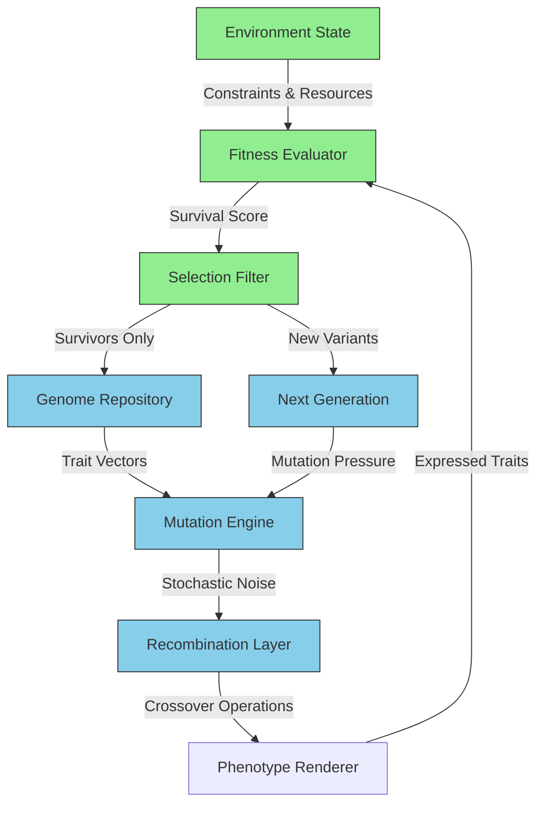

# Life On Earth is 100% AI Generated Slop.

## Introduction

Evolution doesn't care about quality. It doesn't care about elegance or efficiency. It churns out variants, selects the survivors, and repeats. What emerges isn't perfectly optimized—it's what worked under specific conditions, warts and all. Sound familiar?

That's exactly how generative AI works. And if we're being honest, most of what passes for "intelligence" on Earth—including human culture—is just evolutionary output. Vestigial organs, maladaptive behaviors, invasive species, and cultural memes are all forms of slop that somehow persisted because they didn't get selected against hard enough.

This isn't philosophy. It's architecture.

## Why This Matters

Software engineers build systems that optimize toward objectives. We tune loss functions, adjust learning rates, and prune dead paths. But when we ignore the noise in our training data, when we overfit to narrow success metrics, we breed the same kind of biological slop that evolution produces.

In production systems, this manifests as:

- Models that fail unpredictably in edge cases
- Codebases with accumulated technical debt that "still works"
- Architectures optimized for yesterday's problems but brittle against new ones

Understanding evolution as a generative process reveals why our AI systems inherit these flaws—and how to design around them.

## How It Works



The system operates in cycles:

1. **Genome Repository**: Stores trait vectors (like model weights)
2. **Mutation Engine**: Injects stochastic noise (random changes)
3. **Recombination Layer**: Crosses over traits between variants
4. **Phenotype Renderer**: Expresses traits as observable behavior
5. **Fitness Evaluator**: Scores based on environmental constraints
6. **Selection Filter**: Keeps only survivors
7. **Next Generation**: Survivors mutate into new variants

This mirrors ML training loops—but with critical differences. There's no central loss function. Selection is distributed and noisy. And crucially, most variants fail.

## Core Concepts

### Genome as Latent Space

In biological systems, the genome represents a point in high-dimensional trait space. Mutations move this point stochastically. Unlike gradient descent, evolution doesn't follow gradients—it samples randomly and selects.

```python
class Genome:
    def __init__(self, trait_dimensions=1000):
        self.traits = np.random.randn(trait_dimensions) * 0.1
    
    def mutate(self, rate=0.01, strength=0.5):
        mutation_mask = np.random.random(len(self.traits)) < rate
        noise = np.random.randn(len(self.traits)) * strength
        self.traits[mutation_mask] += noise[mutation_mask]
        return self
```

### Fitness as Distributed Reward

Natural selection applies rewards across multiple dimensions simultaneously. Survival, reproduction, resource acquisition—all compete. This creates multi-objective optimization without explicit coordination.

```python
def evaluate_fitness(phenotype, environment):
    # Survival probability based on environmental match
    survival_score = calculate_survival_probability(phenotype, environment)
    
    # Reproductive potential
    reproduction_score = phenotype.reproductive_fitness()
    
    # Resource efficiency
    efficiency_score = phenotype.resource_efficiency()
    
    # Combined with diminishing returns
    return (survival_score * reproduction_score * efficiency_score) ** 0.5
```

### Environmental Constraints as Loss Functions

Climate change, predation, resource scarcity—these act as implicit loss functions. They're not learned; they're exogenous pressures that shape what survives.

## Examples & Code Walkthrough

Let's implement a minimal evolutionary generator that mirrors biological processes while highlighting where "slop" emerges.

### Evolutionary Diffusion Engine

```python
import numpy as np
from typing import List, Callable, Tuple

class EvolutionaryDiffusionEngine:
    """
    Simulates biological generative processes:
    - Mutation as stochastic noise injection
    - Recombination as latent space interpolation
    - Selection as distributed reward modeling
    """
    
    def __init__(self, 
                 population_size: int = 1000,
                 genome_length: int = 512,
                 mutation_rate: float = 0.02,
                 selection_pressure: float = 0.1):
        self.population_size = population_size
        self.genome_length = genome_length
        self.mutation_rate = mutation_rate
        self.selection_pressure = selection_pressure
        self.population = [np.random.randn(genome_length) * 0.1 
                          for _ in range(population_size)]
        
    def inject_mutation_noise(self, genome: np.ndarray) -> np.ndarray:
        """
        Apply stochastic mutation with Gaussian noise.
        This is where biological "slop" begins to accumulate.
        """
        noise_mask = np.random.random(len(genome)) < self.mutation_rate
        noise = np.random.randn(len(genome)) * np.random.uniform(0.1, 0.5)
        return genome + (noise_mask * noise)
    
    def recombine_traits(self, parent_a: np.ndarray, parent_b: np.ndarray) -> np.ndarray:
        """
        Perform crossover operation between two genomes.
        Mimics biological recombination during sexual reproduction.
        """
        crossover_point = np.random.randint(0, len(parent_a))
        child = np.concatenate([
            parent_a[:crossover_point],
            parent_b[crossover_point:]
        ])
        return child
    
    def evaluate_phenotype(self, genome: np.ndarray, 
                          environment: Callable) -> float:
        """
        Map genotype to fitness score.
        Environment function acts as distributed reward signal.
        """
        # Decode genome to phenotype characteristics
        energy_efficiency = np.tanh(genome[0]) + 1.0
        camouflage_effectiveness = 1.0 / (1.0 + np.exp(-genome[1]))
        reproductive_rate = np.abs(genome[2]) * 0.5
        
        # Calculate survival probability in given environment
        survival_chance = environment(energy_efficiency, 
                                     camouflage_effectiveness, 
                                     reproductive_rate)
        return survival_chance
    
    def evolve_generation(self, environment: Callable) -> List[np.ndarray]:
        """
        Execute one generation of evolutionary dynamics.
        Returns new population after selection and variation.
        """
        # Evaluate all individuals
        fitness_scores = [
            self.evaluate_phenotype(genome, environment) 
            for genome in self.population
        ]
        
        # Apply selection pressure (truncation selection)
        threshold = np.percentile(fitness_scores, 
                                 100 - (self.selection_pressure * 100))
        survivors = [
            self.population[i] 
            for i, score in enumerate(fitness_scores) 
            if score >= threshold
        ]
        
        if len(survivors) == 0:
            # Catastrophic failure - restart with random population
            return [np.random.randn(self.genome_length) * 0.1 
                   for _ in range(self.population_size)]
        
        # Generate next generation through mutation and recombination
        new_population = survivors.copy()
        
        while len(new_population) < self.population_size:
            # Select parents randomly from survivors
            parent_a, parent_b = np.random.choice(survivors, 2, replace=False)
            
            # Recombine traits
            offspring = self.recombine_traits(parent_a, parent_b)
            
            # Apply mutation
            offspring = self.inject_mutation_noise(offspring)
            
            new_population.append(offspring)
        
        self.population = new_population[:self.population_size]
        return self.population

# Example environment function (predator-prey dynamics)
def forest_environment(efficiency: float, camouflage: float, reproduction: float) -> float:
    """
    Simulates competitive forest ecosystem.
    Higher efficiency + better camouflage = higher survival.
    But too much reproduction reduces offspring survival.
    """
    predation_risk = 0.3 / (efficiency * 0.7 + camouflage * 0.3 + 1e-6)
    resource_competition = reproduction * 0.2
    return max(0, 1 - predation_risk - resource_competition)
```

### Ecological Reward Router

```python
class EcologicalRewardRouter:
    """
    Implements reward shaping that prevents mode collapse
    through diversity preservation and entropy regularization.
    """
    
    def __init__(self, diversity_weight: float = 0.1, 
                 entropy_weight: float = 0.05):
        self.diversity_weight = diversity_weight
        self.entropy_weight = entropy_weight
        self.trait_history = []
    
    def calculate_diversity_loss(self, population: List[np.ndarray]) -> float:
        """
        Penalize lack of genetic diversity.
        Prevents population from collapsing to single strategy.
        """
        if len(population) < 2:
            return 0.0
            
        # Calculate pairwise distances between genomes
        distances = []
        for i in range(len(population)):
            for j in range(i+1, len(population)):
                dist = np.linalg.norm(population[i] - population[j])
                distances.append(dist)
        
        avg_distance = np.mean(distances)
        return -avg_distance  # Negative because we want to maximize distance
    
    def calculate_entropy_regularization(self, population: List[np.ndarray]) -> float:
        """
        Encourage exploration through entropy maximization.
        Prevents premature convergence to local optima.
        """
        if len(population) == 0:
            return 0.0
            
        # Estimate distribution of key traits
        trait_0_values = np.array([genome[0] for genome in population])
        trait_1_values = np.array([genome[1] for genome in population])
        
        # Simple histogram-based entropy estimation
        hist_0, _ = np.histogram(trait_0_values, bins=10, density=True)
        hist_1, _ = np.histogram(trait_1_values, bins=10, density=True)
        
        # Add small epsilon to prevent log(0)
        hist_0 = hist_0 + 1e-10
        hist_1 = hist_1 + 1e-10
        
        entropy_0 = -np.sum(hist_0 * np.log(hist_0))
        entropy_1 = -np.sum(hist_1 * np.log(hist_1))
        
        return (entropy_0 + entropy_1) / 2
    
    def compute_total_reward(self, phenotype: np.ndarray, 
                           environment_score: float,
                           population: List[np.ndarray]) -> float:
        """
        Combine survival reward with diversity and entropy penalties.
        Total reward = survival + diversity_bonus + entropy_bonus
        """
        diversity_bonus = self.diversity_weight * self.calculate_diversity_loss(population)
        entropy_bonus = self.entropy_weight * self.calculate_entropy_regularization(population)
        
        return environment_score + diversity_bonus + entropy_bonus
```

## Best Practices

1. **Embrace Stochasticity**: Don't eliminate noise—channel it. Biological systems use mutation as a creative force, not a bug.

2. **Design for Failure**: Most variants should fail. This is healthy. Build systems that recover gracefully from catastrophic selection events.

3. **Monitor Diversity Metrics**: Track genetic diversity in your populations. Mode collapse kills innovation.

4. **Separate Concerns**: Keep mutation, recombination, and selection as distinct phases. This makes debugging easier.

5. **Version Control Your Environments**: Environmental changes drive evolution. Track these like code changes.

## Common Mistakes & Anti-Patterns

### Anti-Pattern 1: Over-Optimizing Selection Pressure

```python
# BAD: Too much selection pressure leads to rapid collapse
engine = EvolutionaryDiffusionEngine(selection_pressure=0.9)

# GOOD: Balanced pressure maintains diversity
engine = EvolutionaryDiffusionEngine(selection_pressure=0.1)
```

### Anti-Pattern 2: Ignoring Environmental Drift

```python
# BAD: Static environment causes overfitting
static_env = lambda e, c, r: 1.0 - predation_risk(e, c)

# GOOD: Dynamic environment prevents stagnation
def seasonal_environment(season):
    def env(e, c, r):
        if season == 'winter':
            return 1.0 - (predation_risk(e, c) * 1.5)
        else:
            return 1.0 - predation_risk(e, c)
    return env
```

### Anti-Pattern 3: Eliminating All Negative Traits

```python
# BAD: Removing all "slop" eliminates beneficial side effects
def overly_restrictive_selection(fitness):
    return fitness > 0.99  # Almost perfect fitness required

# GOOD: Allow variation within bounds
def balanced_selection(fitness):
    return fitness > np.percentile(fitness_history, 25)
```

## Performance Considerations

### Memory Allocation

The population storage grows quadratically with size during recombination phases. Pre-allocate arrays when possible:

```python
# Pre-allocate for better memory locality
self.population_buffer = np.empty((population_size, genome_length), dtype=np.float32)
```

### Computational Complexity

- **Per Generation**: O(N²) for pairwise fitness evaluation
- **Mutation**: O(N × G) where G is genome length
- **Recombination**: O(N × G) for crossover operations

For large populations, consider parallel evaluation or subsampling techniques.

### Scalability Limits

Beyond 10,000 individuals, traditional evolutionary algorithms become computationally prohibitive. Solutions:

1. Island models (distributed populations)
2. Fitness sharing (artificial niching)
3. Streaming evolution (constant memory usage)

## Real-World Usage

Netflix employs evolutionary strategies for content recommendation. Their system maintains diverse algorithm variants, selects based on user engagement while preserving exploration capacity—directly mirroring biological diversity maintenance.

Uber's dispatch algorithms use similar principles: multiple routing strategies compete, with selection based on rider satisfaction and driver efficiency. They explicitly inject variation to avoid local optima in traffic prediction.

Google's AutoML uses evolutionary neural architecture search, where network topologies mutate and recombine. Their success depends on maintaining architectural diversity throughout training.

## Frequently Asked Questions (FAQ)

**Q: Isn't biological evolution inefficient compared to gradient descent?**

A: Gradient descent requires differentiable objectives and precise gradients. Evolution works with discrete, noisy signals. It's slower but doesn't require perfect information.

**Q: How do we prevent harmful mutations from persisting?**

A: Through environmental filtering. Just as ecosystems select against dangerous traits, our systems need robust evaluation mechanisms that penalize harmful side effects.

**Q: Can we accelerate evolution using faster hardware?**

A: Yes, but speed without diversity leads to premature convergence. Cloud-scale evolution requires careful population management to maintain exploration.

## Conclusion

Earth's biosphere demonstrates that generative systems produce slop—and that's their strength. Imperfect outputs drive innovation. Failed experiments reveal new possibilities. The "100% AI generated slop" isn't a flaw; it's the raw material of emergence.

For engineers building production AI systems, this perspective offers practical guidance: embrace noise, preserve diversity, and design for recovery. The cleanest solutions often emerge from the messiest processes.
