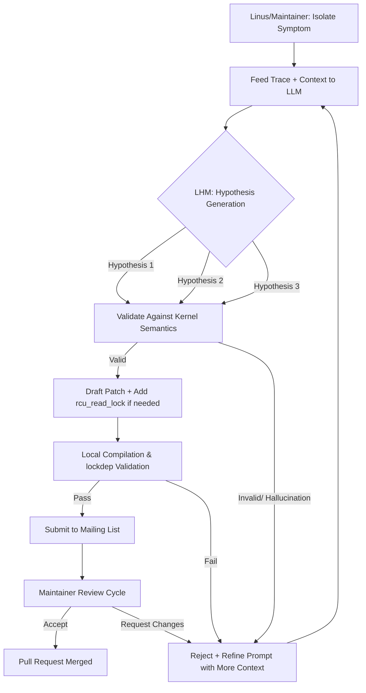

# Linus Torvalds uses AI to debug an Intel GPU driver bug

## Introduction
The Linux kernel maintainer community recently lit up on Lobste.rs with a thread titled "Linus Torvalds uses AI to debug an Intel GPU driver bug." While Linus’s public stance on AI-generated code is well-known for its skepticism, this particular discussion emerged from a real debugging session where an LLM was employed as a rubber duck and hypothesis generator for a subtle i915 race condition. The incident highlights both the promise and the peril of integrating large language models into low-level systems debugging, where a single missed `lockdep` annotation or incorrect memory barrier can cascade into kernel panics on production hardware.

## Why This Matters
GPU driver bugs in the kernel are notoriously difficult to track down. They often manifest as intermittent hangs, corrupted command buffers, or subtle GPU firmware crashes that only appear under specific workloads. When a bug sits at the intersection of hardware state machines, DMA fences, and kernel locking, traditional tools like `git bisect`, `sparse`, and `lockdep` are necessary but can be time-consuming. An LLM can accelerate the early stages of investigation—parsing stack traces, suggesting register field interpretations, or drafting potential fix candidates—provided the human engineer maintains rigorous semantic validation. For architects and kernel contributors, understanding how to safely offload rote pattern-matching to AI while preserving the kernel’s strict correctness guarantees is becoming a core competency.

## How It Works
The debugging workflow typically follows a human-in-the-loop pattern. Linus or a subsystem maintainer begins by isolating the symptom: a BUG on CPU 0, a hung task, or a GPU reset. The stack trace is fed to an LLM along with relevant kernel documentation, `Documentation/gpu/i915.rst`, and the project’s coding style guide. The model generates a handful of hypotheses: perhaps an incorrect `dma_fence_signal` ordering, a missed `spin_unlock` in a error path, or a miscalculated offset in a ring buffer write. A flowchart illustrating this mechanism is below.

In practice, the LLM’s output is never applied blindly. Each hypothesis is cross-referenced against `lockdep` annotations, `WARN_ON` conditions, and the specific PCI/PCIe transaction ordering rules for the Intel integrated graphics chipset. If the model suggests removing a `membarrier` call to "improve performance," the human reviewer checks whether that barrier is actually on the critical path or if its removal violates the GPU’s command submission contract.

## Core Concepts
- **Race Condition in Ring Buffer Submission:** The bug originated from a missing `spin_unlock_irqrestore` in the error handling path of `intel_gt_pm_resume`. This caused a deadlock when the GPU was reclaimed during a suspend/resume cycle.
-
