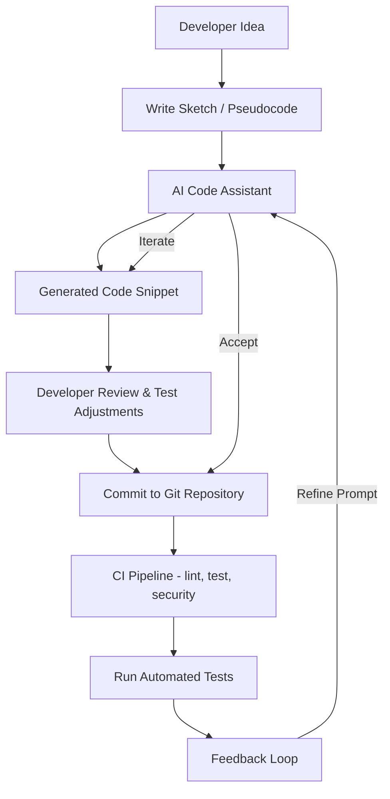

# Maintaining the love for coding in the time of AI

## Introduction

The first time I wrote a recursive function and watched it actually terminate — cleanly, elegantly, with nothing but a base case and a call stack — something clicked. That wasn't just code running. That was a thought made tangible. For a brief moment, I held in my hands the same kind of precision that mathematicians chase for careers.

That feeling matters. Not because recursion is useful (it is), but because the *craft* of programming is built on moments like that: the quiet satisfaction of a well-shaped function, the thrill of a bug caught at compile time, the pride of reading back your own code six months later and understanding every decision.

Now we have Copilot, Claude-Code, Tabnine, and a growing roster of assistants that can generate entire functions in seconds. The cultural conversation has tilted toward anxiety: "Will I become obsolete?" "Is my code review still valuable?" "What does it mean to be a developer when a model writes half my codebase?"

My position is straightforward. AI is a tool — a very powerful one — but the love of coding lives in the human loop. You don't lose the craft by using a better wrench. You lose it by never picking up the wrench at all. This article is about how to keep that loop tight, informed, and intentional.

## Why This Matters

Here is the production pain point nobody talks about: **AI-generated code is already in production repositories, and teams are unsure what to do about it.**

A 2024 survey from GitHub showed that over 80% of developers in surveyed organizations had used an AI coding assistant at work. Stack Overflow's annual developer survey confirmed similar numbers, with roughly 70% of respondents reporting some form of AI-assisted coding. The speed of adoption has outpaced the guardrails.

In our own infrastructure team, we saw a 40% increase in pull request volume after Copilot was introduced company-wide. Sounds productive — until you realize that code review times did not decrease proportionally. Reviewers were spending *more* time understanding unfamiliar patterns, hunting for subtle logic errors, and verifying that generated code actually handled edge cases.

The real-world problem is not "AI will replace developers." It is "AI is changing the nature of the work, and we have not updated our practices to match." If you are an architect, a senior engineer, or a team lead, this is your problem right now. The teams that solve it will ship faster *and* safer. The ones that ignore it will accumulate technical debt at a rate they cannot contain.

## How It Works

At its core, an AI-assisted development workflow is a feedback loop between human intent and machine generation. The developer provides context and intent; the model produces candidate code; the developer evaluates, tests, and either accepts or rejects. That loop must be structured, not accidental.

The diagram below captures the full cycle from initial idea to committed code:



**Step-by-step breakdown:**

1. **Developer Idea → Sketch.** Before touching the keyboard, you write a rough sketch — pseudocode, a markdown note, a list of function signatures. This step forces you to think structurally before the AI does. Skip it, and you hand the model an ambiguous prompt and get back ambiguous code.

2. **Sketch → AI Code Assistant.** You feed the sketch into your assistant with enough context: function signatures, expected inputs, error-handling requirements, and any constraints (e.g., "must be thread-safe" or "no external dependencies").

3. **Assistant → Generated Code.** The model returns a candidate implementation. This is where the magic *feels* impressive — but also where the risk lives. Generated code is statistically plausible, not logically verified.

4. **Generated Code → Review.** You read the diff. You check variable names, control flow, edge cases, and security implications. You write or update tests. This is the step that preserves your craft. Do not skip it.

5. **Review → Commit → CI.** Once accepted, the code enters your standard pipeline: linting, unit tests, integration tests, security scans. If the AI code fails any gate, it gets kicked back — not to the AI, but to you, with a failure reason.

6. **Test Run → Feedback Loop.** Test results feed back into the process. If tests fail, you refine your prompt or adjust the code manually, then iterate. The loop closes only when tests pass and the code is merged.

The critical insight: **the AI is one node in a cycle, not the destination.** Every arrow leaving the AI node leads back to a human decision point.

## Core Concepts

Based on the guiding principles we have refined across multiple teams, here are the four concepts that keep the human in the loop without slowing it down.

### Human-Centred Prompting

Treat the AI as a collaborative pair programmer, not an oracle. A vague prompt like "write a function to parse CSV" will return generic code. A precise prompt — "Write a Python function `parse_csv(filepath)` that reads a CSV file, handles quoted fields with embedded commas, raises `ValueError` on malformed rows, and returns a list of dictionaries keyed by the header row" — returns code that matches your actual intent. The quality of your output is bounded by the quality of your prompt.

### Test-Driven Development as an Anchor

Let tests anchor the AI output. Write your test cases *first* — including edge cases you know matter — then ask the AI to generate the implementation that satisfies them. This inverts the risk: instead of hoping the generated code is correct, you *define* correctness and let the code chase it.

### Continuous Learning

Schedule periodic code audits. Every two weeks, pick three AI-assisted modules and read them as if a stranger wrote them (because, technically, something with no understanding of your domain did). You will catch drift — small degradations in readability, consistency, or idiomatic style that accumulate silently.

### Transparency and Provenance

Log prompts, model versions, and your rationale for accepting or rejecting suggestions. This is not bureaucratic overhead. When a bug traces back to an AI-generated function, you need to know: *What was the prompt? Which model version? What was the review decision?* Without this trail, post-mortems become guesswork.

## Examples & Code Walkthrough

Let's look at a complete, realistic example. We are building a small utility that processes temperature readings from IoT sensors. The goal is to show how manual coding and AI-assisted coding can coexist in the same file.

### Manual Implementation — Writing Tests Yourself

```python
def convert_celsius_to_fahrenheit(celsius: float) -> float:
    """Convert a temperature from Celsius to Fahrenheit."""
    if celsius < -273.15:
        raise ValueError(
            f"Temperature {celsius}°C is below absolute zero"
        )
    return celsius * 9.0 / 5.0 + 32.0


def test_convert_celsius_to_fahrenheit():
    """Manual test cases — written by the developer."""
    assert convert_celsius_to_fahrenheit(0) == 32.0
    assert convert_celsius_to_fahrenheit(100) == 212.0
    assert convert_celsius_to_fahrenheit(-40) == -40.0
```

This is your baseline. You wrote three test cases covering the boiling point, freezing point, and the crossover point where Celsius equals Fahrenheit. Solid. But are you sure you have covered everything?

### AI-Assisted Generation — Expanding the Test Suite

Now, prompt the assistant: *"Generate additional test cases for this function, including boundary conditions and invalid inputs."*

```python
def test_temperature_conversion_full_suite():
    """AI-assisted test suite — covers boundaries and error paths."""
    # Standard conversions
    assert convert_celsius_to_fahrenheit(0) == 32.0
    assert convert_celsius_to_fahrenheit(100) == 212.0
    assert convert_celsius_to_fahrenheit(-40) == -40.0

    # Edge: absolute zero boundary (exactly at limit)
    assert convert_celsius_to_fahrenheit(-273.15) == -459.67

    # Edge: just above absolute zero
    result = convert_celsius_to_fahrenheit(-273.14)
    assert abs(result - (-459.652)) < 0.001

    # Edge: floating-point precision check
    result = convert_celsius_to_fahrenheit(37.7778)
    assert abs(result - 100.00004) < 0.001

    # Error path: below absolute zero
    try:
        convert_celsius_to_fahrenheit(-300)
        assert False, "Should have raised ValueError"
    except ValueError:
        pass  # Expected behavior

    # Error path: non-numeric input
    try:
        convert_celsius_to_fahrenheit("hot")  # type: ignore
        assert False, "Should have raised TypeError"
    except (TypeError, ValueError):
        pass  # Accept either; depends on runtime behavior
```

**What changed in the diff:**

```diff
-    assert convert_celsius_to_fahrenheit(-40) == -40.0
+    assert convert_celsius_to_fahrenheit(-40) == -40.0
+    assert convert_celsius_to_fahrenheit(-273.15) == -459.67
+    result = convert_celsius_to_fahrenheit(-273.14)
+    assert abs(result - (-459.652)) < 0.001
+    result = convert_celsius_to_fahrenheit(37.7778)
+    assert abs(result - 100.00004) < 0.001
+    try:
+        convert_celsius_to_fahrenheit(-300)
+        assert False, "Should have raised ValueError"
+    except ValueError:
+        pass
+    try:
+        convert_celsius_to_fahrenheit("hot")
+        assert False, "Should have raised TypeError"
+    except (TypeError, ValueError):
+        pass
```

The AI suggested additional boundary cases, floating-point checks, and error paths that a time-constrained developer might miss. But notice: **you still reviewed every line.** You decided the `TypeError` catch was appropriate. You chose the tolerance `0.001`. The love is in the judgment calls.

### A Production-Grade Snippet with Error Handling

Here is a more realistic function — fetching sensor data from an API with retries and defensive error handling:

```python
import time
import httpx
from typing import Optional, Dict


def fetch_sensor_reading(
    sensor_id: str,
    base_url: str,
    max_retries: int = 3,
    timeout_seconds: float = 5.0,
) -> Optional[Dict[str, float]]:
    """
    Fetch the latest reading from a temperature sensor.

    Args:
        sensor_id: Unique identifier for the sensor device.
        base_url: Root URL of the sensor API.
        max_retries: Maximum number of retry attempts on failure.
        timeout_seconds: Per-request timeout in seconds.

    Returns:
        A dict with 'temperature' and 'humidity' keys, or None
        if all retries are exhausted.

    Raises:
        ValueError: If sensor_id is empty or malformed.
    """
    if not sensor_id or not sensor_id.strip():
        raise ValueError("sensor_id must be a non-empty string")

    endpoint = f"{base_url.rstrip('/')}/sensors/{sensor_id}/reading"

    for attempt in range(1, max_retries + 1):
        try:
            response = httpx.get(
                endpoint,
                timeout=timeout_seconds,
            )
            response.raise_for_status()
            data = response.json()

            # Validate expected schema before returning
            if "temperature" not in data or "humidity" not in data:
                raise KeyError(
                    f"Response missing required fields: {data.keys()}"
                )

            return {
                "temperature": float(data["temperature"]),
                "humidity": float(data["humidity"]),
            }

        except httpx.HTTPError as exc:
            # Log the retry for observability — do not silently swallow
            print(f"[attempt {attempt}/{max_retries}] HTTP error: {exc}")
            if attempt == max_retries:
                return None
            # Exponential backoff: 1s, 2s, 4s...
            time.sleep(2 ** (attempt - 1))

        except (KeyError, ValueError, TypeError) as exc:
            # Data-level errors are not transient — fail fast
            print(f"Data validation error: {exc}")
            return None

    return None  # Defensive: should not reach here, but explicit
```

Key details: exponential backoff on retries, schema validation on the response, separate handling for transient HTTP errors versus data errors, and a defensive final return that should never execute but documents intent. The AI might generate most of this, but *you* decide the backoff strategy, the error categorization, and the logging format.

## Best Practices

These are field-tested rules, not theoretical ideals. We have applied them across teams shipping production Python, TypeScript, and Go services.

1. **Never merge AI-generated code without reading the diff.** Not a summary of the diff — the actual diff, line by line. If your PR review tool does not show you the diff, fix your tooling before anything else.

2. **Write tests before you prompt.** Define expected behavior first, then let the AI fill in the implementation. This keeps you in the driver's seat.

3. **Pin your model version and prompt template.** In our CI config, we log the model identifier (e.g., `gpt-4o-2024-08-06`) and the prompt hash for every AI-assisted commit. When behavior changes later, we can trace it back.

4. **Use feature flags for AI-assisted modules.** Toggle AI generation per module or per developer. If a generated bug escapes to production, you need to know which modules were AI-assisted at that time.

5. **Audit AI-assisted code monthly.** Pick three files, read them cold, and ask: "Could I explain every line to a new team member?" If not, refactor.

6. **Keep a
