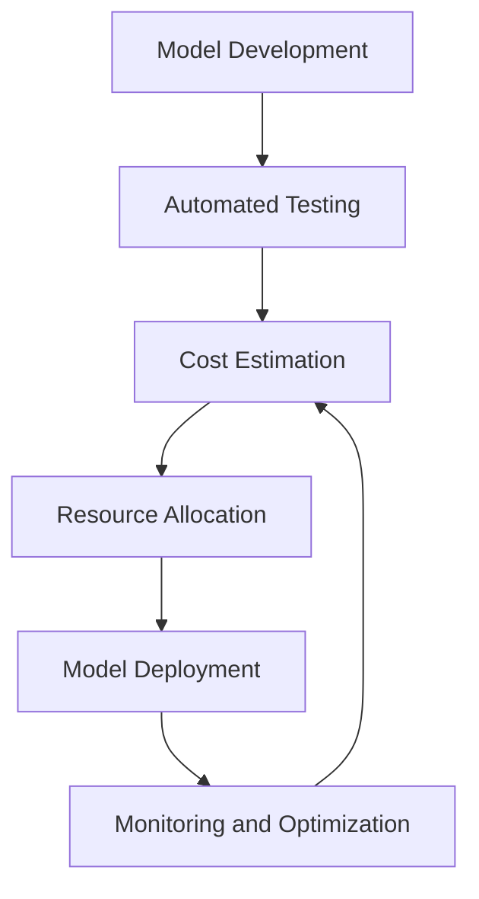

# Managing AI Coding Costs at Scale

## Introduction
When we started building our AI-powered product, we were excited about the potential of machine learning to drive business value. However, as our models grew in complexity and our team expanded, we realized that managing AI coding costs was becoming a significant challenge. We had to balance the need for rapid experimentation and innovation with the need to control costs and ensure scalability. In this article, we'll share our experiences and lessons learned on managing AI coding costs at scale.

## Why This Matters
As AI becomes increasingly ubiquitous in software development, managing coding costs is crucial for businesses to remain competitive. AI models require significant computational resources, and the cost of training and deploying these models can quickly add up. Moreover, the complexity of AI systems makes it difficult to predict and manage costs, leading to unexpected surprises and budget overruns. By understanding how to manage AI coding costs, software engineers can help their organizations avoid costly mistakes and ensure the long-term sustainability of their AI initiatives.

## How It Works
Our approach to managing AI coding costs involves a combination of automation, monitoring, and optimization. Here's a high-level overview of our architecture:

In this workflow, we use automated testing to validate our models and estimate their computational costs. We then allocate resources based on these estimates and deploy our models to production. Once deployed, we continuously monitor our models' performance and optimize their configuration to minimize costs.

## Core Concepts
There are several key concepts that underlie our approach to managing AI coding costs. These include:

* **Automated testing**: We use automated testing to validate our models and estimate their computational costs.
* **Cost estimation**: We use cost estimation models to predict the computational costs of our AI models.
* **Resource allocation**: We allocate resources based on our cost estimates to ensure that our models have the necessary computational power to run efficiently.
* **Monitoring and optimization**: We continuously monitor our models' performance and optimize their configuration to minimize costs.

## Examples & Code Walkthrough
Here's an example of how we use automated testing to estimate the computational costs of our AI models:
```python
import tensorflow as tf
from tensorflow.keras.models import Sequential
from tensorflow.keras.layers import Dense

# Define a simple neural network model
model = Sequential()
model.add(Dense(64, activation='relu', input_shape=(784,)))
model.add(Dense(32, activation='relu'))
model.add(Dense(10, activation='softmax'))

# Compile the model
model.compile(optimizer='adam', loss='categorical_crossentropy', metrics=['accuracy'])

# Define a function to estimate the computational cost of the model
def estimate_cost(model):
    # Estimate the number of floating-point operations (FLOPs) required by the model
    flops = 0
    for layer in model.layers:
        if isinstance(layer, Dense):
            flops += layer.output_shape[1] * layer.input_shape[1]
    return flops

# Estimate the computational cost of the model
cost = estimate_cost(model)
print(f"Estimated computational cost: {cost} FLOPs")
```
In this example, we define a simple neural network model and estimate its computational cost using a function that calculates the number of floating-point operations (FLOPs) required by the model.

## Best Practices
Based on our experiences, we recommend the following best practices for managing AI coding costs:

* **Use automated testing**: Automated testing can help you catch errors and estimate computational costs early in the development process.
* **Monitor and optimize**: Continuously monitor your models' performance and optimize their configuration to minimize costs.
* **Use cost estimation models**: Cost estimation models can help you predict the computational costs of your AI models and allocate resources accordingly.

## Common Mistakes & Anti-Patterns
Here are some common mistakes and anti-patterns to avoid when managing AI coding costs:

* **Not estimating computational costs**: Failing to estimate computational costs can lead to unexpected surprises and budget overruns.
* **Not monitoring and optimizing**: Failing to monitor and optimize your models' performance can lead to wasted resources and suboptimal performance.
* **Not using automated testing**: Failing to use automated testing can lead to errors and bugs that can increase computational costs.

## Performance Considerations
When managing AI coding costs, there are several performance considerations to keep in mind, including:

* **Computational complexity**: The computational complexity of your AI models can have a significant impact on their performance and cost.
* **Memory usage**: The memory usage of your AI models can also impact their performance and cost.
* **Network overhead**: The network overhead of your AI models can impact their performance and cost, particularly in distributed systems.

## Real-World Usage
Industry leaders such as Google, Amazon, and Facebook are already using AI to drive business value. For example, Google uses AI to improve the accuracy of its search results, while Amazon uses AI to personalize product recommendations. By managing AI coding costs effectively, these companies can ensure the long-term sustainability of their AI initiatives and drive continued innovation.

## Frequently Asked Questions (FAQ)
Here are some frequently asked questions about managing AI coding costs:

* **Q: How can I estimate the computational cost of my AI model?**
A: You can use cost estimation models or automated testing to estimate the computational cost of your AI model.
* **Q: What are some best practices for managing AI coding costs?**
A: Some best practices include using automated testing, monitoring and optimizing, and using cost estimation models.
* **Q: How can I optimize the performance of my AI model?**
A: You can optimize the performance of your AI model by monitoring its performance, optimizing its configuration, and reducing its computational complexity.

## Conclusion
Managing AI coding costs is a critical challenge for software engineers and organizations that want to drive business value with AI. By understanding how to estimate computational costs, monitor and optimize performance, and avoid common mistakes and anti-patterns, engineers can help their organizations ensure the long-term sustainability of their AI initiatives and drive continued innovation.
