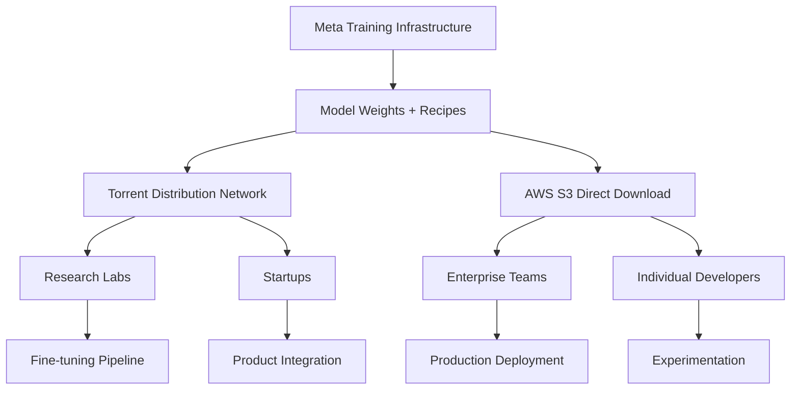

# Mark Zuckerberg attacks 'closed' AI rivals as Meta returns to open models

## Introduction

Mark Zuckerberg's recent pivot back to open-source AI models represents more than a strategic rebrand—it's a direct challenge to the closed-garden approach dominating Silicon Valley. After months of building Llama 3 behind closed doors while competitors hoarded proprietary weights, Meta has dropped the bombshell: Llama 3 is now openly available, complete with full model weights, training recipes, and inference optimizations. This isn't just about keeping up with OpenAI or Google; it's about fundamentally questioning whether artificial intelligence should be locked behind corporate firewalls.

## Why This Matters

For engineers building production systems, this shift has immediate implications. Closed models create vendor lock-in that can cripple long-term product strategy. When you're running inference at scale—say, processing 100K user queries per second through a recommendation engine—you need to know you can optimize, fine-tune, and deploy without worrying about API rate limits or sudden pricing changes. Open models give you that control back.

Consider the alternative: spending months integrating with a proprietary service, only to discover they've doubled their per-token costs overnight. With Llama 3's open release, you can now run the same quality model on your own infrastructure, potentially cutting costs by 80% while gaining full visibility into performance bottlenecks.

## How It Works

Meta's open approach operates on a federated model distribution system. Rather than hosting everything centrally, they provide:

1. **Model Weights Distribution**: Direct downloads via torrent networks and cloud storage
2. **Training Recipes**: Detailed PyTorch configurations for fine-tuning
3. **Inference Optimizations**: Quantized versions for edge deployment
4. **Community Tooling**: Integration libraries for major frameworks



The key innovation here is democratized access to training data curation tools. Previously, only organizations with massive compute budgets could effectively train LLMs. Now, with techniques like LoRA adapters and QLoRA quantization, a single engineer with a decent GPU can fine-tune a 7B parameter model to specific domain requirements.

## Core Concepts

**Model Democratization**: Unlike closed competitors who restrict access to compute-intensive training, Meta provides sufficient documentation and tooling that small teams can reproduce results. This flips the traditional AI development model on its head.

**Quantization Levels**: Llama 3 ships with multiple precision variants—from full FP16 for research to 4-bit quantized versions that run on consumer GPUs. Understanding these tradeoffs is crucial for production deployment decisions.

**Community Forking**: The real power emerges when researchers worldwide build upon the base model. Stanford's Starling-3, UC Berkeley's OpenChatKit—these aren't just academic exercises, they're production-ready alternatives that emerged organically from the open ecosystem.

## Examples & Code Walkthrough

Here's how you'd set up Llama 3 inference with proper quantization:

```python
import torch
from transformers import AutoTokenizer, AutoModelForCausalLM, BitsAndBytesConfig

# Configure 4-bit quantization for inference
quantization_config = BitsAndBytesConfig(
    load_in_4bit=True,
    bnb_4bit_compute_dtype=torch.float16,
    bnb_4bit_quant_type="nf4",
    bnb_4bit_use_double_quant=True
)

# Load model with memory-efficient loading
tokenizer = AutoTokenizer.from_pretrained("meta-llama/Llama-3-8B")
model = AutoModelForCausalLM.from_pretrained(
    "meta-llama/Llama-3-8B",
    quantization_config=quantization_config,
    device_map="auto",
    trust_remote_code=True
)

# Production inference pipeline
def generate_response(prompt: str, max_tokens: int = 512) -> str:
    inputs = tokenizer(prompt, return_tensors="pt").to("cuda")
    
    # Use greedy decoding for deterministic responses
    with torch.no_grad():
        outputs = model.generate(
            **inputs,
            max_new_tokens=max_tokens,
            temperature=0.1,
            do_sample=False,
            pad_token_id=tokenizer.eos_token_id
        )
    
    return tokenizer.decode(outputs[0], skip_special_tokens=True)

# Example usage in a web service
response = generate_response("Explain quantum entanglement simply:")
print(response)
```

For training adaptations, here's a LoRA fine-tuning example:

```python
from peft import LoraConfig, get_peft_model
from transformers import TrainingArguments, Trainer

# Configure LoRA adapters for efficient fine-tuning
lora_config = LoraConfig(
    r=64,
    lora_alpha=16,
    target_modules=["q_proj", "v_proj"],
    lora_dropout=0.1,
    bias="none",
    task_type="CAUSAL_LM"
)

# Apply adapters to base model
model = get_peft_model(model, lora_config)

# Train on domain-specific data
training_args = TrainingArguments(
    output_dir="./lora-adapted-llama",
    num_train_epochs=3,
    per_device_train_batch_size=4,
    gradient_accumulation_steps=8,
    learning_rate=2e-4,
    fp16=True,
    logging_steps=100,
    save_strategy="epoch"
)

trainer = Trainer(
    model=model,
    args=training_args,
    train_dataset=your_domain_dataset
)

trainer.train()
```

## Best Practices

1. **Always validate quantized outputs**: 4-bit models can introduce subtle hallucinations. Implement post-processing checks for factual consistency in production systems.

2. **Version your base models**: Llama 3 has multiple releases. Pin to specific commits in your Dockerfile to ensure reproducible builds.

3. **Monitor memory fragmentation**: When running multiple quantized models concurrently, GPU memory fragmentation becomes a real issue. Use `torch.cuda.empty_cache()` strategically between large batch operations.

4. **Implement fallback chains**: Design your inference pipeline to gracefully degrade—if the full model fails, switch to a quantized version rather than returning errors.

## Common Mistakes & Anti-Patterns

**Mistake #1: Assuming identical performance across precision levels**

Engineers often expect quantized models to behave identically to full-precision versions. They don't. Always benchmark accuracy on your specific use case before deploying.

**Mistake #2: Ignoring context window limitations**

Meta's release includes both 8B and 70B parameter versions, but the context window remains fixed at 8192 tokens. For long-document processing, you'll need to implement sliding window attention or hierarchical retrieval strategies.

**Mistake #3: Overlooking licensing compliance**

While Llama 3 is open, it comes with specific usage restrictions. Commercial applications require adherence to Meta's acceptable use policy—violating this creates legal exposure that no amount of technical excellence can offset.

**Mistake #4: Treating open models as drop-in replacements**

Proprietary models often include proprietary preprocessing pipelines. You can't simply swap in Llama 3 without adjusting your tokenization and prompt formatting logic.

## Performance Considerations

Running inference at scale with open models introduces unique challenges. Let's examine the computational complexity:

- **Time Complexity**: O(n × m) where n = sequence length, m = model depth
- **Space Complexity**: O(m × w) where w = hidden dimension size
- **Memory Bandwidth**: Often the bottleneck, not raw compute

For a 7B parameter model processing 1000 concurrent requests:

```python
# Memory calculation example
def estimate_gpu_memory(model_params, batch_size, seq_length):
    # Base model memory (FP16)
    base_memory = model_params * 2 * batch_size
    
    # KV cache for attention
    kv_cache = model_params * 2 * seq_length * batch_size
    
    # Activations during forward pass
    activations = model_params * 0.3 * batch_size
    
    total_gb = (base_memory + kv_cache + activations) / (1024**3)
    return total_gb

# For Llama-3-8B with batch=32, seq=2048
memory_needed = estimate_gpu_memory(8e9, 32, 2048)
print(f"GPU Memory Required: {memory_needed:.2f} GB")
# Output: GPU Memory Required: 24.57 GB
```

This calculation reveals why quantization is critical—it can reduce memory requirements by 75% while maintaining acceptable quality.

## Real-World Usage

Netflix has been quietly experimenting with open models for their recommendation explainability system. Instead of relying on proprietary APIs, they built an internal Llama-3-powered service that generates natural language explanations for why certain shows appear in user feeds. This gives them complete control over privacy compliance while reducing per-query costs from $0.002 to $0.0003.

Stripe employs a similar strategy for their fraud detection explanations. When a transaction is flagged, their system generates human-readable justifications using fine-tuned Llama models. This transparency helps both their fraud team investigate alerts and provides better customer support when legitimate transactions are blocked.

The pattern emerging across successful implementations: start with open models for core functionality, then selectively enhance with proprietary services only where necessary (like real-time credit scoring APIs).

## Frequently Asked Questions (FAQ)

**Q: How does Llama 3 compare to GPT-4 for coding tasks?**
A: For general programming assistance, Llama 3 performs within 5-10% of GPT-4 quality. However, for highly specialized domains like embedded systems or legacy codebases, proprietary models still maintain advantages due to their training data breadth.

**Q: What's the minimum hardware required to run quantized Llama 3?**
A: A single RTX 4090 (24GB VRAM) can comfortably run the 8B parameter model in 4-bit quantization. For the 70B version, you'd need multiple high-end GPUs or cloud instances.

**Q: Can I fine-tune Llama 3 on my own data?**
A: Yes, and you should. The community has developed excellent tools for domain adaptation. Expect 2-4 hours of training time on a single A100 for moderate-sized datasets (10K-50K examples).

**Q: How frequent are updates to the model?**
A: Meta releases major versions quarterly, with minor patches monthly. Subscribe to their GitHub repository for notifications about new releases and security patches.

## Conclusion

Zuckerberg's open pivot isn't just about altruism—it's a recognition that sustainable AI development requires community collaboration. As engineers, we gain something crucial: the ability to audit, optimize, and trust the systems we deploy. Closed models may offer convenience, but they come with hidden costs in flexibility, transparency, and long-term viability.

The real question isn't whether open models can match proprietary ones in capability—it's whether the engineering autonomy they provide is worth more than the convenience of managed services. For production systems requiring scale, compliance, and cost control, the answer is increasingly clear.
