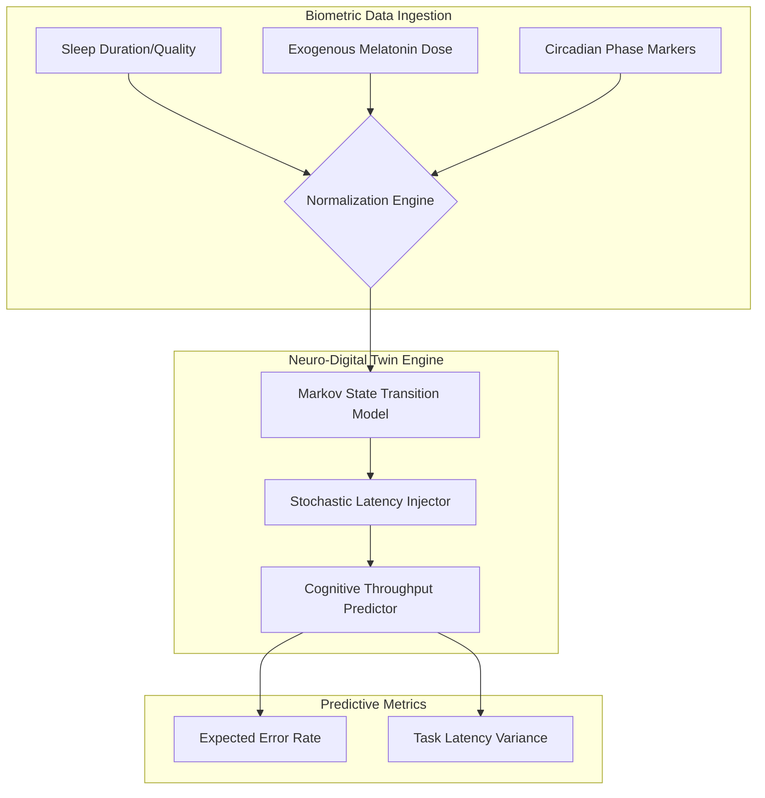

# Melatonin impairs morning cognition in healthy young adults (2023)

## Introduction

A recent 2023 study has confirmed what many sleep-deprived engineers have suspected for years: exogenous melatonin isn't a "magic switch" for sleep; it's a phase-shifter that carries a heavy computational cost. The research shows that even in healthy young adults, melatonin supplementation can lead to significant cognitive impairment during the morning hours following administration. 

In engineering terms, we aren't just looking at "feeling tired." We are looking at a high-latency, high-error-rate state that persists long after the substance has cleared the bloodstream. The brain's transition from `SLEEP_STATE` to `HIGH_PERFORMANCE_COGNITION` becomes non-linear and stochastic, introducing a "cognitive hangover" that degrades throughput during critical morning windows.

## Why This Matters

If you are building Human-in-the-Loop (HITL) AI systems or high-stakes collaborative software, you need to account for the biological constraints of the operator. We often design AI agents to be available 24/7, but the humans supervising them are subject to circadian disruption.

When a developer or site reliability engineer (SRE) is operating under the influence of melatonin-induced cognitive lag, their ability to debug complex distributed systems or respond to production incidents drops significantly. For engineers designing AI-driven scheduling, productivity tools, or neuro-adaptive interfaces, understanding how pharmacological interventions shift the "cognitive boot-up" sequence is essential for building reliable, human-centric systems.

## How It Works

The biological mechanism acts as a parameter perturbation in the circadian state machine. Instead of a predictable, periodic transition from sleep to wakefulness, melatonin introduces a "jitter" in the transition probabilities.

The following architecture describes how we can model this using a Neuro-Digital Twin (NDT) approach. We treat the human circadian rhythm as a periodic function and use stochastic modeling to predict the "morning lag" based on evening dosage.



The system ingests biometric inputs, passes them through a Markov Model that defines the probability of moving from `NREM` to `REM` to `Wake`, and then applies a latency injector that simulates the cognitive "drag" caused by the chemical presence of melatonin.

## Core Concepts

*   **Circadian Phase Shifting:** The movement of the biological clock forward or backward. Melatonin doesn't just "make you sleep"; it tells the system *when* to start the sleep routine.
*   **Cognitive Inertia:** The state of reduced alertness and impaired executive function immediately following waking. In our model, this is represented as increased latency in the task-completion function.
*   **Stochastic Cognitive Decay:** The non-deterministic nature of how errors occur. Cognitive impairment isn't a constant; it's a probability distribution where the variance increases as the melatonin concentration decreases.
*   **Exogenous vs. Endogenous Regulation:** The difference between the body's natural hormone production and external pharmacological intervention.

## Examples & Code Walkthrough

To understand the impact of melatonin on a system, we can simulate a cognitive engine. We'll use a Gamma distribution to model task latency, as real-world reaction times are never normally distributed—they are heavily skewed toward longer durations.

```python
import numpy as np
import pandas as pd

class CognitivePerformanceSimulator:
    """
    Simulates human cognitive throughput under varying neuro-chemical states.
    Models the 'elatonin hangover' as a combination of increased latency 
    and increased error probability.
    """
    
    def __init__(self, base_latency_ms: float, baseline_error_rate: float):
        self.base_latency = base_latency_ms
        self.baseline_error_rate = baseline_error_rate
        
    def run_simulation(self, melatonin_dosage: float, hours: int = 4):
        """
        Simulates a work session.
        melatonin_dosage: 0.0 (natural) to 1.0 (high pharmacological dose)
        """
        results = []
        
        # The 'Hangover' effect: increases mean latency and variance
        # We model this as a multiplier on the scale of the distribution
        inertia_multiplier = 1.0 + (melatonin_dosage * 2.2)
        
        # Error probability increases non-linearly with dosage
        effective_error_rate = self.baseline_error_rate + (melatonin_dosage * 0.25)
        
        for hour in range(1, hours + 1):
            # Tasks per hour (representing cognitive load)
            for task_id in range(15):
                # Gamma distribution captures the 'long tail' of slow reaction times
                # shape=5 provides a realistic skew for human reaction times
                latency = np.random.gamma(shape=5, scale=(self.base_latency * inertia_multiplier / 5))
                
                is_error = np.random.random() < effective_error_rate
                
                results.append({
                    "hour": hour,
                    "latency_ms": latency,
                    "is_error": is_error
                })
                
        return pd.DataFrame(results)

# --- Execution ---

# Scenario 1: Baseline (Natural Circadian Rhythm)
baseline_sim = CognitivePerformanceSimulator(base_latency_ms=450, baseline_error_rate=0.03)
baseline_data = baseline_sim.run_simulation(melatonin_dosage=0.0)

# Scenario 2: Post-Melatonin (The 2023 Study Scenario)
melatonin_sim = CognitivePerformanceSimulator(base_latency_ms=450, baseline_error_rate=0.03)
melatonin_data = melatonin_sim.run_simulation(melatonin_dosage=0.8)

print(f"--- Baseline Performance ---")
print(f"Avg Latency: {baseline_data['latency_ms'].mean():.2f}ms")
print(f"Error Rate: {baseline_data['is_error'].mean()*100:.1f}%")

print(f"\n--- Post-Melatonin Performance ---")
print(f"Avg Latency: {melatonin_data['latency_ms'].mean():.2f}ms")
print(f"Error Rate: {melatonin_data['is_error'].mean()*100:.1f}%")
```

In this simulation, you'll notice that the melatonin dose doesn't just add a fixed delay; it expands the variance of the latency. This is the "jitter" that makes human performance unpredictable during the morning hours.

## Best Practices

*   **Window Optimization:** If you must use melatonin, schedule it significantly earlier than your desired sleep time to allow the phase-shift to stabilize before the "wake" transition.
*   **Cognitive Buffering:** Schedule high-complexity, low-error-tolerance tasks (e.g., code reviews, architectural design) for the mid-morning period, once the "inertia multiplier" has decayed.
*   **Biometric Monitoring:** Use wearable data (HRV and skin temperature) to estimate your current cognitive state and adjust your task load accordingly.

## Common Mistakes & Anti-Patterns

*   **The "Quick Fix" Fallacy:** Assuming melatonin is a sedative. It is actually a chronobiotic (a timing regulator). Using it to "force" sleep can lead to a massive morning latency spike.
*   **Ignoring the Tail Risk:** Relying on "average" performance metrics. In a melatonin-induced state, your *mean* performance might look okay, but your *variance* (the probability of a catastrophic error) increases dramatically.
*   **Over-reliance on Automation:** Using AI to schedule heavy workloads during known biological "low-performance" windows without accounting for the human supervisor's cognitive lag.

## Performance Considerations

When modeling these systems, remember that the complexity is $O(N \times M)$ where $N$ is the number of time steps and $M$ is the number of simulated tasks. However, the real computational challenge is the **parameter estimation**. 

Fitting a Markov Model to noisy, heterogeneous biometric data requires significant compute, especially when using Bayesian inference to update the state transition matrix in real-time. In a production-grade Digital Twin, you would likely use a Kalman Filter to update the latent state of the user's cognitive readiness as new sensor data arrives.

## Real-World Usage

*   **Bio-Adaptive Scheduling:** High-performance teams are beginning to experiment with tools that suggest "deep work" blocks based on individual circadian rhythms.
*   **Safety-Critical Systems:** In aviation and heavy machinery, understanding the pharmacological impact on reaction time is a core component of fatigue risk management systems (FRMS).
*   **Neuro-Augmentation Research:** AI companies are investigating how to use digital twins to simulate the effects of various neuro-modulators to optimize human-AI collaborative workflows.

## Frequently Asked Questions (FAQ)

**Q: Does melatonin affect everyone the same way?**
A: No. The "phase-shift" is highly individual. In our models, we treat the `inertia_multiplier` as a hyperparameter that varies per user.

**Q: Why does it affect morning cognition specifically?**
A: It's a phase-delay or phase-advance effect. If the drug is still present in the system during the transition to wakefulness, the "boot-up" sequence of the brain is interrupted.

**Q: Can AI predict my "cognitive hangover" period?**
A: Yes, by using recurrent architectures (like LSTMs or Transformers) trained on historical sleep and performance data, we can predict cognitive throughput with increasing accuracy.

## Conclusion

The 2023 findings on melatonin serve as a reminder that biological systems are not simple boolean switches. They are complex, stochastic state machines. For engineers building the next generation of human-centric AI, the ability to model and predict these biological "interrupts" will be a key differentiator in creating truly seamless and safe human-machine interfaces.
