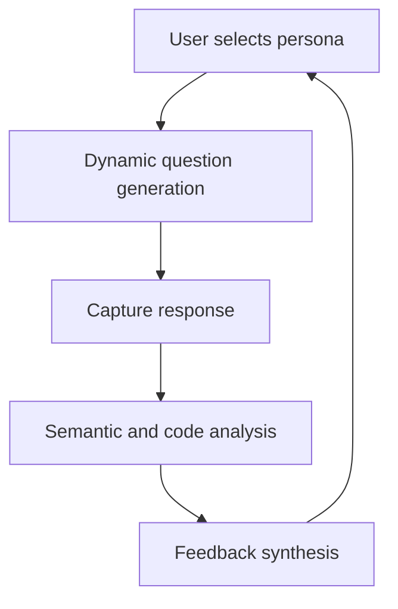

# Mockterview : Master your Mind for every Interview

## Introduction
Preparing for technical interviews can feel like solving a puzzle while the clock ticks. Traditional resources often rely on static question banks and generic advice, which rarely address the mental strain that builds during a real interview. Mockterview is an AI-powered mental training platform that simulates interview dynamics, adapts to the candidate’s skill level, and provides targeted feedback. This article explores the architecture behind Mockterview, the core concepts, and how you can integrate it into your own preparation workflow.

## Why This Matters
Software engineers spend hours rehearsing whiteboard problems, yet the stress of a live interview can drain working memory and trigger a stress response that degrades performance. Mockterview addresses this by offering a controlled environment where candidates can practice under realistic pressure, receive immediate, data-driven feedback, and iteratively improve their communication and problem‑solving skills. In high‑stakes hiring cycles, even a modest boost in confidence can translate to better hiring decisions and reduced time‑to‑fill roles.

## How It Works
Mockterview follows a clear pipeline: a user selects an interviewer persona, the system generates a tailored question, the candidate records a response, the platform evaluates the answer, and a feedback report is returned. Each stage is powered by specialized components that interact through well‑defined APIs.



Each component communicates via asynchronous messages. The persona engine draws traits from weighted pools, ensuring variation while preserving role‑specific expectations. The question generator uses a fine‑tuned language model to create questions that match the selected domain and difficulty. The response analyzer combines vector similarity with structural checks, and the feedback synthesizer blends rule‑based heuristics with generative critique.

## Core Concepts
At the heart of Mockterview are four interacting modules:

### Interview Persona Engine
Generates role‑specific interviewers by sampling traits such as tone, technical depth, and patience. The engine maintains a registry of persona templates and applies random weighting to produce a unique instance for each session.

### Dynamic Question Generator
Uses a fine‑tuned large language model to create questions that match the selected domain and difficulty. The model is prompted with context about the candidate’s background, ensuring relevance and novelty.

### Response Analyzer
Combines semantic similarity scoring with static code analysis. Vector embeddings capture the conceptual alignment between the candidate’s answer and an ideal response, while abstract syntax tree parsing evaluates code structure when applicable.

### Feedback Synthesizer
Produces human‑like critiques by merging heuristic rules with generative AI. The output includes strengths, weaknesses, and concrete suggestions for improvement.

## Examples & Code Walkthrough

### Custom Interview Persona Engine
```python
# Custom persona generation with weighted trait sampling
import random
from dataclasses import dataclass
from typing import Dict, List

@dataclass
class InterviewerPersona:
    name: str
    style: str
    technical_depth: float  # 0.0 to 1.0
    patience: float         # 0.0 to 1.0
    focus_areas: List[str]

class PersonaGenerator:
    """Creates interviewer personas based on role and difficulty."""
    def __init__(self):
        self.styles = ["Skeptical", "Encouraging", "Fast-paced", "Theoretical"]
        self.expertise_map = {
            "Backend": ["System Design", "Distributed Systems", "Database Theory"],
            "Frontend": ["Browser Internals", "Performance", "State Management"],
            "ML": ["Mathematics", "Model Optimization", "Data Pipelines"]
        }
    
    def generate(self, role: str, difficulty: str) -> InterviewerPersona:
        # Validate inputs
        if role not in self.expertise_map:
            raise ValueError(f"Unsupported role: {role}")
        difficulty = difficulty.lower()
        if difficulty not in {"junior", "mid", "senior"}:
            raise ValueError(f"Invalid difficulty: {difficulty}")
        
        style = random.choice(self.styles)
        depth = {"junior": 0.3, "mid": 0.6, "senior": 0.9}[difficulty]
        focus = random.sample(self.expertise_map[role], k=2)
        
        return InterviewerPersona(
            name=f"Interviewer_{random.randint(1000, 9999)}",
            style=style,
            technical_depth=depth,
            patience=random.uniform(0.4, 0.9),
            focus_areas=focus
        )
```

### Semantic Response Analyzer
```python
# Hybrid evaluation using sentence transformers and AST parsing
import ast
from sentence_transformers import SentenceTransformer, util
import numpy as np

class ResponseEvaluator:
    """Evaluates candidate answers using semantic similarity and code structure."""
    def __init__(self):
        self.model = SentenceTransformer('all-MiniLM-L6-v2')
        self.keyword_weights = {
            "correctness": 0.4,
            "clarity": 0.3,
            "depth": 0.3
        }
    
    def evaluate(self, question: str, response: str, ideal_answer: str) -> Dict[str, float]:
        # Encode embeddings
        embeddings = self.model.encode([question, response, ideal_answer])
        semantic_score = float(util.cos_sim(embeddings[1], embeddings[2]))
        
        # Analyze code structure if the response looks like code
        code_score = self._analyze_code_structure(response)
        
        return {
            "semantic_similarity": semantic_score,
            "code_structure": code_score,
            "composite_score": (semantic_score * 0.6 + code_score * 0.4)
        }
    
    def _analyze_code_structure(self, response: str) -> float:
        """Parse the response as Python code and compute a simplicity metric."""
        try:
            tree = ast.parse(response)
            # Complexity is based on number of nodes; normalize to 0‑1 range
            complexity = len(list(ast.walk(tree)))
            # Clamp to a reasonable maximum for scoring
            return min(complexity / 50.0, 1.0)
        except SyntaxError:
            # Non‑code responses receive a zero code score
            return 0.0
```

## Best Practices
### Keep persona definitions lean
Define only the traits that meaningfully affect interview flow; excess fields increase maintenance overhead.

### Use versioned model endpoints
Pin the sentence‑transformer model version to avoid breaking changes when the underlying weights shift.

### Log evaluation metrics
Persist semantic similarity and code scores alongside timestamps to track candidate progress over time.

### Validate user input early
Check that role and difficulty strings exist in the predefined maps before proceeding; this prevents runtime crashes.

## Common Mistakes & Anti-Patterns
### Over‑reliance on a single model
Using only a generic LLM for question generation can produce off‑topic prompts. Mitigation: fine‑tune the model on domain‑specific interview transcripts and enforce a domain filter.

### Ignoring code parsing errors
If the response analyzer assumes every answer contains code, a pure textual response will raise a SyntaxError and return a zero score. Fix: add a lightweight language detection step before invoking the AST parser.

### Storing raw user audio without consent
Recording voice input raises privacy concerns. Best practice: obtain explicit consent and store only processed text representations.

### Hard‑coding thresholds
Hard‑coding similarity cut‑offs makes the system brittle across languages. Instead, calibrate thresholds on a validation set that reflects your target candidate pool.

## Performance Considerations
### Memory footprint
The sentence‑transformer model loads into RAM once per service instance; typical size is 300 MB for the MiniLM variant. Caching the model across requests reduces cold‑start latency.

### CPU overhead
Embedding generation dominates compute cost; a single forward pass on a CPU takes ~15 ms for a 128‑token sequence. Batching multiple evaluations can improve throughput but may increase latency.

### Network latency
If the model resides in a remote GPU cluster, round‑trip times can add 50–100 ms. Deploying the model locally or using a lightweight ONNX runtime reduces this penalty.

### Scalability
The system is stateless apart from the model cache, enabling horizontal scaling behind a load balancer. Autoscaling based on request rate keeps costs aligned with demand.

### Big‑O complexity
Question generation is O(n) in the number of tokens, while semantic similarity is also O(n) due to vector dot‑product. Code parsing is linear in AST size, which is bounded by response length.

## Real-World Usage
### Netflix
Netflix engineers use a similar pipeline to rehearse system‑design interviews for senior staff. By feeding historical design discussions into the question generator, they produce bespoke prompts that mirror actual architecture review sessions.

### Uber
Uber’s interview platform incorporates a feedback loop where candidate responses are re‑ranked by a reinforcement learning model, continuously refining the difficulty curve.

### Cloudflare
Cloudflare runs Mockterview in a serverless environment, leveraging edge compute to keep latency low for global candidates. The architecture scales automatically during high‑traffic hiring periods.

## Frequently Asked Questions (FAQ)
### Do I need a GPU to run Mockterview?
No. The sentence‑transformer model runs efficiently on a modern CPU; a GPU only shortens inference time.

### Can I customize the persona traits?
Yes. Extend the `expertise_map` and `styles` lists, or supply a custom JSON configuration that the `PersonaGenerator` reads at startup.

### How is bias mitigated in generated questions?
The system applies a post‑generation filter that checks for stereotypical language and removes or re‑phrases problematic content before it reaches the candidate.

### Is the feedback deterministic?
Feedback combines deterministic heuristics with generative AI, so repeated runs may yield slightly different wording while preserving overall scores.

## Conclusion
Mockterview transforms interview preparation from a static rehearsal into an adaptive mental workout. By coupling persona‑driven roleplay with AI‑enhanced question generation, semantic evaluation, and actionable feedback, it helps engineers build the composure and technical fluency needed for high‑pressure hiring cycles. Integrating the framework into your own workflow requires modest engineering effort, but the payoff is measurable improvement in both confidence and performance.
