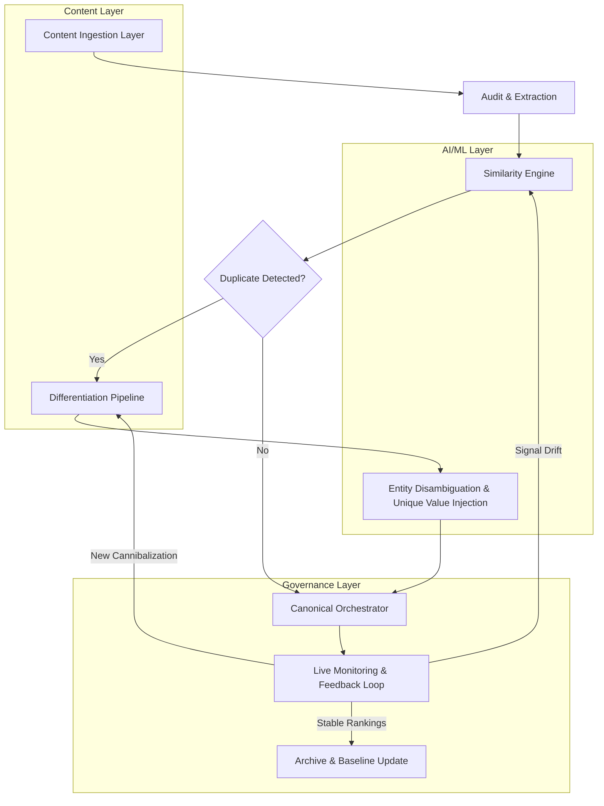

# Multi-Location SEO Governance: How to Stop City Pages Competing With Each Other

## Introduction

A regional HVAC company we'll call ClimateRight had 47 city pages. One week, Google ranked page /hvac/chicago for "AC repair Chicago." The next week, it promoted /hvac/chicago-il. Then /chicago-hvac-service took the slot. Three different URLs, same intent, same keywords, fighting each other in the SERPs. None of them held a stable position. The rest of the portfolio — 44 pages — sat invisible on page three.

This isn't a content problem. It's a governance failure. And with AI-driven search overlays — AI Overviews, LLM-powered ranking signals, entity-level topical authority models — the damage compounds faster than any manual audit can catch it.

This article walks through how to build a city-page governance system that detects, prevents, and continuously resolves cannibalization using semantic similarity engines and structured differentiation pipelines.

## Why This Matters

Software engineers building content platforms, multi-location SaaS products, or franchise websites face a scaling problem that traditional SEO playbooks don't address. When you go from 5 city pages to 200, you don't just double your surface area — you exponentially increase the collision surface between near-identical pages.

Here's what makes this an engineering problem, not just a marketing one:

- **Entity-level ranking signals.** Google's AI models now evaluate topical authority at the entity level. A brand with 30 city pages that all say the same thing gets treated as a single weak entity, not 30 strong ones.
- **AI Overviews amplify duplication.** When Google's SGE (Search Generative Experience) pulls from your domain for a location query, it favors the most authoritative, most differentiated source. Duplicated city pages dilute that signal across all of them.
- **Automated content pipelines accelerate the problem.** If your CMS generates city pages from templates (and most do), cannibalization isn't a bug — it's the default state.

The cost of ignoring this is real: lost organic traffic, wasted crawl budget, and a ranking profile that fluctuates unpredictably. We built a governance system to fix this at the infrastructure level, and here's how.

## How It Works

The system operates as a five-stage pipeline that ingests raw city page content, scores pairwise similarity, triggers differentiation workflows, enforces canonical signals, and feeds results back into the content generation loop.



### Stage 1: Content Ingestion & Audit

A scheduled job crawls all location-tagged pages from your CMS. It extracts the raw text, metadata (title tag, H1, meta description), structured data (JSON-LD), and internal link graph position. Each page gets a normalized document object with a unique page ID, location entity (city + state), and a content hash.

### Stage 2: Similarity Engine

This is where the AI component lives. We encode each page's body text into a dense vector embedding using a transformer-based sentence model. Then we compute pairwise cosine similarity across all pages targeting the same market region. Any pair above a tunable threshold (typically 0.92) flags as a cannibalization candidate.

### Stage 3: Differentiation Pipeline

When a collision is detected, the pipeline doesn't just flag it — it generates a structured diff of the two pages and identifies what's missing. Is one page missing local schema markup? Does another lack unique service-area details? The differentiation engine proposes concrete content interventions: unique H2 sections, location-specific data inserts, distinct internal anchor text strategies.

### Stage 4: Canonical Orchestrator

The orchestrator applies the right canonical strategy per conflict type. For pages that serve genuinely distinct user intents (e.g., one page targets "emergency AC repair Chicago" and another targets "routine maintenance Chicago"), we keep both and differentiate aggressively. For pages that are thin duplicates, we consolidate and redirect. The orchestrator writes canonical tags, 301 redirects, and internal link adjustments programmatically.

### Stage 5: Live Monitoring & Feedback Loop

Post-deployment, the system monitors ranking volatility for each target keyword. If a page that was consolidated starts showing ranking instability for its former keywords, the feedback loop triggers a re-evaluation. This is an ongoing process, not a one-time fix.

## Core Concepts

**Cannibalization** — When two or more pages from the same domain target the same search intent and compete against each other in the SERPs, splitting the click-through and authority signals.

**Entity-Level Authority** — How modern AI ranking models assess a brand's expertise on a specific entity (e.g., "AC repair in Chicago"). Thin or duplicated pages dilute the entity signal across all of them.

**Semantic Similarity Threshold** — The cosine similarity score above which we consider two pages to be cannibalizing each other. This is tunable based on domain size and content strategy.

**Differentiation Vector** — The set of content, structural, and metadata changes needed to make two competing pages serve distinct user intents or provide unique value.

**Canonical Orchestration** — The automated application of canonical tags, redirects, and internal linking changes to resolve identified conflicts.

## Examples & Code Walkthrough

Here's the core of the system — a Python module that ingests city page content, extracts entity embeddings, and detects cannibalization candidates.

```python
import hashlib
import json
from dataclasses import dataclass, field
from typing import Optional

import numpy as np
from sentence_transformers import SentenceTransformer
from sklearn.metrics.pairwise import cosine_similarity


@dataclass
class CityPageRecord:
    page_id: str
    url_path: str
    location_entity: str  # e.g. "Chicago, IL"
    title_tag: str
    h1: str
    body_text: str
    meta_description: str
    json_ld: Optional[dict] = None
    internal_links: list[str] = field(default_factory=list)
    content_hash: str = ""

    def __post_init__(self):
        raw = f"{self.title_tag}|{self.h1}|{self.body_text}"
        self.content_hash = hashlib.sha256(raw.encode()).hexdigest()


@dataclass
class CannibalizationPair:
    page_a_id: str
    page_b_id: str
    similarity_score: float
    shared_keywords: list[str]
    recommendation: str


class CannibalizationDetector:
    def __init__(self, model_name: str = "all-MiniLM-L6-v2", threshold: float = 0.92):
        self.model = SentenceTransformer(model_name)
        self.threshold = threshold
        self._cache: dict[str, np.ndarray] = {}

    def _encode_page(self, record: CityPageRecord) -> np.ndarray:
        cache_key = record.content_hash
        if cache_key in self._cache:
            return self._cache[cache_key]

        # Combine structured metadata with body text for richer signal
        text_blob = (
            f"{record.title_tag}. {record.h1}. "
            f"{record.body_text[:4000]}. "
            f"Location: {record.location_entity}. "
            f"Meta: {record.meta_description}"
        )
        embedding = self.model.encode(text_blob, normalize_embeddings=True)
        self._cache[cache_key] = embedding
        return embedding

    def _extract_shared_keywords(self, text_a: str, text_b: str, top_n: int = 10) -> list[str]:
        from collections import Counter
        import re

        stop_words = {
            "the", "a", "an", "in", "for", "of", "and", "or", "to", "is",
            "service", "repair", "company", "we", "our", "your"
        }

        words_a = [w for w in re.findall(r"[a-z]{3,}", text_a.lower()) if w not in stop_words]
        words_b = [w for w in re.findall(r"[a-z]{3,}", text_b.lower()) if w not in stop_words]

        counter_a = Counter(words_a)
        counter_b = Counter(words_b)

        shared = set(counter_a.keys()) & set(counter_b.keys())
        scored = sorted(shared, key=lambda w: counter_a[w] * counter_b[w], reverse=True)
        return scored[:top_n]

    def detect_pairs(
        self, pages: list[CityPageRecord], location_filter: Optional[str] = None
    ) -> list[CannibalizationPair]:
        if location_filter:
            candidates = [p for p in pages if p.location_entity == location_filter]
        else:
            candidates = pages

        if len(candidates) < 2:
            return []

        embeddings = np.array([self._encode_page(p) for p in candidates])
        sim_matrix = cosine_similarity(embeddings)

        results: list[CannibalizationPair] = []
        n = len(candidates)

        for i in range(n):
            for j in range(i + 1, n):
                score = float(sim_matrix[i][j])
                if score >= self.threshold:
                    shared_kw = self._extract_shared_keywords(
                        candidates[i].body_text, candidates[j].body_text
                    )
                    recommendation = self._recommend_action(candidates[i], candidates[j], score, shared_kw)
                    results.append(CannibalizationPair(
                        page_a_id=candidates[i].page_id,
                        page_b_id=candidates[j].page_id,
                        similarity_score=round(score, 4),
                        shared_keywords=shared_kw,
                        recommendation=recommendation,
                    ))

        # Sort by severity — highest similarity first
        results.sort(key=lambda p: p.similarity_score, reverse=True)
        return results

    def _recommend_action(
        self, page_a: CityPageRecord, page_b: CityPageRecord, score: float, shared_kw: list[str]
    ) -> str:
        if score > 0.97:
            return "CONSOLIDATE: Near-perfect duplicate. Merge content and 301 redirect the weaker page."
        elif score > 0.94:
            return "DIFFERENTIATE: High overlap. Inject unique local schema, distinct H2 sections, and location-specific data."
        elif score > 0.92:
            return "REVIEW: Borderline similarity. Audit for thin content on one or both pages. Add unique value."
        else:
            return "MONITOR: Similarity near threshold. Re-evaluate on next pipeline run."


class GovernanceOrchestrator:
    def __init__(self, detector: CannibalizationDetector):
        self.detector = detector
        self.resolved: list[dict] = []

    def run_governance_cycle(
        self, pages: list[CityPageRecord], location_filter: Optional[str] = None
    ) -> dict:
        pairs = self.detector.detect_pairs(pages, location_filter)

        actions_taken = {
            "consolidated": [],
            "differentiated": [],
            "review_required": [],
            "total_pairs_found": len(pairs),
        }

        for pair in pairs:
            action = pair.recommendation.split(":")[0]
            record = {
                "pair": (pair.page_a_id, pair.page_b_id),
                "similarity": pair.similarity_score,
                "action": action,
                "detail": pair.recommendation,
            }

            if action == "CONSOLIDATE":
                actions_taken["consolidated"].append(record)
                # In production, this triggers the redirect writer and CMS update
                self._apply_consolidation(pair)

            elif action == "DIFFERENTIATE":
                actions_taken["differentiated"].append(record)
                self._apply_differentiation(pair)

            else:
                actions_taken["review_required"].append(record)

        self.resolved.extend(actions_taken.values())
        return actions_taken

    def _apply_consolidation(self, pair: CannibalizationPair):
        # Placeholder: writes 301 redirect in CMS, updates internal link graph
        pass

    def _apply_differentiation(self, pair: CannibalizationPair):
        # Placeholder: pushes content diff tasks to the CMS editing queue
        pass
```

### How to Use It

```python
# Load city pages from your CMS or database
pages = load_all_city_pages()  # Returns list[CityPageRecord]

# Initialize the detector with a stricter threshold for large portfolios
detector = CannibalizationDetector(threshold=0.90)

# Run the governance cycle
orchestrator = GovernanceOrchestrator(detector)
results = orchestrator.run_governance_cycle(pages, location_filter="Chicago, IL")

print(f"Found {results['total_pairs_found']} cannibalization pairs.")
print(f"Consolidated: {len(results['consolidated'])}")
print(f"Differentiated: {len(results['differentiated'])}")
print(f"Needs Review: {len(results['review_required'])}")
```

### What's Happening Under the Hood

The `SentenceTransformer` model converts each page into a 384-dimensional vector. Cosine similarity between two vectors gives you a score from -1 to 1, where 1 means identical direction (near-duplicate content). We combine this with keyword overlap analysis so the recommendations aren't just similarity scores — they're actionable.

The cache keyed on `content_hash` prevents re-encoding pages that haven't changed since the last run. For a portfolio of 200 pages, this keeps the embedding pass to sub-second latency on subsequent cycles.

## Best Practices

**1. Run detection per market region, not globally.** A page targeting "plumber Chicago" and a page targeting "plumber Dallas" shouldn't trigger cannibalization alerts even if their templates are identical. Filter by market cluster first, then compare within the cluster.

**2. Tune your similarity threshold per portfolio size.** Smaller portfolios (under 20 pages) can tolerate a higher threshold like 0.95. Larger portfolios with thin content need it lower — around 0.88 — because the baseline similarity between template-derived pages is already high.

**3. Combine embedding similarity with structural signals.** Don't rely on text embeddings alone. A page with proper JSON-LD local schema, unique embedded maps, and location-specific service lists should be treated as differentiated even if the body text cosine similarity is high.

**4. Automate the feedback loop.** The moment you apply consolidations or differentiations, the monitoring layer should track ranking changes for the affected keywords over a 14-30 day window. If rankings degrade, the system should flag it for human review.

**5. Keep a baseline snapshot.** Before your first governance run, snapshot the current ranking positions and organic traffic for every city page. This gives you a before/after metric that proves the system works — or reveals that your threshold needs adjustment.

## Common Mistakes & Anti-Patterns

**Mistake 1: Using keyword overlap alone to detect cannibalization.**
Two city pages might share the word "plumbing" and "Chicago" but serve entirely different user intents — one targets emergency calls, the other targets annual
