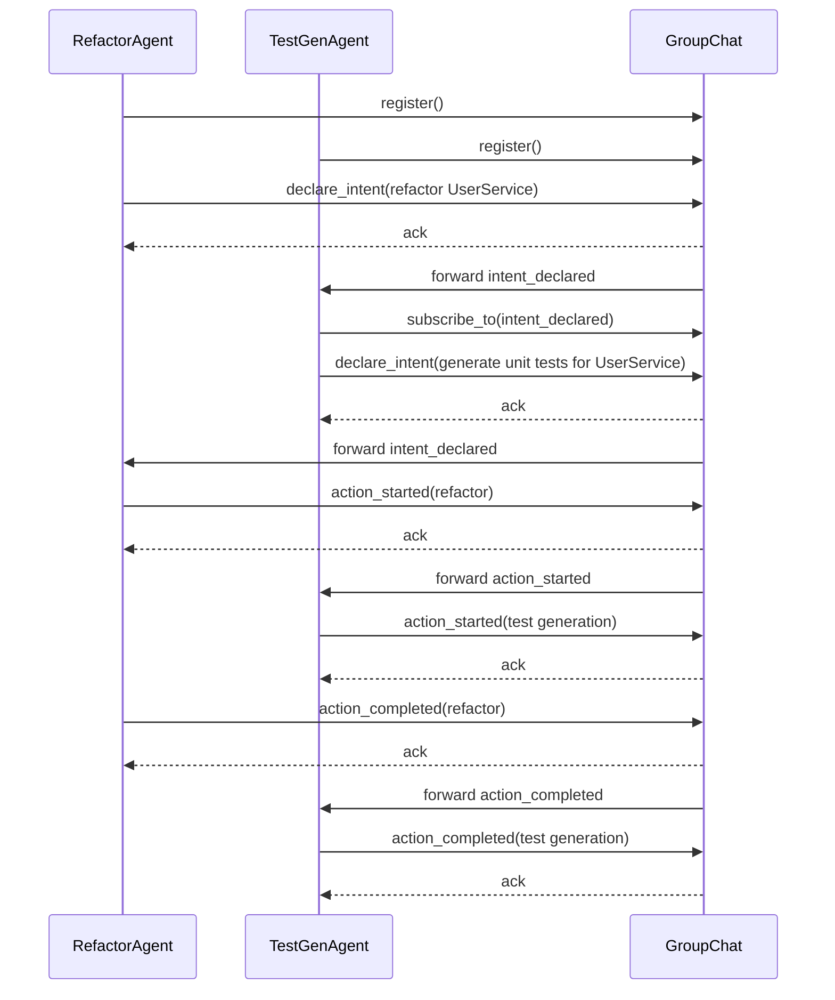

# Multiplayer AI: Why your team (and its agents) need a group chat

## Introduction
Three autonomous agents were tasked with refactoring a shared service. Agent A updated the user profile schema, Agent B added a welcome‑email trigger, and Agent C renamed a database column. Each worked in isolation, pushing changes to the same repository within minutes of each other. The CI pipeline failed with a cascade of merge conflicts, and the production deploy was rolled back. The agents were individually smart, but together they acted like strangers in a crowded hallway—each moving forward without seeing the others.

The root cause isn’t a lack of intelligence; it’s a lack of a shared communication channel. When agents operate in silos, duplicate work, conflicting edits, and lost context become the norm. A group chat‑style message bus gives agents the ambient awareness that human teams rely on, turning a collection of solo performers into a coordinated team.

## Why This Matters
Modern AI‑assisted development pipelines increasingly spawn multiple agents: code reviewers, test generators, security scanners, and refactor bots. Without a way to see each other’s intentions, these agents step on each other’s toes, wasting compute cycles and creating brittle systems. Production teams notice the symptom as flaky tests, intermittent service degradation, and increased mean‑time‑to‑recovery. By giving agents a lightweight, persistent chat channel, you reduce redundant work, surface conflicts early, and let higher‑level planners focus on strategy instead of micromanaging every low‑level action.

## How It Works
The pattern is straightforward: every agent registers with a central message broker, declares its intentions before acting, and listens for relevant announcements from peers. The broker stores a short history so late‑joining agents can catch up on recent context. Below is a sequence diagram that shows the flow for two agents coordinating a refactor.



**Step‑by‑step**

1. **Registration** – Each agent calls `register()` on the `GroupChat` instance, supplying its unique ID. The broker stores a reference so it can route messages later.
2. **Intent declaration** – Before touching any resource, an agent publishes an `INTENT_DECLARED` message containing a short description and any relevant context (e.g., files it plans to modify). All subscribers receive a copy.
3. **Observation** – Peers inspect incoming intents. If they detect overlap (e.g., two agents both mention the same database table), they can raise a `CONFLICT_DETECTED` alert or negotiate a sequence.
4. **Action lifecycle** – Agents publish `ACTION_STARTED` when they begin work and `ACTION_COMPLETED` when finished. This gives the team a live view of who is doing what, without needing to poll shared state.
5. **History** – The broker keeps a per‑conversation log. New agents can replay recent messages to get up to speed, mimicking how a human catches up by reading a chat backlog.

The core idea is that coordination happens through lightweight, asynchronous messages rather than tight coupling or shared locks.

## Core Concepts
- **Message broker (pub/sub)** – A simple in‑process or network‑based dispatcher that matches message types to subscriber lists. It does not guarantee ordering across different types, but preserves order per sender.
- **Agent ID** – A stable string (UUID, hostname+pid, or service name) used for routing and history keys.
- **Message types** – An enum that defines the semantic intent of a packet (`INTENT_DECLARED`, `ACTION_STARTED`, etc.). Keeping the set small makes routing predictable.
- **Payload** – A free‑form dictionary. Agents agree on a convention (e.g., always include `"resource"` and `"operation"` fields) to enable generic conflict detection.
- **Conversation ID** – Optional tag that groups related messages (e.g., all messages about a specific ticket). If omitted, the broker defaults to the sender’s ID, creating a personal log.
- **History buffer** – A fixed‑size list per conversation ID. Prevents unbounded memory growth while still offering recent context.
- **Back‑pressure handling** – The publisher `await`s on each subscriber’s `receive_message`. If a subscriber is slow, the publisher pauses, protecting the broker from overrunning a slow consumer.

## Examples & Code Walkthrough
Below is a self‑contained example that you can drop into an asyncio‑based service. It includes defensive checks, type hints, and inline comments that explain the non‑obvious bits.

```python
# agent_chat.py
import asyncio
from dataclasses import dataclass, field
from typing import Dict, List, Callable, Optional
from enum import Enum, auto
import time

class MessageType(Enum):
    INTENT_DECLARED = auto()
    ACTION_STARTED = auto()
    ACTION_COMPLETED = auto()
    CONTEXT_UPDATE = auto()
    CONFLICT_DETECTED = auto()

@dataclass
class AgentMessage:
    sender_id: str
    message_type: MessageType
    payload: Dict[str, object]
    timestamp: float = field(default_factory=time.time)
    conversation_id: Optional[str] = None

class AgentGroupChat:
    """Minimal pub/sub broker with per‑conversation history."""
    def __init__(self, history_limit: int = 100):
        self._agents: Dict[str, 'BaseAgent'] = {}
        self._subscribers: Dict[MessageType, List[str]] = {}
        self._history: Dict[str, List[AgentMessage]] = {}
        self._history_limit = history_limit
        self._lock = asyncio.Lock()

    async def register_agent(self, agent: 'BaseAgent') -> None:
        async with self._lock:
            if agent.agent_id in self._agents:
                raise ValueError(f"Agent {agent.agent_id} already registered")
            self._agents[agent.agent_id] = agent
            agent.set_group_chat(self)

    async def publish(self, msg: AgentMessage) -> None:
        async with self._lock:
            conv_id = msg.conversation_id or msg.sender_id
            conv = self._history.setdefault(conv_id, [])
            conv.append(msg)
            if len(conv) > self._history_limit:
                # drop oldest to keep memory bounded
                del conv[0:-self._history_limit]

            subs = self._subscribers.get(msg.message_type, [])
        # Deliver outside the lock to avoid holding it while awaiting
        for sub_id in subs:
            if sub_id == msg.sender_id:
                continue
            agent = self._agents.get(sub_id)
            if agent:
                try:
                    await agent.receive_message(msg)
                except Exception as exc:  # pragma: no cover - defensive
                    # Log but do not break other deliveries
                    print(f"[GroupChat] Error delivering to {sub_id}: {exc}")

class BaseAgent:
    def __init__(self, agent_id: str, group_chat: Optional[AgentGroupChat] = None):
        self.agent_id = agent_id
        self.group_chat: Optional[AgentGroupChat] = group_chat
        self._subscribed: set[MessageType] = set()

    def set_group_chat(self, gc: AgentGroupChat) -> None:
        self.group_chat = gc

    def subscribe_to(self, msg_type: MessageType) -> None:
        if not self.group_chat:
            raise RuntimeError("Agent must be registered before subscribing")
        self._subscribed.add(msg_type)
        asyncio.create_task(self._ensure_subscriber(msg_type))

    async def _ensure_subscriber(self, msg_type: MessageType) -> None:
        async with self._group_chat_lock():
            lst = self.group_chat._subscribers.setdefault(msg_type, [])
            if self.agent_id not in lst:
                lst.append(self.agent_id)

    async def _group_chat_lock(self):
        # expose the broker's lock for short critical sections
        return self.group_chat._lock  # type: ignore[attr-defined]

    async def declare_intent(self, description: str, context: Optional[Dict] = None) -> None:
        if not self.group_chat:
            raise RuntimeError("Agent not attached to a group chat")
        msg = AgentMessage(
            sender_id=self.agent_id,
            message_type=MessageType.INTENT_DECLARED,
            payload={"intent": description, "context": context or {}},
        )
        await self.group_chat.publish(msg)

    async def action_started(self, description: str, metadata: Optional[Dict] = None) -> None:
        msg = AgentMessage(
            sender_id=self.agent_id,
            message_type=MessageType.ACTION_STARTED,
            payload={"action": description, "meta": metadata or {}},
        )
        await self.group_chat.publish(msg)

    async def action_completed(self, description: str, outcome: Optional[Dict] = None) -> None:
        msg = AgentMessage(
            sender_id=self.agent_id,
            message_type=MessageType.ACTION_COMPLETED,
            payload={"action": description, "outcome": outcome or {}},
        )
        await self.group_chat.publish(msg)

    async def receive_message(self, msg: AgentMessage) -> None:
        handler_name = f"handle_{msg.message_type.name.lower()}"
        handler = getattr(self, handler_name, None)
        if handler:
            try:
                await handler(msg)
            except Exception as exc:  # pragma: no cover
                print(f"[{self.agent_id}] Handler error: {exc}")

# Example agents ---------------------------------------------------------

class RefactorAgent(BaseAgent):
    def __init__(self, agent_id: str, gc: AgentGroupChat):
        super().__init__(agent_id, gc)
        self.subscribe_to(MessageType.INTENT_DECLARED)
        self.subscribe_to(MessageType.ACTION_STARTED)

    async def refactor_user_service(self) -> None:
        await self.declare_intent(
            "Refactor UserService to use UUID primary keys",
            {"module": "userservice", "tables": ["users"]},
        )
        await self.action_started("Begin schema migration")
        # Simulate work
        await asyncio.sleep(0.5)
        await self.action_completed("Schema migration done", {"rows_affected": 1200})

    async def handle_intent_declared(self, msg: AgentMessage) -> None:
        intent = msg.payload.get("intent", "").lower()
        if "userservice" in intent and msg.sender_id != self.agent_id:
            print(f"[{self.agent_id}] Notice: {msg.sender_id} also touches UserService")

class TestGenAgent(BaseAgent):
    def __init__(self, agent_id: str, gc: AgentGroupChat):
        super().__init__(agent_id, gc)
        self.subscribe_to(MessageType.INTENT_DECLARED)

    async def generate_tests_for(self, module: str) -> None:
        await self.declare_intent(
            f"Generate unit tests for {module}",
            {"module": module},
        )
        await self.action_started(f"Writing tests for {module}")
        await asyncio.sleep(0.3)
        await self.action_completed(f"Tests for {module} ready", {"test_count": 42})

    async def handle_intent_declared(self, msg: AgentMessage) -> None:
        mod = msg.payload.get("module")
        if mod and mod == "userservice":
            print(f"[{self.agent_id}] Aligning test generation with {msg.sender_id}'s work on UserService")

# Demo -----------------------------------------------------------------
async def demo() -> None:
    chat = AgentGroupChat()
    refactor = RefactorAgent("refactor-01", chat)
    tester = TestGenAgent("tester-02", chat)

    await chat.register_agent(refactor)
    await chat.register_agent(tester)

    # Run both agents concurrently
    await asyncio.gather(
        refactor.refactor_user_service(),
        tester.generate_tests_for("userservice"),
    )

if __name__ == "__main__":
    asyncio.run(demo())
```

**What the code shows**

- The `AgentGroupChat` encapsulates the pub/sub logic, history trimming, and safe delivery.
- Agents declare their intent before mutating any resource, giving peers a chance to notice overlap.
- Each agent implements a simple `handle_intent_declared` to log potential conflicts—this is where you could plug in a more sophisticated conflict‑resolution engine (e.g., voting, locking, or task‑reordering).
- The demo runs two agents that both mention the `userservice` module; they each print a notice, illustrating the awareness the chat provides.

Feel free to replace the `print` statements with real alerts, issue‑tracker updates, or automated rollback triggers.

## Best Practices
1. **Keep messages small and semantic** – Publish only the information needed for coordination (intent, resource IDs, timestamps). Large blobs belong in object stores, not the chat bus.
2. **Version your message schema** – If you need to evolve the payload, add a `schema_version` field and have agents ignore unknown versions gracefully.
3. **Use timeouts on publishes** – Wrap `await group_chat.publish(msg)` in `asyncio.wait_for` with a sensible deadline (e.g., 2 s) to avoid hanging if a subscriber crashes.
4. **Persist history for crash recovery** – In production, back the `_history` dictionary with a durable log (e.g., Kafka topic or Redis stream) so a restarted agent can replay recent events.
5. **Separate concerns** – Let the broker handle delivery; let agents decide what to do with the information. Avoid putting business logic inside the broker.
6. **Monitor subscriber lag** – Track the difference between the latest message timestamp and the last processed timestamp per agent. Consistently high lag indicates a slow consumer that may need scaling or optimization.

## Common Mistakes & Anti-Patterns
| # | Mistake | Why it hurts | Fix |
|---|---------|--------------|-----|
| 1 | **Publishing after the action has started** | Other agents have already acted on stale state, causing conflicts. | Declare intent *before* any I/O or state change; treat the intent message as a lock request. |
| 2 | **Using a single global topic for all message types** | Subscribers receive irrelevant noise, making it hard to spot real signals. | Keep distinct `MessageType` enums and let agents subscribe only to what they need. |
| 3 | **Ignoring delivery failures** | A crashed subscriber silently drops messages, leading to drift in shared awareness. | Catch exceptions in `receive_message`, log them, and optionally trigger a health check or restart. |
| 4 | **Storing unlimited history** | Memory grows without bound in long‑running systems, eventually OOM. | Enforce a fixed‑size buffer (as shown) or offload to a rolling log with retention policy. |
| 5 | **Hard‑coding agent IDs** | Makes dynamic scaling impossible and creates collisions in ephemeral environments. | Derive IDs from a combination of pod name, instance ID, and a random suffix, or use a service‑discovery registry to assign them. |

## Performance Considerations
- **CPU overhead** – Each publish involves a lock acquisition, a dictionary lookup, and a loop over subscribers. With *N* agents and *M* message types, the worst‑case work per message is O(S) where S is the number of subscribers for that type. In practice, S is small because agents subscribe only to relevant types.
- **Latency** – The critical path is the time to serialize the message, acquire the lock, and invoke each subscriber’s `receive_message`. For intra‑process asyncio, this is typically under a millisecond. Network‑based brokers add RTT; aim for sub‑10 ms latency if you need tight coordination.
- **Memory** – History storage is O(H × C) where H is the history limit per conversation and C is the number of active conversations. Setting H to 50‑
