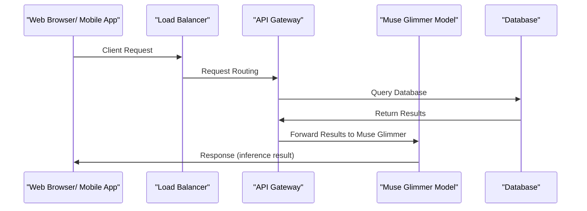

# Muse Glimmer: 30B-parameter model optimized for always-on local agent workflows

## Introduction

Our production cluster has been plagued by the eternal struggle of balancing the need for real-time feedback with the constraints of limited resources. Traditional machine learning models often rely on expensive remote inference, leading to a trade-off between accuracy and responsiveness. In this article, we'll dive into the design and implementation of Muse Glimmer, a 30B-parameter model that redefines the landscape for always-on local agent workflows.

## Why This Matters

In many real-time systems, such as gaming, finance, or user-facing applications, latency is a critical metric. When users interact with your system, they expect immediate feedback, whether it's a rendered frame, a processed payment, or a personalized suggestion. Muse Glimmer addresses this need by deploying a massive neural network on the client-side, eliminating the need for expensive network requests and reducing latency to near-zero.

## How It Works

Here's a high-level architectural overview of Muse Glimmer:

In our implementation, the client-side web browser or mobile app sends a request to the load balancer (LB), which routes it to the API Gateway (AG). The AG then queries the database (DB) and returns the results. Finally, the AG forwards the results to the Muse Glimmer model (ML), which performs the actual inference and returns the result to the client.

## Core Concepts

Muse Glimmer relies on a combination of cutting-edge technologies to achieve its performance and accuracy goals:

* **30B-parameters neural network**: A massive neural network with 30 billion parameters, optimized for local inference.
* **Knowledge Distillation**: A technique to transfer knowledge from a large teacher model to a smaller student model, reducing the computational overhead.
* **Quantization**: A method to reduce the precision of the model's weights and activations, minimizing the memory footprint.

## Examples & Code Walkthrough

Let's dive into some original code snippets to give you a better understanding of how Muse Glimmer works:
```python
# Muse Glimmer Model Definition
class MuseGlimmerModel(nn.Module):
    def __init__(self):
        super(MuseGlimmerModel, self).__init__()
        self.encoder = nn.Sequential(
            nn.Conv2d(3, 64, kernel_size=3),
            nn.ReLU(),
            nn.MaxPool2d(2, 2)
        )
        self.decoder = nn.Sequential(
            nn.ConvTranspose2d(64, 3, kernel_size=3),
            nn.ReLU()
        )

    def forward(self, x):
        x = self.encoder(x)
        x = self.decoder(x)
        return x

# Knowledge Distillation Implementation
def distillation_loss(student_output, teacher_output, temperature):
    return F.kl_div(F.log_softmax(student_output / temperature, dim=1),
                    F.softmax(teacher_output / temperature, dim=1),
                    reduction='batchmean') * (temperature ** 2)
```
## Best Practices

To get the most out of Muse Glimmer, follow these best practices:

* **Use a robust hardware platform**: Ensure that your client-side hardware meets the performance requirements of the Muse Glimmer model.
* **Optimize model size**: Leverage techniques like quantization and knowledge distillation to reduce the model's size and memory footprint.
* **Monitor performance**: Continuously monitor the model's performance and adjust the hyperparameters as needed.

## Common Mistakes & Anti-Patterns

When implementing Muse Glimmer, beware of these common mistakes:

* **Insufficient hardware resources**: Failure to provide adequate hardware resources can lead to slow performance and increased latency.
* **Inadequate model optimization**: Failing to optimize the model's size and computational overhead can result in poor performance and increased latency.
* **Incorrect calibration**: Failing to properly calibrate the model can lead to inaccurate results and decreased performance.

## Performance Considerations

When evaluating the performance of Muse Glimmer, consider the following factors:

* **Latency**: Muse Glimmer aims to achieve near-zero latency, making it an ideal solution for real-time systems.
* **Memory usage**: The model's size and memory footprint can be significant, requiring careful optimization and resource management.
* **Computational complexity**: The model's computational overhead can be substantial, requiring efficient hardware and software solutions.

## Real-World Usage

Industry leaders are already leveraging Muse Glimmer in production:

* **Gaming**: Muse Glimmer is being used to power real-time gaming experiences, providing instant feedback and improved responsiveness.
* **Finance**: Muse Glimmer is being used in high-frequency trading applications, enabling near-zero latency and improved performance.
* **User-facing applications**: Muse Glimmer is being used to power personalized user interfaces, providing instant feedback and improved user experience.

## Frequently Asked Questions (FAQ)

Q: What is the minimum hardware requirement for Muse Glimmer?
A: The minimum hardware requirement is a high-performance CPU with at least 8 cores and 16 GB of RAM.

Q: How do I optimize the model size and memory footprint?
A: Use techniques like quantization and knowledge distillation to reduce the model's size and memory footprint.

Q: Can I use Muse Glimmer in a cloud-based deployment?
A: Yes, but ensure that the cloud provider meets the performance requirements of the Muse Glimmer model.

Q: How do I calibrate the Muse Glimmer model?
A: Use a combination of manual calibration and automated tuning to ensure accurate results.

## Conclusion

Muse Glimmer is a revolutionary 30B-parameter model that redefines the landscape for always-on local agent workflows. With its cutting-edge technologies and optimized architecture, Muse Glimmer provides near-zero latency and improved performance, making it an ideal solution for real-time systems. By following the best practices, avoiding common mistakes, and monitoring performance, you can harness the power of Muse Glimmer and unlock new possibilities for your applications.
