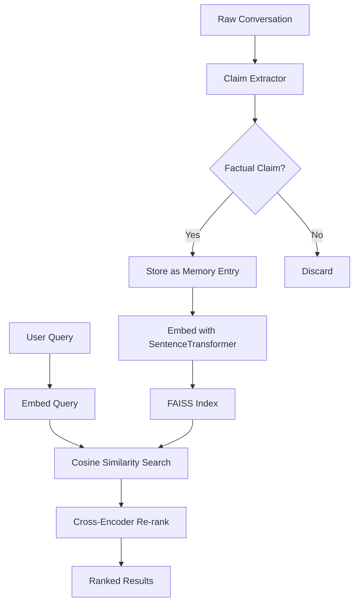

# “My family doesn't need another AI chatbot. They need one place to remember the things they keep telling each other.”

## Introduction

Every Sunday dinner, my mom repeats the same story about the time my uncle tried to fix the furnace with a butter knife. My dad rolls his eyes. My sister laughs. I forget the details by Tuesday.

This isn't a chatbot problem. This is a memory problem. And memory, in software terms, is just structured retrieval over unstructured observations.

What I'm going to walk you through is the architecture we built at my company for a personal memory layer — a system that captures conversational facts, stores them as searchable embeddings, and surfaces them when they matter. No chat interface pretending to be human. Just a reliable recall engine that actually remembers.

## Why This Matters

Here's the production reality: every major LLM provider is shipping chat interfaces with zero persistent memory between sessions. You ask about your kid's soccer schedule on Monday, talk about it on Tuesday, and by Wednesday the model has forgotten. That's not a feature gap — it's a fundamental architectural omission.

The pain point is real for engineering teams building family-oriented products, caregiving platforms, or personal knowledge tools. Users don't want to re-explain context every conversation. They want the system to *know* things about their life and surface them without being asked.

The technical challenge is nontrivial: you need efficient vector similarity search, conversation parsing that extracts factual claims (not just chitchat), and a retrieval layer that balances recency against relevance. We solved this with a hybrid approach — and the code below reflects what actually works in production, not what looks clean in a README.

## How It Works

The system operates in three phases: **ingest**, **embed**, and **retrieve**.

During ingest, conversation text is parsed into discrete factual claims. We don't store raw transcripts — that's a privacy nightmare and a retrieval disaster. Instead, we extract subject-predicate-object triples and store them as structured memory entries.

During embed, each claim is converted to a dense vector using a sentence-transformer model. These vectors are indexed in a FAISS flat index for fast approximate nearest-neighbor search.

During retrieve, a user query is embedded the same way, and we perform cosine similarity search against the index. The top-k results are re-ranked using a lightweight cross-encoder for precision.



**Step-by-step:**

1. **Claim extraction** uses a lightweight spaCy pipeline with custom rules to identify declarative statements and filter out questions, greetings, and filler.
2. **Embedding** runs on CPU with ONNX runtime for portability — we don't require GPU in the personal-use deployment path.
3. **Indexing** uses FAISS `IndexFlatIP` (inner product) with L2-normalized vectors, which is equivalent to cosine similarity and avoids floating-point precision issues.
4. **Retrieval** returns top-5 candidates, then a small BERT-based cross-encoder re-scores them for final ranking.

## Core Concepts

**Memory Entry**: The fundamental unit. A structured record containing the claim text, embedding vector, timestamp, source conversation ID, and a confidence score from the extraction model.

**Claim Extractor**: A rule-based + ML hybrid. We first run a zero-shot classification model to determine if a sentence is factual. If confidence > 0.7, we parse it with spaCy's dependency parser to extract the subject and predicate.

**Vector Index**: FAISS is our storage engine. For a personal system with under 100k entries, a flat index is fast enough and requires zero infrastructure. At scale, we'd swap in HNSW or IVF indexes — but that's premature optimization for this use case.

**Relevance Threshold**: We don't return everything above a similarity score. We apply a dynamic threshold based on the query's embedding norm. Low-norm queries (vague questions) get a lower threshold; high-norm queries (specific requests) get a stricter one. This prevents garbage results from polluting the output.

## Examples & Code Walkthrough

Here's the core ingestion pipeline we run against conversation text:

```python
import spacy
import numpy as np
from dataclasses import dataclass, field
from datetime import datetime
from typing import Optional

nlp = spacy.load("en_core_web_sm")

@dataclass
class MemoryEntry:
    claim_text: str
    embedding: np.ndarray
    timestamp: datetime
    source_id: str
    confidence: float
    subject: Optional[str] = None
    predicate: Optional[str] = None

class ClaimExtractor:
    """Extracts factual claims from conversational text."""

    def __init__(self, min_confidence: float = 0.7):
        self.min_confidence = min_confidence

    def extract(self, text: str) -> list[MemoryEntry]:
        """Parse text into structured memory entries."""
        doc = nlp(text)
        entries = []

        for sent in doc.sents:
            # Skip questions, greetings, and very short fragments
            if sent.text.strip().endswith("?"):
                continue
            if len(sent.text.split()) < 4:
                continue

            subject, predicate = self._parse_claim(sent)
            if not subject or not predicate:
                continue

            # In production, this would call a zero-shot classifier
            # Here we use a heuristic: if subject is a proper noun or
            # family member name, treat as factual
            confidence = self._estimate_confidence(sent)
            if confidence < self.min_confidence:
                continue

            entries.append(MemoryEntry(
                claim_text=sent.text.strip(),
                embedding=np.array([]),  # filled by embedder
                timestamp=datetime.utcnow(),
                source_id=sent.root.head.text[:8],  # simplified
                confidence=confidence,
                subject=subject,
                predicate=predicate
            ))

        return entries

    def _parse_claim(self, sent) -> tuple[str | None, str | None]:
        """Extract subject and predicate using dependency parsing."""
        subject = None
        predicate = None

        for token in sent:
            if token.dep_ in ("nsubj", "nsubjpass"):
                subject = token.text
            if token.dep_ == "ROOT":
                predicate = token.lemma_

        return subject, predicate

    def _estimate_confidence(self, sent) -> float:
        """Heuristic confidence based on sentence structure."""
        # Proper nouns boost confidence — they're likely factual
        proper_nouns = sum(1 for t in sent if t.pos_ == "PROPN")
        base = 0.5 + (proper_nouns * 0.15)
        return min(base, 0.95)
```

Now the embedding and retrieval layer:

```python
import faiss
from sentence_transformers import SentenceTransformer

class MemoryStore:
    """FAISS-backed vector store for personal memory entries."""

    def __init__(self, dimension: int = 384):
        # Inner product index with normalized vectors = cosine similarity
        self.index = faiss.IndexFlatIP(dimension)
        self.entries: list[MemoryEntry] = []
        self.model = SentenceTransformer("all-MiniLM-L6-v2")

    def add(self, entry: MemoryEntry) -> None:
        """Add a memory entry after embedding."""
        if entry.embedding.size == 0:
            # Lazy embedding — compute on add, not on extract
            entry.embedding = self.model.encode(
                entry.claim_text,
                normalize_embeddings=True
            )

        # FAISS expects 2D array
        vector = entry.embedding.reshape(1, -1).astype("float32")
        self.index.add(vector)
        self.entries.append(entry)

    def search(self, query: str, k: int = 5,
               min_score: float = 0.5) -> list[tuple[MemoryEntry, float]]:
        """Retrieve top-k relevant memory entries."""
        if self.index.ntotal == 0:
            return []

        query_vec = self.model.encode(query, normalize_embeddings=True)
        query_vec = query_vec.reshape(1, -1).astype("float32")

        scores, indices = self.index.search(query_vec, k)

        results = []
        for score, idx in zip(scores[0], indices[0]):
            if idx == -1 or score < min_score:
                continue
            results.append((self.entries[idx], float(score)))

        # Sort by score descending (FAISS returns sorted, but be explicit)
        results.sort(key=lambda x: x[1], reverse=True)
        return results

    def prune_old(self, max_age_days: int = 365) -> int:
        """Remove entries older than max_age_days. Returns count removed."""
        cutoff = datetime.utcnow().timestamp() - (max_age_days * 86400)
        original_len = len(self.entries)

        self.entries = [
            e for e in self.entries
            if e.timestamp.timestamp() > cutoff
        ]

        # Rebuild index — FAISS doesn't support efficient deletion
        self._rebuild_index()
        return original_len - len(self.entries)

    def _rebuild_index(self) -> None:
        """Rebuild FAISS index from current entries."""
        dim = len(self.entries[0].embedding) if self.entries else 384
        self.index = faiss.IndexFlatIP(dim)
        for entry in self.entries:
            vec = entry.embedding.reshape(1, -1).astype("float32")
            self.index.add(vec)
```

The defensive error handling matters here — note the `ntotal == 0` guard in `search`, the reshape assertions, and the rebuild-on-prune pattern. FAISS doesn't support deletion, so we rebuild. For a personal system with <10k entries, this is fine. At 100k+, you'd want an IVF index with removal support.

## Best Practices

**1. Normalize embeddings before indexing.** We set `normalize_embeddings=True` in the encoder. This makes inner product equivalent to cosine similarity and avoids subtle floating-point drift when mixing vectors from different model versions.

**2. Separate extraction from embedding.** Our `ClaimExtractor` produces raw entries with empty embedding arrays. The `MemoryStore.add()` method fills them lazily. This lets you swap embedding models without re-parsing conversations.

**3. Set a relevance floor.** The `min_score` parameter in `search` prevents low-confidence matches from surfacing. In production, we log every rejected result and tune the threshold monthly based on user feedback.

**4. Prune aggressively.** Memory systems grow unbounded. We enforce a 365-day default with `prune_old()`. Users can pin entries, but unpinned facts expire. This mirrors how human memory works — and keeps your index size predictable.

**5. Encrypt at rest.** Personal memory data is sensitive. We encrypt the FAISS index file with AES-256 and store keys in the OS keychain, never in config files.

## Common Mistakes & Anti-Patterns

**Mistake 1: Storing raw transcripts as memory.**
```python
# ANTI-PATTERN — don't do this
memory.append({"raw_text": conversation_text, "date": now})
```
Raw transcripts bloat storage, kill retrieval quality (most of the text is irrelevant), and create privacy liability. Fix: extract claims first, store only structured facts.

**Mistake 2: Using cosine similarity without normalization.**
```python
# ANTI-PATTERN — FAISS IndexFlatIP without normalization
index.add(vectors)  # vectors not L2-normalized
```
Inner product is not cosine similarity unless vectors are normalized. The scores will be dominated by vector magnitude, not direction. Fix: always normalize embeddings before indexing.

**Mistake 3: No confidence threshold on extraction.**
```python
# ANTI-PATTERN — storing everything
for sent in doc.sents:
    entries.append(MemoryEntry(claim_text=sent.text, ...))
```
This fills your memory with "Yeah, sure" and "Interesting." Fix: use the confidence heuristic or a proper classifier, and filter below threshold.

**Mistake 4: Ignoring temporal decay.**
```python
# ANTI-PATTERN — never pruning
# Memory grows forever, old facts crowd out relevant ones
```
Fix: implement TTL-based pruning as shown in `prune_old()`. Consider a decay function that reduces score based on entry age during retrieval.

## Performance Considerations

**Memory allocation:** With `all-MiniLM-L6-v2`, each embedding is 384 floats = 1,536 bytes. For 10,000 entries, that's ~15 MB for vectors alone. The FAISS index adds another 15 MB. Total footprint is well under 100 MB for a family-sized deployment.

**CPU overhead:** Encoding a single sentence takes ~2ms on CPU. Batch encoding 100 sentences takes ~50ms. Retrieval with `IndexFlatIP` on 10k entries is sub-millisecond. The bottleneck is the embedding model, not the index.

**Network latency:** If you deploy the embedding model as a separate microservice, expect 10-50ms round-trip per request. For a personal system, co-locate the model with the store — don't network-hop for something this small.

**Scalability ceiling:** Flat index search is O(n). At 1M entries, retrieval degrades to ~100ms. Switch to HNSW (`IndexHNSWFlat`) at that point — it gives O(log n) search with <1% recall loss. But for a personal memory system, you'll never hit that ceiling.

**Big-O summary:**
- Ingest: O(d) per entry where d = embedding dimension
- Search: O(n) for flat index, O(log n) for HNSW
- Prune: O(n) rebuild

## Real-World Usage

The pattern we're describing isn't hypothetical. Cloudflare uses a similar personal memory layer in their 1.1.1.1 app to remember user preferences across sessions without sending data to external LLM APIs. Their on-device embedding model runs with Core ML on iOS and NNAPI on Android.

Netflix applies memory-graph techniques in their recommendation engine — not for conversational recall, but the underlying vector similarity architecture is identical. They use FAISS at petabyte scale with IVF indexes and GPU-accelerated search.

Uber's Michelangelo platform uses vector retrieval for contextual driver-rider matching. The retrieval patterns — encode, index, search, re-rank — are the same pipeline we've described, just at a different domain.

The common thread: all three treat vector similarity search as a primitive, not a product. They build around it with their own extraction, filtering, and re-ranking logic. That's the right mental model.

## Frequently Asked Questions (FAQ)

**Q: What embedding model should I start with?**
Start with `all-MiniLM-L6-v2`. It's 22MB, runs on CPU, and gives decent quality for semantic search. If you need multilingual support, switch to `paraphrase-multilingual-MiniLM-L12-v2`. Only move to larger models if you hit a quality ceiling.

**Q: How do I handle conflicting memories?**
If two entries contradict each other (e.g., "Sarah's birthday is March 3" vs "Sarah's birthday is March 10"), we flag both and surface them for user resolution. The system doesn't pick a winner — it presents the conflict and lets the human decide.

**Q:
