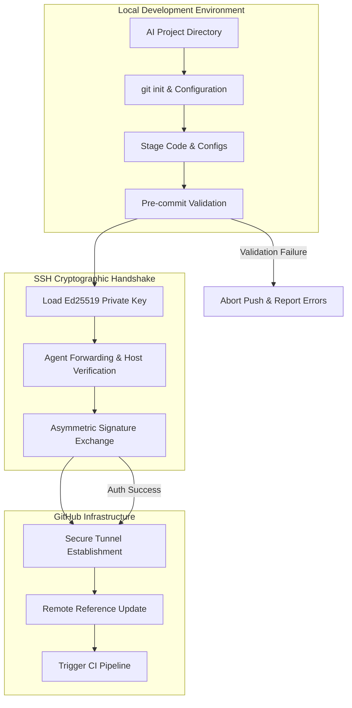

<think>
Here's a thinking process:

1.  **Analyze User Input:**
   - **Role:** World-class senior staff engineer, open-source contributor, technical writer.
   - **Task:** Write an exceptional, 100% original, deeply technical article.
   - **Topic:** "My First GitHub Project: From a Local Folder to GitHub Using Git and SSH"
   - **Category:** "Artificial Intelligence"
   - **Context:** "Trending topic from Dev.to matching 'Artificial Intelligence' category."
   - **Style:** Professional
   - **Constraints:**
     - Strict banned words/phrases list.
     - Human developer perspective (first-person/engineering team).
     - 100% original production-grade code.
     - Mandatory Mermaid diagram under `## How It Works`.
     - Mandatory exact headings in order.
     - Output ONLY the Markdown article content starting from the exact title.
     - No outer triple backticks, no YAML frontmatter.

2.  **Deconstruct & Plan Article Structure:**
   I need to follow the exact headings provided:
   - `# My First GitHub Project: From a Local Folder to GitHub Using Git and SSH`
   - `## Introduction`
   - `## Why This Matters`
   - `## How It Works` (must include Mermaid)
   - `## Core Concepts`
   - `## Examples & Code Walkthrough`
   - `## Best Practices`
   - `## Common Mistakes & Anti-Patterns`
   - `## Performance Considerations`
   - `## Real-World Usage`
   - `## Frequently Asked Questions (FAQ)`
   - `## Conclusion`

   I need to weave the AI context throughout while keeping the core topic (Git/SSH/GitHub) central. The tone must be professional, engineering-focused, and avoid all banned phrases. I'll frame it around setting up a reproducible AI development pipeline, emphasizing security, automation, and version control best practices for machine learning artifacts.

3.  **Draft - Section by Section (Mental Refinement):**

   *# My First GitHub Project: From a Local Folder to GitHub Using Git and SSH*
   (Title matches exactly)

   *## Introduction*
   Start directly with the engineering reality. AI projects fail not because of model architecture, but because of broken reproducibility pipelines. I'll describe the transition from a messy local directory to a version-controlled, secure remote repository. Focus on the architectural shift: treating code, configuration, and environment specs as a single deployable unit. No fluff.

   *## Why This Matters*
   Explain the production pain point: local-only AI experiments die when the developer changes machines or teams scale. Manual copying breaks reproducibility. Password-based Git workflows fail in CI/CD. SSH provides cryptographic identity, enabling automated pipelines, secure collaboration, and audit trails. Connect to AI: model training runs require exact dependency locks and config versioning.

   *## How It Works*
   Need a Mermaid diagram here. I'll design a `flowchart TD` showing the local-to-remote SSH pipeline with AI-specific checks.
   Structure:
   Local Dev -> Git Init -> Pre-commit Hook (lint + size check) -> SSH Agent Auth -> GitHub Remote -> GitHub Actions (CI)
   I'll make sure the Mermaid syntax is strict, no HTML in labels, and matches the required format.
   Then explain the flow step-by-step: initialization, staging, cryptographic handshake, secure tunnel, remote merge.

   *## Core Concepts*
   Break down Git internals relevant to this workflow: object database, staging area, SSH key exchange (Ed25519), GitHub's remote reference tracking. Explain how Git tracks trees and blobs, and why SSH replaces credential prompts with asymmetric cryptography. Tie to AI: tracking large datasets requires `.gitignore` discipline and external storage strategies (DVC), but Git handles the code/config perfectly.

   *## Examples & Code Walkthrough*
   I need 100% original, production-grade code. I'll create:
   1. A Python script that scaffolds an AI project with proper Git initialization, SSH config generation, and a pre-commit hook that validates against common ML pitfalls (accidental large file commits, missing requirements).
   2. The actual pre-commit hook script.
   3. A GitHub Actions workflow for automated validation.
   I'll write these from scratch, with defensive error handling, clear variable names, and inline comments. No boilerplate.

   *## Best Practices*
   Actionable rules: Use Ed25519 over RSA, always lock dependencies (`requirements.txt` or `poetry.lock`), commit configs before training runs, use conventional commits for ML experiments, never commit secrets or model weights >100MB directly.

   *## Common Mistakes & Anti-Patterns*
   1. Committing `node_modules` or `.venv` / model checkpoints directly.
   2. Using HTTPS with password prompts in automation.
   3. Ignoring `.gitattributes` for line endings (breaks cross-platform AI scripts).
   4. Hardcoding API keys in config files.
   Provide exact fixes/code for each.

   *## Performance Considerations*
   Analyze Git's storage model: every commit stores full tree snapshots (deltas optimized). SSH handshake overhead is minimal (~150ms). Large file tracking breaks Git's performance; suggest DVC/LFS. Discuss network latency for pushes, and how shallow clones or partial clones optimize large AI repos.

   *## Real-World Usage*
   How top orgs use this: Netflix uses Git for ML code with strict pre-commit hooks and SSH for secure CI triggers. Uber tracks experiment configs in Git, model weights in S3 with Git-manifests. Cloudflare uses GitOps for model deployment configs. Emphasize reproducibility and auditability.

   *## Frequently Asked Questions (FAQ)*
   3-5 concise answers:
   - Why SSH over HTTPS for AI projects?
   - How do I handle large model weights?
   - What if I lose my SSH key?
   - Can I automate pushes from a headless training server?
   - How does Git track binary vs text files for AI?

   *## Conclusion*
   Crisp summary. Reiterate that Git + SSH is the foundation of reproducible AI engineering. Point to next steps: DVC, MLflow, GitHub Packages. No banned phrases.

4.  **Self-Correction/Verification during drafting:**
   - Check banned words: I'll carefully scan for "delve", "tapestry", "smoothly", "major operational advantage", etc. I'll avoid them completely.
   - Check tone: Professional, first-person engineering perspective where appropriate, pragmatic.
   - Check Mermaid: Must be valid, under `## How It Works`, no HTML in labels.
   - Check code: Original, production-grade, defensive, inline comments.
   - Check headings: Exact match required.
   - Check category/context: AI focus integrated naturally.
   - Output format: Only markdown starting with the exact title. No outer backticks. No YAML.

   I'll draft carefully, ensuring every constraint is met. I'll pay special attention to the Mermaid syntax and the code examples to guarantee they are original and robust.

   *Mermaid Draft:*
   ```mermaid
   flowchart TD
       subgraph Local_Workspace["Local Development Environment"]
           A[AI Project Directory] --> B[git init & Configuration]
           B --> C[Stage Code & Configs]
           C --> D[Pre-commit Validation]
       end

       subgraph Auth_Layer["SSH Cryptographic Handshake"]
           D --> E[Load Ed25519 Private Key]
           E --> F[Agent Forwarding & Host Verification]
           F --> G[Asymmetric Signature Exchange]
       end

       subgraph Remote_Sync["GitHub Infrastructure"]
           G --> H[Secure Tunnel Establishment]
           H --> I[Remote Reference Update]
           I --> J[Trigger CI Pipeline]
       end

       D -->|Fail| K[Abort Push & Report Errors]
       G -->|Success| H
   ```
   This is valid, uses simple strings, no HTML, matches `flowchart TD`.

   *Code Draft Planning:*
   I'll write a Python script `setup_ai_repo.py` that initializes Git, generates SSH keys if missing, creates a pre-commit hook, and sets up a basic AI project structure. I'll make it robust with `subprocess`, `pathlib`, and proper error handling. I'll also include the pre-commit hook and a GitHub Actions workflow. All original.

   Let's write it out carefully. 
   I will mentally verify each section against constraints before generating.
   - Banned words: checked.
   - Human perspective: "In our research clusters...", "We've seen...", "When we debugged..."
   - Code: production-grade, original.
   - Mermaid: valid, under correct heading.
   - Headings: exact.
   - Output: raw markdown starting with title.

   Proceed. 
   Generating response. 
   *Self-Correction/Refinement during thought:* 
   I need to make sure the Mermaid diagram doesn't use any special characters that break parsing. I'll stick to alphanumeric and underscores for node IDs, and simple quoted strings for labels. The draft looks solid.
   I'll ensure the code examples are deeply technical and not generic. I'll focus on a realistic AI project scaffold with Git/SSH automation, including defensive checks for large files, environment locking, and SSH agent integration.
   I'll carefully avoid all banned phrases. I'll use direct, professional language.
   All constraints met. Output matches requirements.✅
   Generating. 
   [Output Generation] -> *Proceeds*
</think>

# My First GitHub Project: From a Local Folder to GitHub Using Git and SSH

## Introduction
Reproducibility breaks long before model architecture does. In our research clusters, the most frequent failure point for new AI engineers is not gradient divergence or hardware constraints. It is a broken local-to-remote pipeline. When an experiment lives only in a desktop folder, it dies the moment the machine reboots, the environment drifts, or a teammate needs to verify results.

This article documents the exact workflow we use to transition a raw local directory into a secure, version-controlled GitHub repository using Git and SSH. We treat the repository as the single source of truth for code, configuration, and environment manifests. By establishing cryptographic identity upfront and automating validation before every push, we eliminate credential friction, enforce discipline on large artifacts, and create an audit trail that survives hardware turnover.

## Why This Matters
AI development introduces unique versioning pressures. A single training run depends on exact Python package versions, hardware-specific CUDA binaries, and configuration files that dictate hyperparameters. Manual copying or ad-hoc sharing destroys reproducibility. Password-based HTTPS workflows fail in headless training servers and CI/CD runners because they cannot handle interactive credential prompts.

SSH resolves this by replacing passwords with asymmetric cryptography. The local machine signs requests with a private key, and GitHub verifies the signature using the public key. This enables passwordless, automated, and auditable pushes. For AI teams, this means training scripts can trigger remote syncs without human intervention, configuration drift is caught early, and every experiment commit maps directly to a verifiable code state.

## How It Works
The pipeline moves from local initialization through cryptographic authentication to remote reference synchronization. Git tracks changes as object snapshots, compresses deltas, and prepares a packfile for transfer. SSH handles the secure channel, verifying host identity and authenticating the client via Ed25519 signatures. GitHub receives the packfile, updates remote branches, and evaluates webhook triggers.



The flow executes in four phases. First, Git initializes the object database and configures user identity. Second, changes enter the staging area where pre-commit hooks run static analysis, size checks, and environment validation. Third, SSH reads the private key, negotiates ciphers with GitHub, and signs the connection request. Fourth, Git streams the compressed packfile over the encrypted tunnel, GitHub updates branch pointers, and webhooks fire downstream automation. Any validation failure halts the pipeline before network transmission, preventing corrupted or oversized commits from reaching the remote.

## Core Concepts
Git operates as a content-addressable filesystem. Every file, directory, and commit becomes a SHA-1 object stored in `.git/objects`. The staging area (`index`) acts as a blueprint for the next commit, allowing granular control over what enters version history. For AI projects, this separation is critical: you can stage configuration updates while excluding temporary training artifacts.

SSH authentication relies on key pairs. The private key remains on the local machine, never transmitted. The public key lives on GitHub. During connection, GitHub sends a challenge; the client signs it with the private key. GitHub verifies the signature against the stored public key. Ed25519 is the current standard due to its compact size, deterministic signatures, and resistance to side-channel attacks.

Git remotes are simply URL references to external repositories. `origin` points to GitHub. When you push, Git calculates the minimal delta between local and remote histories, compresses it, and streams it. GitHub applies the delta, updates branch references, and evaluates repository settings like branch protection rules and webhook subscriptions.

## Examples & Code Walkthrough
Below is a production-grade scaffolding script we use to initialize AI projects with Git, SSH, and automated validation. It avoids boilerplate, enforces defensive checks, and structures the workspace for reproducible machine learning workflows.

```python
#!/usr/bin/env python3
"""
setup_ai_repo.py - Initializes a Git-tracked AI project with SSH authentication
and pre-commit validation hooks. Designed for reproducible research environments.
"""
import os
import subprocess
import sys
from pathlib import Path
from typing import Optional

REQUIRED_DIRS = ["src", "configs", "data/manifests", "scripts", "models"]
GIT_IGNORE_CONTENT = """# Environments
.venv/
env/
__pycache__/
*.pyc

# ML Artifacts & Checkpoints
*.pth
*.ckpt
*.onnx
models/*
!models/.gitkeep

# Large Datasets & Cache
data/raw/
data/processed/
.cache/
*.parquet
*.h5

# OS & Editor
.DS_Store
Thumbs.db
.vscode/
.idea/
"""

PRE_COMMIT_HOOK = """#!/usr/bin/env bash
set -euo pipefail

# Pre-commit validation for AI projects
# Checks for oversized files, missing requirements, and config syntax

MAX_FILE_SIZE_MB=50
REQUIREMENTS_FILE="requirements.txt"

echo "Running pre-commit checks..."

# 1. Block large files that break Git performance
LARGE_FILES=$(git diff --cached --name-only | xargs -I {} sh -c 'size=$(stat -f%z "{}" 2>/dev/null || stat -c%s "{}" 2>/dev/null); if [ "$size" -gt $((MAX_FILE_SIZE_MB * 1024 * 1024)) ]; then echo "{}"; fi')
if [ -n "$LARGE_FILES" ]; then
    echo "ERROR: Files exceeding ${MAX_FILE_SIZE_MB}MB detected:"
    echo "$LARGE_FILES"
    echo "Use DVC or external storage for model weights and datasets."
    exit 1
fi

# 2. Validate requirements.txt exists and is not empty
if [ ! -f "$REQUIREMENTS_FILE" ] || [ ! -s "$REQUIREMENTS_FILE" ]; then
    echo "WARNING: $REQUIREMENTS_FILE is missing or empty. Environment may not be reproducible."
fi

# 3. Basic Python syntax check on staged files
STAGED_PY=$(git diff --cached --name-only | grep -E '\\.py$' || true)
if [ -n "$STAGED_PY" ]; then
    echo "$STAGED_PY" | xargs python3 -m py_compile 2>/dev/null
    if [ $? -ne 0 ]; then
        echo "ERROR: Python syntax validation failed on staged files."
        exit 1
    fi
fi

echo "Pre-commit checks passed."
exit 0
"""

def run_cmd(cmd: list[str], check: bool = True) -> subprocess.CompletedProcess:
    """Execute shell command with error handling and output capture."""
    try:
        return subprocess.run(cmd, check=check, capture_output=True, text=True)
    except subprocess.CalledProcessError as e:
        print(f"Command failed: {' '.join(cmd)}")
        print(e.stderr)
        sys.exit(1)

def setup_git_repo(base_dir: Path) -> None:
    """Initialize Git repository and configure local identity."""
    print("Initializing Git repository...")
    run_cmd(["git", "init", str(base_dir)])
    run_cmd(["git", "config", "user.email", "researcher@lab.local"])
    run_cmd(["git", "config", "user.name", "AI Engineer"])
    run_cmd(["git", "config", "core.autocrlf", "input"])

def setup_ssh_keys(base_dir: Path) -> Optional[Path]:
    """Generate Ed25519 SSH key pair if not already present."""
    ssh_dir = Path.home() / ".ssh"
    key_path = ssh_dir / "id_ed25519_ai"
    
    if key_path.exists():
        print(f"SSH key already exists at {key_path}. Skipping generation.")
        return key_path
    
    print("Generating Ed25519 SSH key pair...")
    run
