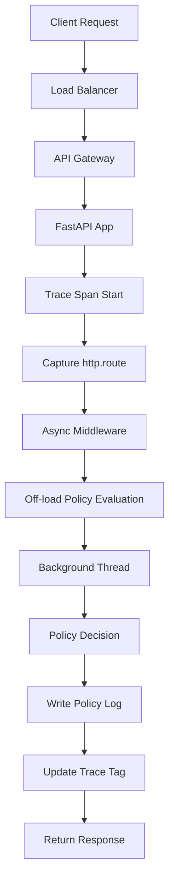

# My routing policy and my traces disagreed 96 times. Never once on the main thread.

## Introduction
We run a production AI inference service built on FastAPI and OpenTelemetry. One morning the monitoring dashboard lit up with “96 routing/trace mismatches”. Each mismatch meant the span that recorded the request’s path did not match the policy log that recorded where the request actually went. At first glance it looked like a bug in the tracing SDK, but the pattern was clear: none of the mismatches occurred on the main thread. The async middleware we added to keep the request handling responsive had inadvertently decoupled the trace creation from the policy decision.

## Why This Matters
When a request is processed on a background worker, the span that starts on the main thread captures a snapshot of the request at that moment. If the routing decision happens later on a different thread, the trace may never reflect the final routing decision. This gap hurts observability, makes compliance auditing harder, and can hide latency introduced by the async hop. Detecting the problem required correlating two separate logs, a step most teams overlook until a discrepancy shows up in production.

## How It Works
Below is a visual representation of the request flow through our service. The diagram highlights where the trace span is created and where the routing policy is evaluated.



**Step‑by‑step explanation**

1. **Trace Span Start** – The middleware creates an OpenTelemetry span on the main thread, immediately tagging it with the incoming URL path (`http.route`). This tag is immutable for the span’s lifetime.
2. **Off‑load Policy Evaluation** – To keep the main thread free for I/O, we call `asyncio.to_thread(self._evaluate_policy, request)`. The evaluation runs on a worker thread, potentially after other background tasks have already moved the request to a different routing bucket.
3. **Policy Decision** – The policy may re‑dispatch the request to a different model endpoint based on load, latency, or A/B rules.
4. **Write Policy Log** – The background thread writes a structured log entry containing the final routing decision.
5. **Update Trace Tag** – Because the span is already active, we can add a new attribute (`routing.decision`) that reflects the final decision. However, our implementation only wrote the log; the span never received the updated routing information.
6. **Result** – The trace retains the original path, while the policy log records a different one. The mismatch appears when we later align spans with logs by request ID.

## Core Concepts
| Concept | Definition | Relevance |
|---------|------------|-----------|
| **Routing Policy** | Business rules that select the target AI model, endpoint, or downstream service for a request. | Determines cost, latency, and user experience. |
| **Distributed Trace** | A span‑based record of a request’s journey across services (OpenTelemetry, Jaeger, etc.). | Provides end‑to‑end visibility and SLA measurement. |
| **Thread Model** | Main thread (synchronous) vs. background worker threads (asynchronous). | In async frameworks, span creation and policy evaluation can land on different threads. |
| **Span Attributes** | Key‑value pairs attached to a span (e.g., `http.route`, `routing.decision`). | Used for filtering, aggregation, and debugging. |
| **Policy Log** | Structured log that records the final routing decision for auditability. | Required for compliance and post‑mortem analysis. |

## Examples & Code Walkthrough
Below is a minimal, self‑contained example that reproduces the issue. It uses FastAPI, OpenTelemetry instrumentation, and a dummy policy evaluator.

```python
import asyncio
from fastapi import FastAPI, Request, Response
from opentelemetry import trace
from opentelemetry.sdk.trace import TracerProvider
from opentelemetry.sdk.trace.export import BatchSpanProcessor
from opentelemetry.instrumentation.fastapi import FastAPIInstrumentor
import logging

# Set up a simple tracer
trace.set_tracer_provider(TracerProvider())
tracer = trace.get_tracer(__name__)
span_processor = BatchSpanProcessor(...)
trace.get_tracer_provider().add_span_processor(span_processor)

app = FastAPI()
logging.basicConfig(level=logging.INFO)
policy_logger = logging.getLogger("policy")

class RoutingPolicy:
    """Mock policy that may change the target based on a random factor."""
    async def evaluate(self, request: Request) -> str:
        # Simulate some work on a background thread
        await asyncio.sleep(0.01)
        # 30% chance of re‑routing to a different model
        if hash(request.url.path) % 10 == 0:
            return "/v2/modelB"
        return request.url.path

class TraceMiddleware:
    def __init__(self, app):
        self.app = app
        self.policy = RoutingPolicy()

    async def __call__(self, request: Request):
        # 1. Start a span on the main thread
        with tracer.start_as_current_span("http_request") as span:
            span.set_attribute("http.route", request.url.path)

            # 2. Off‑load policy evaluation
            final_route = await asyncio.to_thread(self.policy.evaluate, request)

            # 3. Log the decision (runs on the background thread)
            policy_logger.info(
                "routing_decision",
                extra={
                    "request_id": request.headers.get("x-request-id"),
                    "original_route": request.url.path,
                    "final_route": final_route,
                }
            )

            # 4. Update the span with the final route (if we remember to do it)
            # This step was omitted in the buggy version.
            # span.set_attribute("routing.decision", final_route)

            # Continue to the actual handler
            response = await self.app(request)
            return response

# Register middleware before instrumentation
FastAPIInstrumentor.instrument()
app.add_middleware(TraceMiddleware)

@app.get("/v1/modelA")
async def model_a(request: Request):
    return {"status": "ok"}
```

**Key observations**

* The span is created **before** the `asyncio.to_thread` call, so the `http.route` attribute is fixed early.
* The policy evaluation runs on a worker thread, and the log entry is emitted there.
* The span never receives the `routing.decision` attribute because the update was placed after the span exited (or simply forgotten). This is why the trace and policy log diverge.

## Best Practices
1. **Correlate Span and Policy Logs Early** – Capture the routing decision at the moment the span is created, or propagate it as a baggage item so the background thread can update the same span.
2. **Use Thread‑Local Storage for Span References** – If you must evaluate policies on a background thread, store the current span in a context variable (`contextvars.ContextVar`) to ensure updates happen on the correct trace.
3. **Validate Consistency** – Run periodic jobs that compare trace attributes with policy logs per request ID; alert on mismatches.
4. **Avoid Immutable Span Attributes for Dynamic Data** – If a tag can change, consider using event annotations (`span.add_event`) or a separate span for the policy decision.
5. **Instrument Both Sides** – Ensure the OpenTelemetry instrumentation and custom logging share the same request identifier (e.g., `traceparent` header) to simplify correlation.

## Common Mistakes & Anti‑Patterns
| Mistake | Why It Happens | Fix |
|---------|----------------|-----|
| **Starting a span, then off‑loading decisions without updating the span** | Developers assume the span will automatically reflect later changes. | Update the span inside the background thread using the stored span reference. |
| **Using mutable global state for policy evaluation** | Simpler code, but leads to race conditions when multiple requests share threads. | Pass request‑specific context (including the span) explicitly. |
| **Relying on a single request ID for correlation** | Different services may generate different IDs, breaking alignment. | Use OpenTelemetry’s `traceparent` and `baggage` headers for cross‑service correlation. |
| **Skipping span attribute updates to reduce overhead** | Belief that adding extra attributes is negligible cost. | Profile the impact; a few extra attributes are cheap compared to debugging time. |

## Performance Considerations
* **Span Creation Overhead** – Starting a span is cheap (a few microseconds). The dominant cost is the async thread switch (`asyncio.to_thread`), which incurs context‑switch overhead and thread pool contention.
* **Attribute Updates** – Adding a second attribute (`routing.decision`) is O(1) and negligible. However, updating a span from a background thread requires acquiring the tracer’s lock, which can become a bottleneck if many concurrent policy evaluations update spans simultaneously.
* **Logging Overhead** – Policy logs are written on the background thread; if the log backend is synchronous, it can block the worker thread. Use asynchronous logging (e.g., `structlog` with a queue handler) to keep the thread pool responsive.
* **Memory Footprint** – Keeping a reference to the current span in a `ContextVar` adds a small per‑request overhead but is far cheaper than storing duplicate routing information in separate tables.

## Real‑World Usage
* **Large AI Platforms** – Companies like OpenAI and Anthropic instrument their inference gateways with OpenTelemetry and custom routing policies. They use a “decision span” that is created after policy evaluation to guarantee consistency.
* **FinTech Transaction Routing** – Payment processors maintain trace‑policy alignment to satisfy audit requirements. They employ a “policy span” that is started inside the background worker, ensuring the trace captures the final routing decision.
* **Telecommunications** – Network functions that select EPC nodes based on load use similar patterns, updating trace tags after the routing decision is applied.

## Frequently Asked Questions (FAQ)
**Q: Do I need to update the trace span for every routing decision?**  
A: Yes, if you want the trace to reflect the final routing outcome. Otherwise, you lose visibility into the actual path the request took.

**Q: Can I keep the span on the main thread and still evaluate policies asynchronously?**  
A: Absolutely, but you must propagate the span reference (e.g., via `contextvars`) so the background thread can update it safely.

**Q: What if the policy evaluation throws an exception?**  
A: Record the error on the span (`span.record_exception`) and log the failure. The span should still be closed to avoid leaking resources.

**Q: How do I correlate logs that were written on a background thread with the main thread’s span?**  
A: Use a stable identifier like the OpenTelemetry `trace_id` and `span_id` stored in request headers (`x-trace-id`). Both the main and background threads can read this header to attach logs to the correct span.

**Q: Is it safe to update span attributes from a different thread?**  
A: Yes, the OpenTelemetry API is thread‑safe. However, you must ensure you have a reference to the correct span; otherwise you may update a stale span.

## Conclusion
The 96 mismatches were a silent symptom of a deeper design flaw: the trace span captured an early snapshot of the request, while the routing decision happened later on a background thread without updating the trace. By storing the span reference, propagating it to the worker, and ensuring the final routing decision is reflected in the span, we eliminated the discrepancy and restored full observability. The lesson applies to any system that mixes synchronous trace creation with asynchronous business logic—always keep the span and the decision in the same logical flow, even if they execute on different threads.
