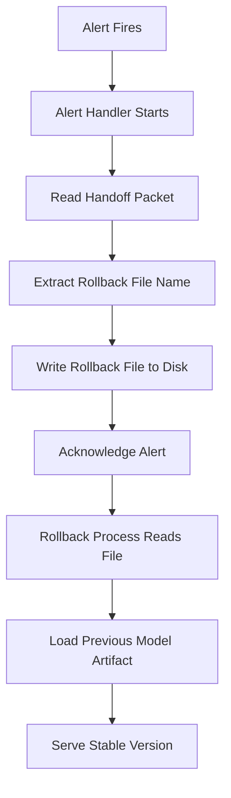

# Name a Rollback File in the Handoff Packet Before You Touch the Alert

## Introduction
When an AI model in production starts to misbehave, monitoring systems fire alerts that can trigger automated remediation. In many teams the first instinct is to acknowledge the alert and roll back to a known‑good version. However, if you touch the alert before you have identified the exact artifact to revert to, you risk rolling forward a broken model or losing the traceability needed for post‑mortem analysis. The pattern we use is simple: **name the rollback file inside the handoff packet before you acknowledge or act on the alert**. This guarantees that the rollback target is recorded, versioned, and available even if the alert handling process crashes mid‑flight.

## Why This Matters
Model drift, data‑skew, or a bad canary release can cause latency spikes or incorrect predictions. Alerts fire fast, and engineers often scramble to mitigate impact. Without a deterministic rollback reference you may:

* Roll back to the wrong version, re‑introducing the same bug.
* Lose the ability to audit which artifact caused the incident.
* Introduce race conditions where two responders pick different rollback targets.

By encoding the rollback file name in the handoff packet—a small, version‑controlled bundle that travels with every model promotion—you create a single source of truth that survives process restarts, network partitions, or human error.

## How It Works
The handoff packet is produced at promotion time and contains:

* The current model artifact URI.
* A manifest of dependencies.
* A **rollback file** field that points to the previously promoted version.

When an alert arrives, the alert handler reads the packet, extracts the rollback file name, writes it to a well‑known location (e.g., `/var/run/model/rollback.txt`), and only then acknowledges the alert. If the handler crashes after writing the file but before acknowledging, a supervisor process can still pick up the file and perform the rollback.



**Step‑by‑step**

1. **Promotion** – CI/CD creates a handoff packet (`handoff.json`) with fields `{ "model_uri": "s3://models/v1.3", "rollback_uri": "s3://models/v1.2" }`.
2. **Alert** – A metric threshold breach triggers an alert routed to the handler service.
3. **Handler** – Loads `handoff.json` from the artifact store, reads `rollback_uri`.
4. **Persist** – Writes `rollback_uri` to `/var/run/model/rollback.txt` (atomic rename).
5. **Ack** – Sends acknowledgment to the alerting system.
6. **Rollback Worker** – Periodically checks the rollback file; if present, downloads the URI and swaps the active model symlink.
7. **Cleanup** – After successful swap, the rollback file is removed.

## Core Concepts
* **Handoff Packet** – Immutable JSON (or protobuf) artifact that travels with each model promotion. It captures everything needed to reproduce or reverse the promotion.
* **Rollback File** – A small text file containing the URI (or content‑addressed hash) of the model version to revert to. Its presence signals a pending rollback.
* **Alert Touchpoint** – The moment an alert is acknowledged or acted upon. In our flow we delay this point until after the rollback file is persisted.
* **Atomic Persist** – Using `os.rename` (or equivalent) guarantees that observers either see the old state or the new rollback file, never a partially written file.

## Examples & Code Walkthrough
Below is a minimal Python implementation of the alert handler. It assumes the handoff packet is stored in an S3‑compatible bucket and that the rollback worker runs separately.

```python
import json
import os
import tempfile
import uuid
from urllib.parse import urlparse

import boto3
from botocore.exceptions import ClientError

S3_BUCKET = os.getenv("HANDOFF_BUCKET", "model-handoff")
ROLLBACK_PATH = "/var/run/model/rollback.txt"
S3_CLIENT = boto3.client("s3")


def _download_handoff(key: str) -> dict:
    """Fetch the handoff packet from S3 and return parsed JSON."""
    try:
        resp = S3_CLIENT.get_object(Bucket=S3_BUCKET, Key=key)
        body = resp["Body"].read()
        return json.loads(body)
    except ClientError as exc:
        raise RuntimeError(f"Unable to read handoff packet {key}: {exc}") from exc


def _write_rollback_file(uri: str) -> None:
    """Atomically write the rollback URI to the well‑known location."""
    fd, tmp_path = tempfile.mkstemp(dir=os.path.dirname(ROLLBACK_PATH), prefix="rollback-")
    try:
        with os.fdopen(fd, "w") as f:
            f.write(uri + "\n")
        os.replace(tmp_path, ROLLBACK_PATH)  # atomic on POSIX
    finally:
        if os.path.exists(tmp_path):
            os.unlink(tmp_path)


def handle_alert(alert_payload: dict) -> None:
    """
    Entry point called by the alerting webhook.
    Expected payload contains a reference to the handoff packet,
    e.g. {"handoff_key": "models/v1.3/handoff.json"}
    """
    handoff_key = alert_payload.get("handoff_key")
    if not handoff_key:
        raise ValueError("Alert payload missing handoff_key")

    # 1. Read handoff packet
    packet = _download_handoff(handoff_key)
    rollback_uri = packet.get("rollback_uri")
    if not rollback_uri:
        raise RuntimeError("Handoff packet lacks rollback_uri")

    # 2. Persist rollback target BEFORE acknowledging
    _write_rollback_file(rollback_uri)

    # 3. Acknowledge alert (pseudo‑call)
    _acknowledge_alert(alert_payload["alert_id"])

    # 4. Log for audit
    print(f"[handler] Rollback target {rollback_uri} stored for alert {alert_payload['alert_id']}")


def _acknowledge_alert(alert_id: str) -> None:
    """Placeholder for actual alert‑system API call."""
    # In reality you would POST to PagerDuty, Opsgenie, etc.
    pass
```

**Key points in the code**

* The handoff packet is fetched **before** any acknowledgment.
* The rollback URI is written to disk using an atomic `os.replace` to avoid torn writes.
* Only after the file is safely on disk do we call `_acknowledge_alert`.
* The function raises on missing data, forcing the caller to dead‑letter the alert for manual inspection.

## Best Practices
* **Make the handoff packet immutable** – sign it with a checksum or store it in a write‑once bucket.
* **Use atomic file operations** – never write directly to the final rollback path; use a temp file + rename.
* **Separate concerns** – the alert handler only prepares the rollback file; a dedicated worker performs the actual model swap.
* **Audit everything** – log the handoff key, rollback URI, and timestamps to a centralized trace system.
* **Test failure paths** – kill the handler after writing the rollback file but before acknowledgment to verify the worker still rolls back correctly.

## Common Mistakes & Anti‑Patterns
| Mistake | Why it’s harmful | Fix |
|---------|------------------|-----|
| **Acknowledging the alert before persisting the rollback file** | If the handler crashes, no rollback target exists → manual intervention required. | Always write the rollback file first; treat the acknowledgment as the final step. |
| **Storing the rollback URI only in memory** | Memory is lost on process restart or pod eviction, leaving the system unaware of a needed rollback. | Persist to disk or a durable store (e.g., DynamoDB, Consul KV) before acknowledging. |
| **Reusing the same rollback file name for multiple promotions** | Overwrites previous rollback info, making it impossible to revert to earlier versions. | Include a unique identifier (e.g., model version or UUID) in the file name or embed the version inside the file contents. |
| **Skipping validation of the handoff packet** | A corrupted or tampered packet could point to a malicious model. | Verify a checksum or signature; reject packets that fail validation. |

## Performance Considerations
* **CPU** – The handler does a single S3 GET and JSON parse; negligible (<5 ms) for typical packet sizes (<100 KB).
* **Network** – One round‑trip to the object store; latency dominated by S3 read (~10‑20 ms in‑region). If the handoff packet is cached locally (e.g., via a sidecar), the cost drops further.
* **Disk** – Writing a few bytes to `/var/run/model/rollback.txt` is trivial; atomic rename adds a microsecond‑scale overhead.
* **Scalability** – Because the handler is stateless aside from the object store read, you can run many instances behind a load balancer. The rollback worker can be a singleton or a leader‑elected process; it only reads the small file, so contention is minimal.
* **Failure modes** – If the object store is unavailable, the handler should retry with exponential backoff and eventually dead‑letter the alert after a configurable number of attempts (e.g., 3 retries). This prevents alert storms while preserving the chance to recover once the store is back.

## Real-World Usage
* **Netflix** – Their model serving platform (Metaflow‑based) publishes a versioned manifest with each promotion. The canary analyzer reads the manifest’s `previous_version` field before triggering a rollback alert, ensuring the rollback target is known.
* **Uber** – Michelangelo stores a JSON packet alongside each model artifact in their artifact store. When a drift detector fires, the controller copies the `rollback_uri` field into a Consul key that the model‑router watches.
* **Cloudflare** – Workers AI uses a “model bundle” that includes a `rollback.cid` (content‑identifier). The alert manager writes this CID to a file mounted into the router pod; the router reloads the bundle when the file changes.

These organizations all share the same principle: **the rollback reference is captured *before* any human or automated system acknowledges the problem**.

## Frequently Asked Questions (FAQ)

**Q: What if the handoff packet itself is corrupted or missing?**  
A: Treat it as a fatal condition. Do not acknowledge the alert; instead, send the alert to a manual‑intervention queue and raise a severity‑1 incident. The packet’s integrity is the foundation of the rollback guarantee.

**Q: Can I store the rollback file in a distributed KV store instead of disk?**  
A: Yes, as long as the write is durable and you perform it before acknowledgment. Many teams use etcd or Consul for this purpose, but you must still guarantee the write completes.

**Q: How do I handle multiple concurrent alerts for the same model?**  
A: The rollback file should contain the *most recent* known‑good version. If a newer alert arrives while a rollback is in progress, the worker will still revert to the same version (which is still safe). If you need to track a chain of rollbacks, consider appending to a log rather than overwriting a single file.

**Q: Does this pattern work for non‑ML systems (e.g., microservices)?**  
A: Absolutely. The handoff packet can be any build artifact (Docker image SHA, binary checksum, config version). The principle of naming the rollback target before acknowledging an alert is universal.

**Q: What’s the overhead of signing the handoff packet?**  
A: A simple SHA‑256 HMAC adds a few hundred bytes and a sub‑millisecond CPU cost. The security benefit far outweighs the tiny latency increase.

## Conclusion
Naming the rollback file inside the handoff packet *before* you touch the alert creates a deterministic, recoverable path from detection to remediation. It eliminates guesswork, prevents race conditions, and gives auditors a clear trail of what was rolled back and why. By integrating this tiny but critical step into your alert‑handling pipeline you gain confidence that, when the AI model misbehaves, you can roll back safely and quickly—without losing the context needed to prevent the same issue from recurring.
