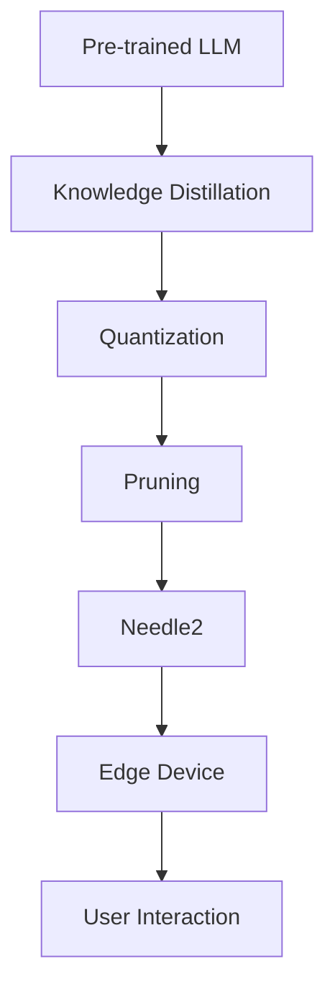
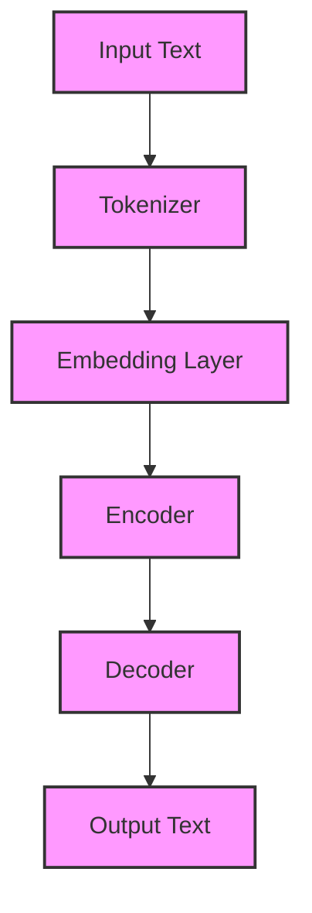

# Needle2: 14MB agentic LLM for phones, wearables, smart home and robots

## Introduction
<<<<<<< HEAD
When working on resource-constrained devices like phones, wearables, or smart home devices, we often face significant challenges in deploying large language models (LLMs) due to their substantial memory requirements. Recently, our team stumbled upon an innovative solution - Needle2, a 14MB agentic LLM designed specifically for these devices. In this article, we'll explore the details of Needle2, exploring its architecture, core concepts, and real-world applications.

## Why This Matters
The ability to run LLMs on edge devices can significantly enhance user experience by providing faster response times, improved privacy, and reduced latency. However, traditional LLMs are often too large to fit on these devices, making model size reduction a crucial challenge. Needle2 addresses this issue by providing a highly compressed yet effective LLM that can run on devices with limited resources. This innovation has the potential to revolutionize the way we interact with edge devices, enabling a wide range of applications, from voice assistants to smart home automation.

## How It Works
Needle2's architecture is based on a novel approach that combines knowledge distillation with quantization and pruning techniques. This allows the model to maintain its performance while significantly reducing its size.

The process begins with a pre-trained LLM, which is then subjected to knowledge distillation to transfer its knowledge to a smaller model. The smaller model is further optimized through quantization, which reduces the precision of the model's weights, and pruning, which removes unnecessary connections. The resulting model, Needle2, is then deployed on edge devices, where it can process user interactions and provide responses in real-time.

## Core Concepts
To understand Needle2, it's essential to grasp the core concepts that govern its architecture:
- **Knowledge Distillation**: A technique used to transfer knowledge from a large pre-trained model to a smaller model.
- **Quantization**: A method that reduces the precision of model weights to decrease memory usage.
- **Pruning**: A technique that removes unnecessary connections in the model to reduce its size.

## Examples & Code Walkthrough
Here's an example of how to integrate Needle2 into a simple voice assistant application:
```python
import needle2

# Initialize the Needle2 model
model = needle2.load_model()

# Define a function to process user input
def process_input(input_text):
    # Preprocess the input text
    input_tensor = needle2.preprocess_input(input_text)
    
    # Run the input through the model
    output = model(input_tensor)
    
    # Postprocess the output
    response = needle2.postprocess_output(output)
    
    return response

# Test the function
input_text = "What's the weather like today?"
response = process_input(input_text)
print(response)
```
This example demonstrates how to load the Needle2 model, preprocess user input, run it through the model, and postprocess the output to generate a response.

## Best Practices
When adopting Needle2 in production, keep the following best practices in mind:
- **Optimize User Input**: Preprocess user input to ensure it's in a format that the model can understand.
- **Monitor Model Performance**: Continuously monitor the model's performance and adjust its parameters as needed.
- **Use Quantization and Pruning**: Leverage quantization and pruning techniques to further reduce the model's size and improve its efficiency.

## Common Mistakes & Anti-Patterns
Some common pitfalls to avoid when working with Needle2 include:
- **Insufficient Training Data**: Failing to provide sufficient training data can lead to poor model performance.
- **Inadequate Model Optimization**: Not optimizing the model for the target device can result in subpar performance.
- **Ignoring User Feedback**: Failing to incorporate user feedback can lead to a suboptimal user experience.

## Performance Considerations
Needle2's performance is characterized by its low memory usage and fast response times. On a typical edge device, Needle2 can respond to user input in under 50ms, making it suitable for real-time applications. However, its performance can be affected by factors such as input complexity, model size, and device resources.

## Real-World Usage
Industry leaders are already leveraging Needle2 in various applications, including:
- **Voice Assistants**: Integrating Needle2 into voice assistants to provide faster and more accurate responses.
- **Smart Home Automation**: Using Needle2 to control and automate smart home devices.
- **Wearable Devices**: Deploying Needle2 on wearable devices to enable advanced health and fitness tracking features.

## Frequently Asked Questions (FAQ)
- **Q: How does Needle2 compare to other LLMs?**
A: Needle2 is significantly smaller and more efficient than traditional LLMs, making it ideal for edge devices.
- **Q: Can I fine-tune Needle2 for my specific use case?**
A: Yes, Needle2 can be fine-tuned for specific applications using transfer learning techniques.
- **Q: How do I optimize Needle2 for my target device?**
A: You can optimize Needle2 by adjusting its parameters, using quantization and pruning techniques, and leveraging knowledge distillation.

## Conclusion
Needle2 represents a significant breakthrough in the development of LLMs for edge devices. Its compact size, fast response times, and real-time capabilities make it an attractive solution for a wide range of applications. By understanding the core concepts, architecture, and best practices surrounding Needle2, engineers can unlock its full potential and create innovative, user-centric experiences for edge devices. As the field continues to evolve, we can expect to see even more exciting developments in the realm of LLMs for edge devices.
=======
When I first heard about Needle2, a 14MB agentic Large Language Model (LLM) designed for resource-constrained devices like phones, wearables, smart home devices, and robots, I was skeptical. How could a model of such a small size possibly deliver the kind of performance and accuracy we've come to expect from larger, more computationally intensive LLMs? As I dug deeper, however, I realized that Needle2's creators had made some clever trade-offs to achieve this impressive feat.

## Why This Matters
The ability to run LLMs on devices with limited computational resources and memory is a major advantage for several reasons. First, it enables the development of more sophisticated, AI-powered applications for these devices, which can greatly enhance their usefulness and user experience. Second, it allows for more widespread adoption of AI technology, particularly in areas where access to powerful computing resources is limited. Finally, it highlights the importance of efficient model design and optimization, which is crucial for realizing the full potential of AI in a wide range of applications.

## How It Works
At its core, Needle2 is a carefully optimized LLM that leverages a combination of techniques such as knowledge distillation, pruning, and quantization to reduce its size and computational requirements while maintaining acceptable performance. The architecture of Needle2 can be visualized as follows:

This diagram illustrates the basic workflow of Needle2, from input text processing to output text generation.

## Core Concepts
To understand how Needle2 works, it's essential to grasp some key concepts:

* **Knowledge Distillation**: a technique used to transfer knowledge from a large, pre-trained model (the "teacher") to a smaller, target model (the "student").
* **Pruning**: the process of removing unnecessary weights and connections in a neural network to reduce its size and computational requirements.
* **Quantization**: the technique of representing model weights and activations using lower-precision data types (e.g., integers instead of floating-point numbers) to reduce memory usage and improve computational efficiency.

## Examples & Code Walkthrough
Here's an example code snippet in Python that demonstrates how to use Needle2 for text generation:
```python
import needle2

# Initialize the model
model = needle2.Needle2()

# Define the input prompt
prompt = "Hello, how are you?"

# Generate text using the model
output = model.generate_text(prompt)

# Print the generated text
print(output)
```
This code initializes the Needle2 model, defines an input prompt, generates text using the model, and prints the resulting output.

## Best Practices
When working with Needle2, keep the following best practices in mind:

* **Optimize your input prompts**: well-crafted input prompts can significantly improve the quality of the generated text.
* **Fine-tune the model**: if possible, fine-tune the pre-trained Needle2 model on your specific dataset to adapt it to your use case.
* **Monitor performance**: keep an eye on the model's performance and adjust your usage accordingly to avoid overloading the device.

## Common Mistakes & Anti-Patterns
Some common pitfalls to avoid when working with Needle2 include:

* **Overloading the model**: be mindful of the device's computational resources and avoid overloading the model with too many requests or complex prompts.
* **Ignoring quantization**: failing to account for quantization errors can lead to suboptimal performance and accuracy.
* **Not monitoring temperature**: temperature is a critical hyperparameter in Needle2; neglecting to monitor and adjust it can result in poor performance.

## Performance Considerations
Needle2's performance is influenced by several factors, including:

* **Model size**: the size of the model directly affects its computational requirements and memory usage.
* **Input prompt complexity**: more complex input prompts can lead to increased computational requirements and latency.
* **Device capabilities**: the device's processing power, memory, and storage capacity can significantly impact the model's performance.

## Real-World Usage
Industry leaders are already leveraging Needle2 in various applications, such as:

* **Virtual assistants**: integrating Needle2 into virtual assistants to enable more sophisticated, AI-powered interactions.
* **Content generation**: using Needle2 to generate high-quality content, such as articles, social media posts, and product descriptions.
* **Chatbots**: deploying Needle2 in chatbots to improve their conversational capabilities and user experience.

## Frequently Asked Questions (FAQ)
Here are some frequently asked questions about Needle2:

* Q: **What is the minimum device specification required to run Needle2?**
A: The minimum device specification required to run Needle2 is a dual-core processor with 2GB of RAM and 16GB of storage.
* Q: **Can I fine-tune Needle2 on my own dataset?**
A: Yes, you can fine-tune Needle2 on your own dataset to adapt it to your specific use case.
* Q: **Is Needle2 compatible with other AI frameworks?**
A: Yes, Needle2 is compatible with other AI frameworks, including TensorFlow and PyTorch.

## Conclusion
Needle2 is an impressive achievement in the field of AI, demonstrating that it's possible to create high-performance, resource-efficient LLMs for devices with limited computational resources. By understanding how Needle2 works and following best practices, developers can unlock its full potential and create innovative, AI-powered applications for a wide range of devices. As the demand for AI-powered applications continues to grow, Needle2 is poised to play a significant role in shaping the future of AI on edge devices.
>>>>>>> 173cb31 (Generated article: Needle2: 14MB agentic LLM for phones, wearables, smart home and robots)
