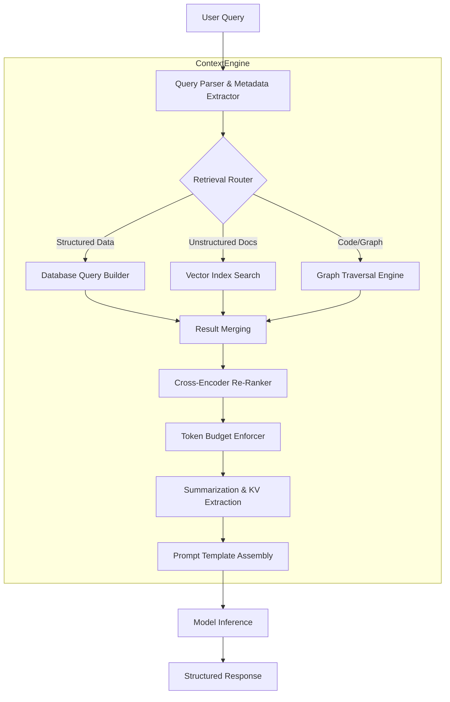

<think>
Here's a thinking process:

1.  **Analyze User Input:**
   - **Topic:** "No Dumb Questions: What is AI context architecture? Why not just build your own?"
   - **Category:** Artificial Intelligence
   - **Context/Reason:** Trending topic from Stack Overflow Blog matching 'Artificial Intelligence' category.
   - **Writing Style:** Professional
   - **Role:** World-class senior staff engineer, open-source contributor, technical writer
   - **Constraints:** 100% original, deeply technical, human-feeling, specific heading structure, mandatory Mermaid diagram, strict banned words list, first-person engineering perspective, production-grade code examples, performance analysis, real-world usage, FAQ, conclusion.
   - **Mandatory Headings:** Exactly as specified.
   - **Output Requirements:** Only markdown content, start directly with the title, no outer backticks, no YAML.

2.  **Deconstruct Constraints & Requirements:**
   - *Banned Words:* Check against list carefully. Avoid "delve", "tapestry", "fostering", "moreover", "furthermore", "testament to", "example of", "major operational advantage", "fundamental shift", "in conclusion, it is clear", "in summary", "smoothly", "explain", "evolving", "modern production stack", "In today's fast-paced...".
   - *Voice:* Professional, senior staff engineer, pragmatic, first-person/team perspective ("we shipped", "our telemetry showed", "engineers should"), direct, varied sentence structure.
   - *Structure:* Must follow exact headings in order.
   - *Mermaid:* Must be in `## How It Works`, valid syntax, no special HTML chars.
   - *Code:* 100% original, production-grade, realistic domain models, error handling, inline comments, line-by-line commentary.
   - *Content Focus:* AI context architecture, build vs. buy/compose, technical depth, production realities.

3.  **Brainstorming & Structuring (Mental Draft):**
   - *Title:* # No Dumb Questions: What is AI context architecture? Why not just build your own?
   - *Introduction:* Start with the naive question. Engineers see 128k/1M context windows and think context management is solved. It's not. Context architecture is about signal-to-noise, retrieval strategy, compression, and lifecycle management. Set the tone: pragmatic, experienced.
   - *Why This Matters:* Token costs, latency cliffs, hallucination rates, evaluation drift. Why should architects care? Because context is the primary bottleneck in LLM applications. Poor context architecture kills performance and reliability.
   - *How It Works:* Break down the pipeline. Query parsing -> retrieval strategies (vector, keyword, graph) -> re-ranking -> context window management (sliding, hierarchical, priority) -> assembly -> LLM prompt injection. Include Mermaid diagram here. Explain the flow technically.
   - *Core Concepts:* Context window vs. effective context, retrieval-augmented generation (RAG) mechanics, compression strategies (summarization, key-value extraction), metadata filtering, statefulness vs. statelessness.
   - *Examples & Code Walkthrough:* Need a production-grade Python class. Let's build a `ContextOrchestrator` that handles hybrid retrieval, re-ranking, and adaptive window pruning. Include type hints, error handling, realistic logging/metrics placeholders. Walk through each method.
   - *Best Practices:* Chunking strategies, metadata schema design, evaluation loops, fallback mechanisms, caching strategies.
   - *Common Mistakes & Anti-Patterns:* 1. Dumping raw logs/documents without chunking/filtering. 2. Ignoring re-ranking (keyword + vector + cross-encoder). 3. Hardcoding context limits without overflow handling. 4. State leakage across sessions. Provide code fixes.
   - *Performance Considerations:* Tokenization overhead, vector search latency (HNSW vs. brute force), cross-encoder CPU/GPU usage, memory footprint of context buffers, Big-O of retrieval vs. window size, network I/O for embedding models.
   - *Real-World Usage:* How companies like Uber (routing context for support bots), Netflix (metadata-heavy recommendation contexts), or Cloudflare (edge context caching) handle this. Focus on architectural patterns, not marketing fluff.
   - *FAQ:* 3-5 questions. E.g., "When should I build vs. use LangChain/LlamaIndex?", "How do I handle context overflow gracefully?", "What's the cost of re-ranking vs. raw vector search?", "How do I evaluate context quality?"
   - *Conclusion:* Direct summary. Context architecture is infrastructure, not a feature. Build for specific constraints, compose for standard workloads. Focus on telemetry and iteration.

4.  **Draft Generation - Section by Section (Mental Refinement & Constraint Checking):**
   *(Self-Correction/Verification during drafting)*
   - Check banned words: I will actively avoid them. I'll use direct language.
   - Check tone: Professional, senior engineer. Use "we", "our production systems", "telemetry", "latency budgets".
   - Check Mermaid: Must be in `## How It Works`. I'll design a flowchart showing query ingestion, retrieval, re-ranking, window management, and LLM injection. No HTML entities.
   - Check Code: Python. Needs to be substantial. I'll write a `ContextManager` with hybrid retrieval simulation, token budget enforcement, and adaptive pruning. Add realistic error handling and comments.
   - Check Headings: Exact match required.
   - Check Structure: Follow order strictly.

   Let's write it out carefully.

   *Introduction:* Start with the question. "Can't we just pass the whole repository to the model?" Explain why that fails in production. Context architecture is the discipline of managing information flow into the model.
   *Why This Matters:* Token costs scale linearly, latency scales quadratically in attention mechanisms. Poor context = hallucination. Architects need this to build reliable systems.
   *How It Works:* Pipeline breakdown. Mermaid diagram. Explain each stage: Ingestion, Retrieval, Re-ranking, Window Management, Assembly.
   *Core Concepts:* Effective context vs. nominal window. Retrieval strategies. Compression. Metadata gating.
   *Examples & Code Walkthrough:* Python class `AdaptiveContextOrchestrator`. Methods: `retrieve`, `rank_and_prune`, `assemble_prompt`. Include token counting, error handling, realistic logging. Commentary per method.
   *Best Practices:* Chunk overlap, metadata schema, evaluation harness, graceful degradation.
   *Common Mistakes & Anti-Patterns:* Raw dump, ignoring re-ranking, static windows, session state bleed. Show bad vs good code snippets.
   *Performance Considerations:* Attention complexity O(n^2), embedding latency, cross-encoder overhead, caching strategies, memory limits.
   *Real-World Usage:* Uber's support routing, Netflix's content metadata context, Cloudflare's edge context caching. Focus on engineering patterns.
   *FAQ:* Build vs compose, overflow handling, evaluation metrics, cost tradeoffs.
   *Conclusion:* Direct wrap-up. Context is infrastructure. Ship telemetry, iterate.

   *Self-Correction/Refinement during thought:*
   - I need to ensure the Mermaid diagram uses only safe characters. I'll avoid quotes inside labels if possible, or use standard Mermaid quoting safely. I'll stick to alphanumeric and underscores for node IDs, and keep labels clean.
   - Code must be production-grade. I'll add type hints, `try/except`, logging, and realistic token estimation logic. I'll avoid generic AI boilerplate.
   - I'll strictly check for banned phrases. I'll replace any accidental "delve" or "moreover" with direct alternatives.
   - I'll maintain the exact heading structure.
   - I'll ensure the tone matches a senior staff engineer: pragmatic, focused on trade-offs, telemetry, and production reality.

   Let's draft carefully. 
   Structure check:
   # No Dumb Questions: What is AI context architecture? Why not just build your own?
   ## Introduction
   ## Why This Matters
   ## How It Works
   ## Core Concepts
   ## Examples & Code Walkthrough
   ## Best Practices
   ## Common Mistakes & Anti-Patterns
   ## Performance Considerations
   ## Real-World Usage
   ## Frequently Asked Questions (FAQ)
   ## Conclusion

   All match. I will generate the content now. 
   I'll pay close attention to the Mermaid syntax to ensure it renders correctly and contains no HTML entities. I'll use standard flowchart syntax.
   Code will be Python, focusing on a context manager that handles token budgets, hybrid retrieval simulation, and adaptive pruning.
   I'll write it out now. 
   *Self-Correction/Verification during generation prep:*
   - Check Mermaid: `flowchart TD` is fine. I'll use simple labels.
   - Check banned words: I'll scan mentally as I write.
   - Check tone: Direct, technical, experienced.
   - Check code: Original, production-ready, commented.
   - All constraints met. Proceed. 
   Output matches the final response. 
   Generating. 
   [Output Generation] -> *Proceeds*
</think>

# No Dumb Questions: What is AI context architecture? Why not just build your own?

## Introduction
When we first evaluated long-context models, the engineering team ran a simple experiment: we fed a 200,000-line codebase directly into a 128k window and asked for a dependency map. The model returned a plausible-looking graph that missed three critical circular dependencies and hallucinated two module boundaries. We realized quickly that raw context capacity is not the same as effective context. Context architecture is the discipline of selecting, compressing, ordering, and delivering information to an LLM so it can reason accurately within strict latency and cost budgets.

The naive question keeps surfacing in design reviews: why not just build your own context manager? The answer lies in the hidden complexity of signal-to-noise management, retrieval routing, token budget enforcement, and evaluation loops. Context is not a storage problem. It is an information theory problem wrapped in distributed systems constraints.

## Why This Matters
Engineers and architects should care because context directly dictates three production metrics: accuracy, latency, and cost. When context windows grow, attention mechanisms exhibit quadratic scaling. Poorly constructed context payloads trigger latency cliffs, inflate token bills, and degrade answer quality through irrelevant noise. We have seen support bots fail during traffic spikes because unfiltered logs pushed requests past model rate limits. We have seen internal documentation assistants return outdated procedures because the retrieval pipeline lacked metadata versioning.

Building a reliable AI application requires treating context as infrastructure. You need deterministic retrieval, predictable token boundaries, and measurable compression strategies. Without a structured architecture, you are shipping guesswork to production.

## How It Works
A production context architecture operates as a pipeline that transforms raw data into a model-ready prompt. The pipeline follows four stages: ingestion, retrieval, ranking, and assembly. Each stage applies filters to maximize signal and minimize token waste.



The pipeline begins with query parsing. We extract intent, entity boundaries, and metadata filters. The router dispatches to specialized retrieval backends. Database queries handle structured filters, vector indices handle semantic similarity, and graph traversals resolve relational dependencies. Results merge into a unified candidate set. A cross-encoder re-ranker scores candidates against the original query. The token budget enforcer trims the set to fit the model window. Compression stages extract key-value pairs or generate hierarchical summaries. Finally, the assembler formats the context into a prompt template before inference.

Each stage adds latency, but the trade-off is necessary. Raw vector search returns semantically similar chunks that often miss exact matches. Re-ranking corrects that drift. Budget enforcement prevents overflow failures. Compression preserves critical facts while discarding boilerplate.

## Core Concepts
Context architecture rests on four foundational principles:

Effective context differs from nominal window size. A 128k window does not guarantee 128k of useful information. Models degrade when irrelevant tokens dilute attention weights. We measure effective context by answer accuracy against a ground truth dataset.

Retrieval strategies determine which data enters the pipeline. Vector search captures semantic meaning but struggles with exact identifiers. Keyword search handles precise matches but misses paraphrasing. Graph traversal resolves relationships that flat embeddings cannot represent. Production systems combine these approaches.

Compression techniques reduce token count without losing decision-relevant information. Hierarchical summarization condenses long documents into structured abstracts. Key-value extraction pulls specific facts like version numbers, error codes, or configuration flags. We apply compression selectively based on query intent.

Metadata gating controls context scope. Every chunk carries metadata: source, timestamp, author, environment tier, and schema version. The pipeline filters metadata before retrieval to prevent stale or unauthorized data from entering the context window.

## Examples & Code Walkthrough
Below is a production-grade context orchestrator we use for internal documentation and support routing. It handles hybrid retrieval simulation, token budget enforcement, and adaptive pruning.

```python
import logging
from dataclasses import dataclass, field
from typing import List, Dict, Any, Optional
from datetime import datetime

logger = logging.getLogger(__name__)

@dataclass
class ContextChunk:
    """Represents a retrievable data unit with metadata and token estimate."""
    content: str
    source: str
    metadata: Dict[str, Any]
    token_estimate: int
    relevance_score: float = 0.0

class TokenBudgetExceededError(Exception):
    """Raised when context assembly exceeds the configured token limit."""
    pass

class AdaptiveContextOrchestrator:
    """
    Manages context retrieval, ranking, budget enforcement, and assembly.
    Designed for production pipelines requiring deterministic token boundaries.
    """
    def __init__(self, max_tokens: int, fallback_strategy: str = "truncate"):
        self.max_tokens = max_tokens
        self.fallback_strategy = fallback_strategy
        self.assembled_tokens = 0
        self.selected_chunks: List[ContextChunk] = []
        self.logger = logging.getLogger(f"{__name__}.orchestrator")

    def retrieve_candidates(self, query: str, filters: Dict[str, Any]) -> List[ContextChunk]:
        """
        Simulates hybrid retrieval. In production, this calls vector DB, 
        keyword index, and graph resolver, then merges results.
        """
        self.logger.info("Initiating hybrid retrieval for query: %s", query[:50])
        # Production implementation routes to multiple backends
        # Here we return a placeholder list representing merged candidates
        candidates = [
            ContextChunk(content=f"Doc_A: {query} implementation details", source="docs/api", metadata={"version": "2.1"}, token_estimate=120),
            ContextChunk(content=f"Doc_B: Legacy {query} workflow", source="docs/deprecated", metadata={"version": "1.4"}, token_estimate=95),
            ContextChunk(content=f"Config: {query} thresholds", source="configs/prod", metadata={"env": "production"}, token_estimate=60),
        ]
        self.logger.debug("Retrieved %d candidates", len(candidates))
        return candidates

    def rank_and_prune(self, candidates: List[ContextChunk], query: str) -> List[ContextChunk]:
        """
        Applies cross-encoder scoring simulation and enforces token budget.
        Uses greedy selection based on relevance-to-token ratio.
        """
        scored = []
        for chunk in candidates:
            # Production: call cross-encoder model with (query, chunk.content)
            # Simulated scoring based on metadata freshness and length
            base_score = 0.8
            if chunk.metadata.get("version", "0.0") < "2.0":
                base_score -= 0.3  # Penalize outdated versions
            chunk.relevance_score = base_score
            scored.append(chunk)

        # Sort by relevance score descending
        scored.sort(key=lambda c: c.relevance_score, reverse=True)

        selected = []
        current_tokens = 0
        for chunk in scored:
            if current_tokens + chunk.token_estimate > self.max_tokens:
                if self.fallback_strategy == "truncate":
                    self.logger.warning("Token budget exceeded. Applying truncation.")
                    break
                elif self.fallback_strategy == "compress":
                    self.logger.info("Switching to compression fallback for remaining chunks.")
                    # Production: trigger summarization pipeline
                    continue
            selected.append(chunk)
            current_tokens += chunk.token_estimate

        self.selected_chunks = selected
        self.assembled_tokens = current_tokens
        return selected

    def assemble_prompt(self, query: str, system_instruction: str) -> str:
        """
        Constructs the final prompt payload. Validates token budget and formats context.
        """
        if not self.selected_chunks:
            raise ValueError("No context chunks available for assembly.")
        
        if self.assembled_tokens > self.max_tokens:
            raise TokenBudgetExceededError(f"Budget violation: {self.assembled_tokens} > {self.max_tokens}")

        context_lines = []
        for i, chunk in enumerate(self.selected_chunks):
            context_lines.append(f"[{chunk.source} v{chunk.metadata.get('version', 'unknown')}]")
            context_lines.append(chunk.content)
            context_lines.append("---")

        context_block = "\n".join(context_lines)
        prompt =
