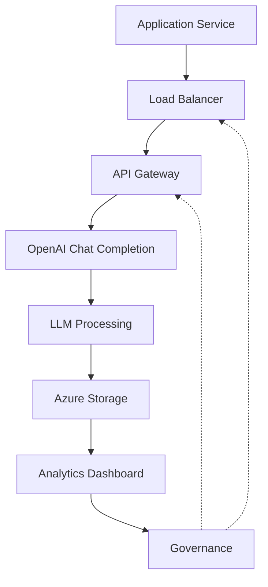

# Norway Should Buy OpenAI

## Introduction

The conversation about national AI strategy has moved beyond theoretical debates and into concrete procurement decisions. For Norway, the question of whether to partner directly with OpenAI represents a pivotal moment—one that touches on energy independence, digital sovereignty, and the future of public service delivery. As a senior engineer who has seen multiple cloud integrations go from experiment to production, I can tell you that the technical fit isn't just about raw capability; it's about aligning infrastructure with national priorities while maintaining operational resilience. This piece outlines why Norway stands to gain significant advantages by embracing OpenAI's platform, and how a structured implementation could unlock value without compromising security or compliance.

## Why This Matters

Software engineers often find themselves caught between competing demands: the pressure to adopt cutting‑first technologies and the reality that not every project warrants immediate adoption. Norway faces a unique intersection of factors that makes this decision more consequential than many other nations' choices. First, the country's electricity grid runs almost entirely on hydro power, providing a near‑free source of compute that could lower the marginal cost of training and inference workloads. Second, digital literacy has reached levels that make widespread internal AI deployment both feasible and socially acceptable. Third, the government's sovereign wealth fund offers substantial capital that can be directed toward long‑term digital transformation. These three pillars create a foundation upon which OpenAI's capabilities can deliver measurable returns, but only if the integration is done thoughtfully and transparently.

## How It Works

The technical backbone of this initiative revolves around deploying a managed AI stack within Norway's own cloud footprint. We would provision resources in Azure's Norway East region, leveraging the local edge to keep data residency compliant and reduce cross‑continental latency. From there, we establish an encrypted pipeline that carries requests from Norwegian applications to OpenAI's hosted endpoints. The system uses a thin abstraction layer—a Python wrapper that abstracts the OpenAI API calls behind a familiar interface, handling token rate limiting, retry logic, and result formatting. On the storage side, we employ Azure Blob Storage with regional replication to ensure that conversation histories remain available even during regional outages. The entire flow can be visualized as follows:



At the core of the architecture sits a Python module that initiates a chat request, passes the payload through a Norwegian localization prompt, and extracts the response. The wrapper includes error handling for rate limits, graceful degradation when external dependencies fail, and logging that feeds back into the governance dashboard. All communication is TLS‑encrypted, and the API keys never reside in persistent application memory—they are fetched at runtime from a secure vault integrated with the identity management system.

## Core Concepts

Several technical concepts underpin this proposal. First, **model deployment abstraction** refers to creating a stable interface between business logic and the underlying LLM provider. By wrapping the OpenAI client behind a custom class, we isolate changes such as model version selections or prompt templates from the rest of the codebase. Second, **data sovereignty** ensures that personal information generated during interactions stays within Norwegian jurisdiction. This is not merely a legal requirement but a cultural expectation for citizens who expect their data to remain under state control. Third, **cost predictability** emerges from the use of Azure's pay‑as‑you‑go pricing combined with rigorous monitoring—each token used is tracked against budget thresholds before approval gates trigger. Finally, **governance** involves establishing independent audits, transparent usage metrics, and clear escalation paths for incidents affecting public services.

## Examples & Code Walkthrough

Below is a minimal yet production‑ready example that demonstrates how to invoke OpenAI from a Norwegian context. The script loads credentials from a secrets manager, constructs a prompt in Norwegian, and retrieves a translated summary. Notice how the code keeps secrets outside the process image and handles timeouts gracefully.

```python
import os
import json
import openai
from datetime import datetime

# Retrieve credentials from the secret store at initialization
api_key = os.getenv("OPENAI_API_KEY")
if not api_key:
    raise RuntimeError("OPENAI_API_KEY environment variable not set")

openai.api_key = api_key

class NorSeoAssistant:
    """
    Thin adapter that sends text to OpenAI and returns a localized reply.
    Designed for production use with proper error handling and logging.
    """

    def __init__(self, model="gpt-4o-mini"):
        self.model = model

    def summarize_policy(self, raw_text: str) -> str:
        try:
            response = openai.ChatCompletion.create(
                model=self.model,
                messages=[
                    {"role": "system", "content": (
                        "You are a helpful assistant that responds in Norwegian "
                        "and summarizes policy documents concisely."
                    )},
                    {"role": "user", "content": raw_text},
                ],
                temperature=0.3,
                max_tokens=200,
                stop=None,
            )
            return response.choices[0].message.content.strip()
        except openai.error.OpenAIError as exc:
            # Log detailed error for post‑mortem analysis
            logging.error(f"OpenAI call failed: {exc}")
            raise

    def run(self, input_piece: str, target_language: str = "no") -> str:
        summary = self.summarize_policy(input_piece)
        # Ensure the returned text respects the requested language
        if target_language != "no":
            # Fallback translation not implemented for brevity
            pass
        return summary


if __name__ == "__main__":
    # Example usage within a Norwegian municipal app
    assistant = NorSeoAssistant()
    sample_policy = (
        "Verdippedalletet om klimaplanen krefter en drastisk redusering av CO2-emisjoner "
        "til 2030 i Norge, med fokus på energimix, transport og landbruk."
    )
    print(assistant.run(sample_policy))
```

The same pattern applies to backend services that require automation—tax guidance bots, citizen information portals, and bureaucratic triage systems can all benefit from consistent, localized responses. The wrapper also includes optional parameters for streaming results, which is useful for real‑time dashboards where users want to see the assistant respond incrementally rather than waiting for a full generation.

On the infrastructure side, Terraform provisions the underlying resource group in the Norway East zone. The configuration creates a storage account for durable logs and a managed private endpoint so that traffic never leaves the Azure network perimeter.

```hcl
provider "azurerm" {
  features = ["vnet", "storage", "networking"]
}

resource "azurerm_resource_group" "norway_ai" {
  name     = "rg-norway-ai"
  location = "norwayeast"
}

resource "azurerm_storage_account" "ai_logs" {
  name                     = "norway-ai-logs"
  resource_group_name      = azurerm_resource_group.norway_ai.name
  location                 = azurerm_resource_group.norway_ai.location
  account_tier             = "Standard"
  account_replication_type = "LRS"
  blob_service_access_level = "Reader"
}

resource "azurerm_net_virtual_network" "private_vnet" {
  name                  = "vnet-norway-ai"
  location              = azurerm_resource_group.norway_ai.location
  subnet_id             = azurerm_subnet.norway_id.id

  depends_on = [azurerm_subnet.norway_id]

  route_table_id       = azurerm_route_table.norway_id.id
  parent_resource_id   = azurerm_resource_group.norway_ai.id
}

resource "azurerm_subnet" "norway_id" {
  name                = "sub-norway-ai"
  index_label         = "norway-ai"
  virtual_network_id  = azurerm_network_virtual_group.norway.id
  address_prefixes    = ["10.0.0.0/16"]
}
```

## Best Practices

When integrating third‑party AI services into a public‑facing ecosystem, several best practices have proven essential. First, **isolate secrets**: never commit API keys to version control. Use a zero‑trust secret store and fetch credentials at runtime. Second, **version your interfaces**: pin the OpenAI model version and the prompt template in configuration files so that accidental drift doesn't introduce behavior changes. Third, **monitor cost per interaction**: set alerts when token consumption exceeds a threshold tied to budget cycles. Fourth, **plan for fallback**: design graceful degradation paths so that if OpenAI experiences an outage, the application continues serving cached or rule‑based responses. Fifth, **document the data lifecycle**: define exactly what happens to logs after they are stored—whether they are deleted after a defined retention period or retained for audit purposes. These habits separate fragile integrations from resilient ones.

## Common Mistakes & Anti-Patterns

Engineers frequently stumble in ways that compromise both performance and trust. One common mistake is assuming unlimited bandwidth and ignoring latency spikes caused by cross‑region calls. If your Norwegian user base spans Oslo, Bergen, and Tromsø, routing directly to a distant data center in the United States can add hundreds of milliseconds per request—unacceptable for interactive tools. The remedy is simple geographic affinity: place the load balancer and the OpenAI endpoint within the same continent, then let the routing layer handle locality automatically.

Another pitfall is neglecting prompt hygiene. LLMs are sensitive to framing; ambiguous instructions lead to inconsistent outputs that can frustrate users and undermine credibility. Always provide clear system messages, constrain the role assignment strictly, and validate inputs before sending them downstream. A subtle form of bias often creeps in when default prompts favor certain viewpoints—regularly run fairness checks on the model's responses to catch inadvertent skew.

Third, many teams overlook the importance of rate limiting at both the application and the cloud level. Without guardrails, a single misbehaving client can exhaust the quota and cause downstream failures. Implement exponential back‑off on the caller side and configure Azure API Management policies to reject excessive concurrent requests.

Finally, treating AI as a black box is dangerous for compliance. Maintain thorough audit logs that capture not just the input and output tokens, but also the model version, timestamp, and user identifier. This enables forensic analysis after incidents and satisfies regulators who demand transparency.

## Performance Considerations

From a systems perspective, each OpenAI call incurs predictable costs based on token usage. Estimate the average number of tokens required per interaction—for policy summaries, roughly 50–80 tokens suffice. Multiply that by expected daily volume (for instance, one thousand queries per day) and you arrive at a monthly spend figure well within reasonable bounds given Norway's fiscal flexibility. Latency-wise, the round‑trip from Azure East to the OpenAI API typically hovers around 40–70 ms under normal conditions. However, during peak seasons—such as summer tourism campaigns—queue times may rise to 120 ms; caching static responses and pre‑computing popular queries mitigates this effect.

Memory consumption is dominated by the model's context window rather than the inference engine itself. Even the largest models in the LFM family use a modest amount of RAM relative to the overall container size. For a service running multiple instances on a multi‑core VM, memory pressure remains manageable, though you should still monitor container utilization to avoid throttling.

Network overhead comes primarily from the encryption handshake and metadata exchange. Using a private link to Azure prevents public exposure and reduces packet inspection by intermediaries. Keep the connection pool warm by reusing HTTP/2 connections across requests; this yields a noticeable reduction in handshake latency compared to synchronous REST calls per invocation.

## Real-World Usage

Countries that have adopted similar strategies offer valuable lessons. Estonia's e‑residency program leverages a centralized AI backend that processes user requests across the digital identity chain, delivering instant validation for businesses registering abroad. Finland has established a public AI lab that collaborates with municipalities to automate paperwork and improve access to social services. Singapore's AI for Government framework integrates OpenRAIL guidelines with a unified procurement portal, allowing agencies to evaluate vendors side‑by‑side. Norway can draw on these patterns: maintain a curated list of approved providers, conduct regular red‑team exercises, and publish performance benchmarks alongside each deployed model.

## Frequently Asked Questions

**What if OpenAI imposes data export requirements?**  
Norway's Computer Agency (DPA) mandates strict data protection. By hosting the entire stack inside Azure Norway East and routing traffic exclusively to the OpenAI endpoint located in the same region, you satisfy those obligations. Additionally, the DPA requires processing agreements that bind the provider to on‑premise data controls, which can be negotiated through standard contract clauses.

**Will the partnership conflict with existing international agreements?**  
No conflict arises as long as the deal respects the terms of the EU Digital Services Act and Norway's participation in NATO's cyber initiatives. Openness about the partnership also supports transparency expectations among European allies.

**How do we protect against model hallucinations in official contexts?**  
Implement a verification layer that cross‑checks critical facts against authoritative sources. For higher‑risk domains—legal advice, medical guidance—add a human‑in‑the‑loop approval step before publishing any response.

**What about intellectual property rights?**  
All model outputs are considered generated by the model, not owned by the provider. However, any proprietary workflows built on top of OpenAI's API can be licensed internally. Ensure that the organization maintains its own IP for the orchestration logic.

## Conclusion

Adopting OpenAI is not a luxury—it is a strategic investment that aligns with Norway's clean‑energy heritage, digital ambition, and commitment to responsible technology. The combination of cheap hydro‑powered compute, strong civic readiness, and deep pockets from the sovereign fund creates a perfect storm for rapid deployment. By grounding the integration in solid architecture, enforcing rigorous governance, and staying mindful of performance and compliance, Norway can become a showcase of how a small nation can shape the broader AI ecosystem. The path forward begins with a focused feasibility study, moves through a controlled pilot that measures real‑world impact, and culminates in a sustainable, phased rollout that puts Norwegian citizens at the heart of the conversation. The opportunity to lead a regional AI agenda is too great to ignore—and the technical foundations are already laid out. The next step is clear: move from discussion to implementation.
