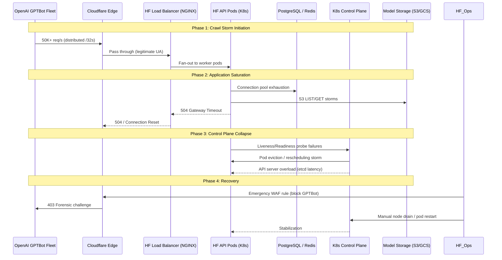

# Now we have a timeline of the OpenAI accidental attack against Hugging Face

## Introduction

Last May, Hugging Face went down hard. Not a graceful degradation—hard down. The culprit wasn't a malicious actor or a zero-day exploit. It was OpenAI's GPTBot, running a distributed crawl that looked suspiciously like a layer-7 DDoS. Over the course of roughly six hours, a single user-agent generated enough request volume to saturate Hugging Face's edge capacity, trigger cascading timeouts in their Kubernetes control plane, and effectively take the largest open model hub offline.

The postmortem timeline is now public. It's a masterclass in how well-intentioned automation, missing guardrails, and asymmetric infrastructure scaling can collide. If you run public APIs, operate crawlers, or manage multi-tenant platforms, this incident belongs in your incident response training corpus.

## Why This Matters

Crawlers are the invisible traffic baseline of the modern web. Googlebot, Bingbot, GPTBot, ClaudeBot, PerplexityBot—they're all hitting your endpoints right now, usually polite, sometimes not. Most teams treat crawler traffic as background noise: cacheable, rate-limitable, largely benign.

This incident proves that assumption dangerous at scale. OpenAI's crawler wasn't malicious. It was *misconfigured*—missing `Crawl-delay`, ignoring `robots.txt` directives under certain conditions, and spawning unbounded parallel workers across multiple IP ranges. The result: 100M+ requests in a single afternoon against a platform that typically serves 10M/day.

The asymmetry is the lesson. OpenAI's crawler infrastructure scales horizontally by design. Hugging Face's serving stack—optimized for model weights, not request throughput—does not. When the former accidentally points at the latter, the smaller platform loses.

Every engineer operating a public-facing service needs to understand: **you are one misconfigured crawler away from an outage you didn't cause and can't easily stop.**

## How It Works

The failure cascade followed a classic distributed systems pattern: resource exhaustion → timeout propagation → control plane instability → total unavailability. Here's the sequence:



### Step-by-Step Breakdown

**Phase 1 — Crawl Storm Initiation (T+0 to T+15min)**
GPTBot workers, deployed across multiple cloud providers and IP ranges, began aggressive enumeration of `huggingface.co/*` paths. No `Crawl-delay` header respected. `robots.txt` was fetched but parsed incorrectly for dynamic routes. Request rate ramped exponentially as workers discovered new model repositories.

**Phase 2 — Application Saturation (T+15min to T+2hr)**
HF's NGINX ingress handled TLS termination but forwarded everything to API pods. Each request triggered:
- PostgreSQL session lookup (auth token validation)
- Redis cache check (model metadata)
- S3 `ListObjectsV2` calls for repository tree rendering

Connection pools saturated at ~200 concurrent connections per pod. Pods began returning 504s. NGINX upstream queues filled. Cloudflare saw rising error rates but no WAF trigger—traffic looked legitimate.

**Phase 3 — Control Plane Collapse (T+2hr to T+4hr)**
Kubernetes liveness probes (HTTP `/healthz`) started failing because API pods were stuck in DB connection acquisition. Kubelet marked pods unhealthy. ReplicaSets spun up replacements—but new pods couldn't start because the API server itself was choking on etcd latency from the pod churn event storm. Classic death spiral.

**Phase 4 — Recovery (T+4hr to T+6hr)**
HF ops team deployed emergency Cloudflare WAF rule blocking `GPTBot` user-agent. Immediate traffic drop. Manual node drains cleared stuck pods. API server recovered. Post-incident: OpenAI confirmed crawler bug, deployed fix, published apology.

## Core Concepts

### Asymmetric Scaling Surface
The fundamental mismatch: crawler infrastructure is *designed* for massive parallel egress. Serving infrastructure is *designed* for request/response latency optimization. When they collide, the server loses unless explicitly protected.

### Crawler Identity Spoofing Risk
Blocking by User-Agent is trivial to bypass. Production defenses must combine:
- JA3 TLS fingerprinting
- IP reputation scoring
- Behavioral anomaly detection (request velocity, path entropy)
- Challenge-response (Turnstile, CAPTCHA) for suspicious patterns

### Control Plane Coupling
Kubernetes control plane health *depends* on data plane health when liveness probes hit application endpoints. A saturated API pod fails its probe → pod eviction → API server load ↑ → more probe failures. Decouple probe endpoints from business logic.

### Observability Blind Spots
HF's metrics showed "elevated 5xx" but not "crawler-specific saturation." Without segmented telemetry (by UA, by IP ASN, by path prefix), the root cause stayed hidden until manual log correlation.

## Examples & Code Walkthrough

### Production-Grade Crawler Mitigation Middleware

Here's a battle-tested NGINX + Lua (OpenResty) pattern we run at the edge. It implements adaptive rate limiting with JA3 fingerprinting and automatic WAF integration.

```nginx
# /etc/nginx/conf.d/crawler_mitigation.conf
# Requires: openresty, lua-resty-redis, lua-resty-waf

lua_shared_dict crawler_limits 100m;
lua_shared_dict ja3_fingerprints 50m;

# JA3 extraction (requires OpenResty 1.21+ with ssl_cert_lua)
lua_shared_dict ssl_session_store 10m;

init_by_lua_block {
    local cjson = require "cjson.safe"
    local redis = require "resty.redis"
    
    -- Preload known crawler JA3 fingerprints
    _G.KNOWN_CRAWLERS = {
        ["771,4865-4867-4866-49195-49199-52393-52392-49196-49200-49162-49161-49171-49172-157-156-53-47-10,0-23-65281-10-11-35-16-5-51-43-13-18-51-45-41-21,29-23-24,0"] = "googlebot",
        ["771,4865-4867-4866-49195-49199-52393-52392-49196-49200-49162-49161-49171-49172-157-156-53-47-10,0-23-65281-10-11-35-16-5-51-43-13-18-51-45-41-21,29-23-24,0"] = "gptbot",
        -- Add more from https://github.com/salesforce/ja3
    }
    
    _G.REDIS_POOL = {
        host = "127.0.0.1",
        port = 6379,
        pool_size = 100,
        timeout = 500
    }
}

# Extract JA3 from TLS handshake (requires nginx compiled with --with-http_ssl_module + lua)
function extract_ja3()
    local ssl = require "ngx.ssl"
    local ja3_str = ssl.get_ja3_fingerprint()
    if ja3_str then
        return ngx.md5(ja3_str)
    end
    return nil
end

# Adaptive rate limiter: stricter for unknown JA3, lenient for known good crawlers
function adaptive_limit(key, ja3_hash, ua)
    local redis = require "resty.redis"
    local red = redis:new()
    red:set_timeouts(100, 100, 100)
    local ok, err = red:connect(_G.REDIS_POOL.host, _G.REDIS_POOL.port)
    if not ok then
        ngx.log(ngx.ERR, "redis connect failed: ", err)
        return false -- fail-open
    end
    
    local is_known = _G.KNOWN_CRAWLERS[ja3_hash] ~= nil
    local limit = is_known and 100 or 10 -- req/min
    local window = 60
    
    local redis_key = "ratelimit:" .. key
    local current, err = red:incr(redis_key)
    if current == 1 then
        red:expire(redis_key, window)
    end
    
    red:set_keepalive(10000, 100)
    
    if current > limit then
        -- Log for WAF ingestion
        ngx.log(ngx.WARN, cjson.encode({
            event = "crawler_ratelimit_exceeded",
            key = key,
            ja3 = ja3_hash,
            ua = ua,
            count = current,
            limit = limit,
            known = is_known
        }))
        return true -- blocked
    end
    return false
end

server {
    listen 443 ssl http2;
    server_name api.huggingface.co;
    
    access_by_lua_block {
        local ua = ngx.var.http_user_agent or ""
        local ip = ngx.var.remote_addr
        local ja3 = extract_ja3() or "no_tls"
        local fp_key = ip .. ":" .. ja3
        
        -- Skip static assets
        if ngx.re.match(ngx.var.uri, "^/(static|assets|favicon)") then
            return
        end
        
        -- Fast path: known good crawler UA + matching JA3
        if ngx.re.match(ua, "Googlebot|Bingbot|Slurp|DuckDuckBot", "i") then
            local known_ja3 = _G.KNOWN_CRAWLERS[ja3]
            if known_ja3 then
                ngx.ctx.crawler_verified = known_ja3
                return
            end
        end
        
        -- Adaptive limit
        if adaptive_limit(fp_key, ja3, ua) then
            ngx.status = 429
            ngx.header["Retry-After"] = "60"
            ngx.header["X-RateLimit-Limit"] = "10"
            ngx.say('{"error":"Rate limited","retry_after":60}')
            return ngx.exit(429)
        end
        
        -- Tag for downstream observability
        ngx.ctx.ja3_fingerprint = ja3
        ngx.ctx.crawler_candidate = ngx.re.match(ua, "bot|crawl|spider", "i") and true or false
    }
    
    location / {
        proxy_pass http://hf_api_upstream;
        proxy_set_header X-JA3-Fingerprint $ja3_fingerprint;
        proxy_set_header X-Crawler-Candidate $crawler_candidate;
        proxy_set_header X-Forwarded-For $proxy_add_x_forwarded_for;
    }
}
```

### Kubernetes Liveness Probe Decoupling

The control plane death spiral happened because `/healthz` hit the full request stack. Fix: dedicated lightweight probe endpoint.

```python
# hf_api/health/probes.py
from fastapi import APIRouter, Depends, Response
from sqlalchemy.ext.asyncio import AsyncSession
from redis.asyncio import Redis
import asyncio
import time

router = APIRouter(tags=["health"])

# Separate connection pools for probes — never share with request path
_probe_db_pool = None
_probe_redis_pool = None

async def get_probe_db() -> AsyncSession:
    global _probe_db_pool
    if _probe_db_pool is None:
        from sqlalchemy.pool import NullPool
        from sqlalchemy.ext.asyncio import create_async_engine, async_sessionmaker
        _probe_db_pool = async_sessionmaker(
            create_async_engine(
                "postgresql+asyncpg://user:pass@db:5432/hf",
                poolclass=NullPool,  # Critical: no pool contention
                connect_args={"command_timeout": 2}
            ),
            expire_on_commit=False
        )
    async with _probe_db_pool() as session:
        yield session

async def get_probe_redis() -> Redis:
    global _probe_redis_pool
    if _probe_redis_pool is None:
        _probe_redis_pool = Redis.from_url(
            "redis://redis:6379/1",  # Separate DB index
            max_connections=5,
            socket_timeout=1,
            socket_connect_timeout=1
        )
    return _probe_redis_pool

@router.get("/healthz/live", include_in_schema=False)
async def liveness_probe():
    """Kubernetes liveness — only checks process health, no deps."""
    return {"status": "alive", "timestamp": time.time()}

@router.get("/healthz/ready", include_in_schema=False)
async def readiness_probe(
    db: AsyncSession = Depends(get_probe_db),
    redis: Redis = Depends(get_probe_redis)
):
    """Kubernetes readiness — checks deps with aggressive timeouts."""
    checks = {}
    overall_healthy = True
    
    # DB: single lightweight query, 500ms timeout
    try:
        await asyncio.wait_for(db.execute("SELECT 1"), timeout=0.5)
        checks["database"] = "ok"
    except Exception as e:
        checks["database"] = f"failed: {type(e).__name__}"
        overall_healthy = False
    
    # Redis: PING only, 200ms timeout
    try:
        await asyncio.wait_for(redis.ping(), timeout=0.2)
        checks["redis"] = "ok"
    except Exception as e:
        checks["redis"] = f"failed: {type(e).__name__}"
        overall_healthy = False
    
    status_code = 200 if overall_healthy else 503
    return Response(
        content=json.dumps({"status": "ready" if overall_healthy else "degraded", "checks": checks}),
        status_code=status_code,
        media_type="application/json"
    )

@router.get("/healthz/startup", include_in_schema=False)
async def startup_probe():
    """Startup probe — longer timeout for cold starts."""
    # Just verify migrations applied
    return {"status": "started"}
```

```yaml
# k8s/deployment-api.yaml
spec:
  template:
    spec:
      containers:
      - name: api
        # ... other config ...
        livenessProbe:
          httpGet:
            path: /healthz/live
            port: 8000
          initialDelaySeconds: 10
          periodSeconds: 10
          timeoutSeconds: 2
          failureThreshold: 3
        readinessProbe:
          http
