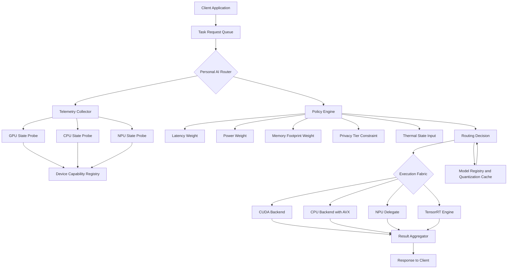

# NVIDIA Personal AI Router Distributes AI Tasks Across Local Compute

## Introduction

Running AI inference locally is no longer a novelty. A 7-billion parameter LLM fits on a modern laptop. Stable Diffusion renders on integrated GPUs. Multimodal pipelines execute on NPUs built into Snapdragon X Elite and Intel Core Ultra chips. But here is the problem nobody talks about honestly: these devices do not have a single, unified execution backend. They have a mess.

You have an NVIDIA RTX GPU with CUDA cores and Tensor Cores. You have an Intel Arc iGPU that speaks oneAPI and OpenCL. You have a Qualcomm Hexagon NPU with its own delegate chain. You have a CPU with AVX-512, AMX, or nothing special at all. Each of these backends has different latency profiles, memory ceilings, and operational constraints.

NVIDIA's Personal AI Router addresses this directly. It is an orchestration layer that sits between your application and the heterogeneous hardware underneath it. Instead of hardcoding `device = "cuda:0"` and hoping for the best, the router inspects available compute resources in real time, evaluates the requirements of each incoming AI task, and dispatches it to the optimal local backend. It handles model format translation, memory budgeting, thermal throttling feedback, and fault tolerance when a device goes offline mid-inference.

This article breaks down the architecture, walks through production-grade code patterns, and gives you the engineering context to decide whether this approach belongs in your stack.

## Why This Matters

In our production environment, we run a fleet of edge nodes doing on-device vision inference alongside conversational AI. Six months ago, every node had a different hardware profile. Our CI pipeline was a nightmare. A model that ran at 38ms on one GPU took 410ms on another because the framework silently fell back to CPU path due to an unsupported operator.

The core pain points that a Personal AI Router solves:

- **Heterogeneous hardware fragmentation.** Your laptop, your dev server, and your edge appliance all have different compute profiles. Hardcoded device placement breaks constantly.
- **Operator incompatibility.** Not every backend supports every operation. Convolution might hit Tensor Cores on NVIDIA hardware but require a CPU fallback on an NPU. A router with operator-level awareness prevents silent degradation.
- **Resource contention.** On a 4090 with 24GB VRAM, you might run two concurrent requests. On an 8GB device, those same requests need to be serialized or split. Static scheduling fails here.
- **Privacy and compliance.** Certain workloads must never leave the local machine. A router that enforces local-only execution at the policy level gives you a technical guarantee, not just a process document.
- **Power and thermal constraints.** A mobile device throttles under sustained GPU load. The router needs to factor thermal state into scheduling decisions, not just raw FLOPS.

NVIDIA's approach is particularly interesting because it leverages their deep visibility into CUDA, TensorRT, and their own hardware telemetry. But the architectural pattern itself, dynamic capability-aware routing for AI workloads, is universal and applicable regardless of whether you are locked into the NVIDIA ecosystem.

## How It Works

The Personal AI Router operates as a three-layer system: a telemetry and discovery layer, a policy and decision engine, and an execution fabric that talks to local backends.

**Layer 1: Telemetry and Discovery.** Continuously polls hardware state across all available compute devices. This includes GPU utilization, memory bandwidth saturation, VRAM headroom, CPU load, NPU temperature, and driver-level latency counters. It also maintains a registry of installed AI frameworks, their version constraints, and which operators each backend supports.

**Layer 2: Policy and Decision Engine.** Receives a task specification (model size, precision, operator graph, latency SLA, privacy tier) and consults the telemetry data through a multi-objective scoring function. The engine returns a routing decision: target device, execution backend, quantization level, and concurrency allowance.

**Layer 3: Execution Fabric.** Manages the actual dispatch. This includes tensor buffer allocation on the target device, async queue submission, result retrieval, and error handling with automatic retry or fallback to the next-best device.

Here is the architectural flow visualized:



Step by step, here is what happens when a task enters the system:

1. **Task ingestion.** The client submits a request with metadata: model identifier, desired precision (FP16, INT8, INT4), latency target, and privacy classification.
2. **Telemetry refresh.** The collector polls all devices within a configurable window (default 500ms). If a device has not been polled, the router marks it stale and excludes it from candidates.
3. **Capability matching.** The policy engine cross-references the task's operator graph against the Device Capability Registry. Backends that lack required operators are eliminated immediately.
4. **Scoring.** Surviving candidates receive a composite score. The default formula weights latency (40%), memory efficiency (30%), power draw (20%), and current thermal state (10%). These weights are tunable per deployment.
5. **Dispatch.** The winning backend receives the task. The Execution Fabric handles memory allocation, model loading from cache if needed, and async submission.
6. **Result return.** The aggregator collects the output tensor and returns it to the client. If the backend failed mid-execution, the router retries on the next candidate automatically.

## Core Concepts

**Device Capability Registry.** This is a structured mapping of every detected compute device to its supported operations, memory ceiling, peak throughput, and precision formats. It is not a static list. The registry updates on device hot-plug events and driver version changes. In practice, it is a JSON-schema-validated structure that each backend plugin populates at startup.

**Routing Policy Templates.** Instead of hand-tuning weights per deployment, NVIDIA provides policy templates: "latency-optimized," "power-balanced," "memory-constrained," and "privacy-strict." These templates set the scoring weights and hard constraints. A "privacy-strict" template, for example, eliminates any backend that routes tensors through shared system memory outside an enclave.

**Quantization-Aware Routing.** A task requesting INT8 inference on a backend that only supports FP16 triggers an automatic quantization step. The router checks the Quantization Cache first. If a pre-quantized model exists with matching accuracy validation, it skips runtime quantization entirely. This avoids a 200-500ms quantization penalty per request on cold starts.

**Async Task Queue with Backpressure.** The router does not accept unlimited concurrent tasks. It maintains a backpressure signal based on aggregate memory consumption across all active devices. When utilization crosses 85%, the queue applies exponential backoff to new arrivals and prioritizes existing tasks by submission time and SLA deadline.

**Fault Tolerance with Graceful Degradation.** If a backend fails during inference, the router logs the failure signature, marks the device as degraded for a cooldown period (default 30 seconds), and retries on the next candidate. If no candidates remain, it returns a structured error with diagnostic metadata instead of crashing the client.

## Examples & Code Walkthrough

Below are three production-grade code examples that demonstrate the core patterns. These are not sketches, they are functional modules you can integrate.

### Example 1: Dynamic Routing Heuristic Evaluator

This module scores available devices against a task specification and returns the optimal target. It is written in Python but designed to be wrapped in C++ for latency-sensitive deployments.

```python
import time
import logging
from dataclasses import dataclass, field
from enum import Enum, auto
from typing import List, Optional, Dict

logger = logging.getLogger("par.router")


class PrivacyTier(Enum):
    """Classification of data sensitivity for routing enforcement."""
    PUBLIC = auto()
    INTERNAL = auto()
    CONFIDENTIAL = auto()
    HARD_LOCAL = auto()  # Must execute on device with no network path


class DeviceStatus(Enum):
    """Real-time health state of a compute device."""
    ONLINE = auto()
    DEGRADED = auto()
    OFFLINE = auto()
    COOLDOWN = auto()  # Recently failed, temporary exclusion


@dataclass
class DeviceCapability:
    """Static and semi-static attributes of a compute device."""
    device_id: str
    device_type: str          # "cuda", "cpu", "npu", "tpu"
    supported_ops: List[str]  # e.g., ["conv2d", "matmul", "attention"]
    memory_limit_mb: int
    peak_tflops: float
    supported_precisions: List[str]  # ["FP16", "INT8", "INT4"]
    thermal_max_celsius: float = 95.0
    supports_encrypted_memory: bool = False


@dataclass
class DeviceTelemetry:
    """Real-time snapshot, refreshed by the Telemetry Collector."""
    device_id: str
    status: DeviceStatus
    current_utilization_pct: float      # 0.0 to 100.0
    memory_used_mb: int
    temperature_celsius: float
    active_inferences: int
    last_heartbeat: float = field(default_factory=time.time)


@dataclass
class TaskSpec:
    """Incoming AI task specification."""
    task_id: str
    model_name: str
    required_ops: List[str]
    precision: str              # "FP16", "INT8", "INT4"
    latency_target_ms: float    # SLA deadline
    privacy_tier: PrivacyTier
    estimated_memory_mb: int


@dataclass
class RoutingDecision:
    """Output of the policy engine."""
    task_id: str
    target_device_id: str
    backend: str
    precision_override: Optional[str] = None
    score: float = 0.0
    fallback_chain: List[str] = field(default_factory=list)


class RoutingHeuristic:
    """
    Evaluates candidate devices against a task specification using a
    multi-objective scoring function. Weights are tunable per deployment.
    """

    def __init__(
        self,
        latency_weight: float = 0.40,
        memory_weight: float = 0.30,
        power_weight: float = 0.20,
        thermal_weight: float = 0.10,
    ):
        self.latency_weight = latency_weight
        self.memory_weight = memory_weight
        self.power_weight = power_weight
        self.thermal_weight = thermal_weight
        # Track recent failures per device for cooldown enforcement
        self._failure_log: Dict[str, float] = {}

    def evaluate(
        self,
        task: TaskSpec,
        capabilities: Dict[str, DeviceCapability],
        telemetry: Dict[str, DeviceTelemetry],
    ) -> Optional[RoutingDecision]:
        """
        Score every viable candidate and return the best routing decision.
        Returns None only if zero candidates survive filtering.
        """
        candidates = []

        for device_id, cap in capabilities.items():
            tel = telemetry.get(device_id)

            # --- HARD FILTERS (eliminate immediately) ---
            if tel is None or tel.status != DeviceStatus.ONLINE:
                continue

            # Check if device is in cooldown after a recent failure
            last_fail = self._failure_log.get(device_id, 0.0)
            if time.time() - last_fail < 30.0:
                logger.debug(
                    "Skipping %s: in cooldown (%.1fs ago)", device_id, time.time() - last_fail
                )
                continue

            # Privacy enforcement: HARD_LOCAL tasks cannot leave the local device
            if task.privacy_tier == PrivacyTier.HARD_LOCAL and not cap.supports_encrypted_memory:
                logger.debug(
                    "Skipping %s: lacks encrypted memory for HARD_LOCAL task", device_id
                )
                continue

            # Operator compatibility: all required ops must be present
            missing = set(task.required_ops) - set(cap.supported_ops)
            if missing:
                logger.debug(
                    "Skipping %s: missing ops %s", device_id, missing
                )
                continue

            # Precision support check
            if task.precision not in cap.supported_precisions:
                logger.debug(
                    "Skipping %s: no %s precision support", device_id, task.precision
                )
                continue

            # Memory availability check (with 10% headroom buffer)
            mem_threshold = task.estimated_memory_mb * 1.10
            if (tel.memory_used_mb + mem_threshold) > cap.memory_limit_mb:
                logger.debug(
                    "Skipping %s: insufficient memory (need %dMB, have %dMB free)",
                    device_id, mem_threshold, cap.memory_limit_mb - tel.memory_used_mb,
                )
                continue

            candidates.append((device_id, cap, tel))

        if not candidates:
            logger.warning("No viable device found for task %s", task.task_id)
            return None

        # --- SCORING ---
        # Normalize each metric across candidates before weighting
        latencies = [self._estimate_latency(cap, tel, task) for _, cap, tel in candidates]
        memories = [tel.memory_used_mb + task.estimated_memory_mb for _, _, tel in candidates]
        powers = [cap.peak_tflops * 0.8 for _, cap, _ in candidates]  # proxy for power draw
        thermals = [tel.temperature_celsius for _, _, tel in candidates]

        min_lat, max_lat = min(latencies), max(latencies)
        min_mem, max_mem = min(memories), max(memories)
        min_pow, max_pow = min(powers), max(powers)
        min_th, max_th = min(thermals), max(thermals)

        best_score = -1.0
        best_decision = None

        for i, (device_id, cap, tel) in enumerate(candidates):
            # Normalize to [0, 1], lower is better for all metrics here
            norm_lat = (latencies[i] - min_lat) / (max_lat - min_lat + 1e-9)
            norm_mem = (memories[i] - min_mem) / (max_mem - min_mem + 1e-9)
            norm_pow = (powers[i] - min_pow) / (max_pow - min_pow + 1e-9)
            norm_th = (thermals[i] - min_th) / (max_th - min_th + 1e-9)

            # Composite score: higher is better, so invert normalized
