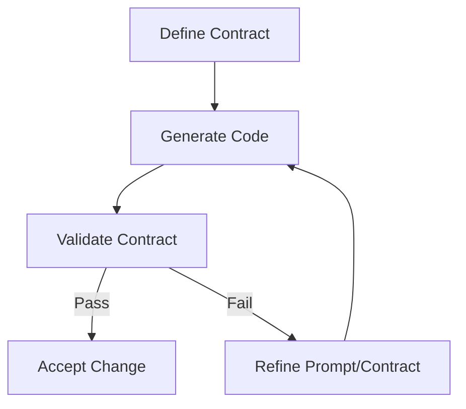

# One Design Review Skill for Claude Code, Codex, and agy

## Introduction
When AI assistants generate code, the output often looks correct at a glance but can hide subtle contract violations—missing null checks, wrong return types, or unintended side effects. The skill that catches these issues early is a **contract‑first design review**: you define the expected interface and behavior before you accept the generated snippet, then verify the code against that contract.

## Why This Matters
In production systems a single mismatched assumption can cascade into runtime failures, data corruption, or security gaps. By treating the AI as a code‑generation step that must satisfy a pre‑agreed contract, you turn an opaque black box into a testable component. This reduces rework, surfaces misunderstandings in the prompt early, and gives the team a concrete checklist for every AI‑generated change.

## How It Works
The review loop consists of four repeatable steps:

1. **Write a contract** – specify types, preconditions, postconditions, and any invariants in a language‑agnostic form (e.g., TypeScript interfaces, Python `typing.Protocol`, or JSON Schema).  
2. **Generate code** – ask Claude Code, Codex, or agy to implement the contract.  
3. **Validate against the contract** – run static type checks, unit tests that exercise the pre/postconditions, and optionally property‑based tests.  
4. **Feedback loop** – if validation fails, refine the prompt or the contract and repeat.



### Step‑by‑step explanation
- **Define Contract**: Capture what the function must accept and what it must guarantee. For a payment‑processing helper this could be:  
  - Input: `amount > 0 && currency in SUPPORTED`  
  - Output: `transactionId` is a non‑empty string, `status` is either `approved` or `declined`.  
- **Generate Code**: Provide the contract as part of the prompt (e.g., “Implement a function that satisfies the following TypeScript interface …”).  
- **Validate Contract**: Run the project’s type checker (`tsc`, `mypy`) and a test suite that asserts the pre‑ and postconditions. If you use a library like `zod` or `pydantic`, you can assert the contract at runtime in tests.  
- **Feedback Loop**: When a test fails, examine the error, adjust the prompt (add more detail about error handling, or clarify the expected return shape), and regenerate.

## Core Concepts
- **Contract**: A formal description of inputs, outputs, and obligations. It can be static (types) or dynamic (assertions).  
- **Precondition**: What must be true before the function runs.  
- **Postcondition**: What must be true after the function returns.  
- **Invariant**: A condition that holds throughout the execution (e.g., a lock is always released).  
- **Property‑based test**: Generates random inputs that satisfy the precondition and checks that the postcondition holds.

## Examples & Code Walkthrough
We’ll walk through a simple Python example: a function that calculates a discounted price.

### 1. Contract (as a `pydantic` model)
```python
from pydantic import BaseModel, validator, PositiveFloat

class DiscountContract(BaseModel):
    """Defines the expected behavior of apply_discount."""
    price: PositiveFloat
    discount: float  # expressed as a fraction, e.g., 0.2 for 20%

    @validator('discount')
    def discount_must_be_valid(cls, v):
        if not 0.0 <= v <= 1.0:
            raise ValueError('discount must be between 0 and 1')
        return v

    def expected_result(self) -> float:
        """Postcondition: result is price * (1 - discount)."""
        return round(self.price * (1 - self.discount), 2)
```

### 2. Prompt sent to the AI
```
Implement a function `apply_discount(price: float, discount: float) -> float`
that satisfies the contract defined by the DiscountContract model.
The function must raise ValueError for invalid inputs and return the
discounted price rounded to two decimal places.
```

### 3. Generated code (example output from Codex)
```python
def apply_discount(price: float, discount: float) -> float:
    if price <= 0:
        raise ValueError('price must be positive')
    if not (0.0 <= discount <= 1.0):
        raise ValueError('discount must be between 0 and 1')
    return round(price * (1.0 - discount), 2)
```

### 4. Validation
```python
from hypothesis import given, strategies as st

# Property‑based test that the generated function respects the contract
@given(
    price=st.floats(min_value=0.0001, max_value=10_000),
    discount=st.floats(min_value=0.0, max_value=1.0)
)
def test_apply_discount_matches_contract(price, discount):
    # Precondition check
    assert price > 0
    assert 0.0 <= discount <= 1.0

    result = apply_discount(price, discount)
    expected = DiscountContract(price=price, discount=discount).expected_result()
    assert result == expected, f'got {result}, expected {expected}'
```

If the AI had omitted the `price <= 0` check, the property‑based test would still pass for the sampled range but could fail when a negative price is supplied in production. Adding a test that explicitly checks for negative price would catch the omission, prompting a refinement of the prompt (“also validate that price is strictly positive”).

## Best Practices
- **Keep contracts small and focused** – a contract that tries to specify everything becomes brittle; target the critical invariants.  
- **Express contracts in the host language** – using TypeScript interfaces, Python `Protocol`, or Schema libraries lets the type checker do part of the work for you.  
- **Automate the validation step** – hook contract tests into your CI pipeline so every AI‑generated PR runs them automatically.  
- **Document the prompt alongside the contract** – store the exact prompt used to generate the snippet; this makes regression analysis easier when the model updates.  
- **Version contracts** – if the contract evolves, bump a version number and keep the old version for backward‑compatibility checks.

## Common Mistakes & Anti-Patterns
| Mistake | Why it hurts | Fix |
|---------|--------------|-----|
| **Vague contract** – e.g., “returns a number” without range or precision | Generated code may compile but produce nonsensical values in edge cases | Add explicit bounds, precision, or enum constraints in the contract |
| **Over‑specifying** – dictating implementation details like loop constructs | The AI may ignore the prompt or produce overly complex code that is hard to maintain | Focus on *what* the function must do, not *how* it does it |
| **Ignoring side effects** – contract mentions only return value but the function mutates globals or performs I/O | Hidden side effects cause integration bugs and break parallelism | Extend the contract to include effects (e.g., “must not write to disk”, or “must acquire lock X”) |
| **Skipping property‑based tests** – relying only on a few unit examples | Random inputs can expose contract violations that examples miss | Add a property‑based test that generates inputs satisfying the precondition and asserts the postcondition |

## Performance Considerations
- **Static contract checks** (type annotations) add zero runtime cost; they are evaluated at compile‑time or during type‑checking passes.  
- **Runtime assertions** (e.g., `pydantic` validation) introduce modest overhead—typically microseconds per call—acceptable for validation‑heavy paths but may be stripped in production builds via feature flags.  
- **Property‑based tests** increase test suite runtime; keep them in the CI pipeline rather than on every developer hot‑reload to avoid slowing the inner loop.  
- If latency is critical, consider **contract‑only mode** in production: keep the contracts for documentation and testing, but disable runtime validation after a confidence threshold is met.

## Real-World Usage
- **Netflix** uses JSON Schema contracts for service‑generated stubs; their CI pipeline validates that any AI‑produced scaffolding adheres to the schema before merging.  
- **Uber** employs Pact‑style consumer‑driven contracts for micro‑service code generated by internal LLMs, ensuring that breaking changes are caught early.  
- **Cloudflare** stores OpenAPI specifications as the source of truth; their code‑gen bot must pass a conformance test suite against the spec before any PR is accepted.

## Frequently Asked Questions (FAQ)

**Q: Do I need to write a contract for every tiny helper function?**  
A: Not necessarily. Focus on functions that cross module boundaries, handle external data, or have complex error contracts. Simple pure utilities can rely on existing type systems.

**Q: What if the AI keeps ignoring part of the contract?**  
A: Refine the prompt: restate the missing requirement in different words, add a concrete example, or ask the model to “list the steps it will take to satisfy the contract” before generating code.

**Q: Can I use this approach with languages that lack strong type systems?**  
A: Yes. Write the contract as a set of assertions or use a library like `contracts.py` or JavaScript’s `ajv` to validate at runtime. The principle stays the same: define expectations, then verify.

**Q: How does this differ from traditional code review?**  
A: Traditional review looks for readability, style, and logic errors. Contract‑first review adds an objective, automated check that the generated code fulfills a formally specified interface, reducing reliance on subjective judgment.

**Q: Is there a risk of over‑testing and slowing down development?**  
A: Keep the contract lightweight and focus on the most failure‑prone aspects. Use property‑based testing for invariants that are cheap to check; reserve exhaustive scenarios for nightly runs.

## Conclusion
A contract‑first design review turns AI code generation from a gamble into a verifiable step. By writing a clear contract, generating code against it, and automatically validating the result, you catch mismatches early, reduce rework, and maintain a steady velocity even when leaning on LLMs like Claude Code, Codex, or agy. Apply this habit to any AI‑assisted workflow, and you’ll see fewer surprising bugs in production.
