# One month without AI

## Introduction

Last January, I turned off GitHub Copilot. I uninstalled the Cursor extension. I blocked `chat.openai.com` and `claude.ai` at the `/etc/hosts` level on my work machine. I told my team I was going dark on LLMs for thirty calendar days—production code, infrastructure, incident response, RFCs, the works.

People asked if I was having a breakdown. I wasn't. I was running a controlled experiment.

The industry has conflated token generation with software engineering. We measure "velocity" in lines of code accepted per minute, then act surprised when the resulting system is a fragile ball of mud that nobody understands. I wanted to measure the actual cost of cognitive offloading: what happens to defect density, architectural coherence, and mean-time-to-resolution when the autocomplete crutch gets kicked away?

Spoiler: the bottleneck was never typing speed.

## Why This Matters

Right now, a significant portion of the industry is optimizing for the wrong metric. We optimize for *keystrokes saved*. We treat the "blank page" problem as the primary friction in software development. It isn't. The primary friction is *state space explosion*—holding the invariants of a distributed system in your head long enough to make a change that doesn't subtly break a payment reconciliation job three services away.

When an LLM writes your Kubernetes `Deployment` manifest, it doesn't know your `readinessProbe` timeout is shorter than your application's cold-start latency. It doesn't know your Rust service aborts the process on OOM instead of draining connections, causing the Go gateway upstream to exhaust its connection pool. It copies a pattern from a 2021 blog post that was wrong then and is dangerous now.

We are trading *comprehension* for *throughput*. That trade shows up in production at 3 AM. I ran this experiment to quantify exactly how bad the interest payments are on that technical debt.

## How It Works

The experiment wasn't "vibe coding" without tools. It was a rigid protocol enforced by git hooks and CI gates.

**Constraints:**
*   **Hard Ban:** No Copilot, Cursor, ChatGPT, Claude Code, Ollama, Perplexity, Phind. Zero LLM interaction for work tasks.
*   **Allowed:** Standard LSPs (`gopls`, `rust-analyzer`), static analysis (`clippy`, `go vet`, SonarQube), man pages, RFCs, source code, internal docs.
*   **Scope:** Primary monorepo (~200k LOC, Go/Rust/TypeScript), Terraform/Pulumi stacks, on-call rotation (two weeks), RFC authoring, interview loop (candidates could use AI; I could not).

**Metrics Tracked (Automated):**
*   `Δ Lead Time for Changes` (PR open → merge)
*   `Δ Cyclomatic Complexity` / `Cognitive Complexity` per new function
*   `Time-to-First-Compile` (TTC) on fresh feature branches
*   `Incident MTTR` during on-call weeks

```mermaid
flowchart TD
    subgraph "AI-Assisted Workflow (Baseline)"
        A1[Prompt: Generate Scaffold] --> B1[Accept Completion]
        B1 --> C1[Run Tests / Lint]
        C1 -->|Fail| D1[Prompt: Fix Error]
        D1 --> B1
        C1 -->|Pass| E1[Open PR]
        E1 --> F1[Review: Style & Syntax Focus]
        F1 --> G1[Merge]
    end

    subgraph "Manual Workflow (Experiment)"
        A2[Read Spec / Source] --> B2[Write Scaffold / Logic]
        B2 --> C2[Compile / Type Check]
        C2 -->|Fail| D2[Read Compiler Output / Source]
        D2 --> B2
        C2 -->|Pass| E2[Local Integration Test]
        E2 --> F2[Open PR + Design Doc Link]
        F2 --> G2[Review: Invariant & Contract Focus]
        G2 --> H2[Merge]
    end

    style A1 fill:#ffcccc,stroke:#333
    style B1 fill:#ffcccc,stroke:#333
    style A2 fill:#ccffcc,stroke:#333
    style B2 fill:#ccffcc,stroke:#333
    style G2 fill:#ffffcc,stroke:#333
```



The diagram above captures the fundamental loop shift. The AI workflow optimizes the inner loop (generate → fix → pass CI). The manual workflow forces the outer loop (read → understand → write → validate invariants) *before* CI runs. The "Design Doc Link" in the manual flow isn't bureaucracy; it's the artifact proving the author held the system state in their head.

## Core Concepts

Three concepts defined the month: **Scaffolding vs. Comprehension**, **Symptom Relief vs. Root Cause**, and **The LGTM Singularity**.

### Scaffolding vs. Comprehension
LLMs are excellent at verbose boilerplate: Kubernetes YAML, Dockerfile multi-stage builds, gRPC service stubs. They are terrible at *your* constraints. An LLM generates a `Deployment` with default probes. Your system requires `readinessProbe.initialDelaySeconds < livenessProbe.initialDelaySeconds` and `resources.limits.memory` set to 80% of the cgroup limit to avoid OOM kills before the probe fires. The LLM doesn't know this. If you don't know it either, you ship a crash loop.

### Symptom Relief vs. Root Cause
During an `OOMKilled` incident on a Rust payment processor, the AI workflow is: paste error → get "increase memory limit" → cargo-cult the limit up. The manual workflow is: `kubectl debug` → `gdb` / `pprof` → trace allocation → find the `Vec<u8>` buffering the entire 500MB payload → implement streaming → add `preStop` hook for connection draining. The first fixes the alert. The second fixes the architecture.

### The LGTM Singularity
PRs authored with AI assistance arrive with perfect style, passing tests, and *subtle logic inversions*. `if user.is_admin() || !feature_flag.enabled()` (AI) vs `&&` (Spec). Invented helper functions: `utils::calculate_tax_v2` (doesn't exist). The reviewer's job shifts from "does this compile?" to "does this *mean* what the ticket says?". That cognitive load is invisible in DORA metrics but very real in burnout.

## Examples & Code Walkthrough

I built two tools during the month to replace specific AI workflows. They are opinionated, typed, and compiled into our CI pipeline.

### 1. `scaffold`: Compile-Time Validated K8s Manifests (Rust)

Instead of asking a chatbot for YAML, I wrote a CLI that generates manifests from typed structs. The validation logic lives in the type system, not in a prompt.

**File: `src/templates/deployment.rs`**

```rust
use serde::Serialize;
use thiserror::Error;

/// Centralized error types for scaffold validation.
/// Prevents invalid manifests from ever hitting the API server.
#[derive(Error, Debug, PartialEq)]
pub enum ScaffoldError {
    #[error("readiness probe initialDelaySeconds must be < liveness probe initialDelaySeconds")]
    ProbeOrdering,
    #[error("memory limit ({limit}Mi) must be >= request ({request}Mi)")]
    MemoryLimitLtRequest { limit: i64, request: i64 },
    #[error("cpu limit ({limit}m) must be >= request ({request}m)")]
    CpuLimitLtRequest { limit: i64, request: i64 },
}

/// Strongly typed resource requirements. No stringly-typed "500Mi".
#[derive(Serialize, Debug, Clone, PartialEq)]
#[serde(rename_all = "camelCase")]
pub struct ResourceRequirements {
    pub limits_memory_mi: i64,
    pub requests_memory_mi: i64,
    pub limits_cpu_m: i64,      // millicores
    pub requests_cpu_m: i64,
}

/// Probe configuration. Forces explicitness: no defaults allowed.
#[derive(Serialize, Debug, Clone, PartialEq)]
#[serde(rename_all = "camelCase")]
pub struct ProbeSpec {
    pub path: String,
    pub port: i32,
    pub initial_delay_seconds: i32,
    pub period_seconds: i32,
    pub timeout_seconds: i32,
    pub failure_threshold: i32,
}

/// The Deployment Spec. All fields mandatory.
#[derive(Serialize, Debug)]
#[serde(rename_all = "camelCase")]
pub struct DeploymentSpec {
    pub name: String,
    pub namespace: String,
    pub image: String,
    pub replicas: i32,
    pub readiness_probe: ProbeSpec,
    pub liveness_probe: ProbeSpec,
    pub resources: ResourceRequirements,
    // ... env, volumes, affinity omitted for brevity
}

impl DeploymentSpec {
    /// Validation runs at *generation time*, not apply time.
    /// This catches the "timeout < startup" class of bugs locally.
    pub fn validate(&self) -> Result<(), ScaffoldError> {
        // Invariant: Readiness must fire before liveness kills the pod.
        if self.readiness_probe.initial_delay_seconds >= self.liveness_probe.initial_delay_seconds {
            return Err(ScaffoldError::ProbeOrdering);
        }

        // Invariant: Limits >= Requests (K8s requirement, often violated by AI).
        if self.resources.limits_memory_mi < self.resources.requests_memory_mi {
            return Err(ScaffoldError::MemoryLimitLtRequest {
                limit: self.resources.limits_memory_mi,
                request: self.resources.requests_memory_mi,
            });
        }
        if self.resources.limits_cpu_m < self.resources.requests_cpu_m {
            return Err(ScaffoldError::CpuLimitLtRequest {
                limit: self.resources.limits_cpu_m,
                request: self.resources.requests_cpu_m,
            });
        }
        Ok(())
    }

    /// Emits valid YAML. Serde handles the serialization; we handle the semantics.
    pub fn to_yaml(&self) -> Result<String, serde_yaml::Error> {
        self.validate()?; // Fail fast
        serde_yaml::to_string(self)
    }
}
```

**Usage:**
```bash
# scaffold generate deployment \
#   --name payment-processor \
#   --image registry.internal/payment-processor:v1.4.2 \
#   --replicas 3 \
#   --readiness-path /health/ready --readiness-delay 15 \
#   --liveness-path /health/live --liveness-delay 30 \
#   --memory-limit 1024 --memory-request 512 \
#   --cpu-limit 1000 --cpu-request 500
```
**Result:** 5 minutes to scaffold vs 30 seconds with Copilot. Zero `apiVersion` mismatches, zero probe ordering bugs, zero limit/request inversions in four weeks. The types *are* the documentation.

### 2. `semgrep-rules/ai-smell.yaml`: Detecting Hallucinated Patterns

We started seeing specific anti-patterns in PRs from teammates using Copilot. Blank imports in Go (often hallucinated side-effects), aliasing stdlib for no reason, generic `errors.Wrap(err, "failed to...")` context that adds zero signal. We codified these into a Semgrep rule set that runs in CI.

**File: `.github/semgrep-rules/ai-smell.yaml`**

```yaml
rules:
  - id: go-ai-smell-blank-import
    pattern-either:
      - pattern: import ( _ "..." )
      - pattern: import ( . "..." )
    message: "Blank/dot import detected. Often hallucinated by LLMs for side-effects. Verify necessity."
    severity: WARNING
    languages: [go]
    metadata:
      category: ai-smell
      likelihood: HIGH

  - id: go-ai-smell-stdlib-alias-unused
    pattern: import ( $ALIAS "fmt" )
    metavariable-regex:
      metavariable: $ALIAS
      regex: "^[a-z]+$" # e.g. import f "fmt"
    message: "Stdlib aliased without clear usage. Common LLM artifact. Remove alias or justify."
    severity: WARNING
    languages: [go]
    metadata:
      category: ai-smell

  - id: go-ai-smell-generic-error-wrap
    pattern: errors.Wrap($ERR, "failed to $X")
    metavariable-regex:
      metavariable: $X
      regex: ".*" # Matches any generic message
    message: "Generic error wrap context. LLMs love 'failed to do X'. Add specific context: operation, IDs, state."
    severity: WARNING
    languages: [go]
    metadata:
      category: ai-smell

  - id: rust-ai-smell-unwrap-expect-prod
    pattern-either:
      - pattern: $X.unwrap()
      - pattern: $X.expect($MSG)
    message: "Panic in production path. LLMs default to unwrap/expect. Use ? or proper error handling."
    severity: ERROR
    languages: [rust]
    metadata:
      category: ai-smell
```

This doesn't ban AI code. It forces the *author* to explain the pattern in the PR description if the rule triggers. "I aliased fmt because..." usually results in the alias being deleted.

### 3. The Fix That Required Reading Source: Graceful Shutdown (Go)

The Rust service OOM'ing caused the Go gateway to leak connections. The fix wasn't in the Rust code (though we added streaming there too). It was in the Go gateway's HTTP client config and the Kubernetes `preStop` hook.

**File: `internal/http/client.go`**

```go
package http

import (
	"context"
	"net"
	"net/http"
	"time"
)

// NewResilientClient returns an http.Client configured for graceful degradation.
// It respects context cancellation *and* implements connection lifecycle hooks
// to drain in-flight requests during pod termination (SIGTERM).
func NewResilientClient(dialTimeout, idleConnTimeout time.Duration) *http.Client {
	dialer := &net.Dialer{
		Timeout:   dialTimeout,
		KeepAlive: 30 * time.Second,
		// ControlFunc allows us to bind the socket to the pod's lifecycle
		// via SO_REUSEPORT or similar kernel tricks if needed, but here
		// we rely on the preStop hook draining the listener.
		Control: func(network, address string, c syscall.RawConn) error {
			// Placeholder for TCP_USER_TIMEOUT / SO_LINGER tuning
			// on Linux to ensure RST on hard kill vs FIN on graceful.
			return nil
		},
	}

	transport := &http.Transport{
		Proxy:                 http.ProxyFromEnvironment,
		DialContext:           dialer.DialContext,
		ForceAttemptHTTP2:     true,
		MaxIdleConns:          100,
		IdleConnTimeout:       idleConnTimeout,
		TLSHandshakeTimeout:   10 * time.Second,
		ExpectContinueTimeout: 1 *
