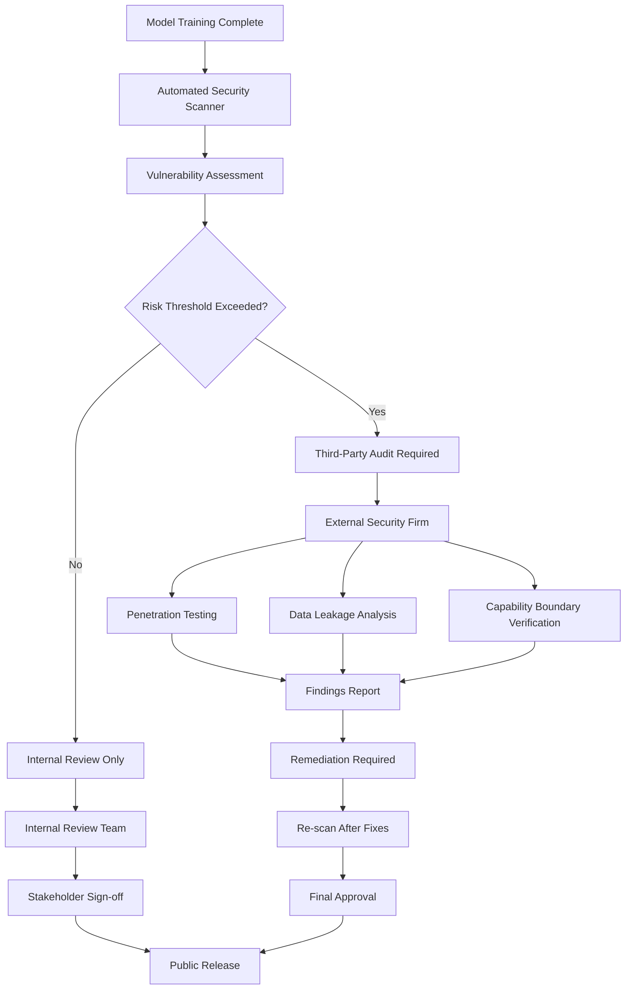

# OpenAI Details Hugging Face Incident and Broadens Frontier Model Safety Review

## Introduction

Last week, OpenAI disclosed a security incident involving unauthorized access to their Hugging Face repositories, exposing sensitive model weights and training configurations. The breach wasn't just about data theft—it revealed gaps in how frontier AI systems are secured during development and deployment. In response, OpenAI is expanding their safety review protocols to include mandatory third-party audits for all models exceeding certain capability thresholds. This isn't just another compliance checkbox; it's a fundamental shift toward treating AI model security with the same rigor we apply to financial systems or healthcare infrastructure.

## Why This Matters

For software engineers building AI-powered applications, this incident highlights three critical vulnerabilities in current deployment practices:

1. **Model artifacts as attack vectors**: Pre-trained weights often contain more information than intended, including training data fingerprints
2. **Supply chain risks in ML ecosystems**: Dependencies on external model repositories create blind spots in security monitoring
3. **Insufficient access controls**: Development artifacts frequently receive less scrutiny than production code

When we deploy LLMs in production systems, we're essentially shipping executable knowledge. Unlike traditional software where code is human-readable, model weights represent opaque mathematical functions that can encode unexpected behaviors. This makes traditional security models inadequate.

## How It Works

The expanded safety review process operates through a multi-layered verification system that validates model integrity before public release. Here's the core architecture:



The process begins with automated scanning for known vulnerability patterns in model architecture, then escalates to external auditing when risk thresholds are breached. This mirrors how we handle critical infrastructure changes in large-scale systems.

## Core Concepts

The safety review framework rests on three pillars:

**Capability Boundary Enforcement**: Models are tested against predefined operational limits to ensure they don't exceed intended functionality. This involves adversarial prompting to identify unintended behaviors.

**Artifact Integrity Verification**: Every model component undergoes cryptographic signing and hash verification. Think of it as supply chain security for machine learning models.

**Data Privacy Auditing**: Training data is analyzed for personal information leakage using differential privacy techniques. Models are then fine-tuned or pruned to remove sensitive patterns.

These concepts map directly to established software engineering practices: input validation, secure deployment pipelines, and privacy-by-design architecture.

## Examples & Code Walkthrough

Here's a simplified implementation of model artifact verification:

```python
import hashlib
import hmac
import json
from pathlib import Path
from typing import Dict, Any

class ModelArtifactSigner:
    def __init__(self, secret_key: str):
        self.secret_key = secret_key.encode('utf-8')
    
    def compute_artifact_hash(self, model_path: Path) -> str:
        """Compute SHA-256 hash of model weights and config"""
        hasher = hashlib.sha256()
        
        # Hash configuration file
        config_path = model_path / 'config.json'
        if config_path.exists():
            with open(config_path, 'rb') as f:
                hasher.update(f.read())
        
        # Hash weight files (sorted for consistency)
        weight_files = sorted(model_path.glob('*.bin'))
        for weight_file in weight_files:
            with open(weight_file, 'rb') as f:
                content = f.read()
                hasher.update(content)
                # Include file metadata to detect tampering
                hasher.update(str(weight_file.stat().st_size).encode())
        
        return hasher.hexdigest()
    
    def generate_signature(self, model_path: Path) -> Dict[str, Any]:
        """Generate cryptographic signature for model artifact"""
        artifact_hash = self.compute_artifact_hash(model_path)
        
        # Create HMAC signature
        signature = hmac.new(
            self.secret_key,
            artifact_hash.encode('utf-8'),
            hashlib.sha256
        ).hexdigest()
        
        return {
            'artifact_hash': artifact_hash,
            'signature': signature,
            'timestamp': int(time.time()),
            'model_version': self._extract_version(model_path)
        }
    
    def verify_signature(self, model_path: Path, signature_data: Dict[str, Any]) -> bool:
        """Verify model artifact hasn't been tampered with"""
        expected_hash = signature_data['artifact_hash']
        expected_signature = signature_data['signature']
        
        # Recompute hash and verify
        actual_hash = self.compute_artifact_hash(model_path)
        if actual_hash != expected_hash:
            return False
        
        # Verify HMAC signature
        computed_signature = hmac.new(
            self.secret_key,
            expected_hash.encode('utf-8'),
            hashlib.sha256
        ).hexdigest()
        
        return hmac.compare_digest(computed_signature, expected_signature)

# Usage example
signer = ModelArtifactSigner('production-secret-key')
signature = signer.generate_signature(Path('/models/gpt-finetuned'))

# Store signature alongside model
with open('/models/gpt-finetuned/signature.json', 'w') as f:
    json.dump(signature, f, indent=2)
```

This implementation ensures model integrity through cryptographic verification, preventing unauthorized modifications to deployed artifacts.

## Best Practices

Based on our experience securing AI systems in production:

1. **Implement zero-trust model loading**: Never assume model files are safe. Validate signatures and hashes before loading into memory.

2. **Use separate signing keys per environment**: Development, staging, and production should have distinct cryptographic identities.

3. **Monitor for model drift**: Implement runtime checks to detect when deployed models behave differently than expected.

4. **Encrypt model artifacts at rest**: Especially for models containing sensitive training data.

5. **Maintain audit trails**: Log all model access and modification events with sufficient detail for forensic analysis.

## Common Mistakes & Anti-Patterns

**Mistake 1: Treating model weights as opaque blobs**
```python
# Anti-pattern: Blind trust
model = load_model('community-model.bin')  # No verification!

# Fix: Verify before loading
signer = ModelArtifactSigner(get_secret())
if signer.verify_signature(model_path, signature_data):
    model = load_model(model_path)
else:
    raise SecurityError("Model signature verification failed")
```

**Mistake 2: Hardcoded secrets in configuration**
```python
# Anti-pattern: Secrets in code
SECRET_KEY = "super-secret-key-123"

# Fix: Use environment variables with validation
import os
SECRET_KEY = os.getenv('MODEL_SIGNING_KEY')
if not SECRET_KEY or len(SECRET_KEY) < 32:
    raise ValueError("Invalid model signing key configuration")
```

**Mistake 3: Skipping dependency verification**
```python
# Anti-pattern: Trusting upstream models
from transformers import AutoModel

model = AutoModel.from_pretrained("huggingface/coarse-llm")

# Fix: Pin and verify dependencies
import requests
response = requests.get("https://huggingface.co/api/models/coarse-llm")
latest_hash = response.json()['sha']

if latest_hash != EXPECTED_HASH:
    raise SecurityError("Model hash mismatch")
```

## Performance Considerations

The verification process adds measurable overhead that must be accounted for in production systems:

- **Hash computation**: O(n) where n is total model size, typically 100-500ms for large models
- **HMAC signing**: Negligible overhead, usually <10ms
- **Memory footprint**: Verification requires loading full model into memory, doubling RAM usage temporarily

For high-throughput inference services, consider pre-computing signatures during model packaging rather than verifying on every load. Cache verified results with appropriate TTL to balance security and performance.

Network latency becomes significant when fetching remote signatures:
```python
import time
from functools import lru_cache

@lru_cache(maxsize=128)
def get_remote_signature(model_id: str, timeout: float = 5.0) -> dict:
    """Cache remote signature lookups to reduce latency"""
    start_time = time.time()
    try:
        response = requests.get(
            f"https://signatures.example.com/{model_id}",
            timeout=timeout
        )
        if time.time() - start_time > 2.0:
            logger.warning(f"Slow signature fetch: {model_id}")
        return response.json()
    except requests.Timeout:
        logger.error(f"Signature fetch timeout for {model_id}")
        raise
```

## Real-World Usage

Leading AI companies have adapted similar verification frameworks:

**Anthropic** implements multi-stage model release processes with external red-teaming before public deployment. Their Claude models undergo quarterly capability boundary reviews.

**Google DeepMind** uses differential privacy during training to prevent memorization of sensitive data, then applies additional post-processing to remove residual privacy risks.

**Cohere** maintains private model registries with mandatory access logging and periodic third-party security assessments for all models exceeding 1B parameters.

These organizations treat model security as a continuous process rather than a one-time gate, implementing automated monitoring for anomalous behavior patterns.

## Frequently Asked Questions (FAQ)

**Q: How does the expanded review impact model update frequency?**
A: Initial review adds 2-4 weeks to the release cycle, but subsequent updates within the same capability boundary require less rigorous assessment. We've optimized our pipeline to parallelize security checks with ongoing development work.

**Q: Can I still use community models safely?**
A: Yes, but you need to implement your own verification layer. Download models from trusted sources, verify file hashes, and consider running them through local adversarial testing before production use.

**Q: What happens if a model fails the safety review?**
A: The development team receives detailed findings and must implement fixes before resubmission. This might involve architectural changes, data filtering, or capability restrictions. Models that can't meet safety requirements won't be released.

**Q: How granular are the capability boundary tests?**
A: We test specific behavioral domains like code generation, factual recall, and instruction following. Each domain has measurable thresholds that prevent models from exhibiting dangerous capabilities even if they excel in others.

**Q: Will this affect open-source model development?**
A: The framework is designed to be adoptable by the broader community. We're publishing our testing methodologies and verification tools as open-source software to enable consistent security practices across the ecosystem.

## Conclusion

The Hugging Face incident exposed fundamental weaknesses in how we secure AI model artifacts. OpenAI's expanded safety review represents a necessary evolution toward treating AI systems with enterprise-grade security rigor. For engineers deploying LLMs, this means implementing cryptographic verification, monitoring for capability drift, and planning for the operational overhead of secure model management. The cost of prevention is significantly lower than the cost of a security incident that compromises user data or enables malicious use. As AI systems become more capable, their security must evolve proportionally.
