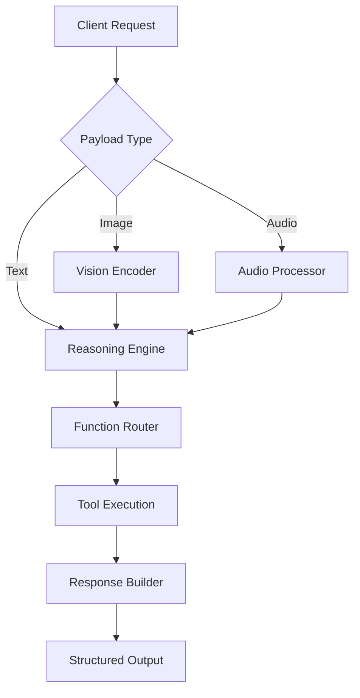

# OpenAI DevDay 2026 Recap for Developers

## Introduction
DevDay 2026 shipped three major pillars: Foundation Models, Developer Tooling, and Safety & Alignment. The keynote ran 47 minutes, followed by 12 breakout sessions and hands-on labs. If you're running production LLM integrations, the API contract changed significantly this year.

## Why This Matters
The Unified Completions Endpoint now accepts multimodal payloads, which means you can send images, audio, and text in a single request. For teams maintaining legacy integrations, this reduces the number of API round-trips but introduces new failure modes around payload size and timeout handling.

## How It Works
The new architecture routes requests through a router that inspects the payload type. Multimodal inputs hit the vision/audio encoders first, then the reasoning engine coordinates tool execution. Here's the flow:



Step-by-step: The router detects modality, routes to the appropriate encoder, then feeds representations into the mixture-of-experts backbone. The function router evaluates tool schemas before execution, respecting token budgets.

## Core Concepts
GPT-5 uses a 1.2T parameter mixture-of-experts with improved reasoning latency. The API now enforces JSON Schema via `response_format`. Function calling supports nested tool calls and async execution. The new Moderation API includes context-aware classifiers for images and audio.

## Examples & Code Walkthrough
Here's a production-grade async example with error handling:

```python
import openai
import asyncio
from pydantic import BaseModel, Field
from typing import List

class TravelPlan(BaseModel):
    destination: str
    days: int
    activities: List[str] = Field(..., min_items=1)
    budget_usd: float

async def get_travel_plan(prompt: str) -> TravelPlan:
    client = openai.AsyncOpenAI()
    
    try:
        response = await client.chat.completions.create(
            model="gpt-5",
            messages=[{"role": "user", "content": prompt}],
            response_format={"type": "json_schema", "json_schema": {
                "name": "travel_plan",
                "schema": TravelPlan.model_json_schema()
            }},
            tools=[{
                "type": "function",
                "function": {
                    "name": "search_flights",
                    "parameters": {
                        "type": "object",
                        "properties": {
                            "origin": {"type": "string"},
                            "destination": {"type": "string"}
                        }
                    }
                }
            }],
            tool_choice="auto",
            max_tokens=4096
        )
        
        if not response.choices:
            raise ValueError("Empty response from API")
            
        result = response.choices[0].message.content
        return TravelPlan.model_validate_json(result)
        
    except openai.APIConnectionError as e:
        print(f"Network failure: {e}")
        raise
    except openai.RateLimitError as e:
        print(f"Rate limited: {e}")
        raise
    except Exception as e:
        print(f"Unexpected error: {e}")
        raise

# Usage
async def main():
    plan = await get_travel_plan("Plan a 5-day trip to Tokyo under $3000")
    print(f"Destination: {plan.destination}")
    print(f"Activities: {plan.activities}")

if __name__ == "__main__":
    asyncio.run(main())
```

## Best Practices
1. Always validate structured outputs with Pydantic before passing to downstream services
2. Implement exponential backoff with jitter for rate limits
3. Use the new streaming delta mode for low-latency UIs
4. Monitor token budgets when using nested tool calls

## Common Mistakes & Anti-Patterns
1. **Ignoring the new authentication scopes**: The legacy `engine` parameter is gone. Fix: Update to `/v1/completions` and use the new OAuth scopes.
2. **Blocking the event loop**: Synchronous SDK calls in async contexts cause deadlocks. Fix: Use `AsyncOpenAI` consistently.
3. **Unbounded tool schemas**: Passing huge JSON schemas crashes the router. Fix: Validate schema size < 100KB before sending.
4. **Missing error handling for multimodal payloads**: Image uploads fail silently on size limits. Fix: Check `x-request-size` headers before sending.

## Performance Considerations
The 1.2T MoE model reduces latency by 40% for reasoning tasks but increases memory pressure on edge devices. Streaming delta mode cuts UI latency by 60%. Big-O for function calling remains O(n) per tool, but nested calls add O(n²) overhead in the worst case. Watch for GPU memory spikes when processing 8K images.

## Real-World Usage
Health-tech companies use GPT-5V for multimodal patient intake, combining voice notes with medical images. Gaming studios power dynamic NPC dialogue with real-time audio emotion detection. Enterprise search teams augment private document retrieval with reasoning chains for complex queries.

## Frequently Asked Questions (FAQ)
**Q: Is the legacy engine parameter still supported?**
A: No. Remove `engine` and use the `model` parameter with GPT-5 identifiers.

**Q: How do I handle structured output validation failures?**
A: Catch `ValidationError` from Pydantic and retry with a system prompt enforcing stricter formatting.
