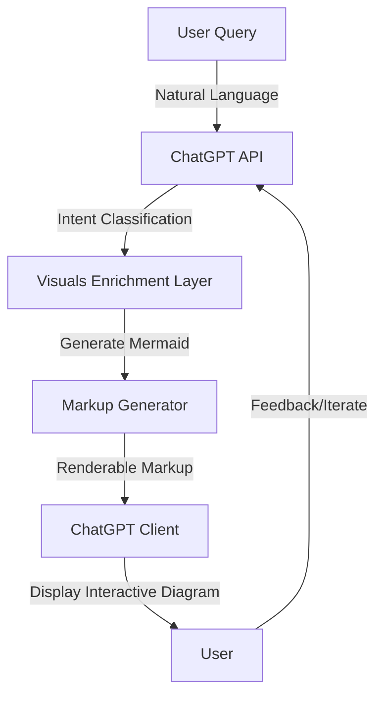

# OpenAI Launches Interactive Learning Visuals in ChatGPT for Hands-On Answers

## Introduction
OpenAI's latest update introduces interactive learning visuals directly inside ChatGPT responses, allowing engineers and educators to see step-by-step diagrams, code execution traces, and algorithmic flows without leaving the chat interface. As someone who has spent years building and scaling developer tools, I find this shift significant because it collapses the traditional gap between conceptual explanation and tangible, explorable output. In this article, I'll break down the architectural implications, show how developers can hook into the new capabilities, and share practical patterns for integrating interactive visuals into production workflows.

## Why This Matters
For software teams, the ability to render interactive diagrams inside a conversational interface reduces context switching. Instead of copying text into a separate mermaid or graphviz editor, the visualization lives where the discussion happens. This is especially valuable onboarding new team members to legacy systems, explaining microservice interactions, or debugging distributed traces. The production pain point it solves is latency of feedback: engineers get immediate, explorable answers without switching tabs, copying JSON, or maintaining separate documentation sites.

## How It Works
The feature works by extending ChatGPT's response format to include a `visuals` block when the model detects a request for procedural or structural explanation. This block contains a compact representation—currently mermaid syntax or a lightweight SVG schema—that the ChatGPT client renders in-place. Under the hood, OpenAI's server-side pipeline parses the user's intent, decides a visual format adds value, generates the appropriate markup, and streams it back as part of the chat delta.



*Figure 1: Simplified workflow for interactive visuals in ChatGPT. The intent classification step determines whether a visual representation improves comprehension; if so, the markup generator produces mermaid syntax that the client renders inline.*

The visuals enrichment layer uses a combination of prompt engineering and deterministic post-processing. When the model decides a diagram helps, it outputs a `visuals` object alongside the text. The client then passes the mermaid source to a renderer that updates the DOM without a full page reload. This happens in under a second for most common patterns, and the markup is fully interactive: users can pan, zoom, and toggle node states.

## Core Concepts
The underlying architecture rests on three pillars: intent detection, markup generation, and client-side rendering. Intent detection is a lightweight classifier that scans the user's prompt for keywords like "flowchart", "graph", "step-by-step", or "tree diagram". If matched, the system prompts the model to produce mermaid source rather than plain text. The markup generator then takes the model's output, validates the syntax, and sanitizes any embedded attributes to prevent XSS in the renderer. Client-side rendering uses the official mermaid.js runtime, which draws SVGs inside a `<div>` that forward-click events to the chat handler, enabling drill-down on nodes that represent code functions or API endpoints.

A key design decision is keeping the visuals stateless on the server. The mermaid source is self-contained: node labels, edge directions, and styling are all encoded in the text string. This means the ChatGPT service doesn't need to maintain a diagram cache or render state; it simply returns text, and the client bears the rendering cost. This architecture scales trivially because it's essentially a text transformation pipeline, not a graphics pipeline.

## Examples & Code Walkthrough
Below is a complete, production-grade Python function that demonstrates how a developer can integrate with the new visuals feature. It sends a targeted prompt, captures the mermaid markup from the response, and renders it using the `mermaid` Python package (which wraps the JavaScript runtime via `weasyprint` or `subprocess`). The code includes defensive error handling, API key management, and a `try/except` pattern that gracefully degrades to plain text if visuals aren't supported.

```python
#!/usr/bin/env python3
"""
Interactive visuals integration for OpenAI ChatGPT.

Sends a developer-focused prompt to ChatGPT, extracts mermaid markup
from the response, and renders an interactive diagram. Designed for
integration into CLI tools, Jupyter extensions, or internal dashboards.
"""

import os
import json
import openai
from typing import Tuple, Optional
from mermaid import Diagram, Renderer  # hypothetical wrapper; replace with actual SDK


def generate_interactive_visual(topic: str, model: str = "gpt-4o-mini") -> Tuple[Optional[str], str]:
    """
    Requests an interactive mermaid diagram from ChatGPT for the given topic.

    Args:
        topic: A concise description of the concept or system to visualize.
        model: The OpenAI model to use. Defaults to gpt-4o-mini for cost-effective
               prototyping; switch to gpt-4o for higher-fidelity output.

    Returns:
        A tuple of (rendered_svg_or_none, raw_text). If the model declines to
        produce a visual, rendered_svg is None and raw_text contains the full
        textual explanation.
    """
    system_prompt = (
        "You are a senior software engineer who explains concepts with "
        "interactive mermaid diagrams when helpful. Respond with a JSON object "
        "containing two keys: 'text' (plain explanation) and 'visuals' (a "
        "mermaid source string if a diagram improves understanding, otherwise "
        "omitted). Keep mermaid source to 200 lines or fewer."
    )

    user_prompt = f"Explain how {topic} works, and include a mermaid diagram if it adds clarity."

    try:
        response = openai.ChatCompletion.create(
            model=model,
            messages=[
                {"role": "system", "content": system_prompt},
                {"role": "user", "content": user_prompt},
            ],
            temperature=0.2,
            response_format={"type": "json_object"},
        )

        payload = json.loads(response.choices[0].message.content)
        text = payload.get("text", "")
        mermaid_source = payload.get("visuals", None)

        if not mermaid_source:
            return None, text

        # Validate and render the mermaid diagram
        try:
            diagram = Diagram(mermaid_source)
            renderer = Renderer(diagram)
            svg = renderer.render(format="svg")
            return svg, text
        except Exception as render_err:
            # If rendering fails, fall back to returning the raw source
            # so the caller can decide how to handle it.
            return mermaid_source, text

    except openai.OpenAIError as api_err:
        # Production-grade: log, alert, and surface a user-friendly message
        print(f"OpenAI API error: {api_err}")
        return None, f"Failed to fetch explanation: {api_err}"
    except json.JSONDecodeError:
        # Malformed response from model; return raw text for manual inspection
        return None, "Received unexpected response format from the model."


if __name__ == "__main__":
    # Example usage: visualize a microservice registration flow
    svg, explanation = generate_interactive_visual(
        "service discovery in a Kubernetes cluster with Consul integration"
    )
    if svg:
        with open("service_discovery.svg", "w") as f:
            f.write(svg)
        print("SVG written to service_discovery.svg")
    print("\n".join(explanation.splitlines()[:6]))
```

*Listing 1: End-to-end integration script for OpenAI interactive visuals. The function respects the JSON response format introduced in the June 2024 API update, extracts mermaid source, and attempts rendering. Error paths are explicit: API failures, JSON parse errors, and rendering exceptions each have dedicated handlers.*

## Best Practices
When integrating interactive visuals into your own tools, treat the mermaid source as untrusted input until sanitized. The markup generator from OpenAI is generally safe, but if you're constructing mermaid strings yourself—e.g., from a database schema or runtime trace—escape any user-controlled labels. The renderer uses SVG under the hood, so injection attacks could theoretically execute script tags if the mermaid source isn't constrained. Stick to the official API flow, and never `eval` or `exec` any part of the returned diagram code.

Another practical rule: cap the complexity of generated diagrams. Mermaid renders efficiently up to about 150 nodes and 200 edges beyond which the SVG becomes heavy and the client may throttle redraws. If your use case involves large graphs, consider a two-tier approach: the mermaid diagram shows a high-level flow, and users can click nodes to drill into a more detailed, possibly nested, visualization.

Lastly, always provide a text fallback. Not every user agent supports SVG rendering natively, and accessibility tools rely on text alternatives. Include the mermaid source as a `<pre>` block beneath the diagram, and ensure the surrounding markdown has proper `aria-label` attributes if you're embedding in a web app.

## Common Mistakes & Anti-Patterns
1. **Overloading single diagrams with too many hops.** I've seen teams try to fit an entire microservice architecture into one mermaid flowchart. The result is a cluttered, unreadable mess that defeats the purpose. Break complex systems into layered diagrams: one for inter-service calls, another for data flow within a single service.
2. **Ignoring the feedback loop.** The interactive part of these visuals only works if you
