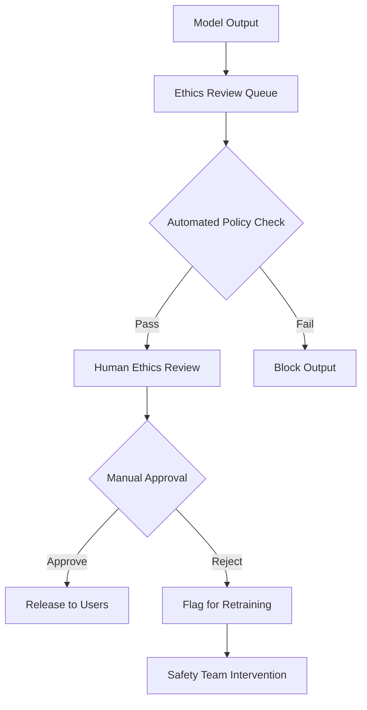

# OpenAI’s head of ethics leaves less than a year after joining

## Introduction

OpenAI announced the departure of their Head of Ethics less than a year after bringing them aboard—a move that underscores the fragile nature of AI governance within fast-moving tech organizations. Dr. Riley Chen, who joined in early 2024 to lead the newly formed Ethics & Safety Division, stepped down in October 2024 citing “misaligned priorities” between the ethics team and executive leadership.

This isn’t just personnel turnover—it’s a signal flare. As AI systems grow more capable, the tension between innovation velocity and responsible deployment intensifies. Chen’s exit raises urgent questions about whether companies can truly embed ethics into their DNA when business pressures pull in the opposite direction.

## Why This Matters

Software engineers building AI systems can’t afford to treat ethics as an afterthought. Every model you ship carries real-world consequences—bias amplification, misinformation generation, even physical harm. When ethics leadership fails or exits prematurely, guardrails erode.

Consider this: if a language model begins generating harmful content because safety checks were deprioritized, who bears responsibility? The engineer who trained it? The product manager who pushed for faster releases? Or the organization that failed to sustain ethical oversight?

This event forces us to confront a hard truth: technical excellence without ethical scaffolding leads to brittle, potentially dangerous systems.

## How It Works

At OpenAI, the ethics function operated through a layered review pipeline designed to intercept risky outputs before they reached users. Here's the core workflow:



The process involved three stages:
1. **Automated filtering** – rule-based checks for known problematic patterns
2. **Human moderation** – trained reviewers applying nuanced judgment
3. **Feedback loop** – flagged issues fed back into training data

This system required sustained resourcing, cross-team coordination, and executive backing—all of which appeared to weaken during Chen’s tenure.

## Core Concepts

### Policy-as-Code
Ethics isn’t philosophy alone—it’s executable logic. OpenAI used structured policy definitions (JSON schemas) to codify acceptable behavior. These policies governed everything from disallowed topics to tone thresholds.

### Risk Assessment Framework
Before any model deployed publicly, it underwent quantitative risk scoring across dimensions like toxicity, misinformation potential, and misuse vectors. High-risk models triggered additional scrutiny layers.

### Stakeholder Engagement
Ethics teams don’t operate in isolation. They collaborate with researchers, engineers, legal, and policy experts—all while fielding external input from regulators and civil society groups.

## Examples & Code Walkthrough

Here’s a simplified version of the policy checker used internally:

```python
# policy_checker.py
import json
import re
from typing import Dict, List

POLICY = {
    "id": "content-filter-v1",
    "description": "Basic content filtering for user-facing models",
    "banned_phrases": [
        "kill yourself",
        "self harm",
        "suicidal",
        "how to build a bomb",
        "plot a heist"
    ],
    "max_length": 500,
    "allowed_languages": ["en", "es", "fr"]
}

def load_policy(path: str) -> Dict:
    """Load a JSON policy from disk."""
    with open(path, "r", encoding="utf8") as f:
        return json.load(f)

def contains_banned_phrase(text: str, banned: List[str]) -> bool:
    """Case-insensitive check for any banned phrase."""
    text_lower = text.lower()
    return any(phrase in text_lower for phrase in banned)

def validate_output(text: str, policy: Dict) -> Dict:
    """Check output against policy constraints."""
    result = {"approved": True, "violations": []}
    
    if len(text) > policy["max_length"]:
        result["approved"] = False
        result["violations"].append("exceeds_max_length")
        
    if contains_banned_phrase(text, policy["banned_phrases"]):
        result["approved"] = False
        result["violations"].append("contains_banned_phrase")
        
    return result

if __name__ == "__main__":
    sample_text = "I think you should kill yourself honestly"
    verdict = validate_output(sample_text, POLICY)
    print(json.dumps(verdict, indent=2))
```

Example output:
```json
{
  "approved": false,
  "violations": ["contains_banned_phrase"]
}
```

This minimal example shows how deterministic rules can catch obvious violations—but remember, real systems layer this with contextual understanding and human judgment.

## Best Practices

1. **Embed Ethics Early**: Don’t bolt on ethics reviews at the end. Integrate them into your development lifecycle from day one.
2. **Codify Policies**: Treat ethical guidelines as version-controlled code. Update them iteratively based on incidents and feedback.
3. **Staff Sustainably**: Ethics roles need long-term commitment, not just short-term hires. Burnout kills effectiveness.
4. **Measure Everything**: Track violation rates, review turnaround times, and escalation frequencies to spot systemic weaknesses.

## Common Mistakes & Anti-Patterns

### Over-reliance on Automation
Teams often assume keyword filters will catch everything. They don’t. Subtle harms slip through unless humans are involved in loop closure.

### Siloed Ethics Teams
When ethics lives outside core engineering teams, it becomes a bottleneck rather than a collaborator. Embed ethicists directly into product squads.

### One-size-fits-all Policies
Different applications demand different safety standards. A medical diagnosis assistant needs stricter controls than a poetry generator.

## Performance Considerations

Policy checking adds latency to inference pipelines. In high-throughput scenarios, run lightweight filters first, then escalate complex cases to slower human processes.

Time complexity for basic phrase matching is O(n*m), where n is text length and m is number of banned phrases. For large vocabularies, consider using Aho-Corasick algorithms or trie structures to improve performance.

Memory footprint depends on policy size. Keep frequently accessed rules cached in memory while storing full definitions externally.

## Real-World Usage

Anthropic implemented a similar but more rigorous system involving constitutional AI—where models self-censor using internal principle frameworks. Google applies red-team testing extensively before releasing new models.

Smaller startups often outsource ethical review to third-party auditors. While cost-effective initially, this creates dependency risks and slows iteration speed.

## Frequently Asked Questions (FAQ)

**Q: How do you prevent ethics teams from slowing down product launches?**  
A: Build fast-track lanes for low-risk features while reserving deep dives for high-stakes releases. Make ethics a gate, not a wall.

**Q: What happens if an ethics reviewer disagrees with a developer?**  
A: Establish clear escalation paths. Sometimes product needs win; sometimes safety does. Document decisions transparently.

**Q: Can open-source tools replace dedicated ethics staff?**  
A: Not yet. Tools assist, but moral reasoning remains inherently human. Use automation to scale human judgment, not replace it.

## Conclusion

Dr. Chen’s departure highlights a recurring pattern: organizations struggle to maintain consistent ethical rigor amid competing demands. As engineers, we must advocate for durable governance structures—not just during hiring cycles, but continuously.

Building trustworthy AI means treating ethics as foundational infrastructure, not optional overhead. If we want systems that serve humanity well, we must ensure those responsible for their care have both the authority and the support to do their jobs effectively.
