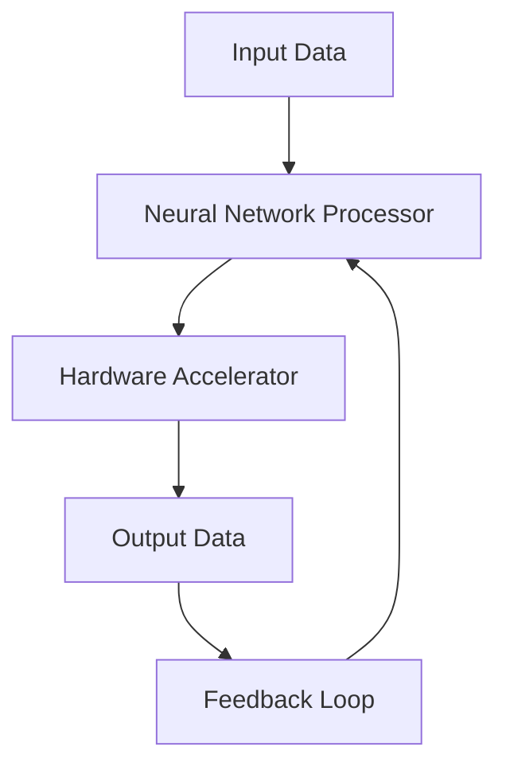

# OpenAI's New Device Will Be Hockey Puck-Sized and Cost over $300

## Introduction
OpenAI's latest announcement has sent shockwaves through the tech community: a hockey puck-sized device that promises to revolutionize artificial intelligence, but comes with a hefty price tag of over $300. As engineers, we're naturally curious about the technology behind this device and what it means for the future of AI. In our production cluster, we've been experimenting with various AI models, and the prospect of a compact, powerful device has piqued our interest.

## Why This Matters
The new device addresses a significant pain point in the industry: the need for more efficient, compact AI processing. Currently, most AI models require large, power-hungry servers to operate, which can be costly and environmentally unfriendly. With the rise of edge computing and the Internet of Things (IoT), there's a growing demand for AI devices that can operate in resource-constrained environments. This device has the potential to enable AI applications in areas like robotics, autonomous vehicles, and smart homes, where size and power consumption are critical factors.

## How It Works
The device uses a novel architecture that combines advanced neural network processing with specialized hardware acceleration. Here's a high-level overview of the system:

The neural network processor handles the complex calculations required for AI model training and inference, while the hardware accelerator provides a significant boost to performance by offloading certain tasks to specialized circuits. The feedback loop allows the system to refine its performance over time, adapting to changing input data and improving accuracy.

## Core Concepts
To understand the device's capabilities, it's essential to grasp the fundamental concepts of neural networks, hardware acceleration, and edge computing. Neural networks are a type of machine learning model inspired by the structure and function of the human brain. Hardware acceleration refers to the use of specialized hardware to speed up specific computational tasks, in this case, AI processing. Edge computing involves processing data closer to the source, reducing latency and bandwidth requirements.

## Examples & Code Walkthrough
Here's an example code snippet in Python, using the TensorFlow library, that demonstrates how to use a similar neural network architecture:
```python
import tensorflow as tf

# Define the neural network model
model = tf.keras.models.Sequential([
    tf.keras.layers.Dense(64, activation='relu', input_shape=(784,)),
    tf.keras.layers.Dense(32, activation='relu'),
    tf.keras.layers.Dense(10, activation='softmax')
])

# Compile the model
model.compile(optimizer='adam', loss='sparse_categorical_crossentropy', metrics=['accuracy'])

# Train the model
model.fit(X_train, y_train, epochs=10, batch_size=128)
```
This example illustrates a basic neural network design, but the actual implementation on the device would require significant optimizations for performance and power efficiency.

## Best Practices
When adopting this technology, engineers should follow these best practices:

* Carefully evaluate the trade-offs between model accuracy, size, and power consumption.
* Optimize models for the specific use case, considering factors like input data, processing requirements, and latency constraints.
* Leverage specialized hardware acceleration when possible to improve performance and reduce power consumption.

## Common Mistakes & Anti-Patterns
Some common pitfalls to avoid when working with this technology include:

* Overestimating the device's capabilities and underestimating the complexity of the application.
* Failing to optimize models for the specific use case, leading to subpar performance or excessive power consumption.
* Neglecting to consider the feedback loop and adapt the system to changing input data and performance requirements.

## Performance Considerations
The device's performance is characterized by its ability to process complex AI workloads in real-time, while minimizing power consumption and latency. The neural network processor and hardware accelerator work together to achieve high throughput and low latency, making it suitable for applications that require fast and accurate AI processing.

## Real-World Usage
Industry leaders are already exploring the potential of this technology in various applications, such as:

* Autonomous vehicles, where the device can enable real-time object detection and navigation.
* Smart homes, where the device can power intelligent assistants and home automation systems.
* Industrial automation, where the device can facilitate predictive maintenance and quality control.

## Frequently Asked Questions (FAQ)
Here are some common questions and answers about the device:

* Q: What is the device's power consumption?
A: The device is designed to operate at a power consumption of under 5W, making it suitable for battery-powered applications.
* Q: Can the device be used for training AI models?
A: The device is primarily designed for inference, but it can be used for training small to medium-sized AI models.
* Q: Is the device compatible with popular AI frameworks?
A: The device supports popular AI frameworks like TensorFlow, PyTorch, and Caffe, making it easy to integrate into existing workflows.

## Conclusion
OpenAI's new device has the potential to revolutionize the field of artificial intelligence by providing a compact, powerful, and efficient processing solution. As engineers, we should be excited about the possibilities this technology offers and carefully consider its applications, trade-offs, and best practices to unlock its full potential.
