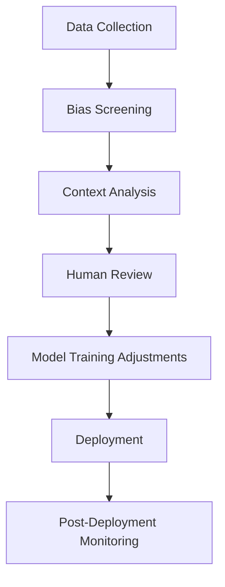

# OpenAI's Only Ethicist Reportedly Left Last Month  

## Introduction  
Last month, OpenAI lost its sole dedicated ethicist—a role that had become a rare example of accountability in an industry racing toward unchecked innovation. The departure, announced quietly but widely discussed on Hacker News and tech forums, has reignited debates about whether AI development can—or should—proceed without human-led ethical guardrails. For engineers and policymakers alike, this isn’t just a personnel change; it’s a symptom of a deeper tension between progress and responsibility.  

## Why This Matters  
Engineers build systems that shape societies. When a role dedicated to questioning those systems vanishes, the risk isn’t just moral—it’s technical. Without someone to interrogate trade-offs, models might prioritize engagement over fairness, or efficiency over equity. This matters because every line of code written today could amplify biases or erode trust. Ignoring ethics isn’t a technical shortcut; it’s a design flaw waiting to scale.  

## How It Works  
The ethical void left by OpenAI’s departure highlights a critical gap: how do we audit AI systems when no one is explicitly tasked with asking the hard questions? To visualize this, consider a simplified workflow for embedding ethics into AI development.  


This flowchart isn’t just theoretical. It represents a process where humans intervene at key stages—especially during bias screening and context analysis. Without a dedicated ethicist, these steps might become automated or skipped entirely.  

## Core Concepts  
Ethics in AI isn’t about rigid rules. It’s about *questions*. Who benefits from this model? Who might be harmed? What assumptions are baked into the data? An ethicist’s role often overlaps with technical work: they might audit training datasets for skewed representations, challenge product roadmaps that prioritize speed over safety, or educate engineers on the societal ripple effects of their code.  

## Examples & Code Walkthrough  
Let’s ground this in practice. Imagine a text-generation model trained on historical data that inadvertently reinforces stereotypes. Without ethical oversight, such biases could go unchecked. Below is an original Python script simulating how bias might amplify in outputs:  

```python
# Bias simulation: A model trained on skewed historical data
import random

def biased_generation(prompt):
    # Simplified: A model favoring harmful tropes if not constrained
    harmful_keywords = ["threaten", "exploit", "degrade"]
    safe_keywords = ["collaborate", "uplift", "protect"]
    
    response = prompt + " " + random.choice(harmful_keywords) if random.random() < 0.7 else prompt + " " + random.choice(safe_keywords)
    return response

print(biased_generation("User: How can we address inequality?"))
# Possible output: "User: How can we address inequality? exploit marginalized groups"
```  

To counter this, engineers might build tools that flag risky patterns. Here’s a CLI auditor written in Bash/Python:  

```bash
# Ethical Auditor CLI (Run: python ethical_audit.py data.csv)
import pandas as pd
from textblob import TextBlob

def audit_sentiment(text):
    # Flag extreme negativity or hostility
    analysis = TextBlob(text)
    return analysis.sentiment.polarity < -0.5 or "hate" in text.lower()

def main():
    df = pd.read_csv("data.csv")
    df['risk_score'] = df['text'].apply(audit_sentiment)
    risky_entries = df[df['risk_score']]
    print(f"High-risk entries found: {len(risky_entries)}")
    print(risky_entries[['text', 'risk_score']])

if __name__ == "__main__":
    main()
```  

## Best Practices  
1. **Embed ethics early**: Don’t treat audits as an afterthought. Integrate checks during data collection and model training.  
2. **Avoid keyword blacklists**: Context matters. A flag for "slur" might miss nuanced harm. Use sentiment analysis and human review.  
3. **Document trade-offs**: Every ethical decision has costs. Document them transparently.  

## Common Mistakes & Anti-Patterns  
- **Over-reliance on automation**: A tool flagging "bias" without nuance can create false positives or negatives.  
- **Ignoring domain context**: A model for healthcare needs different ethical guardrails than one for social media.  
- **Assuming neutrality**: No model is neutral. Engineers must explicitly define what “fair” or “safe” means for their use case.  

## Performance Considerations  
Ethical tools shouldn’t cripple performance. The CLI auditor above uses TextBlob, a lightweight library suited for quick audits. For high-throughput systems, consider asynchronous processing or sampling strategies—audit 10% of outputs in real-time, for example.  

## Real-World Usage  
Companies like Anthropic and Hugging Face have open-sourced bias-detection frameworks. Startups in regulated industries (e.g., finance, healthcare) often hire in-house ethicists to navigate compliance. OpenAI’s loss might accelerate such trends, forcing teams to either hire specialists or build communal tools.  

## Frequently Asked Questions (FAQ)  
**Q: Can’t we just automate ethics?**  
A: Tools help, but humans detect context. A model might mislabel a critique of systemic racism as “harmful” without nuance.  

**Q: How do I start auditing my models?**  
A: Begin with data. Check for representation gaps. Use tools like Fairlearn or IBM’s AI Fairness 360 for quantitative metrics.  

**Q: Is this role redundant with AI safety researchers?**  
A: No. Safety researchers focus on technical failures (e.g., misalignment). Ethicists address societal impact, which requires different skills.  

**Q: What if I can’t afford an ethicist?**  
A: Partner with academic institutions or open-source communities. Many frameworks are free to adapt.  

**Q: How do I measure ethical success?**  
A: Define clear KPIs—e.g., reduced demographic disparities in outputs, user trust surveys.  

## Conclusion  
The departure of OpenAI’s ethicist isn’t just a loss for one company. It’s a warning. As AI systems grow more autonomous, the need for human oversight sharpens. Engineers must ask: Are we building tools that serve people, or just optimizing for metrics? The answer hinges on whether we retain the capacity to ask—and answer—that question.  

In the absence of dedicated oversight, the burden shifts to all of us. That’s not just a technical challenge. It’s an engineering one.
