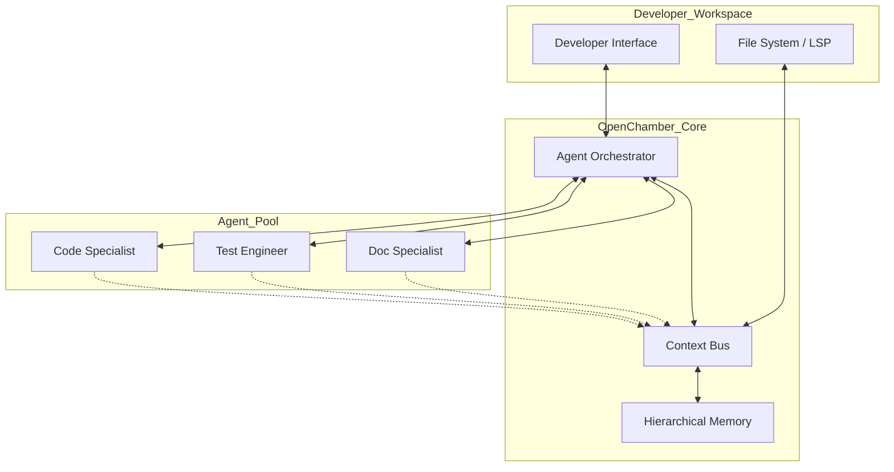

# OpenChamber: An Agentic Development Environment

## Introduction

We have spent the last two years treating Large Language Models (LLMs) as glorified autocomplete engines. We use them to write a single function, explain a cryptic error message, or refactor a small block of logic. But there is a fundamental mismatch between how LLMs work and how software is actually built. 

Software engineering isn't a series of isolated text transformations; it is a continuous, stateful, and highly contextual loop of intent, implementation, and verification. Current IDEs treat AI as a sidecar—a plugin that waits for a prompt. OpenChamber moves away from this "Chat-in-a-Sidebar" model toward an **Agentic Development Environment**. In this paradigm, the AI is not a tool you call; it is a specialized workforce living inside your workspace, possessing its own memory, specialized roles, and the ability to observe your file system in real-time.

## Why This Matters

The bottleneck in modern software engineering has shifted from "how to write syntax" to "how to manage complexity." As codebases grow, the cognitive load required to keep the entire dependency graph and architectural intent in mind becomes overwhelming.

Traditional AI assistants fail here because they suffer from "context blindness." They only know what you copy-paste into the chat box. If you change a type definition in `types.ts`, the assistant doesn't know until you tell it. This creates a "context gap" where the AI's suggestions become increasingly hallucinated as the project scales. 

OpenChamber solves this by turning the IDE into a living organism. By treating development as a multi-agent orchestration problem, we allow specialized agents to handle specific domains—testing, documentation, refactoring, or debugging—while sharing a unified, persistent memory of the entire project.

## How It Works

OpenChamber operates via a decoupled architecture where the developer interface is merely one of many observers. The heart of the system is the **Agent Orchestration Layer**, which manages a pool of specialized agents.



The workflow follows a reactive pattern:
1.  **Observation**: A `ContextStreamProcessor` watches the file system and LSP (Language Server Protocol) events.
2.  **Broadcast**: When a change occurs (e.g., a function signature changes), the `ContextBus` broadcasts a semantic update.
3.  **Reasoning**: The `AgentOrchestrator` receives the update and decides which agents need to react.
4.  **Execution**: The `Test Agent` might automatically trigger a new test suite to verify the change, while the `Doc Agent` prepares an update for the README.

## Core Concepts

### The Context Bus
Unlike a standard event emitter, the Context Bus is "semantically aware." It doesn't just pass strings; it passes structured data containing the scope of the change, the affected dependency nodes, and the intent inferred from the diff.

### Hierarchical Memory
To prevent the "lost in the middle" problem common in long-context LLMs, OpenChamber uses a three-tier memory system:
*   **Episodic Memory**: A vector store of recent developer interactions and terminal outputs (Short-term).
*   **Semantic Memory**: A knowledge graph representing the actual relationships in your code (Long-term).
*   **Procedural Memory**: A record of how *you* specifically prefer to write code (e.g., "Always use functional components for React").

### Agent Specialization
Instead of one massive prompt trying to do everything, we use "Small Specialist Models." A "Test Agent" is prompted with strict constraints on testing frameworks and edge-case coverage, making it far more reliable than a general-purpose assistant.

## Examples & Code Walkthrough

Let's look at how the `AgentOrchestrator` manages the lifecycle of a specialized task. When you request a new feature, the orchestrator doesn't just "write code"; it spawns a session.

```python
class AgentSession:
    """Represents a single unit of work for a specific agent."""
    def __init__(self, agent_id: str, capabilities: list[str], bus: ContextBus):
        self.id = agent_id
        self.capabilities = capabilities
        self.bus = bus
        self.status = "idle"

    async def execute(self, task_spec: TaskSpec):
        self.status = "running"
        # The agent observes the bus to gather context before acting
        context = await self.bus.get_relevant_context(task_spec.scope)
        
        # Perform the actual reasoning/coding loop
        result = await self._run_reasoning_loop(task_spec, context)
        
        # Broadcast results back to the system
        await self.bus.publish(ContextEvent(
            type="TASK_COMPLETED",
            payload=result,
            origin=self.id
        ))
        self.status = "idle"

class AgentOrchestrator:
    async def spawn_agent(self, agent_type: str, task_spec: TaskSpec) -> AgentSession:
        # Mapping agent types to specific system prompts and model configurations
        config = self.registry.get_config(agent_type)
        
        agent = AgentSession(
            agent_id=uuid4(),
            capabilities=config.capabilities,
            bus=self.context_bus
        )
        
        # Register the agent so other agents know it's working on 'AuthModule'
        await self.context_bus.register_agent(agent.id, agent.capabilities)
        
        # Start execution in the background
        asyncio.create_task(agent.execute(task_spec))
        return agent
```

And here is how the `ContextStreamProcessor` handles a file change to ensure the agents aren't working on stale data:

```typescript
class ContextStreamProcessor {
    private graph: DependencyGraph;

    async onFileChanged(event: FileChangeEvent) {
        // 1. Update the semantic knowledge graph
        const delta = await this.analyzeSemanticDelta(event.filePath, event.diff);
        this.graph.update(event.filePath, delta);

        // 2. Identify "Blast Radius"
        // If I change a public interface, who is affected?
        const affectedFiles = this.graph.getDependents(event.filePath);

        // 3. Notify the Bus
        this.bus.emit({
            type: 'CONTEXT_UPDATE',
            payload: {
                file: event.filePath,
                impact: affectedFiles,
                delta: delta
            }
        });
    }
}
```

## Best Practices

*   **Define Clear Boundaries**: When configuring agents, give them strictly defined "toolsets." A `Test Agent` should have access to the terminal and test runners, but it should *never* have permission to push to `main`.
*   **Human-in-the-Loop (HITL) for Mutations**: Always configure the orchestrator to require human approval for any "write" operations that affect more than three files.
*   **Incremental Context**: Don't dump the whole codebase into the prompt. Use the Semantic Memory (Knowledge Graph) to only feed the agent the relevant nodes of the graph.

## Common Mistakes & Anti-Patterns

1.  **The "God Agent" Fallacy**: Trying to create one agent that can do everything. This leads to massive context windows, high latency, and high hallucination rates. Break tasks down into specialists.
2.  **Ignoring the "Blast Radius"**: Letting an agent modify a file without checking if that modification breaks a distant, seemingly unrelated module. Always use a dependency graph.
3.  **Over-reliance on Episodic Memory**: Relying solely on "what happened in the last 5 minutes" (chat history) instead of "how the code is structured" (semantic memory). This causes the agent to lose the architectural "big picture."

## Performance Considerations

The primary overhead in an agentic environment is **LLM Latency** and **Context Token Cost**. 

*   **Complexity Analysis**: The cost of context retrieval is $O(log N)$ when using a vector database for episodic memory, but the semantic graph traversal is $O(V + E)$ where $V$ is the number of files and $E$ is the number of dependencies.
*   **Optimization**: To mitigate latency, we implement **Speculative Execution**. If the `Code Agent` modifies a function, the `Test Agent` starts spinning up the test environment *before* the code is even saved to disk, anticipating the completion.

## Real-World Usage

While OpenChamber is a new paradigm, we see its precursors in advanced CI/CD pipelines where "auto-fix" bots attempt to resolve linting errors. However, the shift toward "Agentic IDEs" is being driven by high-velocity startups where the ratio of junior to senior engineers is increasing, requiring AI to act as a "force multiplier" that maintains architectural integrity through automated peer review and continuous context awareness.

## Frequently Asked Questions (FAQ)

**Q: Won't this make developers lazy?**
A: No. It shifts the developer's role from "writer" to "reviewer/architect." You spend less time typing boilerplate and more time validating the logic and design of the system.

**Q: How do you handle security/privacy with a persistent memory?**
A: Memory is stored locally or in a self-hosted vector database. The agents only receive the specific context needed for the current task, following the principle of least privilege.

**Q: What happens if two agents try to edit the same file?**
A: The Orchestrator manages a distributed lock on files. Agents must request a "write lock" via the Context Bus, ensuring sequential, conflict-free updates.

## Conclusion

The era of the "Chatbot IDE" is ending. We are moving toward environments where the development tool is an active participant in the engineering process. OpenChamber represents a move toward a world where the IDE understands not just the syntax you are typing, but the intent of your architecture and the consequences of your changes. For engineers, the goal is clear: stop fighting the tools and start orchestrating them.
