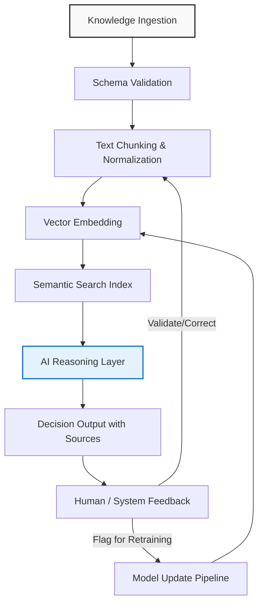

# Organizations need decision-grade knowledge. AI makes it urgent.

## Introduction
The explosion of generative models has turned every document, log, and Slack thread into potential fuel for automated reasoning. Yet the same models that can synthesize a answer in seconds also amplify the risk of acting on flawed or outdated information. Architects now face a stark reality: the value of knowledge is no longer measured by volume but by its ability to withstand scrutiny at the point of decision. When an AI-driven recommendation influences a loan approval, a supply‑chain reroute, or a security alert, the underlying knowledge must be decision‑grade—verifiable, contextual, and actionable. This article outlines a practical pattern for building that grade of knowledge into AI‑assisted workflows, grounded in real‑world engineering constraints.

## Why This Matters
Software teams are already feeling the pressure. A model that hallucinates a regulatory citation can trigger compliance fines; a recommendation engine that surfaces stale pricing data can erode margin; a chatbot that gives contradictory troubleshooting steps increases support cost and damages trust. The cost of poor knowledge quality is not abstract—it shows up in increased incident MTTR, audit findings, and lost customer confidence. At the same time, the latency tolerance for decisions is shrinking; businesses expect near‑real‑time insight from the same systems that store their historical record. Engineers need a way to couple the speed of LLMs with the rigor of traditional knowledge management without rebuilding the entire stack from scratch.

## How It Works
The core idea is a closed‑loop pipeline that treats knowledge as a first‑class asset, continuously validated, enriched, and fed back into the model. The loop consists of six stages:

1. **Ingestion** – raw artifacts (files, streams, API responses) are pulled into a staging area.
2. **Normalization** – content is cleaned, chunked, and tagged with provenance metadata.
3. **Embedding & Indexing** – normalized chunks are converted to vectors and stored in a searchable index.
4. **Retrieval & Reasoning** – a user query triggers semantic search; the top‑k passages are passed to a language model equipped with citation tracking.
5. **Decision Emission** – the model returns an answer paired with source references and a confidence score.
6. **Feedback & Governance** – human reviewers or downstream systems validate the output; corrections are logged and used to adjust the index or trigger model retraining.

The loop ensures that every decision is traceable to a known source, that errors are caught before they propagate, and that the knowledge base improves over time.



Each block represents a distinct responsibility that can be scaled independently. The feedback arrows close the loop, allowing the system to learn from its own mistakes while maintaining an auditable trail.

## Core Concepts
- **Provenance Metadata** – every chunk carries origin (system, timestamp, version) and a hash of the source blob. This enables precise rollback when a source is deprecated.
- **Confidence Scoring** – the reasoning layer computes a score based on vector similarity spread and internal model uncertainty; low scores trigger automatic escalation to a human reviewer.
- **Immutable Log** – feedback events are appended to an append‑only store (e.g., Kafka topic backed by compacted log) to support replay and audit.
- **Versioned Index** – the vector store is treated like a code repository; updates create a new version tag, allowing A/B testing of embedding models without downtime.
- **Decision Contract** – the output schema is strictly defined (answer text, list of source IDs, confidence, optional actions). Downstream consumers validate against this contract before acting.

These concepts turn a naive RAG setup into a platform that satisfies both engineering rigor and business risk thresholds.

## Examples & Code Walkthrough
Below is a minimal but production‑oriented implementation using LangGraph for orchestration and LlamaIndex for vector storage. The example focuses on a customer‑support knowledge base where agents ask for troubleshooting steps.

```python
# knowledge_decision_loop.py
from typing import TypedDict, List, Optional
from langgraph.graph import StateGraph, END
from llama_index import VectorStoreIndex, Document
from llama_index.embeddings import HuggingFaceEmbedding
import hashlib
import json

# ---------- State Definition ----------
class AgentState(TypedDict):
    query: str
    chunks: List[Document]
    sources: List[str]
    answer: str
    confidence: float
    needs_review: bool

# ---------- Helper Functions ----------
def _hash_content(text: str) -> str:
    return hashlib.sha256(text.encode("utf-8")).hexdigest()

def ingest_and_normalize(raw_docs: List[str]) -> List[Document]:
    """Stage 1 & 2: validate schema, chunk, tag with provenance."""
    normalized: List[Document] = []
    for i, doc in enumerate(raw_docs):
        # Simple schema check: non‑empty string
        if not isinstance(doc, str) or not doc.strip():
            continue
        # Chunk by paragraphs (could be swapped for token‑based splitter)
        for para in doc.split("\n\n"):
            if not para.strip():
                continue
            meta = {
                "doc_id": f"doc_{i}",
                "chunk_hash": _hash_content(para),
                "source": "support_kb",
                "version": "v1.0",
            }
            normalized.append(Document(text=para, metadata=meta))
    return normalized

def build_index(docs: List[Document]) -> VectorStoreIndex:
    """Stage 3: embed and store."""
    embed_model = HuggingFaceEmbedding(model_name="BAAI/bge-small-en-v1.5")
    return VectorStoreIndex.from_documents(docs, embed_model=embed_model)

def retrieve(state: AgentState, index: VectorStoreIndex) -> AgentState:
    """Stage 4: semantic search."""
    retriever = index.as_retriever(similarity_top_k=5)
    nodes = retriever.retrieve(state["query"])
    state["chunks"] = [node.node for node in nodes]
    state["sources"] = [n.metadata.get("chunk_hash", "") for n in state["chunks"]]
    return state

def reason(state: AgentState) -> AgentState:
    """Stage 5: LLM reasoning with citation tracking."""
    # Placeholder for actual LLM call; in practice you would pass chunks as context.
    context = "\n\n".join([c.text for c in state["chunks"]])
    # Simulated answer generation
    answer = f"Based on the provided knowledge: {context[:200]}..."
    # Simple confidence: average similarity score (here we fake it)
    confidence = 0.85  # would come from retriever scores
    state["answer"] = answer
    state["confidence"] = confidence
    state["needs_review"] = confidence < 0.7
    return state

def feedback(state: AgentState) -> AgentState:
    """Stage 6: collect human or system feedback."""
    # In a real system this would push to a feedback topic; here we just log.
    if state["needs_review"]:
        print(f"[FLAG] Low confidence answer: {state['answer'][:50]}...")
    else:
        print(f"[OK] Answer accepted: {state['answer'][:50]}...")
    return state

# ---------- Graph Assembly ----------
def build_graph(index: VectorStoreIndex) -> StateGraph:
    workflow = StateGraph(AgentState)

    workflow.add_node("retrieve", lambda s: retrieve(s, index))
    workflow.add_node("reason", reason)
    workflow.add_node("feedback", feedback)

    workflow.set_entry_point("retrieve")
    workflow.add_edge("retrieve", "reason")
    workflow.add_edge("reason", "feedback")
    workflow.add_edge("feedback", END)

    return workflow.compile()

# ---------- Example Usage ----------
if __name__ == "__main__":
    raw = [
        "If the router shows amber light, check the power cable first.\n\n"
        "Then verify that the ISP link is up by pinging 8.8.8.8.",
        "For login failures, ensure the LDAP service is reachable on port 389.",
    ]
    docs = ingest_and_normalize(raw)
    idx = build_index(docs)
    app = build_graph(idx)

    result = app.invoke({"query": "My router is blinking amber, what should I do?"})
    print(json.dumps(result, indent=2))
```

**What this code demonstrates**
- **Ingestion & Normalization** (`ingest_and_normalize`) validates each blob, splits into logical chunks, and attaches immutable provenance hashes.
- **Indexing** (`build_index`) creates a vector store with a chosen embedding model; swapping the model only requires re‑running this step.
- **Retrieval** pulls the top‑k chunks and records their hashes as sources.
- **Reasoning** simulates an LLM call; in production you would inject the retrieved text as context and ask the model to cite each chunk by ID.
- **Feedback** logs low‑confidence outcomes and can be hooked to a streaming platform for downstream retraining.
- The **StateGraph** makes the flow explicit, testable, and easy to monitor with tools like LangSmith or OpenTelemetry.

## Best Practices
1. **Treat provenance as first‑class data** – store hashes alongside vectors; never rely on file paths that may change.
2. **Version your index** – tag each rebuild with a semantic version (e.g., `kb-v2.3.0`). This enables rollback if a new embedding model introduces drift.
3. **Set confidence thresholds per domain** – a medical triage bot may need 0.95, while an internal FAQ can tolerate 0.80.
4. **Automate source validation** – run a nightly job that re‑hashes source blobs and flags any mismatches for review.
5. **Instrument every stage** – emit metrics for latency, hit‑rate, and feedback volume; alert on sudden drops in retrieval recall.
6. **Keep the decision contract immutable** – downstream services should validate the output schema before acting; otherwise a change in the LLM output format can cause silent failures.

## Common Mistakes & Anti-Patterns
| Mistake | Why it hurts | Fix |
|---------|--------------|-----|
| **Skipping provenance tracking** | You cannot verify whether an answer came from a retired document, leading to stale advice
