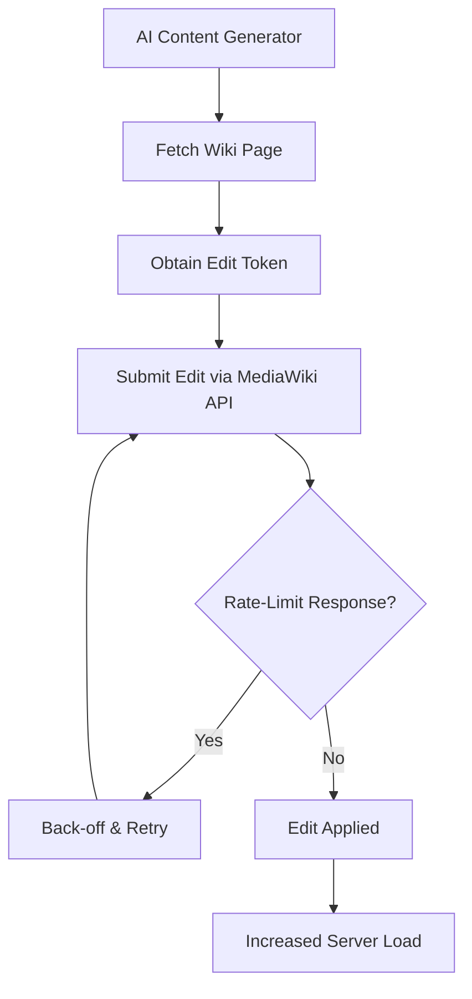

# OSRS Wiki and RuneLite are increasingly under strain from low-effort AI development

## Introduction
We have observed a noticeable rise in low‑effort AI‑generated contributions to the Old School RuneScape Wiki and to the RuneLite plugin repository. These contributions typically originate from scripts that call a large language model, produce boilerplate text or code, and push the result directly to the wiki’s editing API or as a pull request. The immediate effect is an increase in API traffic, more frequent rate‑limit responses, and a growing backlog of low‑quality edits that volunteer maintainers must review.

## Why This Matters
For engineers who rely on community‑run services, the strain translates into real operational costs:

* **Increased latency** – Legitimate editors experience longer wait times when the API is throttled.
* **Higher failure rates** – Bots that ignore back‑off rules trigger HTTP 429 responses, causing edit failures.
* **Maintenance overhead** – Volunteers spend time reverting or polishing AI‑generated noise instead of improving content.
* **Risk of abuse** – Open edit endpoints become attractive vectors for spam or misinformation if not guarded.

Understanding the mechanics behind this traffic helps us design defenses that protect both the service and its contributors.

## How It Works
The typical flow of a low‑effort AI contribution can be broken down into four stages:

1. **Content generation** – A script prompts an LLM with a short instruction (e.g., “write a summary of the X skill”) and receives a text blob.
2. **API preparation** – The script fetches the current revision of a wiki page, obtains a CSRF token, and builds an edit payload.
3. **Submission** – The payload is sent to the MediaWiki `action=edit` endpoint.
4. **Rate‑limit handling** – If the service replies with a `ratelimited` error, the script may either abort or retry after a fixed delay.

The following diagram visualizes this loop, including the back‑off decision point.



* **A–C** are lightweight, local steps.
* **D** is the network‑bound call that consumes server resources.
* **E** represents the service’s protection mechanism.
* **F** shows the typical retry behavior of a poorly written bot; a well‑behaved client would respect the `retry-after` header and cease after a few attempts.

## Core Concepts
Understanding the pieces that interact helps us reason about mitigation strategies.

| Concept | Role | Typical Failure Mode |
|---------|------|----------------------|
| **MediaWiki API** (`action=edit`) | Primary write interface for wiki edits. Requires a CSRF token and respects `ratelimited` responses. | Missing token → `badtoken` error; ignoring `ratelimited` → HTTP 429. |
| **Edit Token** | A per‑session cryptographic token that prevents CSRF. Obtained via `action=query&meta=tokens`. | Reusing an expired token leads to rejection. |
| **Rate‑Limit Headers** (`X-RateLimit-Remaining`, `Retry-After`) | Inform the caller how many requests remain and how long to wait before retrying. | Not parsing these headers results in busy‑looping. |
| **RuneLite Plugin Manifest** (`plugin.json`) | Describes a plugin’s name, version, author, and compatibility. The repository accepts pull requests that add new manifests. | Missing required fields → CI failure; malformed JSON → repository reject. |
| **LLM Prompting** | The instruction given to the model to produce the desired output. Low‑effort prompts yield generic, often inaccurate text. | Overly vague prompts → hallucinated content that needs cleanup. |

## Examples & Code Walkthrough
Below is a realistic Python snippet that attempts to edit a wiki page while respecting rate limits. It uses the `mwclient` library, handles token acquisition, and implements exponential back‑off.

```python
import time
import mwclient
from typing import Optional

def edit_wiki_page(
    site: mwclient.Site,
    title: str,
    summary: str,
    content: str,
    max_retries: int = 5,
) -> bool:
    """
    Save a page to the wiki with exponential back‑off on rate‑limit errors.
    Returns True on success, False otherwise.
    """
    for attempt in range(max_retries):
        try:
            page = site.pages[title]
            # Obtain a fresh CSRF token for each attempt.
            token = site.get_token('csrf')
            # The edit call throws mwclient.errors.APIError on failure.
            page.edit(text=content, summary=summary, token=token)
            return True
        except mwclient.errors.APIError as exc:
            if exc.code == 'ratelimited':
                # Respect the suggested wait time if present, otherwise fallback.
                wait_header = exc.info.get('wait', None)
                if wait_header is not None:
                    try:
                        wait = float(wait_header)
                    except ValueError:
                        wait = 2 ** attempt  # exponential fallback
                else:
                    wait = 2 ** attempt
                print(
                    f"Rate limited (attempt {attempt + 1}/{max_retries}); "
                    f"waiting {wait:.1f}s before retry."
                )
                time.sleep(wait)
                continue
            # Non‑rate‑limit errors are not retried.
            print(f"API error {exc.code}: {exc.info}")
            return False
        except Exception as exc:  # pragma: no cover – defensive catch‑all
            print(f"Unexpected error while editing {title}: {exc}")
            return False
    print(f"Failed to edit {title} after {max_retries} attempts.")
    return False
```

**Key points in the code**

* The CSRF token is fetched inside the loop because tokens can expire.
* On a `ratelimited` error we first look for a `wait` hint in the error info; if missing we fall back to exponential back‑off.
* All other API errors abort immediately – retrying them would waste resources.
* The function returns a boolean so the caller can decide whether to queue the edit for later or discard it.

### Generating a RuneLite Plugin Manifest
A similar pattern appears when bots create plugin metadata. The following function calls a mock LLM endpoint, validates the output, and writes a `plugin.json` file.

```python
import json
import requests
from pathlib import Path

def generate_plugin_manifest(
    name: str,
    description_prompt: str,
    output_dir: Path,
    version: str = "1.0.0",
) -> Optional[Path]:
    """
    Ask an LLM for a description, assemble a manifest, and write it to disk.
    Returns the path to the written file on success, None on failure.
    """
    try:
        # Mock call to an LLM service – replace with your actual provider.
        llm_resp = requests.post(
            "https://api.example.com/v1/completions",
            json={
                "model": "llm-13b",
                "prompt": description_prompt,
                "max_tokens": 60,
                "temperature": 0.7,
            },
            timeout=10,
        )
        llm_resp.raise_for_status()
        description = llm_resp.json()["choices"][0]["text"].strip()
    except Exception as exc:
        print(f"LLM request failed: {exc}")
        return None

    manifest = {
        "name": name,
        "description": description,
        "version": version,
        "authors": ["AI Bot"],  # In practice you might omit or flag this.
        "tags": ["utility"],
        "clientCompatibility": {
            "min": "2.0.0",
            "max": "2.5.0",
        },
    }

    # Basic sanity check – manifest must be valid JSON and contain required keys.
    required = {"name", "description", "version", "authors"}
    if not required.issubset(manifest):
        print("Manifest missing required fields.")
        return None

    file_path = output_dir / f"{name.lower().replace(' ', '-')}.json"
    try:
        file_path.write_text(json.dumps(manifest, indent=2, ensure_ascii=False))
        return file_path
    except OSError as exc:
        print(f"Unable to write manifest to {file_path}: {exc}")
        return None
```

*The function isolates external calls, validates the LLM output, and ensures the resulting file is well‑formed JSON before writing it.*

## Best Practices
1. **Respect rate‑limit signals** – Always parse `Retry-After` or the `wait` field in API error responses and back off accordingly. Ignoring them turns a polite client into a denial‑of‑service agent.
2. **Use short‑lived tokens** – Fetch CSRF (or authentication) tokens immediately before each write operation; reuse across multiple edits can lead to `badtoken` failures.
3. **Validate LLM output** – Treat model‑generated text as untrusted input. Run it through a profanity filter, length check, and factual sanity test before committing.
4. **Implement idempotency keys** – For edit‑like operations, include a unique identifier (e.g., a UUID) in the request payload so the server can detect duplicate submissions.
5. **Separate bot accounts** – If you must run automated edits, create a dedicated bot account with clearly scoped rights and flag it in the wiki’s bot policy. This makes auditing easier.
6. **Monitor edit velocity** – Set alerts on a per‑account or per‑IP basis when the number of edits per minute exceeds a reasonable threshold (e.g., > 5 edits/min for a human‑operated account).

## Common Mistakes & Anti‑Patterns
| Mistake | Why it’s harmful | Fix |
|---------|------------------|-----|
| **Ignoring `ratelimited` responses** | Leads to tight loops that consume bandwidth and trigger automated bans. | Implement back‑off logic; honor `Retry-After`. |
| **Hard‑coding credentials** | Exposes passwords or API keys if the source is leaked. | Store secrets in environment variables or a vault; load at runtime. |
| **Generating massive edit bursts** | Overwhelms the recent‑changes feed, making it harder for humans to spot vandalism. | Batch edits, introduce a minimum delay between submissions (e.g., 2 s). |
| **Skipping edit token refresh** | Results in `badtoken` errors after a short period, causing unnecessary retries. | Fetch a fresh token before each edit attempt. |
| **Using vague LLM prompts** | Produces hallucinated or off‑topic content that increases review load. | Craft specific prompts with constraints (length
