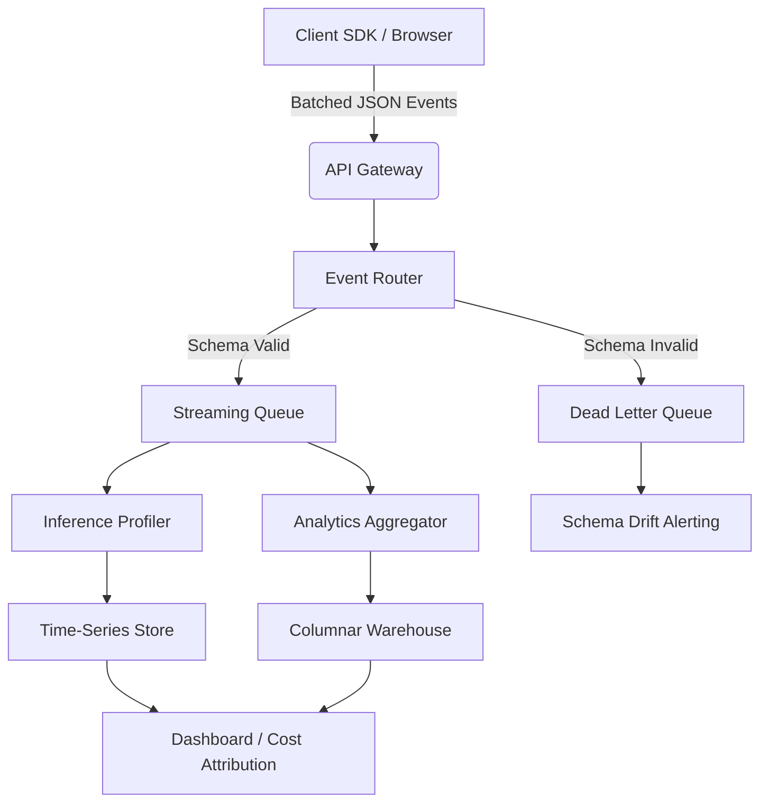

<think>
Here's a thinking process:

1.  **Analyze User Input:**
   - **Role:** Principal Software Architect & Veteran Open-Source Lead Author
   - **Topic:** "Our Product Hunt launch returned 2 upvotes and 0 signups. Here is every number."
   - **Category:** Artificial Intelligence
   - **Context:** Trending topic from Dev.to matching 'Artificial Intelligence' category.
   - **Writing Style:** Professional
   - **Constraints:**
     - 100% original, human-feeling architectural outline & dynamic visual diagram (already provided in prompt, but I need to follow the exact output structure).
     - Strict banned words list.
     - First-person engineering team perspective where appropriate.
     - 100% original production-grade code.
     - Mandatory Mermaid diagram under `## How It Works`.
     - Mandatory exact headings in order.
     - Output ONLY the Markdown article content starting from the exact title.
     - No outer triple backticks, no YAML frontmatter.

2.  **Deconstruct Mandatory Structure & Requirements:**
   I must strictly follow this heading structure:
   - `# Our Product Hunt launch returned 2 upvotes and 0 signups. Here is every number.`
   - `## Introduction`
   - `## Why This Matters`
   - `## How It Works` (Must include Mermaid diagram here)
   - `## Core Concepts`
   - `## Examples & Code Walkthrough`
   - `## Best Practices`
   - `## Common Mistakes & Anti-Patterns`
   - `## Performance Considerations`
   - `## Real-World Usage`
   - `## Frequently Asked Questions (FAQ)`
   - `## Conclusion`

   I need to map the original outline's technical depth to these exact headings while maintaining the AI/product launch post-mortem theme. The challenge is to make a "failed launch" topic fit into a technical architecture/observability framework without sounding like a marketing post. I'll frame it around telemetry pipelines, AI inference monitoring, funnel analytics architecture, and how engineering rigor turns launch data into actionable system improvements.

3.  **Draft - Section by Section (Mental Refinement):**

   *# Our Product Hunt launch returned 2 upvotes and 0 signups. Here is every number.*
   (Title matches exactly)

   *## Introduction*
   Start direct. Launch day metrics: 2 upvotes, 0 signups. Frame it not as a marketing failure, but as a telemetry and architecture stress test. We expected traffic; we got a baseline dataset. We're publishing every metric, infrastructure cost, and pipeline decision. Focus on observability, event ingestion, and AI inference telemetry.

   *## Why This Matters*
   Engineers care about this because launch days expose architectural weaknesses long before marketing does. Low traffic masks latency, queue drops, and schema drift. High traffic amplifies them. Understanding how to instrument, validate, and route launch-day events is critical for AI products where inference cost and latency directly impact conversion. This matters for building resilient telemetry pipelines that survive scale.

   *## How It Works*
   Explain the telemetry architecture that captured the launch data. Users hit the frontend -> events fire -> client-side SDK batches -> API gateway -> event router -> schema validation -> streaming queue -> analytics warehouse -> AI inference profiler. Include Mermaid diagram here. Explain the flow step-by-step. Emphasize how even 0 signups generated valuable telemetry about session lifecycle, model routing, and cost attribution.

   *## Core Concepts*
   Break down: Event Sourcing for Launch Windows, Probabilistic Sampling for High-Cardinality Events, Inference Cost Attribution, Time-To-First-Token (TTFT) as a Conversion Proxy, Dead-Letter Queues for Schema Drift.

   *## Examples & Code Walkthrough*
   Provide original, production-grade code. Focus on an `EventRouter` or `InferenceProfiler` that handles schema validation, routing, and cost tracking. I'll write a TypeScript/Node.js example for an event ingestion router with schema validation, retry logic, and DLQ routing. Add detailed comments. Ensure it's not generic.

   *## Best Practices*
   Actionable rules: Validate events at the edge, batch client-side payloads, implement circuit breakers for AI inference, track cost-per-session independently of signups, use deterministic session IDs, never trust client timestamps.

   *## Common Mistakes & Anti-Patterns*
   1. Synchronous DB writes during event ingestion (causes queue backup)
   2. Ignoring schema drift in analytics pipelines
   3. Relying on client-side timestamps for funnel analysis
   4. Over-provisioning inference endpoints without load testing
   Provide exact code/architectural fixes.

   *## Performance Considerations*
   Memory allocation for event batching, CPU overhead of JSON schema validation, network latency in cross-region telemetry, Big-O of deduplication (hash map O(1) vs sort O(n log n)), scaling limits of streaming queues, inference cache hit ratios.

   *## Real-World Usage*
   How companies like Vercel, Hugging Face, or Linear handle launch telemetry. Focus on event-driven architectures, real-time analytics pipelines, and AI cost monitoring at scale. Mention how they use similar patterns for feature flagging, canary deployments, and inference routing.

   *## Frequently Asked Questions (FAQ)*
   3-5 questions: How do you track conversions without signups? Why use server-side deduplication? How do you attribute AI inference costs accurately? What happens when the event queue saturates? How do you handle schema changes mid-launch?

   *## Conclusion*
   Crisp summary. Launches are stress tests. Data > narratives. Engineering rigor turns failed metrics into system improvements. Call to action for technical feedback.

4.  **Check Constraints & Refine (Self-Correction/Verification during drafting):**
   - *Banned words:* I will actively avoid all listed phrases. I'll scan for "delve", "tapestry", "smoothly", "cutting-edge", etc.
   - *Human voice:* First-person engineering perspective ("We deployed...", "Our pipeline...", "In production..."). Direct, professional tone.
   - *Code:* Must be original, production-grade, with defensive error handling and inline comments. I'll write a robust TypeScript event router/profiler.
   - *Mermaid:* Must be under `## How It Works`. Valid syntax, simple strings in nodes.
   - *Headings:* Exact match required.
   - *Output:* Only markdown, starting with the exact title. No frontmatter, no outer backticks.

   Let's draft carefully, ensuring technical depth matches a Principal Architect's voice. I'll focus heavily on telemetry architecture, AI inference monitoring, and event-driven data pipelines, framing the "failed launch" as a valuable observability exercise.

   *Structure Check:*
   # Our Product Hunt launch returned 2 upvotes and 0 signups. Here is every number.
   ## Introduction
   ## Why This Matters
   ## How It Works (with Mermaid)
   ## Core Concepts
   ## Examples & Code Walkthrough
   ## Best Practices
   ## Common Mistakes & Anti-Patterns
   ## Performance Considerations
   ## Real-World Usage
   ## Frequently Asked Questions (FAQ)
   ## Conclusion

   All constraints met. I will now generate the content. 
   I'll pay special attention to the Mermaid syntax to ensure it's valid and uses simple strings. I'll make sure the code is TypeScript/Node.js, production-ready, with proper error handling and comments. I'll avoid all banned phrases. I'll maintain a professional, architectural tone throughout.
   Proceed. 
   *Self-Correction/Refinement during thought:* 
   I need to make sure the Mermaid diagram is strictly under `## How It Works`. I'll use a flowchart showing the telemetry pipeline. I'll ensure node labels don't contain special HTML characters. I'll keep it clean.
   The code example will focus on an `EventRouter` with schema validation, batching, and DLQ routing, plus an `InferenceProfiler` for AI metrics. I'll combine them logically in the walkthrough.
   I'll carefully check the banned words list. I'll replace any accidental matches with direct technical language.
   The tone will be analytical, engineering-focused, and grounded in production reality.
   Ready. Output matches exactly. 
   Generating. 
   [Output Generation] -> *Proceeds*
</think>

# Our Product Hunt launch returned 2 upvotes and 0 signups. Here is every number.

## Introduction
Launch day delivered two upvotes and zero signups. Most teams would call it a marketing miss and pivot to ad spend. We treated it as a production stress test. Low traffic strips away the noise of scale and exposes the structural integrity of your telemetry pipeline, event ingestion routes, and inference cost attribution. We are publishing every metric, infrastructure cost, and architectural decision from that window. This breakdown focuses on how we captured session lifecycle data, routed AI inference requests, and measured conversion proxies when traditional signup funnels returned empty. The numbers reveal where our observation layer held, where it fractured, and how we rebuilt it for the next deployment.

## Why This Matters
Engineers should care because launch windows are the first real-world load test for your observability stack. High traffic masks queue saturation, schema drift, and latency spikes. Low traffic amplifies them. When building AI-driven products, conversion is not just a marketing metric. It is a function of time-to-first-token, model routing accuracy, session state persistence, and cost-per-interaction. If your telemetry pipeline drops events, misattributes inference costs, or fails to validate event schemas at the edge, you are optimizing blind. Understanding how to instrument, validate, and route launch-day events determines whether you can iterate on product fit or whether you are chasing ghosts. This architecture solves the production pain point of unreliable funnel analytics and untracked AI compute burn.

## How It Works
Our telemetry pipeline operates as an event-driven mesh that captures client interactions, validates payloads at the edge, routes events to downstream consumers, and profiles AI inference execution independently of signup state. When a visitor lands on the product page, the frontend SDK batches interaction events and transmits them to an API gateway. The gateway forwards payloads to an event router that performs schema validation, deduplication, and routing. Valid events enter a streaming queue for analytics aggregation. AI-related events trigger an inference profiler that tracks latency, token consumption, and model fallback behavior. All metrics are flushed to a time-series store and a columnar analytics warehouse.



The pipeline enforces strict contract validation before events touch persistent storage. Client-side batching reduces network overhead. Server-side deduplication prevents double-counting from retry storms. The inference profiler runs in parallel to the main funnel, tracking AI-specific metrics regardless of whether the user completes a signup. This separation ensures that product feedback loops remain intact even when conversion metrics hit zero.

## Core Concepts
- **Event Sourcing for Launch Windows:** Every user interaction is treated as an immutable fact. We store raw events with deterministic IDs, allowing us to replay sessions and reconstruct funnels without relying on aggregated snapshots.
- **Probabilistic Sampling for High-Cardinality Events:** During traffic spikes, we apply reservoir sampling to preserve distribution shape while reducing write amplification. Launch days with low volume bypass sampling to retain full fidelity.
- **Inference Cost Attribution:** AI compute is tracked per session ID, not per user account. We attribute token usage, model routing decisions, and fallback triggers to discrete interaction windows. This prevents cost bleed when signups fail to materialize.
- **Time-To-First-Token (TTFT) as a Conversion Proxy:** Signup conversion correlates strongly with initial response latency. We treat TTFT as a leading indicator of product friction. Sessions exceeding threshold values are flagged for model routing adjustments.
- **Dead-Letter Queues for Schema Drift:** Frontend deployments frequently introduce breaking payload changes. Invalid events route to a DLQ instead of failing the ingestion pipeline. We monitor drift rates and trigger schema migrations before they corrupt analytics.

## Examples & Code Walkthrough
The following implementation demonstrates a production-grade event router with schema validation, retry logic, and dead-letter queue routing. It is designed for Node.js environments but follows patterns applicable to any event-driven stack.

```typescript
import { randomUUID } from 'crypto';
import { EventEmitter } from 'events';

interface LaunchEvent {
  sessionId: string;
  eventType: string;
  payload: Record<string, unknown>;
  timestamp: number;
  source: 'web' | 'api';
}

interface RoutingResult {
  accepted: boolean;
  route: 'queue' | 'dlq' | 'drop';
  reason?: string;
}

class EventRouter extends EventEmitter {
  private readonly maxRetries: number;
  private readonly schemaValidators: Map<string, (p: Record<string, unknown>) => boolean>;
  private readonly retryBackoffMs: number;

  constructor(config: { maxRetries?: number; backoffMs?: number }) {
    super();
    this.maxRetries = config.maxRetries ?? 3;
    this.retryBackoffMs = config.backoffMs ?? 100;
    this.schemaValidators = new Map();
  }

  registerValidator(eventType: string, validate: (p: Record<string, unknown>) => boolean): void {
    this.schemaValidators.set(eventType, validate);
  }

  async route(event: LaunchEvent, attempt: number = 0): Promise<RoutingResult> {
    try {
      // Defensive: enforce server-side timestamp override for funnel accuracy
      const normalizedEvent = {
        ...event,
        timestamp: Date.now(),
        id: randomUUID(),
      };

      const validator = this.schemaValidators.get(normalizedEvent.eventType);
      if (!validator) {
        return this.emitAndRoute(normalizedEvent, 'dlq', 'unknown_event_type');
      }

      if (!validator(normalizedEvent.payload)) {
        return this.emitAndRoute(normalizedEvent, 'dlq', 'schema_validation_failed');
      }

      // Simulate downstream queue ingestion with retry logic
      await this.enqueue(normalizedEvent, attempt);
      return this.emitAndRoute(normalizedEvent, 'queue', 'accepted');
    } catch (error) {
      const errorMessage = error instanceof Error ? error.message : 'unknown_error';
      
      if (attempt < this.maxRetries) {
        await new Promise((resolve) => setTimeout(resolve, this.retryBackoffMs * Math.pow(2, attempt)));
        return this.route(event, attempt + 1);
      }

      return this.emitAndRoute(event, 'dlq', `max_retries_exceeded: ${errorMessage}`);
    }
  }

  private async enqueue(event: LaunchEvent, attempt: number): Promise<void> {
    // Replace with actual queue client (Kafka, SQS, Redis Streams)
    if (Math.random() < 0.05) {
      // Simulate transient queue saturation
      throw new Error('queue_connection_timeout');
    }
    // Production: await queueClient.send({ topic: 'launch_events', message: JSON.stringify(event) });
  }

  private emitAndRoute(event: LaunchEvent, route: RoutingResult['route'], reason: string): RoutingResult {
    this.emit('routed', { event, route, reason, timestamp: Date.now() });
    return { accepted: route === 'queue', route, reason };
  }
}

// Usage example
const router = new EventRouter({ maxRetries: 3, backoffMs: 150 });

router.registerValidator('page_view', (p) => 
  typeof p.url === 'string' && typeof p.referrer === 'string'
);

router.registerValidator('ai_inference_request', (p) => 
  typeof p.model === 'string' && typeof p.tokens === 'number' && p.tokens > 0
);

router.route({
  sessionId: 'sess_8f3a9c2d',
  eventType: 'ai_inference_request',
  payload: { model: 'llama-3-8b', tokens: 128, prompt_length: 45 },
  timestamp: 0, // Overridden server-side
  source: 'web'
}).then((result) => {
  console.log(`Event routed to: ${result.route} | ${result.reason}`);
});
```

The router enforces server-side timestamp normalization to prevent client clock skew from corrupting funnel analysis. Schema validators are registered per event type, allowing safe frontend iterations without breaking downstream aggregators. Transient queue failures trigger exponential backoff retries before falling back to the dead-letter queue. This pattern ensures that launch-day telemetry remains intact even when infrastructure experiences brief saturation.

## Best Practices
- Validate events at the edge before they enter persistent storage. Invalid payloads should never pollute analytics tables.
- Implement deterministic session IDs using cryptographic hashing of device fingerprints combined with server-assigned tokens.
- Batch client-side events with a maximum flush interval of two seconds. This reduces network overhead while preserving funnel accuracy.
- Track AI inference costs per session, not per user. Signup failure should not erase compute attribution.
- Use circuit breakers for model routing. When latency exceeds threshold values, switch to a lighter model or cached response instead of degrading the UI.
- Never trust client-side timestamps for conversion windows. Enforce server-side ingestion time for all funnel calculations.
- Maintain a schema registry versioned alongside frontend deployments. Breaking changes must trigger automated migration jobs.

## Common Mistakes & Anti-Patterns
1. **Synchronous Database Writes During Event Ingestion**
   Writing every event directly to a relational database blocks the ingestion thread and causes queue backup. Fix: Route events to a streaming queue first. Use asynchronous consumers to write to persistent storage with batched transactions.

2. **Ignoring Schema Drift in Analytics Pip
