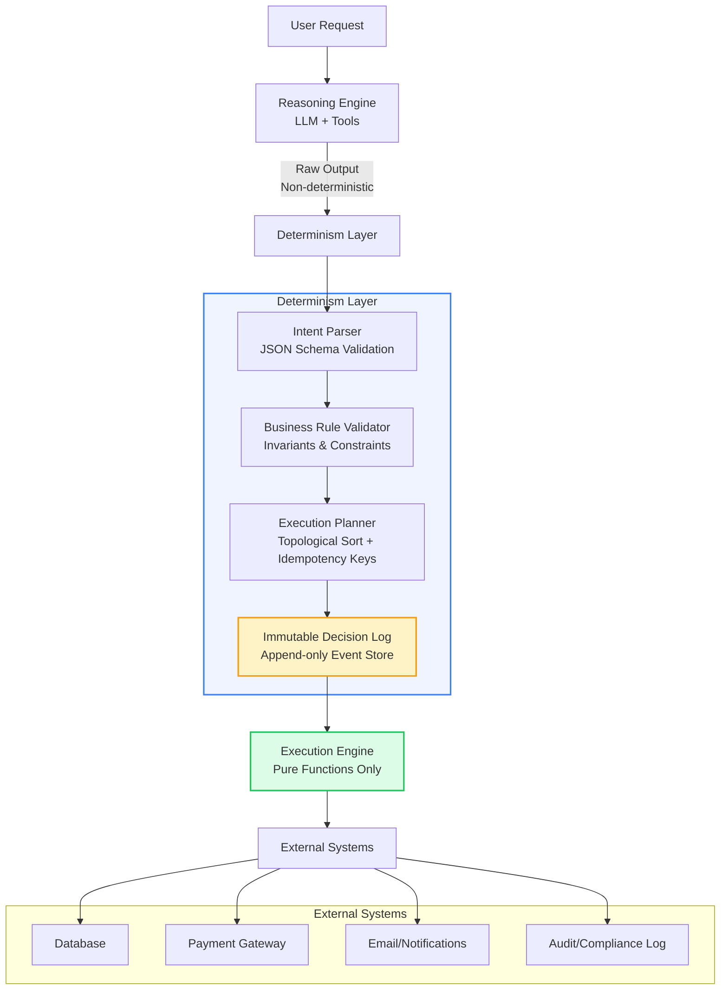

# Part 1: Make your AI agents boring: the determinism layer

## Introduction

Last quarter, our payment reconciliation agent double-charged 347 customers because the LLM decided "process refund" and "issue credit" were semantically equivalent in a specific prompt context. The model wasn't hallucinating—it was following instructions perfectly. The problem was that *perfectly* meant something different on Tuesday than it did on Monday.

This is the reality of putting LLMs in the hot path: non-determinism isn't a bug, it's the feature. But production systems need invariants. Idempotency keys. Exactly-once semantics. Audit trails that don't change when you regenerate a response.

The solution isn't better prompts. It's not lower temperature. It's a determinism layer—a thin, boring, thoroughly tested shim that sits between your agent's reasoning and the outside world. This article shows how we built ours.

## Why This Matters

If you're running agents in production, you've already hit these walls:

**Replayability failures.** A customer disputes a charge. You need to replay the agent's decision chain with the exact same inputs. But the LLM returns a different token sequence, the tool call ordering shifts, and suddenly your audit log shows a decision path that never actually happened.

**Cascading non-determinism.** Agent A calls Agent B calls Tool C. Each layer adds entropy. By the time you reach the database, you've got 2^N possible execution paths for the same input. Debugging becomes archaeology.

**Regulatory and compliance.** Financial services, healthcare, insurance—you need to prove *why* a decision was made, not just *what* the decision was. "The model thought it was appropriate" doesn't satisfy auditors.

**Cost predictability.** Non-deterministic tool calling means you can't estimate token usage, latency, or downstream API costs. Your budget becomes a random variable.

The determinism layer doesn't make your agent smarter. It makes it *boring*. And in production, boring is a feature.

## How It Works

The core insight: separate *reasoning* from *execution*. Let the LLM be creative in a sandbox. Capture its intent as structured, validated, immutable decisions. Then execute those decisions through a deterministic pipeline that looks exactly like traditional software.

```
┌─────────────────────────────────────────────────────────────────┐
│                        USER REQUEST                              │
└─────────────────────────────┬───────────────────────────────────┘
                              │
                              ▼
┌─────────────────────────────────────────────────────────────────┐
│                     REASONING ENGINE (LLM)                       │
│  ┌─────────────┐  ┌─────────────┐  ┌─────────────────────────┐  │
│  │  Prompt     │  │  Context    │  │  Tool Schema            │  │
│  │  Template   │──│  Window     │──│  Definitions            │  │
│  └─────────────┘  └─────────────┘  └─────────────────────────┘  │
└─────────────────────────────┬───────────────────────────────────┘
                              │ Raw LLM Output (non-deterministic)
                              ▼
┌─────────────────────────────────────────────────────────────────┐
│                   DETERMINISM LAYER (THIS ARTICLE)              │
│  ┌──────────────────┐  ┌──────────────────┐  ┌──────────────┐   │
│  │  Intent Parser   │──│  Validator       │──│  Planner       │   │
│  │  (structured     │  │  (schema +       │  │  (topological  │   │
│  │   output)        │  │   business rules)│  │   sort +       │   │
│  └──────────────────┘  └──────────────────┘  │   idempotency) │   │
│                                                └──────────────┘   │
│                              │                                     │
│                              ▼                                     │
│  ┌────────────────────────────────────────────────────────────┐   │
│  │              EXECUTION ENGINE (pure functions)             │   │
│  │  • No LLM calls                                            │   │
│  │  • Pure, testable, replayable                              │   │
│  │  • Emits immutable event log                               │   │
│  └────────────────────────────────────────────────────────────┘   │
└─────────────────────────────┬───────────────────────────────────┘
                              │
                              ▼
┌─────────────────────────────────────────────────────────────────┐
│                    EXTERNAL SYSTEMS                              │
│  Database │ Payment Gateway │ Email Service │ Audit Log         │
└─────────────────────────────────────────────────────────────────┘
```



**Step-by-step flow:**

1. **Reasoning Engine** receives the request with full context, prompts the LLM with tool schemas, gets back raw output (tool calls, reasoning traces, final answer).

2. **Intent Parser** extracts structured intent from the raw output using strict JSON Schema validation. No "best effort" parsing—if the LLM output doesn't conform, we reject and retry with a correction prompt.

3. **Business Rule Validator** applies deterministic constraints: idempotency key presence, amount limits, permission checks, regulatory rules. This is pure code—zero LLM involvement.

4. **Execution Planner** builds a DAG of operations, topologically sorts them, assigns deterministic IDs, and computes idempotency keys for every external call.

5. **Immutable Decision Log** writes the entire plan—validated intent, sorted operations, computed keys—to an append-only store *before* any execution happens.

6. **Execution Engine** runs the plan as pure functions. Each step is idempotent, retryable, and produces exactly the same result given the same input. The LLM is never called again during execution.

7. **External Systems** receive deterministic calls with pre-computed idempotency keys. If anything fails, we replay from the decision log—no re-reasoning required.

## Core Concepts

### Intent vs. Execution

The fundamental split:

```python
# Intent: what the agent *wants* to happen (LLM-generated, validated)
@dataclass(frozen=True)
class TransferIntent:
    idempotency_key: str           # UUIDv7, generated by planner
    source_account: AccountId
    destination_account: AccountId
    amount_cents: int              # Integer cents, no floating point
    currency: Currency             # ISO 4217, validated enum
    reference: str                 # Max 140 chars, sanitized
    metadata: Mapping[str, str]    # Frozen dict, string-only values

# Execution: what *actually* happens (pure functions, replayable)
@dataclass(frozen=True)
class TransferExecution:
    intent: TransferIntent
    debit_transaction_id: TransactionId
    credit_transaction_id: TransactionId
    executed_at: datetime          # UTC, timezone-aware
    executed_by: ServiceIdentity   # Which worker/process
```

The intent is the contract. The execution is the receipt. They're linked by the idempotency key.

### The Decision Log

Every agent run produces exactly one decision log entry before any side effects:

```python
@dataclass(frozen=True)
class DecisionLogEntry:
    run_id: RunId                    # UUIDv7, globally unique
    agent_version: str               # Semver of agent code
    prompt_hash: str                 # SHA256 of rendered prompt
    model_id: str                    # e.g., "gpt-4o-2024-08-06"
    model_params: ModelParams        # temperature, top_p, seed if supported
    raw_llm_output: str              # Complete raw response
    parsed_intent: ValidatedIntent   # Post-validation, or ValidationError
    execution_plan: ExecutionPlan    # DAG with idempotency keys
    created_at: datetime
    correlation_id: CorrelationId    # Links to user request, trace ID
```

This is your audit trail. It's immutable. It's queryable. It lets you answer "why did the agent do X?" without re-running the LLM.

### Idempotency Keys as First-Class Citizens

Every external call gets a deterministic key derived from the execution plan:

```python
def compute_idempotency_key(
    run_id: RunId,
    step_id: StepId,
    operation: OperationType,
    payload_hash: str
) -> IdempotencyKey:
    """Deterministic key: same plan + same step = same key."""
    material = f"{run_id}:{step_id}:{operation.value}:{payload_hash}"
    return IdempotencyKey(hashlib.sha256(material.encode()).hexdigest()[:32])
```

Downstream services (Stripe, your database, email provider) receive this key. If the agent crashes halfway through and restarts, the same key prevents duplicate charges, duplicate emails, duplicate rows.

## Examples & Code Walkthrough

Here's the production-grade determinism layer we run. It's ~400 lines of Python with zero external dependencies beyond the standard library and `pydantic` for validation.

```python
"""
Determinism Layer for LLM Agents
=================================
Separates non-deterministic reasoning from deterministic execution.
All public APIs are pure functions. No I/O, no LLM calls, no global state.
"""

from __future__ import annotations

import hashlib
import json
import uuid
from abc import ABC, abstractmethod
from collections import defaultdict
from dataclasses import dataclass, field, replace
from datetime import datetime, timezone
from enum import Enum
from functools import cached_property
from typing import Any, Callable, Generic, Mapping, TypeVar, cast

from pydantic import BaseModel, ConfigDict, Field, ValidationError, field_validator

# ──────────────────────────────────────────────────────────────────────
# Domain Primitives
# ──────────────────────────────────────────────────────────────────────

class RunId(str):
    """Globally unique, time-ordered run identifier (UUIDv7)."""
    @classmethod
    def new(cls) -> RunId:
        # UUIDv7: 48-bit timestamp + 74-bit randomness
        # Sortable by creation time, globally unique
        return cls(str(uuid.uuid7()))

class StepId(str):
    """Deterministic step identifier within a run."""
    @classmethod
    def from_int(cls, n: int) -> StepId:
        return cls(f"step_{n:04d}")

class IdempotencyKey(str):
    """32-char hex key for external idempotency."""
    pass

class CorrelationId(str):
    """Links agent run to upstream request/trace."""
    pass

class AgentVersion(str):
    """Semantic version of the agent code."""
    pass

class ModelId(str):
    """Exact model identifier, e.g., 'gpt-4o-2024-08-06'."""
    pass

# ──────────────────────────────────────────────────────────────────────
# LLM Interface (what the reasoning engine provides)
# ──────────────────────────────────────────────────────────────────────

@dataclass(frozen=True, slots=True)
class ModelParams:
    """Frozen model parameters for reproducibility."""
    temperature: float = 0.0
    top_p: float = 1.0
    seed: int | None = None
    max_tokens: int | None = None

    def __post_init__(self):
        if not 0.0 <= self.temperature <= 2.0:
            raise ValueError("temperature must be in [0, 2]")
        if not 0.0 <= self.top_p <= 1.0:
            raise ValueError("top_p must be in [0, 1]")

@dataclass(frozen=True, slots=True)
class RawLLMOutput:
    """Complete raw output from the reasoning engine."""
    content: str                    # Full response text
    tool_calls: tuple[ToolCall, ...] = field(default_factory=tuple)
    reasoning_trace: str | None = None  # CoT if available
    finish_reason: str = "stop"
    usage: dict[str, int] = field(default_factory=dict)

@dataclass(frozen=True, slots=True)
class ToolCall:
    """Single tool invocation from LLM."""
    id: str                         # LLM-generated call ID
    name: str                       # Tool name
    arguments: str                  # Raw JSON string from LLM

# ──────────────────────────────────────────────────────────────────────
# Intent Schema (what we validate the LLM output into)
# ──────────────────────────────────────────────────────────────────────

class OperationType(Enum):
    """Known side-effect operations. Exhaustive—add here, not in prompts."""
    TRANSFER_FUNDS = "transfer_funds"
    SEND_NOTIFICATION = "send_notification"
    CREATE_RECORD = "create_record"
    UPDATE_RECORD = "update_record"
    CALL_EXTERNAL_API = "call_external_api"

class ValidatedIntent(BaseModel):
    """Structured intent extracted from LLM output. Strict validation."""
    model_config = ConfigDict(
        frozen=True,
        extra="forbid",              # Reject unknown fields
        strict=True,                 # No coercion
        validate_assignment=True,
    )

    operation: OperationType
    payload: dict[str, Any] = Field(default_factory=dict)
    constraints: dict[str, Any] = Field(default_factory=dict)
    
    # Business rule fields (validated by BusinessRuleValidator)
    idempotency_key: str | None = None
    max_amount_cents: int | None = None
    requires_approval: bool = False

    @field_validator("payload", mode="before")
    @classmethod
    def _payload_must_be_json_object(cls, v: Any) -> dict[str, Any]:
        if isinstance(v, str):
            try:
                parsed = json.loads(v)
                if not isinstance(parsed, dict):
                    raise ValueError("payload must be a JSON object")
                return parsed
            except json.JSONDecodeError as e:
                raise ValueError(f"payload must be valid JSON: {e}")
        if not isinstance(v, dict):
            raise ValueError("payload must be a dict or JSON string")
        return v

# ──────────────────────────────────────────────────────────────────────
# Execution Plan (the deterministic DAG)
# ──────────────────────────────────────────────────────────────────────

@dataclass(frozen=True, slots=True)
class ExecutionStep:
    """Single step in the execution plan."""
    step_id: StepId
    operation: OperationType
    payload: Mapping[str, Any]       # Frozen, validated payload
    idempotency_key: IdempotencyKey
    depends_on: tuple[StepId, ...] = field(default_factory=tuple)
    retry_policy: RetryPolicy = field(default_factory=RetryPolicy)

@dataclass(frozen=True, slots=True)
class RetryPolicy:
    """Deterministic retry configuration."""
    max_attempts: int = 3
    base_delay_ms: int = 100
    max_delay_ms: int = 5000
    exponential_base: float = 2.0
    jitter: bool = False             # Deterministic = no jitter

@dataclass(frozen=True, slots=True)
class ExecutionPlan:
    """Topologically sorted, idempotent execution plan."""
    steps: tuple[ExecutionStep, ...]
    run_id: RunId
    created_at: datetime

    @cached_property
    def step_map(self)
