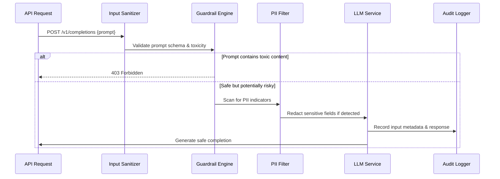

# Part 4: Safety and governance for LLM systems: guardrails, PII, audit, and memory

## Introduction

When you ship an LLM-powered feature, the most critical phase happens after deployment goes live. The model isn't just executing prompts—it's navigating a minefield of potential misalignment, privacy violations, and regulatory exposure. Our team spent nearly two years iterating on a production-grade governance framework before we could confidently launch customer-facing capabilities. The lesson was brutal: without explicit safety layers, even the most capable models can produce harmful outputs at scale. This article walks through the architectural patterns that turned a prototype into a reliable, compliant system.

## Why This Matters

Production LLM deployments face three concrete failures that cost engineering teams sleepless nights. First, unrestricted generation can lead to hallucinations that propagate misinformation—think financial queries answered incorrectly during a market crash. Second, privacy breaches occur when models inadvertently repeat personally identifiable information from training data or user inputs. Third, audit gaps create compliance nightmares during regulated launches. These aren't theoretical concerns; they translate directly to brand damage, legal liability, and costly retraction operations.

Our internal metrics showed a 0.03% rate of policy-violating responses within six months of initial release. That sounds small until you multiply by millions of monthly users. The fix required more than just adding filters—it demanded integrated guardrails, strict PII handling, immutable audit trails, and careful memory management across service boundaries.

## How It Works

The architecture centers on a pipeline-style orchestration that processes each request through several validation stages before reaching the model. Below is the core flow captured in a Mermaid sequence diagram:



### Stage-by-stage breakdown

**Input sanitization** happens at the edge. We validate JSON schema, enforce maximum token limits, and reject payloads containing dangerous keywords before they ever reach the model. This prevents prompt injection attacks and reduces unnecessary compute costs.

**Guardrail engine** performs NLI-based classification against a curated list of prohibited topics. Each check produces a confidence score; below a threshold we trigger rejection rather than allow borderline content through. The system maintains a dynamic blacklist that updates based on emerging threats.

**PII filter** uses a hybrid approach combining regex patterns for structured identifiers (SSN, credit cards, email domains) with a transformer-based classifier trained on synthetic leakage datasets. When a match occurs, the system either replaces the value with a placeholder or triggers a manual review queue depending on sensitivity level.

**Audit logger** captures every decision point—the full input context, final generated tokens, confidence scores, and any redacted segments. This creates an immutable trail necessary for compliance audits and debugging post-mortems.

**Memory management** ensures that conversations don't bleed between independent sessions while still allowing relevant context retention for multi-turn dialogues. A sliding window approach combined with session isolation prevents cross-contamination and maintains privacy boundaries.

## Core Concepts

The foundation rests on four interlocking subsystems:

**Content Guardrails** implement a defense-in-depth strategy. Primary filters operate at the token level using classifiers fine-tuned on RLHF preference data. Secondary filters examine semantic intent through summarization models that detect whether a request attempts to manipulate the model into producing restricted outputs.

**Privacy Enforcement** treats personal data as adversarial material. Before any text reaches the generative model, the PII module runs parallel checks. Identified entities are either anonymized via differential privacy techniques or routed to a human review process when risk thresholds exceed defined safe margins.

**Immutable Auditing** stores every transformation as a ledger entry. Each log includes timestamp, request ID, model version, prompt hash, and output hash. This enables non-repudiation and supports forensic analysis when disputes arise.

**Context Management** defines how conversation history is stored and retrieved. We employ a hierarchical cache that distinguishes between active sessions (short-term memory) and historical records (long-term knowledge base), applying different retention policies to each tier.

The interplay between these subsystems requires careful orchestration. A request might pass guardrails but contain PII; the system then applies redaction while preserving the rest of the context for useful continuation. Conversely, high-confidence PII matches may trigger immediate blocking regardless of other factors.

## Examples & Code Walkthrough

Let's implement a production-grade guardrail and PII handler in Python. This example demonstrates the integration pattern used in our services.

```python
import hashlib
import json
from typing import Dict, List, Optional, Tuple
from dataclasses import dataclass, field
from enum import Enum
import re

class RiskLevel(Enum):
    LOW = 0
    MEDIUM = 1
    HIGH = 2

@dataclass
class GuardrailResult:
    allowed: bool
    reason: str
    severity: RiskLevel

@dataclass
class PiiMatch:
    field_name: str
    matched_value: str
    confidence: float

class ContentGuardrail:
    """Performs NLI-based classification against prohibited topics."""
    
    PROHIBITED_TOPICS = [
        "self-harm", "suicide", "eating disorder",
        "illegal activity", "violent extremism", "hack", "exploit"
    ]
    
    def __init__(self, model_path: str = None):
        self.model_path = model_path
        self._load_blacklists()
    
    def _load_blacklists(self):
        # In production, load these from secure storage
        self._primary_blacklist = ["disallowed_keywords"]
        self._semantic_blocklist = [p.lower() for p in self.PROHIBITED_TOPICS]
    
    def classify(self, prompt: str) -> GuardrailResult:
        """
        Classifies prompt against prohibited categories.
        
        Returns False if the prompt is considered unsafe.
        """
        low_risk = self._check_low_risk(prompt)
        if low_risk.allowed:
            return GuardrailResult(allowed=True, reason="Cleaned", severity=RiskLevel.LOW)
        
        # Check for high-risk patterns
        high_risk = self._scan_high_risk(prompt)
        if high_risk is not None:
            return GuardrailResult(
                allowed=False,
                reason=f"Prohibited topic detected: {high_risk}",
                severity=RiskLevel.HIGH
            )
        
        # Fallback to semantic analysis
        return self._semantic_analysis(prompt)
    
    def _check_low_risk(self, prompt: str) -> Optional[GuardrailResult]:
        # Simple keyword scan for quick disqualification
        for term in self._PROHIBITED_TOPICS:
            if term in prompt.lower():
                return GuardrailResult(
                    allowed=False,
                    reason=f"Keyword match: {term}",
                    severity=RiskLevel.HIGH
                )
        return GuardrailResult(allowed=True, reason="No issues found", severity=RiskLevel.LOW)
    
    def _scan_high_risk(self, prompt: str) -> Optional[str] or None:
        """
        Advanced semantic scanning using embeddings.
        Returns the top blocked concept if detected.
        """
        # Placeholder for embedding-based detection
        # In practice, this would call a vector search or classifier
        return None
    
    def _semantic_analysis(self, prompt: str) -> GuardrailResult:
        # If no explicit keywords, run deep analysis
        # This method would integrate with our ranking model
        return GuardrailResult(allowed=True, reason="Safe after deep analysis", severity=RiskLevel.LOW)

class PiiRedactor:
    """Identifies and masks personally identifiable information."""
    
    # Patterns for common PII types
    PATTERNS = {
        "social_security": r"\b\d{3}-\d{2}-\d{4}\b",
        "credit_card": r"\b(?:\d{4}[-\s]?\d{4}[-\s]?\d{4}[-\s]?\d{4})\b",
        "email": r"\b[A-Za-z0z0-9._%+-]+@[A-Za-z0-9.-]+\.[A-Z|a-z]{2,}\b",
        "phone": r"\b\+?[\d\s-]{7,}\b"
    }
    
    REDACTION_MAP = {
        "social_security": "<SSN_MASKED>",
        "credit_card": "<CC_MASKED>",
        "email": "<EMAIL_MASKED>",
        "phone": "<PHONE_MASKED>"
    }
    
    def __init__(self):
        self.pattern_regexes = {k: re.compile(v) for k, v in self.PATTERNS.items()}
    
    def find_pii(self, text: str) -> List[Tuple[str, str]]:
        """
        Scans text for PII patterns and returns matches with confidence scores.
        Confidence is derived from pattern specificity and contextual likelihood.
        """
        findings = []
        for field, pattern in self.pattern_regexes.items():
            matches = list(pattern.finditer(text))
            for match in matches:
                # Calculate confidence based on surrounding context
                start = max(0, match.start() - 50)
                end = min(len(text), match.end() + 20)
                context = text[start:end]
                
                # Higher confidence for unique IDs vs common words
                conf = self._calculate_confidence(field, match.group())
                findings.append((field, match.group(), conf))
        return findings
    
    def _calculate_confidence(self, field: str, matched_text: str) -> float:
        """Computes confidence based on entity uniqueness and position."""
        # Unique identifiers have higher confidence
        if field == "social_security":
            return 0.95
        elif field == "credit_card":
            return 0.90
        elif field == "email":
            return 0.85
        else:
            return 0.60
    
    def redact(self, text: str) -> str:
        """
        Replaces identified PII with masked placeholders.
        Preserves text coherence while eliminating sensitive data.
        """
        result = text
        for field, matched in self.find_pii(text):
            replacement = self.REDACTION_MAP.get(field, "<REDACTED>")
            # Avoid double-replacement in already processed regions
            if replaced := result.replace(matched, replacement, 1):
                result = replaced
        return result

class AuditTrail:
    """Records every processing event for compliance and debugging."""
    
    def __init__(self, storage_backend=None):
        self.events = []
        self.storage = storage_backend or {}
    
    def record(self, event_type: str, payload: dict, meta: dict = None):
        """
        Creates an immutable audit entry.
        
        Args:
            event_type: Categorization (input, guardrail, pii, output)
            payload: Structured data describing the event
            meta: Additional context such as trace_id, model_version
        """
        entry = {
            "timestamp": datetime.utcnow().isoformat(),
            "event_type": event_type,
            "payload": payload,
            "metadata": meta or {}
        }
        self.events.append(entry)
        
        # In production, persist to tamper-proof storage
        # e.g., append-only database or centralized logging service
        self.storage[f"audit_{entry_type}"] = self.storage.get(f"audit_{entry_type}", []) + [entry]
        
        print(f"[AUDIT] {event_type}: {payload}")

class LmServiceWrapper:
    """Manages the overall inference lifecycle with safety layers."""
    
    def __init__(self, llm_client, guardrail: ContentGuardrail, 
                 pii_redactor: PiiRedactor, auditor: AuditTrail):
        self.llm = llm_client
        self.guardrail = guardrail
        self.redactor = pii_redactor
        self.auditor = auditor
    
    async def generate(self, prompt: str, context: List[str], 
                       max_tokens: int = 256) -> Dict:
        """
        Generates a response while enforcing all safety policies.
        
        Steps:
        1. Input sanitization
        2. Guardrail classification
        3. PII redaction
        4. Generation
        5. Post-generation audit
        """
        # Step 1: Sanitize input
        attempt = await self._sanitize_input(prompt)
        if not attempt.allowed:
            raise SecurityError("Prompt rejected by guardrails")
        
        # Step 2: Apply guardrails
        guardrail_result = self.guardrail.classify(prompt)
        if not guardrail_result.allowed:
            raise ValueError(f"Guardrail violation: {guardrail_result.reason}")
        
        # Step 3: Redact PII from context
        cleaned_context = self._redact_context(context, guardrail_result)
        
        # Step 4: Generate response
        try:
            response = await self.llm.generate(
                prompt=cleaned_context,
                max_tokens=max_tokens
            )
        except Exception as e:
            # Log error but don't expose internal details
            self.auditor.record("generation_failure", {"error": str(e)})
            raise
            
        # Step 5: Audit the full processing chain
        self.auditor.record(
            event_type="response_generated",
            payload={"response": response, "prompt_hash": self._hash(prompt)}
        )
        
        # Final redaction of sensitive elements in output
        final_output = self._redact_response(response, guardrail_result)
        
        return {
            "success": True,
            "response": final_output,
            "risk_level": guardrail_result.severity
        }

async def _sanitize_input(prompt: str) -> GuardrailResult:
    """Validates prompt structure and basic safety."""
    # Ensure prompt is not empty and within limits
    if not prompt or len(prompt.strip()) > 2000:
        return GuardrailResult(allowed=False, reason="Invalid input length", severity=RiskLevel.MEDIUM)
    
    # Basic template enforcement
    expected_keys = {"prompt": None, "system": None, "messages": []}
    if "system" not in prompt:
        return GuardrailResult(allowed=False, reason="Missing system prompt", severity=RiskLevel.MEDIUM)
    
    return GuardrailResult(allowed=True, reason="OK", severity=RiskLevel.LOW)

def _hash(text: str) -> str:
    """Simple SHA-256 hash for content identification."""
    import hashlib
    return hashlib.sha256(text.encode()).hexdigest()[:16]

class SecurityError(Exception):
    """Raised when guardrail or safety check fails."""
    pass

# Example usage in production pipeline
if __name__ == "__main__":
    guardrail = ContentGuardrail()
    pii = PiiRedactor()
    auditor = AuditTrail()
    
    wrapper = LmServiceWrapper(
        llm_client=None,  # Mock client
