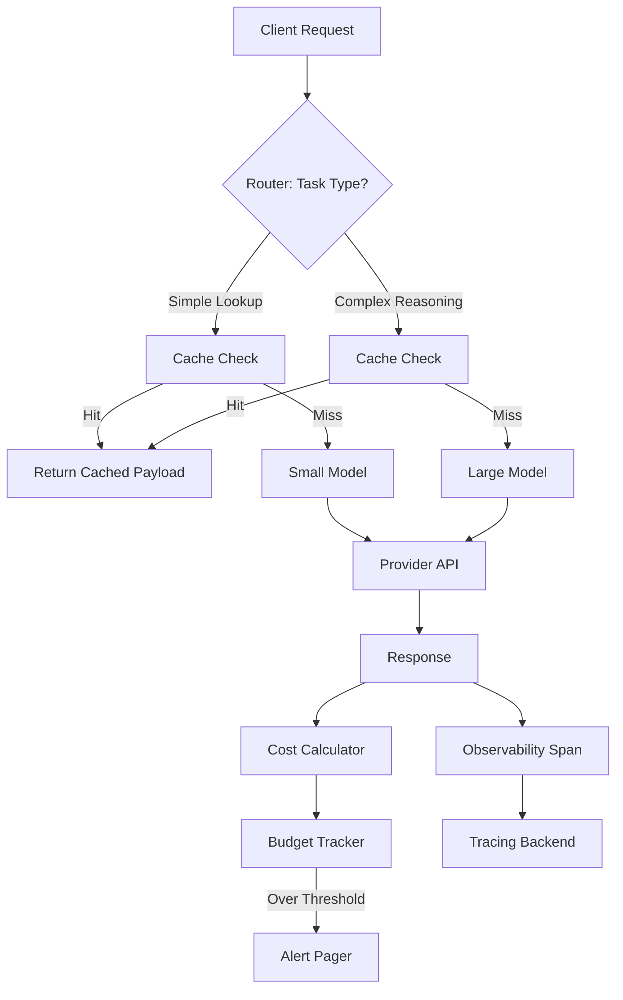

# Part 5: Operating an LLM system: observability, cost, routing, and the platform underneath

## Introduction

Building an LLM application feels different from building traditional software. In a standard web service, if the code is correct, the output is deterministic. Run the same input, get the same output. With a language model, the same input yields a different response every time. That non-determinism changes everything once you move past a demo notebook.

In the previous articles of this series, we covered how to build the model interface, how to serve it, and how to secure it. This article covers the layer most teams neglect until they have a bill shock or an outage: operations.

We are talking about the plumbing that sits under the model calls. How do you know how much a request cost? How do you decide whether a simple lookup should hit a small local model or a large expensive one? How do you trace a hallucination back to the specific prompt version that caused it?

Running an LLM system in production is less about model tuning and more about infrastructure hygiene. You are operating a probabilistic service over a metered network. That combination requires specific tooling.

## Why This Matters

Three months ago, we shipped a feature that used an external LLM provider for document summarization. It worked in staging. It worked in production. Three weeks later, our monthly API spend jumped 400%.

We had no telemetry on token usage per endpoint. We had no cache. We had no model routing. Every request went straight to the largest model available, regardless of complexity. A simple "what is the status of ticket 402?" query cost the same as a request requiring a full legal contract review.

This is the common trajectory for LLM ops. Teams build the happy path, launch, and then discover they cannot answer three basic questions:

1.  What is the actual cost per request?
2.  Which requests are failing and why?
3.  Are we using the right model for the job?

Without answers to these, you cannot set SLOs. You cannot budget. You cannot debug. Observability, cost control, and routing are not nice-to-have features; they are the foundation of a maintainable system.

## How It Works

The core mechanism is a request gateway. This layer sits between your application and the model provider. It intercepts every call, applies logic, and records metrics before and after the network hop.

The flow looks like this:

Here is the step-by-step breakdown of what happens inside that gateway:

1.  **Ingress and Routing:** The request enters the gateway. We classify the task. If the prompt is a factual lookup, we route it to a smaller, cheaper model. If it requires reasoning, we route to a larger context window.
2.  **Cache Validation:** Before touching a network, we compute a hash of the normalized prompt. If that hash exists in our cache store, we return the stored response immediately. This bypasses the model entirely.
3.  **Provider Execution:** If the cache misses, the router selects the provider and model. It applies retry logic with exponential backoff.
4.  **Post-Processing:** We strip PII from the response stream before it is logged. We also normalize the output format.
5.  **Telemetry Recording:** We write a span to the tracing backend. We update the cost tracker with the token counts returned by the provider.
6.  **Feedback:** If the cost exceeds the daily budget, we trigger an alert. We do not block the request silently, but we notify the on-call engineer.

The key insight is that the gateway is the single source of truth for cost. Your application code should never call the provider directly. It calls the gateway.

## Core Concepts

**Structured Observability**
Standard logs are not enough for LLMs. You need spans that capture the prompt, the response, the token count, the latency, and the model version. This allows you to correlate a bad response with the exact prompt that generated it. We use OpenTelemetry to propagate context across microservices.

**Token Accounting**
Providers bill by token, but tokenizers differ between libraries. A Python `tiktoken` count rarely matches the provider's count exactly. We record the provider's reported token usage in the span, not our own estimate. We use this as the billing ground truth.

**Model Routing**
Routing is the practice of sending different requests to different models. This is not just about cost; it is about latency and accuracy. A small model answers faster and cheaper for simple tasks. A large model handles ambiguity better. We maintain a registry of models with tags like `fast`, `cheap`, `high_reasoning`.

**Prompt Versioning**
Prompts are code. They change. When you change a prompt, you must version it. If a new prompt causes a regression, you need to roll back to the previous version. We store prompts in a database with a version number and reference that version in every request span.

**Semantic Caching**
