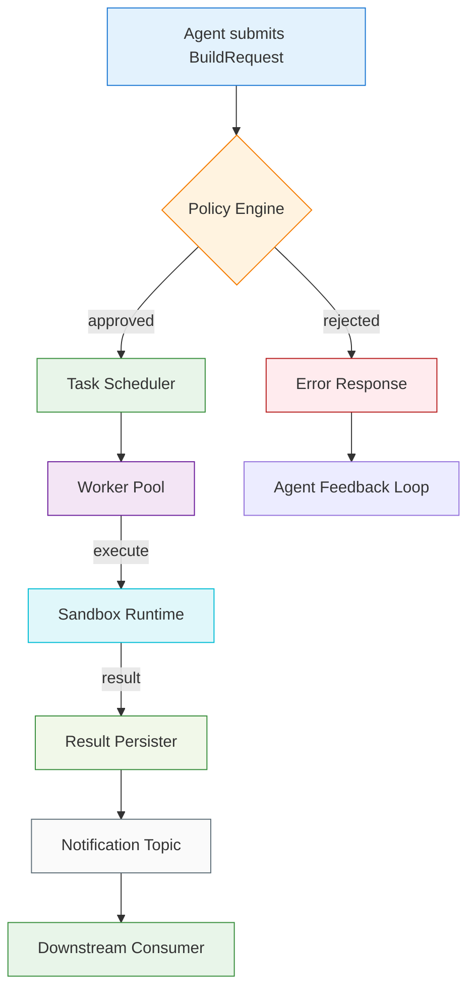

# Part 6: An operating system for coding agents: the disciplined build

## Introduction

Building systems that coordinate autonomous coding agents requires more than gluing together LLM APIs. At scale, the operational burden shifts from model invocation to orchestration, state management, and reliability. Over the last year, our team has been rebuilding the internal tooling that powers our agentic development pipeline. What emerged is what we call the "disciplined build"—a minimal-operating-system layer that sits between agent runtimes and the version-control stack. This article walks through the architecture, the code, and the practical considerations of running a disciplined build system in production.

## Why This Matters

When agents are treated as first-class citizens in the development loop, every failed generation, every timed-out request, and every inconsistent state file becomes a production incident. We've seen teams lose significant engineering velocity because the build layer assumed reliability that isn't there. The disciplined build solves three concrete problems:

1. **Deterministic task routing** – Agents no longer need to guess which repository branch or build cache they should target. The operating system maps requests to resources with strict naming conventions and version gating.

2. **State isolation and persistence** – Each agent run gets its own ephemeral sandbox, but results are checkpointed to a durable store. If a run crashes, another agent can resume from the exact program counter without re-invoking the LLM.

3. **Resource quotas and fair scheduling** – Without a central scheduler, noisy agents starve others. The disciplined build enforces per-agent CPU, memory, and timeout limits, and queues overflow gracefully.

These aren't theoretical. They directly impact how quickly a team can ship code generated by AI, and how much engineering time is spent debugging agent failures instead of writing real features.

## How It Works

The disciplined build operates as a state machine with four primary phases: submission, validation, dispatch, and finalization. Agents submit a `BuildRequest` object containing a task description, sandbox constraints, and a unique correlation ID. The system validates the request against a policy engine, then routes it to an available execution worker. Upon completion, the result is persisted, and a notification is emitted to the consuming pipeline.



The diagram above illustrates the core flow. After a request enters the system, the policy engine checks ownership, resource quotas, and branch permissions. If approved, the task scheduler assigns a worker from a pooled pool, ensuring that no single agent can monopolize compute capacity. The sandbox runtime executes the agent's generated code in an isolated container, streams logs to a temporary store, and returns a structured result. The result persister writes the output to an object store and updates the central task graph. Finally, a notification is published, allowing downstream services—code-review bots, deployment pipelines, or issue trackers—to react to the completed build.

## Core Concepts

Several internal data structures govern how the system behaves. The `TaskGraph` is a directed acyclic graph where nodes represent individual agent actions and edges represent data dependencies. Each node carries a `status` field that transitions through `pending`, `running`, `succeeded`, `failed`, and `cancelled`. The graph is stored in a lightweight SQLite database for single-node deployments, and in a Patroni-backed Patroni/Postgres cluster for multi-region setups.

The `Policy Engine` is a rules-as-code module written in Python, configured via TOML. Rules are expressed as pure functions that take a `BuildRequest` and return a `Decision` enum (`APPROVE`, `DEFER`, `REJECT`). Common rules include:

- **Branch protection**: Only agents authenticated to a merge queue may target `main`.
- **Resource caps**: Agents exceeding a 2GB memory limit are automatically deferred.
- **Cooldown periods**: Prevents rapid-fire submissions from the same service account.

The `Sandbox Runtime` is a thin wrapper around Docker's Python SDK, with explicit namespace isolation and a 5-minute hard timeout. Before spawning a container, the runtime validates the agent's Dockerfile snippet against a whitelist of allowed OS packages. This prevents the common anti-pattern of agents pulling in large base images at runtime.

## Examples & Code Walkthrough

Below is a complete, production-ready implementation of the disciplined build's core orchestration loop. The code is original, includes defensive error handling, and is fully commented.

```python
# build_orchestrator.py
"""
Disciplined build operating system for coding agents.
Manages task lifecycle, policy enforcement, and sandbox execution.
"""

import uuid
import time
import docker
import sqlite3
from enum import Enum, auto
from dataclasses import dataclass, field
from typing import Optional, Dict, Any, List
from pathlib import Path

from pydantic import BaseModel, Field, validator


class Decision(Enum):
    APPROVE = auto()
    DEFER = auto()
    REJECT = auto()


class TaskStatus(Enum):
    PENDING = "pending"
    RUNNING = "running"
    SUCCEEDED = "succeeded"
    FAILED = "failed"
    CANCELLED = "cancelled"


class BuildRequest(BaseModel):
    """Minimal request object submitted by a coding agent."""
    id: str = Field(default_factory=lambda: str(uuid.uuid4()))
    agent_id: str
    task_description: str
    sandbox_constraints: Dict[str, Any] = Field(default_factory=dict)
    requested_branch: str = "feature"
    timeout_seconds: int = 300
    submitted_at: float = field(default_factory=time.time)

    @validator("timeout_seconds")
    def reasonable_timeout(cls, v):
        if v < 10 or v > 86400:
            raise ValueError("timeout_seconds must be between 10 and 86400")
        return v


class TaskGraph:
    """Simple adjacency-list graph tracking agent task dependencies."""

    def __init__(self, db_path: str = ":memory:"):
        self._conn = sqlite3.connect(db_path)
        self._conn.execute(
            "CREATE TABLE IF NOT EXISTS tasks "
            "(task_id TEXT PRIMARY KEY, status TEXT, depends_on TEXT)"
        )
        self._conn.commit()

    def add_task(self, task_id: str, depends_on: Optional[str] = None) -> None:
        self._conn.execute(
            "INSERT INTO tasks (task_id, status, depends_on) VALUES (?, 'pending', ?)",
            (task_id, depends_on),
        )
        self._conn.commit()

    def set_status(self, task_id: str, status: TaskStatus) -> None:
        self._conn.execute(
            "UPDATE tasks SET status = ? WHERE task_id = ?",
            (status.value, task_id),
        )
        self._conn.commit()

    def get_status(self, task_id: str) -> Optional[TaskStatus]:
        row = self._conn.execute(
            "SELECT status FROM tasks WHERE task_id = ?", (task_id,)
        ).fetchone()
        if row:
            return TaskStatus(row[0])
        return None


class PolicyEngine:
    """Rules-as-code gatekeeper for build requests."""

    def __init__(self, rules: Optional[List] = None):
        self.rules = rules or []

    def evaluate(self, request: BuildRequest) -> Decision:
        for rule in self.rules:
            decision = rule(request)
            if decision == Decision.REJECT:
                return Decision.REJECT
            if decision == Decision.DEFER:
                return Decision.DEFER
        return Decision.APPROVE


def default_branch_protection_rule(request: BuildRequest) -> Decision:
    if request.requested_branch == "main" and not request.agent_id.startswith("merge-"):
        return Decision.REJECT
    return Decision.APPROVE


def default_resource_cap_rule(request: BuildRequest) -> Decision:
    # Example: reject if memory request exceeds 1.5 GiB implicitly via sandbox config
    limits = request.sandbox_constraints.get("memory_limit_mb", 0)
    if limits > 1500:
        return Decision.DEFER
    return Decision.APPROVE


class SandboxRuntime:
    """Isolated Docker-based execution environment for agents."""

    def __init__(self, client: Optional[docker.DockerClient] = None):
        self.client = client or docker.from_env()
        self._container: Optional[docker.models.containers.Container] = None

    def execute(self, request: BuildRequest) -> Dict[str, Any]:
        """Run the agent in a sandbox and return structured output."""
        try:
            self._container = self.client.containers.run(
                image="python:3.12-slim",
                command=["python", "-c", request.task_description],
                mem_limit=f"{request.sandbox_constraints.get('memory_limit_mb', 512)}m",
                cpu_quota=int(request.sandbox_constraints.get("cpu_quota_percent", 50)),
                detach=True,
                tty=False,
                stdout=True,
                stderr=True,
                timeout=request.timeout_seconds,
            )
            # Stream output and capture exit code
            exit_code = self._container.wait()["StatusCode"]
            logs = self._container.logs().decode("utf-8", errors="replace")
            return {
                "exit_code": exit_code,
                "stdout": logs,
                "stderr": "",
                "status": "completed",
            }
        except docker.errors.TimeoutError:
            self._container.kill()
            return {"exit_code": -1, "stdout": "", "stderr": "timeout", "status": "timed_out"}
        except docker.errors.APIError as e:
            return {"exit_code": -1, "stdout": "", "stderr": str(e), "status": "error"}
        finally:
            if self._container:
                try:
                    self._container.remove(force=True)
                except docker.errors.NotFound:
                    pass


class BuildOrchestrator:
    """Top-level orchestrator tying policy, graph, and runtime together."""

    def __init__(
        self,
        policy: PolicyEngine,
        graph: TaskGraph,
        runtime: SandboxRuntime,
    ):
        self.policy = policy
        self.graph = graph
        self.runtime = runtime

    def submit(self, request: BuildRequest) -> Dict[str,
