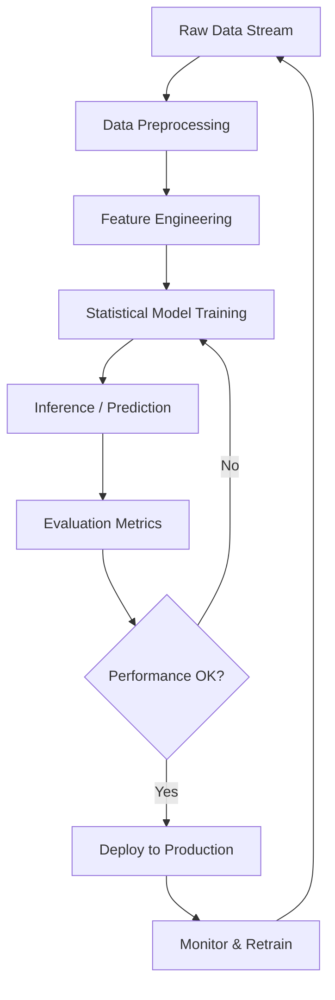

# Part 6 - STATISTICS

## Introduction

You've spent years building systems that process millions of requests per second. You've optimized memory allocation, fine-tuned database queries, and profiled CPU bottlenecks. But at some point, you hit a wall that most engineers never encounter: the data itself. Not the code, not the infrastructure, not the network. The data.

If you've worked with machine learning models, you know that the quality of your predictions is only as good as the statistical properties of your training data. A model trained on biased or noisy data will produce garbage, no matter how sophisticated your algorithm. This is where statistics enters the picture.

Statistics is the backbone of any data-driven system. It's the science of extracting meaningful patterns from randomness. It's the difference between a model that "works" and one that "actually works." In this article, we'll dissect the core statistical concepts that every engineer should understand when building or evaluating AI systems.

## Why This Matters

Here's the uncomfortable truth: most software engineers touch statistics only when they need to debug a flaky test or optimize a query. They don't study probability distributions, confidence intervals, or hypothesis testing. They don't understand the difference between overfitting and underfitting, or why a model's performance metrics can be misleading.

This gap is dangerous.

In production systems, a single statistical error can cascade into real business impact. Imagine a recommendation engine that serves users content it knows nothing about because its training data had a distribution shift that nobody caught. Imagine an anomaly detection system that fires false alarms because it didn't account for the natural variance in your telemetry. These aren't hypotheticals — they're the daily reality of engineers who don't understand the statistical foundations of their systems.

The reason statistics matters today is that data is everywhere, and the stakes are higher than ever. We're building systems that need to generalize from limited data, handle noisy inputs, and make decisions under uncertainty. If you don't know how to reason about these problems statistically, you're flying blind.

## How It Works

At its core, statistics in AI is about making predictions from data using probability theory and inferential methods. Let me walk you through the architecture of a typical statistical pipeline.



The pipeline above is a simplified representation of how statistics operates in real AI systems. Let me break down each stage.

### Stage 1: Data Preprocessing

Before any statistical modeling, you need clean, well-structured data. This means handling missing values, normalizing distributions, and removing outliers. The preprocessing step is where most of the statistical work happens.

Consider a scenario where your training data has a feature with a heavily skewed distribution. If you feed it directly into a linear model, you'll get biased predictions. You need to apply a transformation — perhaps a log transform, a Box-Cox transform, or even a quantile-based discretization — to stabilize the variance and make the distribution more symmetric.

### Stage 2: Feature Engineering

Feature engineering is where domain expertise meets statistical reasoning. You're creating new variables that capture meaningful patterns in the data. For example, in a fraud detection system, you might create a feature that measures the ratio of a user's transactions to their baseline activity. This ratio can reveal anomalies that the raw transaction count alone cannot.

The key here is that feature engineering is a statistical act. You're not just adding columns — you're applying mathematical transformations that reveal structure in the data. A good engineer thinks about what the data looks like, not just what the columns are.

### Stage 3: Statistical Model Training

This is where the actual learning happens. The model iteratively adjusts its parameters to minimize a loss function, which is a measure of how far off its predictions are from the true values. The loss function is the mathematical expression of your model's objective.

In statistical terms, you're estimating the parameters of a probability distribution that best fits your data. The model is essentially a hypothesis about the underlying data-generating process, and you're trying to find the parameters that maximize the likelihood of observing your data.

### Stage 4: Inference and Prediction

Once the model is trained, it's time to use it. During inference, the model takes new inputs and produces outputs based on the learned parameters. The quality of your predictions depends on how well the model's assumptions match the real-world distribution of your data.

### Stage 5: Evaluation and Monitoring

After inference, you evaluate the model using statistical metrics. Accuracy, precision, recall, F1 score, RMSE, MAE — these are all statistics that tell you how well your model is performing. But the evaluation doesn't stop there. You need to monitor the model over time to detect drift, which is when the real-world distribution starts to shift from what the model was trained on.

## Core Concepts

Let's break down the fundamental concepts that govern statistical reasoning in AI.

### Probability Distributions

A probability distribution describes how a random variable is distributed. In statistics, we model data using distributions like the normal (Gaussian), binomial, Poisson, exponential, and many others. Each distribution has its own parameters, and understanding these parameters is critical.

For example, the normal distribution is characterized by its mean (μ) and standard deviation (σ). If you're predicting a continuous variable, the normal distribution is a natural choice. If you're modeling count data, the Poisson distribution might be more appropriate.

The key insight is that the distribution tells you what you can expect. If your data follows a normal distribution, you can make predictions with confidence intervals. If it doesn't, you need to choose a different distribution or apply a transformation.

### Central Limit Theorem

The Central Limit Theorem (CLT) is one of the most powerful concepts in statistics. It states that the sampling distribution of the mean of any independent, identically distributed random variables will be approximately normal, regardless of the underlying distribution, provided the sample size is large enough.

This is why you can estimate population means using sample means, even when you don't know the population distribution. The CLT is the statistical foundation behind much of the inference you do in practice.

### Hypothesis Testing

Hypothesis testing is the process of making decisions about population parameters based on sample data. You set up a null hypothesis (H₀) and an alternative hypothesis (H₁), collect data, and compute a test statistic. If the test statistic falls in the rejection region, you reject the null hypothesis.

In AI, hypothesis testing is used all the time. You might test whether a new model performs significantly better than the baseline. You might test whether a feature has a statistically significant effect on the target variable. You might test whether the performance of two models is different.

The key is to choose the right test for your data. A t-test works for comparing means. A chi-square test works for comparing proportions. A permutation test works for any comparison. The wrong test gives you a false sense of confidence.

### Confidence Intervals

A confidence interval gives you a range of plausible values for a population parameter. If you compute a 95% confidence interval for the mean of a dataset, you're saying that if you repeated the experiment many times, 95% of the intervals would contain the true population mean.

Confidence intervals are more informative than point estimates because they tell you the precision of your estimate. A point estimate might say "the mean is 5.0," but a confidence interval says "the mean is between 4.5 and 5.5, and we're 95% confident."

### Bias-Variance Tradeoff

This is perhaps the most important concept in machine learning. A model has two sources of error: bias and variance. Bias is the error due to overly simplistic assumptions in the model. Variance is the error due to sensitivity to fluctuations in the training data.

A model with high bias underfits the data — it's too simple to capture the underlying patterns. A model with high variance overfits the data — it's too complex and captures noise as if it were signal. The goal is to find the sweet spot where the total error is minimized.

### Regularization

Regularization is a technique used to prevent overfitting by adding a penalty to the loss function. Common regularization methods include L1 (Lasso) and L2 (Ridge) regularization. L1 regularization encourages sparsity in the model parameters, effectively performing feature selection. L2 regularization discourages large parameter values, which helps prevent the model from fitting the noise in the data.

The choice of regularization strength is a hyperparameter that you tune. Too much regularization makes the model too simple. Too little regularization allows the model to overfit.

## Examples & Code Walkthrough

Let me show you some concrete examples of how statistics work in practice. We'll look at a simple hypothesis test, a confidence interval computation, and a regularization example.

### Example 1: One-Sample t-Test

Suppose you have a dataset of 50 customer satisfaction scores, and you want to test whether the mean score is significantly different from 4.0. Here's how you'd set up the hypothesis test.

```python
import numpy as np
from scipy import stats

# Simulated customer satisfaction scores
np.random.seed(42)
scores = np.random.normal(loc=4.0, scale=1.0, size=50)

# Define the null hypothesis and alternative hypothesis
null_mean = 4.0
alternative = "two-sided"

# Perform the one-sample t-test
t_stat, p_value = stats.ttest_1samp(scores, null_mean)

print(f"t-statistic: {t_stat:.4f}")
print(f"p-value: {p_value:.4f}")

# Decision
alpha = 0.05
if p_value < alpha:
    print(f"Reject H₀: The mean satisfaction score is significantly different from {null_mean}.")
else:
    print(f"Fail to reject H₀: The mean satisfaction score is not significantly different from {null_mean}.")
```

This test tells you whether the observed difference between the sample mean and the hypothesized population mean is statistically significant. If the p-value is less than 0.05, you have enough evidence to reject the null hypothesis.

### Example 2: Confidence Interval for a Mean

Now let's compute a 95% confidence interval for the same dataset.

```python
# Calculate the sample mean and standard error
sample_mean = np.mean(scores)
sample_std = np.std(scores, ddof=1)  # ddof=1 for sample standard deviation
n = len(scores)

# Standard error of the mean
se = sample_std / np.sqrt(n)

# Critical value for 95% confidence interval (z-score)
z_critical = stats.norm.ppf(0.975)  # 1.96 for two-tailed 95% CI

# Confidence interval
ci_lower = sample_mean - z_critical * se
ci_upper = sample_mean + z_critical * se

print(f"Sample mean: {sample_mean:.4f}")
print(f"95% Confidence Interval: [{ci_lower:.4f}, {ci_upper:.4f}]")
```

The confidence interval gives you a range of plausible values for the population mean. If you want to be 95% confident that the true mean falls within this range, you can use this interval.

### Example 3: Regularization with Ridge Regression

Let's look at how regularization prevents overfitting. We'll use a simple linear regression with Ridge regularization.

```python
from sklearn.linear_model import Ridge
from sklearn.model_selection import train_test_split
from sklearn.datasets import make_regression

# Generate synthetic regression data
X, y = make_regression(n_samples=1000, n_features=20, noise=10.0, random_state=42)

# Split into training and test sets
X_train, X_test, y_train, y_test = train_test_split(X, y, test_size=0.2, random_state=42)

# Train a model with different regularization strengths
alphas = [0.01, 0.1, 1.0, 10.0, 100.0]

for alpha in alphas:
    model = Ridge(alpha=alpha)
    model.fit(X_train, y_train)
    train_score = model.score(X_train, y_train)
    test_score = model.score(X_test, y_test)
    print(f"Alpha: {alpha:6.2f} | Train R²: {train_score:.4f} | Test R²: {test_score:.4f}")
```

As you can see, with a very small alpha, the model might overfit the training data. With a very large alpha, the model might underfit. The optimal alpha balances these two sources of error. This is the bias-variance tradeoff in action.

## Best Practices

Here are some actionable rules of thumb for working with statistics in production systems.

1. **Always check your assumptions.** Before you fit a model, verify that the data meets the assumptions of the method you're using. For example, if you're using a linear regression, check that the residuals are normally distributed and that there's no severe multicollinearity.

2. **Use cross-validation.** Cross-validation gives you a more reliable estimate of your model's performance by training on different subsets of the data and testing on the remaining data. It's a simple but powerful way to catch overfitting.

3. **Watch for distributional shifts.** In production, the distribution of your data can change over time. A model trained on historical data might perform poorly on new data if the distribution shifts. Monitor your model's performance metrics over time and retrain when you see a significant drift.

4. **Think about your sample size.** A small sample size can lead to unreliable statistical estimates. If you're running a hypothesis test on 10 data points, you're going to get a lot of noise. Consider increasing your sample size or using a more robust method.

5. **Don't rely on a single metric.** Accuracy, precision, recall, F1 score, and RMSE all tell you different things about your model's performance. Use a combination of metrics to get a complete picture.

6. **Document your assumptions.** If you're using a statistical method, document what assumptions it makes and what you've done to verify them. This makes your work reproducible and auditable.

## Common Mistakes & Anti-Patterns

Let me highlight three frequent pitfalls that engineers make when working with statistics.

### Pitfall 1: Confusing Correlation with Causation

This is the classic mistake. Just because two variables are correlated doesn't mean one causes the other. In a production system, this can lead to incorrect feature engineering or wrong model assumptions. For example, you might find that ice cream sales and drowning deaths are correlated, and you might conclude that ice cream causes drowning. The real explanation is that both are caused by a third variable — hot weather.

To avoid this, always look for causal relationships, not just statistical associations. Use domain knowledge to interpret your results.

### Pitfall 2: Ignoring the Data Distribution

Many engineers fit models without checking whether the data follows the assumptions of the model. A linear regression model assumes that the residuals are normally distributed. If your data is heavily skewed, the model's predictions will be biased. You need to check the distribution of your residuals and apply transformations if necessary.

### Pitfall 3: Overfitting to Training Data

Overfitting happens when a model learns the noise in the training data instead of the underlying pattern. This is especially common when you have a large number of features and a small number of training examples. The solution is to use regularization, cross-validation, and a simpler model.

## Performance Considerations

Let's analyze the performance implications of statistical methods.

### Time Complexity

The time complexity of statistical methods depends
