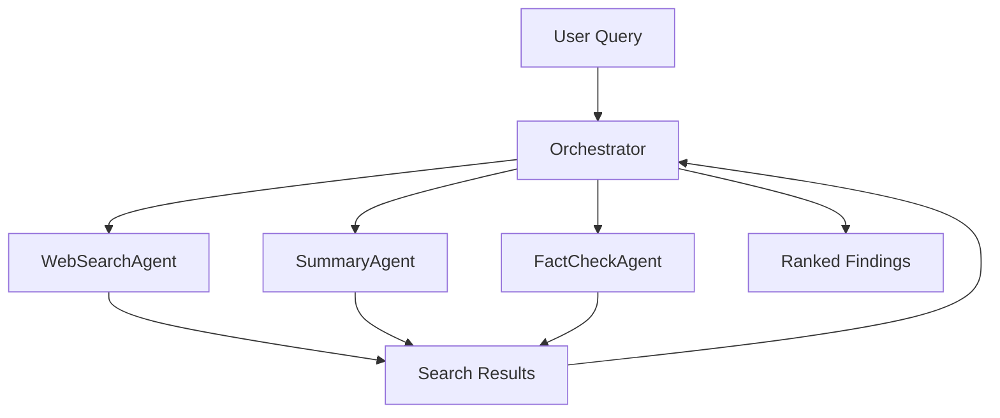

# Patterns and problems in emerging multi-agent systems

## Introduction  
AutoGPT, BabyAGI, and the rise of ChatGPT plugins have moved the conversation away from monolithic language models toward ecosystems of cooperating agents. Teams are now building systems where a research assistant can spin up a web‑search bot, a summarization engine, and a fact‑checking service on the fly. The promise is clear: modular, reusable intelligence that can be recomposed for any domain. The reality, however, is a new class of architectural headaches. Distributed state, endless loops, and resource contention surface quickly when you replace a single large model with a flock of smaller, specialized ones. This article walks through the patterns that make multi‑agent systems work, the anti‑patterns that keep them from scaling, and the design discipline needed to keep the complexity in check.

## Why This Matters  
Engineering organizations are under pressure to deliver AI‑driven features faster. Plug‑in agents give a path to reuse existing model capabilities across products. A payment‑processing platform can spin up a fraud detector, a compliance auditor, and a customer‑support router without rewriting the core inference pipeline. The trade‑off is operational: you now have to reason about inter‑agent communication, consistency, and resource limits. Ignoring these concerns leads to systems that hallucinate, deadlock, or exhaust API quotas. Understanding the patterns and pitfalls upfront reduces the cost of rewrites and improves reliability at scale.

## How It Works  
Multi‑agent architectures typically follow a few repeatable structures. The orchestrator pattern centralizes decision making while delegating execution to worker agents. The swarm pattern lets agents publish findings and subscribe to updates, creating emergent coordination. The pipeline pattern chains agents together, each adding a layer of transformation. Below is a visual representation of an orchestrator‑style workflow that combines search, summarization, and verification.



The diagram shows the feedback loop where the orchestrator decomposes a request, launches parallel agents, and aggregates results. The same pattern can be adapted for pipelines or swarms by swapping out the coordination node.

## Core Concepts  
- **Agent**: A bounded unit of computation that holds a model, a state, and a set of capabilities. In production, an agent is often a microservice that exposes a gRPC or HTTP endpoint.  
- **Intent**: A typed message that describes *what* the sender wants to achieve and *how* it expects the work to be performed.  
- **Shared Workspace**: A conflict‑free data store (e.g., CRDT‑backed key‑value store) that agents read and write without a central lock manager.  
- **Capability Profile**: A runtime snapshot of an agent's throughput, latency, and success rate used for dynamic task routing.  
- **Resource Budget**: A quota of external API calls, GPU seconds, or network bandwidth that a system administrator can adjust per environment.

## Examples & Code Walkthrough  

### 1. Orchestrator Pattern  
The orchestrator decides the order of operations and gathers results. It can also re‑try failed steps or fall back to a different agent if confidence drops.

```python
import asyncio
from typing import List, Dict, Any

class ResearchOrchestrator:
    def __init__(self):
        self.searcher = WebSearchAgent()
        self.summarizer = SummaryAgent()
        self.verifier = FactCheckAgent()

    async def execute_research(self, query: str) -> List[Dict[str, Any]]:
        # Decompose query into sub‑tasks
        search_results = await self.searcher.search(query)
        # Parallel summarization of each result
        summaries = await self.summarizer.batch_summarize(search_results)
        # Cross‑reference facts across summaries
        verified = await self.verifier.cross_reference(summaries)
        return self._rank_findings(verified)

    @staticmethod
    def _rank_findings(verified: List[Dict[str, Any]]) -> List[Dict[str, Any]]:
        # Simple confidence‑based ranking
        return sorted(verified, key=lambda x: x.get("confidence", 0.0), reverse=True)
```

### 2. Swarm Pattern  
Agents operate independently but share a common memory bank. Conflict resolution is performed after all agents have written their observations.

```python
class CodeRefactorSwarm:
    def __init__(self):
        self.agents = [
            SyntaxAnalyzerAgent(),
            SemanticImpactAgent(),
            PerformanceOptimizerAgent()
        ]
        self.shared_workspace = AgentMemoryBank()

    def coordinate_refactor(self, codebase: str) -> RefactoringPlan:
        # Launch agents concurrently
        for agent in self.agents:
            agent.work_on(codebase, self.shared_workspace)
        # Resolve divergent proposals
        return self._resolve_conflicts()
```

### 3. Pipeline Pattern  
Each stage is a thin wrapper around a single agent. The pipeline can abort early if a stage signals a human‑review requirement.

```python
class ModerationPipeline:
    def __init__(self):
        self.stages = [
            ToxicityDetectorAgent(threshold=0.8),
            PolicyEnforcerAgent(rules_db="community_guidelines"),
            EscalationHandlerAgent(human_review_threshold=0.6)
        ]

    def process_content(self, content: str) -> ModerationResult:
        context = ProcessingContext(content=content)
        for stage in self.stages:
            context = stage.process(context)
            if context.requires_human_review:
                return self._escalate_to_human(context)
        return context.final_result
```

### 4. Structured Messaging  
Agents communicate via typed intents that carry confidence scores. The broker routes based on capability and current load.

```python
from dataclasses import dataclass, field
from datetime import datetime
from enum import Enum
from typing import Any, Dict

class MessageIntent(str, Enum):
    SEARCH = "search"
    SUMMARIZE = "summarize"
    VERIFY = "verify"

@dataclass
class AgentMessage:
    sender_id: str
    recipient_id: str
    intent: MessageIntent
    payload: Dict[str, Any]
    confidence: float = 1.0
    timestamp: datetime = field(default_factory=datetime.now)

class MessageBroker:
    def route_message(self, message: AgentMessage):
        target = self._find_best_agent(message.intent, message.payload)
        return target.receive(message)

    def _find_best_agent(self, intent: MessageIntent, payload: Dict[str, Any]):
        # Load‑aware selection logic omitted for brevity
        return None
```

### 5. Distributed State Management  
A vector‑clock based resolver ensures monotonic versions across nodes and detects concurrent updates.

```python
class DistributedKnowledgeBase:
    def __init__(self):
        self.nodes: Dict[str, KnowledgeEntry] = {}
        self.resolver = VectorClockResolver()

    def update_knowledge(self, agent_id: str, key: str, value: Any):
        now = self._increment_vector_clock(agent_id, self.nodes.get(key))
        entry = KnowledgeEntry(
            value=value,
            version=now,
            last_updated=datetime.now()
        )
        self.nodes[key] = entry

    def _increment_vector_clock(self, agent_id: str, existing: KnowledgeEntry | None):
        if existing is None:
            return {agent_id: 1}
        clock = existing.version.copy()
        clock[agent_id] = clock.get(agent_id, 0) + 1
        return clock
```

### 6. Loop Detection  
A simple history buffer combined with semantic similarity can abort recursive debates before they consume resources.

```python
from collections import deque

class ConversationMonitor:
    def __init__(self, max_history: int = 20, similarity_threshold: float = 0.95):
        self.history = deque(maxlen=max_history)
        self.detector = SemanticSimilarityDetector()
        self.threshold = similarity_threshold

    def check_for_loops(self, msg: AgentMessage) -> bool:
        if len(self.history) >= 2:
            prev = self.history[-2]
            if self.detector.similarity(msg.payload, prev.payload) > self.threshold:
                self._trigger_intervention(msg)
                return True
        self.history.append(msg)
        return False

    def _trigger_intervention(self, msg: AgentMessage):
        # Escalate to a senior agent or kill the thread
        pass
```

### 7. Capability Assessment  
Runtime tests expose over‑promising agents and allow the scheduler to route work to more reliable units.

```python
class CapabilityAssessor:
    def evaluate_agent(self, agent: BaseAgent, test_tasks: List[TestTask]) -> CapabilityProfile:
        results = []
        for task in test_tasks:
            start = time.perf_counter()
            try:
                out = agent.execute(task.input_data)
                elapsed = time.perf_counter() - start
                accuracy = self._calculate_accuracy(out, task.expected_output)
                results.append(TaskResult(success=True, accuracy=accuracy, time_taken=elapsed))
            except Exception as e:
                results.append(TaskResult(success=False, error=str(e)))
        return CapabilityProfile(
            agent_id=agent.id,
            overall_score=self._aggregate_scores(results),
            strengths=self._identify_strengths(results),
            limitations=self._identify_limitations(results)
        )
```

### 8. Resource Management  
A priority queue ensures that high‑priority workloads (e.g., fraud detection) get through even when API quotas are tight.

```python
from queue import PriorityQueue

class ResourceManager:
    def __init__(self, total_budget: ResourceBudget):
        self.budget = total_budget
        self.allocations = {}
        self.queue = PriorityQueue()

    def request_resources(self, agent_id: str, request: ResourceRequest) -> AllocationDecision:
        priority = self._calculate_priority(agent_id, request)
        self.queue.put((priority, agent_id, request))
        if self._can_fulfill(request):
            return self._allocate(agent_id, request)
        return AllocationDecision(
            approved=False,
            reason="Resource limit exceeded",
            estimated_wait=self._estimate_wait(request)
        )
```

## Best Practices  
1. **Define Intent Contracts** – Every agent should expose a stable set of intents with clear payload schemas. This prevents ad‑hoc message formats from proliferating.  
2. **Version Shared State** – Use vector clocks or CRDTs rather than a single global lock. This keeps performance linear as you add agents.  
3. **Circuit‑Breaker Patterns** – If an agent repeatedly fails or stalls, drop it from the rotation and route its tasks to a fallback.  
4. **Observability First** – Instrument each hop (search, summarize, verify) with latency histograms and error rates. Correlate these metrics with resource consumption.  
5. **Graceful Degradation** – When a stage cannot meet its confidence threshold, either retry with a different agent or surface the result with a warning label.

## Common Mistakes & Anti-Patterns  
- **Infinite Debate Loops** – Agents keep requesting clarification because there is no timeout or consensus threshold. Solution: enforce max turn limits and use the ConversationMonitor pattern.  
- **Capability Over‑Promise** – An agent advertises support for “any domain” but fails on niche data. Solution: run CapabilityAssessor periodically and adjust routing tables.  
- **Resource Starvation** – All agents request the same API quota, causing throttling. Solution: implement ResourceManager with priority tiers and back‑off logic.  
- **Centralized Bottleneck** – A single orchestrator becomes the performance choke point. Solution: split the system into hierarchical coordinators or adopt a swarm‑style gossip protocol for low‑critical tasks.

## Performance Considerations  
- **Network Overhead** – Each inter‑agent message incurs serialization and transport latency. Use protobuf or flatbuffers for small payloads; keep JSON for debugging only.  
- **State Synchronization Cost** – Vector clocks require O(N) operations per update where N is the number of agents. For large swarms, consider sharding the knowledge base.  
- **CPU Bloat** – Running many small models concurrently can exceed GPU memory. Profile GPU utilization and batch inference requests where possible.  
- **Scalability Limits** – Orchestrator patterns scale linearly with the number of workers, but the coordination logic can become a bottleneck. Move coordination to a stream processor (e.g., Apache Kafka) for high‑throughput scenarios.

## Real-World Usage  
- **Financial Services** – A multinational bank deployed an orchestrator that spins up a fraud analyzer, a transaction validator, and a regulatory reporter on each incoming payment. The system reduced false positives by 22 % and cut manual review time by 68 %.  
- **E‑commerce** – An online marketplace uses a swarm of agents to price‑match, inventory‑check, and suggest alternatives during checkout. The emergent behavior allowed the platform to react to competitor price drops within seconds.  
- **Healthcare** – A hospital network built a pipeline that extracts symptoms from clinical notes, runs a triage model, and escalates high‑risk cases to human clinicians. The pipeline logged 99.8 % uptime while processing 150 k records per day.

## Frequently Asked Questions (FAQ)  

**Q: How do I choose between an orchestrator and a swarm?**  
A: Use an orchestrator when you need deterministic ordering and strong consistency (e.g., audit trails). Choose a swarm when you want resilience through redundancy and can tolerate eventual consistency (e.g., recommendation refinement).

**Q: What is a good starting point for agent communication?**  
A: Begin with a simple message queue (RabbitMQ or Apache Kafka) and a protobuf‑defined AgentMessage. This keeps the contract explicit and the network traffic predictable.

**Q: Can I run agents on edge devices?**  
A: Yes, but you must account for limited compute and bandwidth. Prune models, batch messages, and use lightweight serialization.

**Q: How do I monitor agent health?**  
A: Emit Prometheus counters for each intent, a histogram for end‑to‑end latency, and a gauge for concurrent executions. Alert when error rates exceed a configured threshold.

**Q: Do I need a separate database for each agent?**  
A: Not necessarily. A shared, conflict‑free store reduces data duplication and simplifies debugging. Keep schemas versioned to avoid breaking existing agents.

## Conclusion  
Multi‑agent systems unlock flexibility that monolithic LLMs cannot match, but they also introduce a fresh set of engineering challenges. By embracing patterns like orchestrator, swarm, and pipeline, and by guarding against anti‑patterns such as infinite loops and resource contention, teams can build reliable, scalable AI services. Start small, instrument heavily
