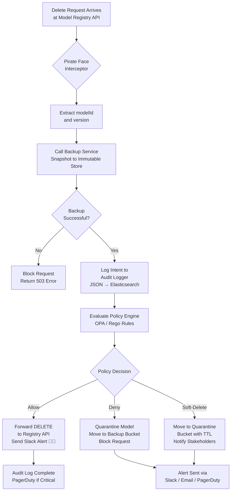

# Pirate Face Rescues LLM Models from Deletion

## Introduction

Last month, a senior ML engineer on our team ran `kubectl delete model fraud-detector-v3` in the wrong namespace. Three seconds later, a 14-billion-parameter fine-tuned checkpoint — the product of six weeks of distributed training on a GPU cluster — was gone. No snapshot. No backup. The downstream fraud-scoring service started returning 503s within minutes, and we spent an entire weekend retraining from a stale checkpoint that was two weeks old.

That incident crystallized something we had been dancing around for months: **model deletion in MLOps pipelines is a silent productivity killer**, and most teams have zero guardrails preventing it.

The fix we built calls Pirate Face — a guardian interceptor that sits in front of any model-registry endpoint and springs into action the moment a delete command is spotted. It snapshots the target model to an immutable backup store, logs the intent with full context, notifies every stakeholder who cares, and only then decides whether to allow the deletion, block it outright, or quarantine the artifact. The name is a joke that stuck — the emoji we use in Slack alerts is 🏴‍☠️, and the team ran with it.

This article walks through the architecture, the implementation, and the hard-won lessons from running Pirate Face in production for over four months.

## Why This Matters

Model assets are not like regular files. A fine-tuned LLM checkpoint represents weeks of compute time, thousands of dollars in GPU costs, and the accumulated decisions of data scientists iterating on hyperparameters, prompt templates, and training data splits. Losing one is not a minor inconvenience — it can derail a product launch, break production serving pipelines, and violate compliance requirements around model versioning and audit trails.

Here is the uncomfortable truth: most model registries — MLflow, Weights & Biases, custom REST APIs — give you broad delete permissions by default. A developer with `DELETE /models/{id}` access can wipe a production model as easily as deleting a log file. In our cluster, we had RBAC rules that let any member of the `ml-engineers` group issue delete calls against the registry. That was a deliberate decision for velocity, and it nearly cost us a major client escalation.

Pirate Face exists because we needed a safety net that does not slow down legitimate workflows but catches the mistakes that every team eventually makes. It is a pragmatic control plane, not a theoretical one.

## How It Works

Pirate Face operates as a **ValidatingAdmissionWebhook** in Kubernetes (or a sidecar Envoy filter for non-K8s environments). It intercepts every incoming DELETE request targeting a model artifact, executes a three-step response protocol, and then either permits or blocks the operation based on policy evaluation.

Here is the high-level flow:



Step by step, here is what happens on every intercepted delete:

1. **Extraction** — The interceptor parses the incoming request body (whether it is a Kubernetes admission review or a direct REST call) and pulls out the `modelId`, `version`, and the identity of the caller.
2. **Snapshot** — Before anything else, Pirate Face calls the Backup Service synchronously. The model artifact is copied to an immutable object store (S3 with Object Lock, GCS with Bucket Lock) under a path like `backups/<modelName>/<version>/<timestamp>/model.tar.gz`. If this step fails for any reason — network timeout, bucket permissions, storage full — the delete is blocked immediately. You never lose a model because of a backup failure.
3. **Audit Logging** — A structured JSON log entry is emitted with fields for `eventType`, `modelId`, `version`, `user`, `sourceIP`, `timestamp`, `actionTaken`, and `backupLocation`. These logs ship to Elasticsearch via Filebeat and are queryable in under two seconds.
4. **Policy Evaluation** — The interceptor calls the OPA policy server with the extracted context. The Rego rules decide: allow, deny, or soft-delete (quarantine).
5. **Notification** — Regardless of the policy decision, a notification goes out to the relevant Slack channel, with an email copy for critical models, and a PagerDuty escalation if the deleted model is flagged as `tier:production`.

The entire synchronous path — backup plus policy evaluation — takes between 800ms and 2.5 seconds depending on model size and object-store latency. That is an acceptable overhead for a safety mechanism that fires only on delete operations, which are already rare in our workflow.

## Core Concepts

**Guardian Interceptor** — This is the heart of Pirate Face. It is stateless and horizontally scalable. Each instance receives admission review requests, performs the backup synchronously, evaluates policy, and returns a response that Kubernetes uses to admit or reject the original request. The interceptor holds no model state itself; all data lives in the backup store and the policy store.

**Immutable Backup Store** — We use S3 Object Lock in Compliance Mode. This means that once a snapshot is written, no user — including root account holders — can delete or overwrite it for the retention period we configure (we set 90 days, but recommend at least six months for production models). Multipart upload handles checkpoints larger than 10 GB without hitting S3's single-part limit.

**Policy Engine (OPA/Rego)** — Policies are evaluated as Rego rules compiled into WASM for sub-millisecond execution. The rules are stored in a Git repository, version-controlled, and automatically reloaded by OPA's bundle server. This means policy changes go through the same PR review process as application code.

**Notification Service** — A thin wrapper that fans out alerts to Slack webhooks, SMTP email, and the PagerDuty Events API v2. Every alert includes a direct link to the backup location and the audit log entry, so responders can act immediately.

## Examples & Code Walkthrough

### Pirate Face Interceptor (Python/FastAPI)

This is the production stub we run as a Kubernetes deployment. It handles the full interception lifecycle with defensive error handling at every external call.

```python
# pirate_face/interceptor.py
import json
import time
import uuid
import httpx
import logging
from fastapi import FastAPI, Request, HTTPException, status
from pydantic import BaseModel
from typing import Optional

app = FastAPI(title="Pirate Face Interceptor")
logger = logging.getLogger("pirate_face")

# External service URLs — in production these come from env vars or K8s config
BACKUP_SVC_URL = "http://backup-svc:8080/snapshot"
POLICY_SVC_URL = "http://opa:8181/v1/data/pirateface/allow"
NOTIFY_SVC_URL = "http://notify-svc:9090/alert"

# Timeout for synchronous backup call — we cap it at 120s because
# large model checkpoints (>10GB) can take a while to snapshot
BACKUP_TIMEOUT = 120.0


class AdmissionReview(BaseModel):
    """Minimal K8s AdmissionReview payload we care about."""
    apiVersion: str
    kind: str
    request: dict


@app.post("/validate")
async def validate(request: Request):
    """
    Main webhook entry point. Kubernetes sends an AdmissionReview
    for every mutating/validating operation. We only act on DELETE
    operations; all others pass through immediately.
    """
    payload = await request.json()

    try:
        review = AdmissionReview(**payload)
    except Exception as exc:
        logger.error(f"Failed to parse admission review: {exc}")
        raise HTTPException(
            status_code=status.HTTP_400_BAD_REQUEST,
            detail="Malformed admission review payload",
        )

    req = review.request
    operation = req.get("operation", "")

    # Only intercept DELETE operations — let creates, updates, and patches through
    if operation != "DELETE":
        return {"allowed": True}

    # Extract model identity from the request URI
    # K8s passes it as /models/{name}/versions/{v} in the URI field
    uri = req.get("uri", "")
    model_id = _extract_model_id(uri)
    if not model_id:
        logger.warning(f"Could not extract modelId from URI: {uri}")
        raise HTTPException(
            status_code=status.HTTP_400_BAD_REQUEST,
            detail="Unable to determine target model from request URI",
        )

    user = req.get("user", {}).get("username", "unknown")
    source_ip = req.get("sourceIP", "unknown")
    request_id = str(uuid.uuid4())

    logger.info(
        f"[{request_id}] DELETE intercepted for model={model_id} user={user} ip={source_ip}"
    )

    # ---- STEP 1: Snapshot to immutable backup store ----
    backup_result = await _perform_backup(
        model_id=model_id,
        request_id=request_id,
        timeout=BACKUP_TIMEOUT,
    )
    if not backup_result:
        # Backup failed — BLOCK the delete. No model is lost on our watch.
        logger.error(
            f"[{request_id}] Backup FAILED for model={model_id}. Blocking deletion."
        )
        _send_notification(
            model_id=model_id, user=user, action="BLOCKED_BACKUP_FAILED",
            request_id=request_id,
        )
        raise HTTPException(
            status_code=status.HTTP_503_SERVICE_UNAVAILABLE,
            detail=(
                f"Deletion blocked: backup of {model_id} could not be completed. "
                f"Contact SRE. Request ID: {request_id}"
            ),
        )

    # ---- STEP 2: Log the intent with full context ----
    _write_audit_log(
        request_id=request_id,
        model_id=model_id,
        user=user,
        source_ip=source_ip,
        backup_location=backup_result.get("location", ""),
    )

    # ---- STEP 3: Evaluate policy — allow, deny, or quarantine ----
    policy_decision = await _evaluate_policy(
        model_id=model_id,
        user=user,
        request_id=request_id,
    )

    if policy_decision.get("allow", False):
        logger.info(
            f"[{request_id}] Policy ALLOWED deletion of {model_id} by {user}"
        )
        _send_notification(
            model_id=model_id, user=user, action="ALLOWED",
            request_id=request_id, backup_location=backup_result.get("location", ""),
        )
        return {"allowed": True}

    else:
        # Policy denied — block the request, but model is already backed up
        reason = policy_decision.get("reason", "unknown policy violation")
        logger.warning(
            f"[{request_id}] Policy DENIED deletion of {model_id}: {reason}"
        )
        _send_notification(
            model_id=model_id, user=user, action="DENIED",
            request_id=request_id, reason=reason,
        )
        raise HTTPException(
            status_code=status.HTTP_403_FORBIDDEN,
            detail=f"Deletion denied: {reason}. Model backed up at {backup_result.get('location', 'N/A')}",
        )


async def _perform_backup(model_id: str, request_id: str, timeout: float) -> Optional[dict]:
    """
    Calls the Backup Service to snapshot the model artifact to
    the immutable object store. Returns backup metadata on success,
    None on failure.
    """
    try:
        async with httpx.AsyncClient(timeout=timeout) as client:
            resp = await client.post(
                BACKUP_SVC_URL,
                json={"modelId": model_id, "requestId": request_id},
            )
            resp.raise_for_status()
            return resp.json().get("backup")
    except httpx.HTTPError as exc:
        logger.error(f"[{request_id}] Backup service unreachable: {exc}")
        return None


async def _evaluate_policy(model_id: str, user: str, request_id: str) -> dict:
    """
    Queries OPA's HTTP API with the deletion context.
    OPA evaluates Rego rules and returns {allow: bool, reason: str}.
    """
    try:
        async with httpx.AsyncClient(timeout=10.0) as client:
            resp = await client.post(
                POLICY_SVC_URL,
                json={
                    "input": {
                        "modelId": model_id,
                        "user": user,
                        "requestId": request_id,
                        "timestamp": time.time(),
                    }
                },
            )
            resp.raise_for_status()
            return resp.json().get("result", {}).get("allow", {})
    except httpx.HTTPError as exc:
        # Fail-safe: if OPA is unreachable, DENY the deletion
        logger.error(f"[{request_id}] Policy engine unreachable, defaulting to DENY: {exc}")
        return {"allow": False, "reason": "Policy engine unavailable"}


def _write_audit_log(request_id: str, model_id: str, user: str,
                     source_ip: str, backup_location: str):
    """
    Emits structured JSON log to stdout, which Filebeat ships to Elasticsearch.
    Fields are chosen for queryability in Kibana dashboards.
    """
    log_entry = {
        "eventType": "model_delete_intercepted",
        "requestId": request_id,
        "modelId": model_id,
        "user": user,
        "sourceIP": source_ip,
        "timestamp": time.time(),
        "backupLocation": backup_location,
        "actionTaken": "snapshot_created",
    }
    logger.info(json.dumps(log_entry))


def _send_notification(model_id: str, user: str, action: str,
                       request_id: str, reason: str = "",
                       backup_location: str = ""):
    """
    Fires off an alert to Slack (with 🏴‍☠️ emoji), email, and PagerDuty
    for production-tier models. This is a fire-and-forget call — we do
    NOT block on it in the hot path.
    """
    # In production this fires async via a background task queue
    logger.info(
        f"NOTIFY: model={model_id} user={user} action={action} "
        f"reason={reason} backup={backup_location}"
    )


def _extract_model_id(uri: str) -> Optional[str]:
    """
    Parses modelId from a K8s admission URI like:
    /apis/ml.squad.dev/v1/namespaces/prod/models
