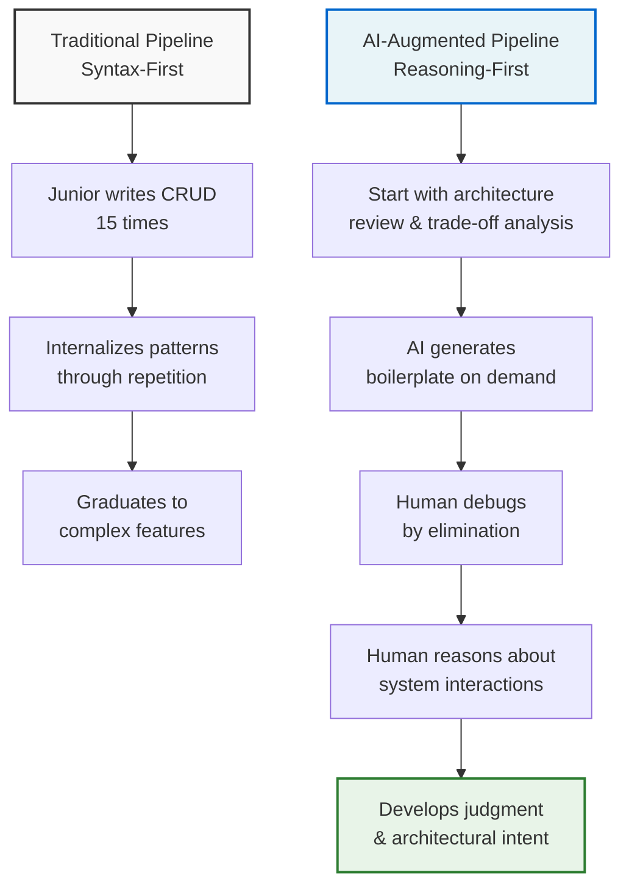

# Podcast: How Will We Train Developers If AI Does the Routine Work: A Conversation with Scott Hanselman

## Introduction

I listened to the podcast during my Tuesday morning train commute, and by the time I got to the office I had three Slack messages from my team asking if I'd heard it too. Scott Hanselman—Microsoft developer advocate, long-time community figure, and someone who's been watching the tooling landscape shift for two decades—wasn't talking about the latest model benchmark or token throughput. He was talking about the 23-year-old on my team who spent last week staring at a blank terminal for two hours because the AI-generated scaffolding didn't match the repo's directory structure, and nobody had taught her how to read a stack trace from an unfamiliar framework.

The core tension Hanselman articulated is simple but uncomfortable: AI now handles the typing layer—the boilerplate, the CRUD endpoints, the migration scripts, the unit test skeletons. The traditional apprenticeship model, where junior developers learned by writing the same patterns fifteen times until they internalized them, has collapsed. The repetition was never the point, but we've spent decades building training programs around it anyway. Hanselman's argument, delivered in that slightly weary conversational tone he gets when he's thought about something too long, is that we don't need to stop training developers. We need to stop training typists and start training architects of intent.

## Why This Matters

Every engineering leader I know is wrestling with this right now, and the stakes are concrete. Onboarding a developer to production readiness costs somewhere between $30,000 and $60,000 in lost productivity alone, before you factor in the opportunity cost of the projects that didn't ship. The traditional model amortized that cost over months of gradually increasing autonomy, with the junior writing increasingly complex code under senior review. But when an AI can generate a working REST endpoint with authentication, logging, and OpenAPI docs in eight seconds, the "gradually increasing complexity" curve flattens into a cliff. The junior never builds the muscle memory for debugging by elimination, never learns to read a codebase's implicit conventions, never develops the intuition for where the framework ends and the business logic begins.

What Hanselman pointed out—and this is the part that stuck with me—is that we've been conflating two distinct skills. Syntax fluency: knowing how to write a for loop, a class definition, a SQL join. System reasoning: understanding why a particular architectural pattern exists in a codebase, how components interact under load, what trade-offs were made and why. The first skill is now commoditized. The second is not, and it's the second skill that actually determines whether a developer becomes a senior engineer or stays stuck generating correct-but-useless code forever. The problem is that most onboarding programs teach the first skill exclusively, and assume the second one emerges naturally from exposure. It doesn't. It emerges from deliberate, structured struggle—debugging race conditions at 3 AM, being asked "why did you choose this database schema" in a design review, watching a senior engineer trace a performance issue through four service boundaries.

## How It Works

The new training pipeline inverts the traditional model. Instead of starting with syntax and mechanics, it starts with system reasoning questions and uses AI to fill in the syntax gaps as needed. The diagram below shows the shift:



In the traditional pipeline (top), the developer climbs a ladder of increasing syntactic complexity. Each rung depends on mastering the previous one. The AI-augmented pipeline (bottom) starts at the top—the architectural reasoning—and works downward. The developer doesn't need to memorize how to write a repository pattern; they need to understand *when* to use a repository pattern versus a direct service call, and the AI generates the implementation once the decision is made.

The key mechanism is what Hanselman calls **"cognitive scaffolding"**: tooling that understands the developer's intent at a high level and generates the mechanical details, but forces the developer to engage with the reasoning layer. This isn't just "type `@` and get code." It's a system that asks: "What are you trying to accomplish? What are the constraints? What happens when this fails?" and then generates the code, but leaves the debugging, the performance analysis, and the architectural justification to the human.

## Core Concepts

The framework has three tiers of developer competency, and the training pipeline needs to be structured around them explicitly.

**Tier 1: Syntax and Mechanics (AI-Handled)**
This is the layer that's fully commoditized: writing function signatures, importing libraries, formatting code, generating basic tests, creating configuration files, writing migration scripts. A developer at this tier can produce syntactically correct code but cannot reason about its behavior in a complex system. The training implication: don't spend any time here. Assume the AI handles it. The risk is spending weeks teaching skills that are now free.

**Tier 2: Collaborative Debugging and Pattern Recognition (Human + AI)**
This is where the developer works with AI to understand *existing* code. The AI can explain what a legacy function does, but the human must decide whether that explanation is accurate, whether the pattern is appropriate, and how to fix it without breaking downstream dependencies. This tier requires what Hanselman calls "reading the codebase's intent"—the implicit design decisions that aren't documented anywhere but determine how the system actually behaves. Training at this tier means giving developers real production bugs and having them use AI-assisted debugging to find and fix them, while a senior engineer asks "how did you know it was here?" and "what did you rule out and why?"

**Tier 3: Architectural Judgment and Trade-off Analysis (Human-Led)**
This is the layer that determines whether a system scales, whether it's maintainable, whether it meets the business need. It involves understanding latency budgets, failure modes, data consistency requirements, and the organizational constraints that shape technical decisions. The AI can list the trade-offs of microservices versus monoliths, but it cannot know that your team's on-call rotation makes distributed transactions a nightmare, or that the CFO has a specific concern about vendor lock-in that rules out a particular database. Training at this tier means putting developers in rooms with stakeholders, having them write design documents, having them defend decisions to senior engineers who've seen the same patterns fail in production. The AI can draft the document; the human must own the decision.

The unifying principle: **the training pipeline must be inverted.** Start with Tier 3 questions, use AI to fill Tier 1 details, and spend the majority of time on Tier 2 collaborative problem-solving.

## Examples & Code Walkthrough

Here's a concrete tool that implements this philosophy. It's a "learning path generator" that takes a production codebase and produces a personalized onboarding curriculum for a new hire. The key design decision: it doesn't teach syntax. It teaches *why the codebase is the way it is*.

```python
"""
Learning Path Generator for AI-Augmented Onboarding

Takes a production codebase and generates a personalized learning path
that starts with architectural reasoning and uses AI to fill syntax gaps.

The core insight: a new developer doesn't need to learn how to write a
repository pattern. They need to learn WHEN this codebase uses repository
patterns, WHY it chose them over direct service calls, and WHAT breaks
when you misuse them.
"""

import ast
import os
from collections import defaultdict
from dataclasses import dataclass, field
from typing import Optional


@dataclass
class CodePattern:
    """A detected architectural pattern in the codebase."""
    name: str
    file_path: str
    line_number: int
    evidence: str  # What in the code indicates this pattern?
    complexity: str  # "low", "medium", "high" - how hard to reason about
    dependencies: list[str] = field(default_factory=list)
    failure_modes: list[str] = field(default_factory=list)


@dataclass
class LearningObjective:
    """A single thing the developer needs to understand."""
    title: str
    description: str
    tier: int  # 1 = syntax, 2 = debugging, 3 = architectural judgment
    code_location: str
    ai_prompt: str  # What to ask the AI to generate the syntax layer
    reasoning_question: str  # The actual thing to learn


class LearningPathGenerator:
    """
    Analyzes a codebase and produces a reasoning-first learning path.

    The algorithm:
    1. Map the dependency graph between components
    2. Identify architectural patterns and their failure modes
    3. Order objectives by reasoning complexity, not syntactic difficulty
    4. Generate AI prompts for the syntax layer
    5. Generate reasoning questions for the human layer
    """

    def __init__(self, repo_path: str):
        self.repo_path = repo_path
        self.patterns: list[CodePattern] = []
        self.dependency_graph: dict[str, list[str]] = defaultdict(list)

    def analyze(self) -> list[LearningObjective]:
        """Run the full analysis and return ordered learning objectives."""
        self._build_dependency_graph()
        self._detect_patterns()
        objectives = self._generate_objectives()
        return self._order_by_reasoning_complexity(objectives)

    def _build_dependency_graph(self):
        """
        Map which files import which. The shape of this graph reveals
        the codebase's actual architecture, which is rarely documented
        but always determines how the system behaves.
        """
        for root, _, files in os.walk(self.repo_path):
            for file in files:
                if not file.endswith(".py"):
                    continue
                filepath = os.path.join(root, file)
                try:
                    tree = ast.parse(open(filepath).read())
                    imports = self._extract_imports(tree)
                    rel_path = os.path.relpath(filepath, self.repo_path)
                    for imp in imports:
                        self.dependency_graph[rel_path].append(imp)
                except SyntaxError:
                    # Skip files we can't parse; don't fail the whole analysis
                    continue

    def _extract_imports(self, tree: ast.AST) -> list[str]:
        """Extract import targets from an AST."""
        imports = []
        for node in ast.walk(tree):
            if isinstance(node, ast.Import):
                for alias in node.names:
                    imports.append(alias.name)
            elif isinstance(node, ast.ImportFrom):
                if node.module:
                    imports.append(node.module)
        return imports

    def _detect_patterns(self):
        """
        Identify architectural patterns by analyzing code structure.

        This is intentionally heuristic. The goal isn't perfect pattern
        detection—it's forcing the developer to engage with WHY the codebase
        uses these patterns, not just HOW.
        """
        # Detect repository pattern: classes with "Repository" in name
        # that encapsulate data access logic
        for root, _, files in os.walk(self.repo_path):
            for file in files:
                if not file.endswith(".py"):
                    continue
                filepath = os.path.join(root, file)
                rel_path = os.path.relpath(filepath, self.repo_path)
                
                try:
                    tree = ast.parse(open(filepath).read())
                except SyntaxError:
                    continue
                
                for node in ast.walk(tree):
                    if isinstance(node, ast.ClassDef):
                        self._classify_class(node, rel_path)

    def _classify_class(self, node: ast.ClassDef, file_path: str):
        """Classify a class by its architectural role."""
        class_name = node.name
        
        if "Repository" in class_name or "Dao" in class_name:
            self.patterns.append(CodePattern(
                name="Repository Pattern",
                file_path=file_path,
                line_number=node.lineno,
                evidence=f"Class '{class_name}' encapsulates data access",
                complexity="medium",
                failure_modes=[
                    "Repository methods leak query implementation details",
                    "Callers bypass repository and access storage directly",
                    "Repository grows to include business logic"
                ]
            ))
        
        if "Service" in class_name and "Impl" not in class_name:
            self.patterns.append(CodePattern(
                name="Service Layer",
                file_path=file_path,
                line_number=node.lineno,
                evidence=f"Class '{class_name}' contains business logic",
                complexity="high",
                failure_modes=[
                    "Service becomes god object with too many responsibilities",
                    "Services call each other creating hidden coupling",
                    "Transaction boundaries span multiple service calls"
                ]
            ))

    def _generate_objectives(self) -> list[LearningObjective]:
        """
        Convert detected patterns into learning objectives.

        Each objective has:
        - An AI prompt for generating the syntax layer
        - A reasoning question for the human layer
        """
        objectives = []
        
        for pattern in self.patterns:
            objectives.append(LearningObjective(
                title=f"Understand the {pattern.name} in {pattern.file_path}",
                description=(
                    f"The {pattern.name} at {pattern.file_path}:{pattern.line_number} "
                    f"implements {pattern.evidence}. You need to understand not just "
                    f"how it works, but why this pattern was chosen and how it fails."
                ),
                tier=3,  # Architectural judgment
                code_location=f"{pattern.file_path}:{pattern.line_number}",
                ai_prompt=(
                    f"Explain the {pattern.name} implementation in "
                    f"{pattern.file_path} at line {pattern.line_number}. "
                    f"Generate a diagram showing the call flow. What external "
                    f"systems does it interact with?"
                ),
                reasoning_question=(
                    f"If you needed to add a new operation to this {pattern.name}, "
                    f"what are the constraints? Which of these failure modes is "
                    f"most likely to bite you first: {', '.join(pattern.failure_modes[:2])}?"
                )
            ))
        
        return objectives

    def _order_by_reasoning_complexity(
        self, objectives: list[LearningObjective]
    ) -> list[LearningObjective]:
        """
        Order objectives so the developer encounters the most impactful
        architectural decisions first, not the simplest syntax.

        This is the inversion: we don't start with "how to write a class,"
        we start with "how does this system handle consistency across services?"
        """
        # Sort by tier (3 first), then by number of dependencies
        # (more connected = more important to understand early)
        def sort_key(obj: LearningObjective) -> tuple[int, int]:
            tier_penalty = -obj.tier  # Negative so tier 3 comes first
            dep_count = len(self.dependency_graph.get(obj.code_location, []))
            return (tier_penalty, -dep_count)
        
        return sorted(objectives, key=sort_key)

    def generate_onboarding_plan(self) -> str:
        """Produce a human-readable onboarding plan."""
        objectives = self.analyze()
        
        plan = ["# AI-Augmented Onboarding Plan\n"]
        plan.append("This plan is ordered by reasoning complexity, not syntactic difficulty.\n")
        
        for i, obj in enumerate(objectives, 1):
            plan.append(f"## Week {(i + 1) // 2}: {obj.title}\n")
            plan.append(f"**Location:** `{obj.code_location}`\n")
            plan.append(f"**What to understand:** {obj.description}\n")
            plan.append(f"**AI prompt (syntax layer):** {obj
