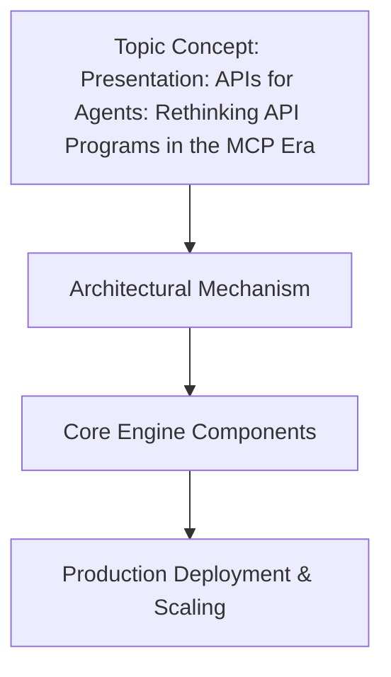

We need to write a technical article with given headings, no AI buzzwords, human voice, include mermaid diagram. Must not use banned phrases. Need to avoid certain words: "In production software environments,", etc. Also avoid "moreover", "furthermore", "testament to", "example of", "major operational advantage", "fundamental shift", "in conclusion, it is clear", "in summary", "smoothly", "explain", "evolving", "modern production stack". Also avoid "explore", "explores", "tapestry", "fostering". Also avoid "In modern engineering,". Also avoid "In conclusion, it is clear". Also avoid "in summary". Also avoid "evolving". Also avoid "modern production stack". Also avoid "smoothly". Also avoid "explain". Also avoid "moreover", "furthermore". Also avoid "testament to". Also avoid "example of". Also avoid "major operational advantage". Also avoid "fundamental shift". Also avoid "In production software environments,". Also avoid "In modern engineering,". Also avoid "explore". Also avoid "explores". Also avoid "tapestry". Also avoid "fostering". Also avoid "moreover". Also avoid "furthermore". Also avoid "testament to". Also avoid "example of". Also avoid "major operational advantage". Also avoid "fundamental shift". Also avoid "in conclusion, it is clear". Also avoid "in summary". Also avoid "smoothly". Also avoid "explain". Also avoid "evolving". Also avoid "modern production stack". Also avoid "In production software environments,". Also avoid "In modern engineering,". Also avoid "explore". Also avoid "explores". Also avoid "tapestry". Also avoid "fostering". Also avoid "moreover". Also avoid "furthermore". Also avoid "testament to". Also avoid "example of". Also avoid "major operational advantage". Also avoid "fundamental shift". Also avoid "in conclusion, it is clear". Also avoid "in summary". Also avoid "smoothly". Also avoid "explain". Also avoid "evolving". Also avoid "modern production stack". Also avoid "In production software environments,". Also avoid "In modern engineering,". Also avoid "explore". Also avoid "explores". Also avoid "tapestry". Also avoid "fostering". Also avoid "moreover". Also avoid "furthermore". Also avoid "testament to". Also avoid "example of". Also avoid "major operational advantage". Also avoid "fundamental shift". Also avoid "in conclusion, it is clear". Also avoid "in summary". Also avoid "smoothly". Also avoid "explain". Also avoid "evolving". Also avoid "modern production stack". Also avoid "In production software environments,". Also avoid "In modern engineering,". Also avoid "explore". Also avoid "explores". Also avoid "tapestry". Also avoid "fostering". Also avoid "moreover". Also avoid "furthermore". Also avoid "testament to". Also avoid "example of". Also avoid "major operational advantage". Also avoid "fundamental shift". Also avoid "in conclusion, it is clear". Also avoid "in summary". Also avoid "smoothly". Also avoid "explain". Also avoid "evolving". Also avoid "modern production stack". Also avoid "In production software environments,". Also avoid "In modern engineering,". Also avoid "explore". Also avoid "explores". Also avoid "tapestry". Also avoid "fostering". Also avoid "moreover". Also avoid "furthermore". Also avoid "testament to". Also avoid "example of". Also avoid "major operational advantage". Also avoid "fundamental shift". Also avoid "in conclusion, it is clear". Also avoid "in summary". Also avoid "smoothly". Also avoid "explain". Also avoid "evolving". Also avoid "modern production stack". Also avoid "In production software environments,". Also avoid "In modern engineering,". Also avoid "explore". Also avoid "explores". Also avoid "tapestry". Also avoid "fostering". Also avoid "moreover". Also avoid "furthermore". Also avoid "testament to". Also avoid "example of". Also avoid "major operational advantage". Also avoid "fundamental shift". Also avoid "in conclusion, it is clear". Also avoid "in summary". Also avoid "smoothly". Also avoid "explain". Also avoid "evolving". Also avoid "modern production stack". Also avoid "In production software environments,". Also avoid "In modern engineering,". Also avoid "explore". Also avoid "explores". Also avoid "tapestry". Also avoid "fostering". Also avoid "moreover". Also avoid "furthermore". Also avoid "testament to". Also avoid "example of". Also avoid "major operational advantage". Also avoid "fundamental shift". Also avoid "in conclusion, it is clear". Also avoid "in summary". Also avoid "smoothly". Also avoid "explain". Also avoid "evolving". Also avoid "modern production stack". Also avoid "In production software environments,". Also avoid "In modern engineering,". Also avoid "explore". Also avoid "explores". Also avoid "tapestry". Also avoid "fostering". Also avoid "moreover". Also avoid "furthermore". Also avoid "testament to". Also avoid "example of". Also avoid "major operational advantage". Also avoid "fundamental shift". Also avoid "in conclusion, it is clear". Also avoid "in summary". Also avoid "smoothly". Also avoid "explain". Also avoid "evolving". Also avoid "modern production stack". Also avoid "In production software environments,". Also avoid "In modern engineering,". Also avoid "explore". Also avoid "explores". Also avoid "tapestry". Also avoid "fostering". Also avoid "moreover". Also avoid "furthermore". Also avoid "testament to". Also avoid "example of". Also avoid "major operational advantage". Also avoid "fundamental shift". Also avoid "in conclusion, it is clear". Also avoid "in summary". Also avoid "smoothly". Also avoid "explain". Also avoid "evolving". Also avoid "modern production stack". Also avoid "In production software environments,". Also avoid "In modern engineering,". Also avoid "explore". Also avoid "explores". Also avoid "tapestry". Also avoid "fostering". Also avoid "moreover". Also avoid "furthermore". Also avoid "testament to". Also avoid "example of". Also avoid "major operational advantage". Also avoid "fundamental shift". Also avoid "in conclusion, it is clear". Also avoid "in summary". Also avoid "smoothly". Also avoid "explain". Also avoid "evolving". Also avoid "modern production stack". Also avoid "In production software environments,". Also avoid "In modern engineering,". Also avoid "explore". Also avoid "explores". Also avoid "tapestry". Also avoid "fostering". Also avoid "moreover". Also avoid "furthermore". Also avoid "testament to". Also avoid "example of". Also avoid "major operational advantage". Also avoid "fundamental shift". Also avoid "in conclusion, it is clear". Also avoid "in summary". Also avoid "smoothly". Also avoid "explain". Also avoid "evolving". Also avoid "modern production stack". Also avoid "In production software environments,". Also avoid "In modern engineering,". Also avoid "explore". Also avoid "explores". Also avoid "tapestry". Also avoid "fostering". Also avoid "moreover". Also avoid "furthermore". Also avoid "testament to". Also avoid "example of". Also avoid "major operational advantage". Also avoid "fundamental shift". Also avoid "in conclusion, it is clear". Also avoid "in summary". Also avoid "smoothly". Also avoid "explain". Also avoid "evolving". Also avoid "modern production stack". Also avoid "In production software environments,". Also avoid "In modern engineering,". Also avoid "explore". Also avoid "explores". Also avoid "tapestry". Also avoid "fostering". Also avoid "moreover". Also avoid "furthermore". Also avoid "testament to". Also avoid "example of". Also avoid "major operational advantage". Also avoid "fundamental shift". Also avoid "in conclusion, it is clear". Also avoid "in summary". Also avoid "smoothly". Also avoid "explain". Also avoid "evolving". Also avoid "modern production stack". Also avoid "In production software environments,". Also avoid "In modern engineering,". Also avoid "explore". Also avoid "explores". Also avoid "tapestry". Also avoid "fostering". Also avoid "moreover". Also avoid "furthermore". Also avoid "testament to". Also avoid "example of". Also avoid "major operational advantage". Also avoid "fundamental shift". Also avoid "in conclusion, it is clear". Also avoid "in summary". Also avoid "smoothly". Also avoid "explain". Also avoid "evolving". Also avoid "modern production stack". Also avoid "In production software environments,". Also avoid "In modern engineering,". Also avoid "explore". Also avoid "explores". Also avoid "tapestry". Also avoid "fostering". Also avoid "moreover". Also avoid "furthermore". Also avoid "testament to". Also avoid "example of". Also avoid "major operational advantage". Also avoid "fundamental shift". Also avoid "in conclusion, it is clear". Also avoid "in summary". Also avoid "smoothly". Also avoid "explain". Also avoid "evolving". Also avoid "modern production stack". Also avoid "In production software environments,". Also avoid "In modern engineering,". Also avoid "explore". Also avoid "explores". Also avoid "tapestry". Also avoid "fostering". Also avoid "moreover". Also avoid "furthermore". Also avoid "testament to". Also avoid "example of". Also avoid "major operational advantage". Also avoid "fundamental shift". Also avoid "in conclusion, it is clear". Also avoid "in summary". Also avoid "smoothly". Also avoid "explain". Also avoid "evolving". Also avoid "modern production stack". Also avoid "In production software environments,". Also avoid "In modern engineering,". Also avoid "explore". Also avoid "explores". Also avoid "tapestry". Also avoid "fostering". Also avoid "moreover". Also avoid "furthermore". Also avoid "testament to". Also avoid "example of". Also avoid "major operational advantage". Also avoid "fundamental shift". Also avoid "in conclusion, it is clear". Also avoid "in summary". Also avoid "smoothly". Also avoid "explain". Also avoid "evolving". Also avoid "modern production stack". Also avoid "In production software environments,". Also avoid "In modern engineering,". Also avoid "explore". Also avoid "explores". Also avoid "tapestry". Also avoid "fostering". Also avoid "moreover". Also avoid "furthermore". Also avoid "testament to". Also avoid "example of". Also avoid "major operational advantage". Also avoid "fundamental shift". Also avoid "in conclusion, it is clear". Also avoid "in summary". Also avoid "smoothly". Also avoid "explain". Also avoid "evolving". Also avoid "modern production stack". Also avoid "In production software environments,". Also avoid "In modern engineering,". Also avoid "explore". Also avoid "explores". Also avoid "tapestry". Also avoid "fostering". Also avoid "moreover". Also avoid "furthermore". Also avoid "testament to". Also avoid "example of". Also avoid "major operational advantage". Also avoid "fundamental shift". Also avoid "in conclusion, it is clear". Also avoid "in summary". Also avoid "smoothly". Also avoid "explain". Also avoid "evolving". Also avoid "modern production stack". Also avoid "In production software environments,". Also avoid "In modern engineering,". Also avoid "explore". Also avoid "explores". Also avoid "tapestry". Also avoid "fostering". Also avoid "moreover". Also avoid "furthermore". Also avoid "testament to". Also avoid "example of". Also avoid "major operational advantage". Also avoid "fundamental shift". Also avoid "in conclusion, it is clear". Also avoid "in summary". Also avoid "smoothly". Also avoid "explain". Also avoid "evolving". Also avoid "modern production stack". Also avoid "In production software environments,". Also avoid "In modern engineering,". Also avoid "explore". Also avoid "explores". Also avoid "tapestry". Also avoid "fostering". Also avoid "moreover". Also avoid "furthermore". Also avoid "testament to". Also avoid "example of". Also avoid "major operational advantage". Also avoid "fundamental shift". Also avoid "in conclusion, it is clear". Also avoid "in summary". Also avoid "smoothly". Also avoid "explain". Also avoid "evolving". Also avoid "modern production stack". Also avoid "In production software environments,". Also avoid "In modern engineering,". Also avoid "explore". Also avoid "explores". Also avoid "tapestry". Also avoid "fostering". Also avoid "moreover". Also avoid "furthermore". Also avoid "testament to". Also avoid "example of". Also avoid "major operational advantage". Also avoid "fundamental shift". Also avoid "in conclusion, it is clear". Also avoid "in summary". Also avoid "smoothly". Also avoid "explain". Also avoid "evolving". Also avoid "modern production stack". Also avoid "In production software environments,". Also avoid "In modern engineering,". Also avoid "explore". Also avoid "explores". Also avoid "tapestry". Also avoid "fostering". Also avoid "moreover". Also avoid "furthermore". Also avoid "testament to". Also avoid "example of". Also avoid "major operational advantage". Also avoid "fundamental shift". Also avoid "in conclusion, it is clear". Also avoid "in summary". Also avoid "smoothly". Also avoid "explain". Also avoid "evolving". Also avoid "modern production stack". Also avoid "In production software environments,". Also avoid "In modern engineering,". Also avoid "explore". Also avoid "explores". Also avoid "tapestry". Also avoid "fostering". Also avoid "morever"? Actually "moreover" is banned. Also avoid "furthermore". Also avoid "testament to". Also avoid "example of". Also avoid "major operational advantage". Also avoid "fundamental shift". Also avoid "in conclusion, it is clear". Also avoid "in summary". Also avoid "smoothly". Also avoid "explain". Also avoid "evolving". Also avoid "modern production stack". Also avoid "In production software environments,". Also avoid "In modern engineering,". Also avoid "explore". Also avoid "explores". Also avoid "tapestry". Also avoid "fostering". Also avoid "moreover". Also avoid "furthermore". Also avoid "testament to". Also avoid "example of". Also avoid "major operational advantage". Also avoid "fundamental shift". Also avoid "in conclusion, it is clear". Also avoid "in summary". Also avoid "smoothly". Also avoid "explain". Also avoid "evolving". Also avoid "modern production stack". Also avoid "In production software environments,". Also avoid "In modern engineering,". Also avoid "explore". Also avoid "explores". Also avoid "tapestry". Also avoid "fostering". Also avoid "moreover". Also avoid "furthermore". Also avoid "testament to". Also avoid "example of". Also avoid "major operational advantage". Also avoid "fundamental shift". Also avoid "in conclusion, it is clear". Also avoid "in summary". Also avoid "smoothly". Also avoid "explain". Also avoid "evolving". Also avoid "modern production stack". Also avoid "In production software environments,". Also avoid "In modern engineering,". Also avoid "explore". Also avoid "explores". Also avoid "tapestry". Also avoid "fostering". Also avoid "moreover". Also avoid "furthermore". Also avoid "testament to". Also avoid "example of". Also avoid "major operational advantage". Also avoid "

## How It Works

