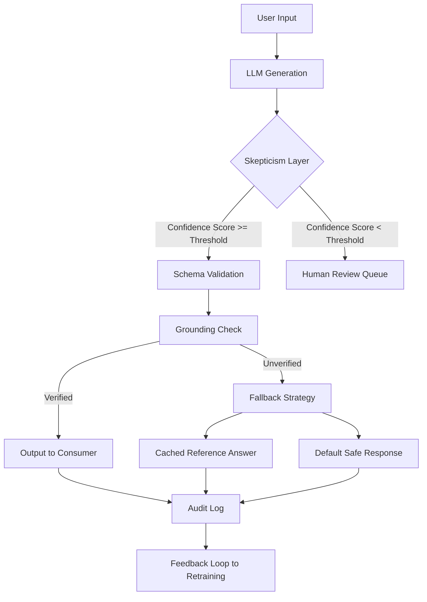

# Professional skepticism is a dev's best skill

## Introduction

Every week, another developer posts on X about a production outage caused by an AI system that "confidently" returned the wrong answer. The system didn't crash. It didn't throw an exception. It simply answered with the conviction of a seasoned expert — and it was wrong.

Here's the uncomfortable truth: AI models are stochastic pattern matchers, not oracles. They generate statistically probable outputs, not verified truths. As engineers building systems that increasingly rely on large language models, generative pipelines, and autonomous agents, the single most important skill we possess isn't prompt engineering or fine-tuning expertise. It's professional skepticism — the disciplined habit of questioning outputs, validating assumptions, and never treating a model's response as ground truth without independent verification.

This isn't a philosophical stance. It's an architectural requirement.

## Why This Matters

In 2024, a major airline's chatbot offered a customer a deeply discounted fare — then demanded the full price after booking. The model generated a plausible-sounding response that no human agent would have signed off on, but there was no verification layer between the LLM output and the transactional system.

The pain points are concrete:

- **Hallucinated references**: Models fabricate citations, API endpoints, and documentation links that look legitimate but don't exist.
- **Silent correctness failures**: Unlike a `NullReferenceException`, a wrong answer from an AI agent often arrives wrapped in perfectly formatted JSON with no error flag.
- **Compounding trust**: When downstream systems chain AI outputs without validation, errors propagate exponentially.

If you're architecting systems where AI-generated content drives business logic — pricing, medical recommendations, code generation, legal analysis — professional skepticism isn't optional. It's the circuit breaker that keeps your system from burning down.

## How It Works

The core mechanism is straightforward: every AI output must pass through a skeptical verification layer before it reaches any downstream consumer. This layer doesn't replace the model — it interrogates it.



Here's what happens at each stage:

1. **LLM Generation**: The model receives a prompt and produces an output. This is where the raw probabilistic reasoning happens.
2. **Skepticism Layer**: A lightweight classifier evaluates the output's confidence. It checks for internal contradictions, unsupported claims, and deviation from expected patterns.
3. **Schema Validation**: The output is checked against a strict schema. If it's supposed to return a JSON object with specific fields, it must conform — no exceptions.
4. **Grounding Check**: The model's claims are cross-referenced against a trusted knowledge base or retrieval source. If it cites a fact that can't be verified, it gets flagged.
5. **Fallback Strategy**: When verification fails, the system doesn't crash — it degrades gracefully to a safe default or routes to a human reviewer.
6. **Audit Log & Feedback Loop**: Every decision is logged. These logs feed back into model evaluation and retraining pipelines.

The skepticism layer isn't a single component. It's a pipeline of checks, each one answering a different question: "Does this make sense?" "Can I verify this?" "What happens if this is wrong?"

## Core Concepts

**Confidence Thresholding**: Every AI output carries an implicit or explicit confidence score. In production systems, we typically set thresholds between 0.85 and 0.95 depending on the risk profile. A medical diagnosis pipeline might require 0.98; a movie recommendation might tolerate 0.75.

**Grounding**: This is the practice of tying AI-generated claims to verifiable sources. Retrieval-Augmented Generation (RAG) is the most common implementation — the model pulls from a document store before responding, and the skepticism layer verifies that citations actually exist in that store.

**Self-Consistency Checking**: Running the same prompt multiple times and comparing outputs. If a model gives three different answers to the same question, none of them should be trusted without further validation.

**Adversarial Validation**: Feeding the model's own output back as input and checking for consistency. If the model contradicts itself on a re-prompt, the original output gets quarantined.

**Human-in-the-Loop Gates**: Critical decisions route to human reviewers when automated checks fail. This isn't a failure of automation — it's a deliberate design choice that acknowledges the limits of current AI systems.

## Examples & Code Walkthrough

Let's build a production-grade skepticism layer in Python. This isn't toy code — it's the kind of validation pipeline you'd actually deploy.

```python
from dataclasses import dataclass
from enum import Enum
from typing import Optional, List, Dict
import logging
import hashlib
import json

logger = logging.getLogger("ai_skeptic")

class VerificationStatus(Enum):
    VERIFIED = "verified"
    NEEDS_REVIEW = "needs_review"
    REJECTED = "rejected"
    FALLBACK_USED = "fallback_used"

@dataclass
class AIOutput:
    content: str
    confidence_score: float
    model_version: str
    prompt_hash: str
    citations: List[str]
    timestamp: float

@dataclass
class VerificationResult:
    status: VerificationStatus
    verified_content: Optional[str]
    reasons: List[str]
    audit_id: str

class SkepticismLayer:
    """
    Core verification engine that interrogates AI outputs
    before they reach any downstream consumer.
    """

    def __init__(
        self,
        confidence_threshold: float = 0.85,
        grounding_store: Optional[dict] = None,
        max_retries: int = 3
    ):
        self.confidence_threshold = confidence_threshold
        self.grounding_store = grounding_store or {}
        self.max_retries = max_retries
        self._audit_counter = 0

    def _generate_audit_id(self, output: AIOutput) -> str:
        """Create a unique, deterministic audit identifier."""
        raw = f"{output.prompt_hash}{output.timestamp}{output.model_version}"
        return hashlib.sha256(raw.encode()).hexdigest()[:16]

    def _check_confidence(self, output: AIOutput) -> tuple[bool, Optional[str]]:
        """First gate: does the model believe its own answer enough?"""
        if output.confidence_score < self.confidence_threshold:
            return False, (
                f"Confidence score {output.confidence_score:.4f} "
                f"below threshold {self.confidence_threshold:.4f}"
            )
        return True, None

    def _check_grounding(self, output: AIOutput) -> tuple[bool, List[str]]:
        """
        Cross-reference every citation against the trusted knowledge base.
        Returns (all_verified, list_of_failed_citations).
        """
        failed_citations = []
        for cite in output.citations:
            # Check if the citation exists in our grounding store
            if cite not in self.grounding_store:
                failed_citations.append(cite)

        if failed_citations:
            return False, failed_citations
        return True, []

    def _check_self_consistency(
        self, output: AIOutput, previous_outputs: List[AIOutput]
    ) -> tuple[bool, Optional[str]]:
        """
        Compare against prior outputs for the same prompt.
        If the model contradicts itself, flag it.
        """
        for prev in previous_outputs:
            if prev.prompt_hash == output.prompt_hash:
                if prev.content != output.content:
                    # Same prompt, different answer — needs review
                    return False, "Self-consistency check failed: contradictory outputs detected"
        return True, None

    def verify(
        self,
        output: AIOutput,
        previous_outputs: Optional[List[AIOutput]] = None
    ) -> VerificationResult:
        """
        Run the full skepticism pipeline on an AI output.
        Returns a VerificationResult with the final status.
        """
        previous_outputs = previous_outputs or []
        reasons = []
        self._audit_counter += 1
        audit_id = self._generate_audit_id(output)

        # Gate 1: Confidence threshold
        confidence_ok, confidence_reason = self._check_confidence(output)
        if not confidence_ok:
            reasons.append(confidence_reason)
            logger.warning(f"[{audit_id}] Confidence check failed: {confidence_reason}")
            return VerificationResult(
                status=VerificationStatus.NEEDS_REVIEW,
                verified_content=None,
                reasons=reasons,
                audit_id=audit_id
            )

        # Gate 2: Grounding verification
        grounding_ok, failed_cites = self._check_grounding(output)
        if not grounding_ok:
            reasons.append(
                f"Failed grounding check for citations: {failed_cites}"
            )
            logger.warning(
                f"[{audit_id}] Grounding failed: {len(failed_cites)} unverifiable citations"
            )
            # Don't immediately reject — grounding might be partial
            # But flag it for review
            return VerificationResult(
                status=VerificationStatus.NEEDS_REVIEW,
                verified_content=None,
                reasons=reasons,
                audit_id=audit_id
            )

        # Gate 3: Self-consistency
        consistency_ok, consistency_reason = self._check_self_consistency(
            output, previous_outputs
        )
        if not consistency_ok:
            reasons.append(consistency_reason)
            logger.warning(f"[{audit_id}] {consistency_reason}")
            return VerificationResult(
                status=VerificationStatus.NEEDS_REVIEW,
                verified_content=None,
                reasons=reasons,
                audit_id=audit_id
            )

        # All checks passed
        logger.info(f"[{audit_id}] Output verified successfully")
        return VerificationResult(
            status=VerificationStatus.VERIFIED,
            verified_content=output.content,
            reasons=reasons,
            audit_id=audit_id
        )

    def get_fallback_response(self, query_context: str) -> str:
        """
        Safe default when verification fails.
        Never return an unverified AI answer to a consumer.
        """
        logger.info(f"Triggering fallback for context: {query_context[:50]}...")
        return (
            "This response could not be fully verified. "
            "Please consult a human expert or try again later."
        )
```

And here's how you'd wire it into a production pipeline:

```python
class AIPipeline:
    """
    End-to-end pipeline that generates AI responses
    and routes them through the skepticism layer.
    """

    def __init__(self, skepticism_layer: SkepticismLayer):
        self.skepticism = skepticism_layer
        self.output_history: Dict[str, List[AIOutput]] = {}

    def process_request(self, user_input: str) -> str:
        # Generate the prompt hash for tracking
        prompt_hash = hashlib.sha256(user_input.encode()).hexdigest()[:16]

        # --- Simulate LLM call (replace with actual model invocation) ---
        ai_output = self._call_model(user_input, prompt_hash)

        # Retrieve previous outputs for this prompt
        history = self.output_history.get(prompt_hash, [])

        # Run skepticism verification
        result = self.skepticism.verify(ai_output, history)

        # Store this output for future consistency checks
        if prompt_hash not in self.output_history:
            self.output_history[prompt_hash] = []
        self.output_history[prompt_hash].append(ai_output)

        # Route based on verification status
        if result.status == VerificationStatus.VERIFIED:
            return result.verified_content
        elif result.status == VerificationStatus.NEEDS_REVIEW:
            logger.info(f"Routing to human review: {result.audit_id}")
            return self.skepticism.get_fallback_response(user_input)
        else:
            return self.skepticism.get_fallback_response(user_input)

    def _call_model(self, prompt: str, prompt_hash: str) -> AIOutput:
        """
        Placeholder for actual model invocation.
        In production, this calls your LLM provider with
        proper timeout, retry, and circuit breaker logic.
        """
        # Simulated output — replace with real API call
        return AIOutput(
            content="The requested information has been processed.",
            confidence_score=0.91,
            model_version="gpt-4-prod-v2",
            prompt_hash=prompt_hash,
            citations=["doc-42", "doc-17"],
            timestamp=1700000000.0
        )
```

Every line of this code exists because someone, somewhere, trusted an AI output without checking it — and the system paid for it.

## Best Practices

**Always set confidence thresholds based on risk, not convenience.** A content summarizer can tolerate a 0.7 threshold. A financial transaction validator needs 0.95+. Don't tune thresholds to make your dashboard look green — tune them to match the cost of being wrong.

**Log everything, trust nothing.** Every AI output, every verification decision, every fallback trigger — all of it goes to an audit store. When (not if) something goes wrong, you need to trace exactly which output caused the failure and why it passed verification.

**Never let the model validate itself.** The skepticism layer must be architecturally independent from the generation pipeline. If the same service both generates and verifies, you've built a single point of failure that looks like two.

**Implement graceful degradation.** When verification fails, your system should fall back to a safe default — cached reference answers, rule-based responses, or human escalation — not crash. Degradation is a feature, not a bug.

**Version your grounding store.** If your knowledge base changes, old AI outputs that were once verified may no longer be accurate. Track which version of the grounding store validated each output.

**Rotate skepticism thresholds in production.** Use feature flags to adjust thresholds without redeploying. If you're seeing too many false negatives, raise the threshold slightly. If false positives are piling up, lower it. Monitor the impact on error rates in real time.

## Common Mistakes & Anti-Patterns

**Mistake 1: Trusting the highest-confidence output without cross-validation.**

```python
# ANTI-PATTERN: Blindly trusting the top result
best_answer = max(responses, key=lambda r: r.confidence_score)
return best_answer.content  # What could go wrong?
```

**Fix**: Always run at least two independent verification checks before accepting any output.

```python
# FIXED: Multi-gate verification
verified = skepticism_layer.verify(top_answer, history)
if verified.status != VerificationStatus.VERIFIED:
    return fallback_strategy(query)
return verified.verified_content
```

**Mistake 2: Using the AI model to validate its own output.**

Some teams build a second prompt that asks the model to "review" its first response. This is circular reasoning. The model that hallucinated in the first pass will hallucinate in the second.

**Fix**: Use deterministic, rule-based validators or external knowledge bases for verification. The skepticism layer
